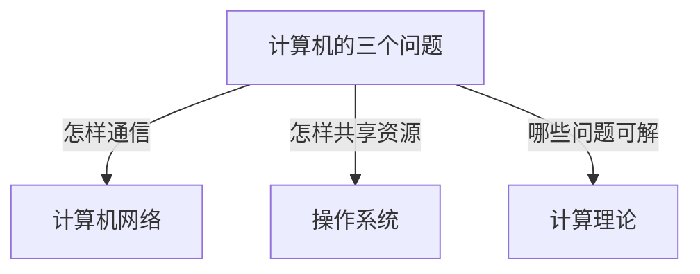

# 课程笔记

ZJU CS 课程笔记整理。

## 秋季三科：从零理解与练习

三门课共 25 章，按前置关系组织正文；每章把问题、概念、机制、公式、推演和自编练习连起来，Mermaid 图用于理解结构与流程。第一次学习按章节顺序阅读，复习时用章末记忆要点定位需要重做的例子。

- [计算机网络](计算机网络/index.md) — 从一次网页访问理解协议、分层、时延、寻址与可靠传输。
- [操作系统](操作系统/index.md) — 从运行一个程序理解进程、调度、同步、内存、文件与 I/O。
- [计算理论](计算理论/index.md) — 从字符串条件理解语言、构造机器与不可判定性证明。

题库共 118 道，均明确标为自编，题面与解析直接展示。笔记覆盖上述课程主线；具体考试范围与实验要求以当年课程通知为准。
