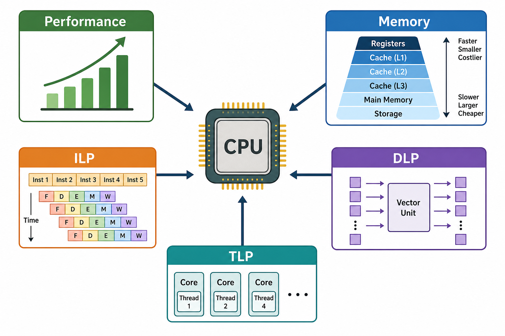

# Chap 1：量化设计基础

→ 课程索引：[CA 首页](index.md)
→ 刷题实战：[刷题实战](exam-drills.md)

这一章的考点很集中：**选择题**考概念（Flynn 分类、三堵墙、定义辨析）和**小计算**（CPU 时间、CPI 加权、Amdahl、性能比、可靠性）。没有大题，但小计算几乎每年都出现。先把公式背熟、把单位算对，这章就稳了。

## 1. 体系结构到底分几层

| 层 | 程序员可见？ | 例子 |
|---|---|---|
| ISA（指令集架构） | 可见 | x86、ARM、RISC-V 的指令、寄存器、寻址方式 |
| Microarchitecture（微架构） | 不可见 | 流水线深度、乱序、Cache、分支预测 |
| Hardware（电路实现） | 不可见 | 门电路、版图、工艺、功耗 |

一个关键直觉：**同一个 ISA 可以有完全不同的微架构**。很多 CPU 都兼容 x86 指令集，但内部流水线、Cache、乱序能力天差地别。考试爱考“ISA 是不是程序员可见的接口”——答案是。

## 2. 三堵墙：现代架构为什么转向并行

| 墙 | 含义 | 后果 |
|---|---|---|
| ILP 墙 | 单核能挖的指令级并行越来越少 | 不能只靠更复杂的乱序核继续提速 |
| 内存墙 | CPU 变快远快于 DRAM 变快 | 程序越来越容易卡在访存上 |
| 功耗墙 | 提频带来过高功耗和散热 | 不能无限提主频 |

→ 概念页：[[concepts/ca-three-walls]]

结论：架构从“单核越来越快”转向**多核 + 向量/GPU + Cache 优化 + 领域专用加速器**。这条主线贯穿后面四章（Chap 3 挖 ILP，Chap 4 挖 DLP，Chap 5 挖 TLP）。

## 3. Flynn 分类法（选择题高频）

按“指令流 × 数据流”分四类：

| 类别 | 全名 | 典型 |
|---|---|---|
| SISD | Single Instruction Single Data | 传统单核标量 CPU |
| SIMD | Single Instruction Multiple Data | 向量机、GPU、多媒体扩展（→ Chap 4） |
| MISD | Multiple Instruction Single Data | 几乎不存在，理论分类 |
| MIMD | Multiple Instruction Multiple Data | 多核、多处理器（→ Chap 5） |

记忆点：**SIMD = DLP，MIMD = TLP**。MISD 是“凑数”的，实际几乎没有产品。

## 4. CPU 时间公式（必背）

这是全课最核心的公式，Chap 1 的小计算几乎都从它出发：

$$
\text{CPU Time} = \text{IC} \times \text{CPI} \times \text{Clock Cycle Time} = \frac{\text{IC} \times \text{CPI}}{\text{Clock Rate}}
$$

- **IC**（Instruction Count）：程序执行了多少条指令。
- **CPI**（Cycles Per Instruction）：平均每条指令几个周期。
- **Clock Cycle Time**：一个周期多长 = 1 / Clock Rate。

优化性能的三条路，对应三个因子：

| 优化对象 | 手段 |
|---|---|
| 减少 IC | 换算法、优化编译、改 ISA |
| 减少 CPI | 流水线、Cache、分支预测、动态调度 |
| 缩短周期 | 提频（受功耗墙限制） |

多类指令混合时，CPI 是加权平均：

$$
\text{CPI} = \sum_i \frac{\text{IC}_i}{\text{IC}} \times \text{CPI}_i
$$

??? example "例题：提频 + CPI 变化，性能提升多少（历年卷原型）"

    > 处理器时钟频率从 1.8GHz → 2.2GHz，CPI 从 1.2 → 1.5，IC 不变，性能提升百分之多少？

    性能 ∝ 1 / CPU Time ∝ Clock Rate / CPI。

    - 旧：$1.8 / 1.2 = 1.5$
    - 新：$2.2 / 1.5 \approx 1.467$

    新 / 旧 = $1.467 / 1.5 \approx 0.978$。

    **性能不升反降约 2.2%**。这题的坑在于：提频虽然好，但 CPI 同时变差了，综合反而退步。做题一定要把两个因子都算进去，不能只看主频。

## 5. Amdahl 定律（必考）

$$
\text{Speedup} = \frac{1}{(1-f) + \dfrac{f}{s}}
$$

- $f$：被优化部分占**原**总时间的比例。
- $s$：这部分被加速了多少倍。
- $1-f$：没被优化的部分 —— 它是最终瓶颈。

→ 概念页：[[concepts/amdahls-law]]

核心直觉：**只优化一部分，整体提升有上限**。哪怕把占 20% 的部分加速到无限快，整体也只能加速 $1/(1-0.2)=1.25$ 倍。

考试常见三种变形：

1. 正向：给 $f$、$s$，求整体 Speedup。
2. 反向：给目标 Speedup，求需要的 $f$ 或 $s$。
3. 极限：$s \to \infty$ 时 Speedup $\to 1/(1-f)$，问“最多能加速多少倍”。

??? example "例题：反向求 f"

    > 想让整体加速 2 倍，被优化部分能加速 5 倍，问该部分需占原时间多少？

    $2 = \dfrac{1}{(1-f) + f/5}$ → $(1-f) + f/5 = 0.5$ → $1 - 0.8f = 0.5$ → $f = 0.625$。

    即被优化部分要占 **62.5%** 才行。这说明热点占比不够大时，再猛的局部加速也救不了整体。

## 6. 性能均值：哪种均值"换参考机不变"

历年卷选择题原题：**哪种均值在更换参考机时能给出一致结果？**

| 均值 | 是否受参考机影响 |
|---|---|
| 算术平均（arithmetic mean） | 受影响 |
| 加权算术平均（weighted arithmetic mean） | 受影响 |
| **归一化几何平均（normalized geometric mean）** | **不受影响 ✅** |
| 调和平均（harmonic mean） | 受影响 |

答案是**归一化几何平均**。原因：几何平均满足 $\text{GM}(a_i/b_i) = \text{GM}(a_i)/\text{GM}(b_i)$，归一化的基准（参考机）被约掉了，所以换参考机不改变排序结论。这是 Chap 1 选择题的经典陷阱题，记结论即可。

## 7. 可靠性指标

| 指标 | 含义 | 公式 |
|---|---|---|
| MTTF | 平均无故障时间 | — |
| MTTR | 平均修复时间 | — |
| MTBF | 平均故障间隔 | ≈ MTTF + MTTR |
| Availability | 可用性 | $\dfrac{\text{MTTF}}{\text{MTTF}+\text{MTTR}}$ |

FIT（failures in time）：每 10⁹ 小时的故障数，$\text{MTTF} = 10^9 / \text{FIT}$。串联系统的失效率可直接相加。提高可靠性的核心是**冗余**。

## 8. 本章考点清单

- [ ] CPU Time = IC × CPI × Cycle Time，会做提频/CPI 联动的性能比题
- [ ] CPI 加权平均
- [ ] Amdahl：正向、反向、极限三种问法
- [ ] 归一化几何平均“换参考机不变”
- [ ] Flynn 四分类，SIMD=DLP / MIMD=TLP
- [ ] 三堵墙的名字和后果
- [ ] ISA / 微架构 / 电路三层，谁对程序员可见
- [ ] MTTF / Availability 公式

下一章 → [Chap 2](chap2.md)（存储器层级与 Cache，是大题主力之一）。
