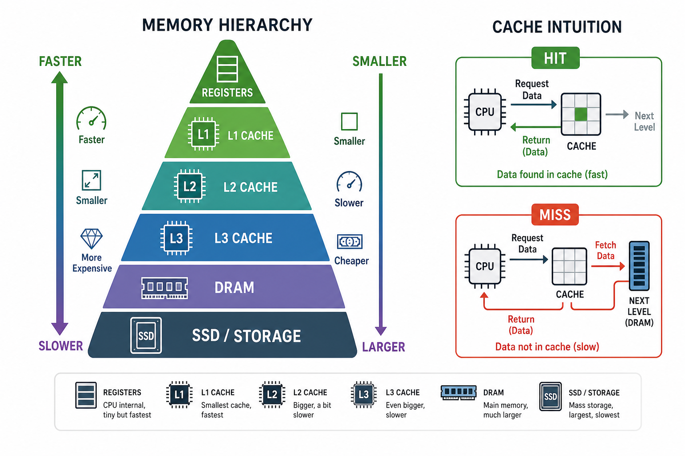

# Chap 2：存储器层级与 Cache

→ 课程索引：[CA 首页](index.md)
→ 刷题实战：[刷题实战](exam-drills.md)

这是全课**最值钱**的一章：选择题（地址拆分、AMAT、三类失效、写策略、优化目标辨析）和大题（循环访存 miss 计数）都稳定从这里出。第一道大题几乎每年都是 Cache。把本章吃透，期末就稳了一大半。



## 1. 为什么要有存储器层级

CPU 极快，DRAM 慢得多。每次都去主存取数据，CPU 大部分时间都在干等。解决办法是搭一层层存储器，让最近要用的数据离 CPU 更近。

| 层级 | 特点 |
|---|---|
| Register | 最快、最小 |
| L1 Cache | 很快、容量小 |
| L2/L3 Cache | 更大、更慢 |
| DRAM 主存 | 容量大、延迟高 |
| SSD/Disk | 更大、更慢 |

之所以这套机制有效，靠的是**局部性**：

- **时间局部性**：刚用过的数据很可能很快再用。
- **空间局部性**：用了某地址，附近地址也很可能用到。

## 2. Cache 术语与 AMAT（必背）

| 术语 | 含义 |
|---|---|
| Block / Line | Cache 与内存间搬运的最小单位 |
| Hit / Miss | 要访问的数据在 / 不在 Cache 里 |
| Hit time | 命中时的访问时间 |
| Miss penalty | 失效后从下一级取回的额外代价 |
| Miss rate | 失效率 |

核心公式：

$$
\text{AMAT} = \text{Hit time} + \text{Miss rate} \times \text{Miss penalty}
$$

多级 Cache（注意是嵌套的）：

$$
\text{AMAT} = \text{Hit}_{L1} + \text{MR}_{L1} \times (\text{Hit}_{L2} + \text{MR}_{L2} \times \text{Penalty}_{L2})
$$

!!! warning "local miss rate vs global miss rate（高频坑）"
    - **Local miss rate** = 该级失效数 / 到达该级的访问数（如 L2 local = L2 miss / L1 miss）。
    - **Global miss rate** = 该级失效数 / CPU 总访问数。
    - 多级 AMAT 公式里乘的是 **local** miss rate。算 stall 时不要混。

??? example "例题：AMAT 与每指令平均停顿（22-23 第 12 题原型）"
    > 1000 次访存中 L1 miss 40 次，L2 miss 20 次。L1 hit time=1，L2 hit time=10，memory penalty=200，每指令 1.5 次访存。求每指令平均停顿周期。

    - L1 miss rate = 40/1000 = 0.04
    - L2 local miss rate = 20/40 = 0.5
    - 每次访存的停顿 = L1 miss rate ×(L2 hit time + L2 local miss × penalty) = 0.04 ×(10 + 0.5×200) = 0.04×110 = 4.4
    - 每指令停顿 = 4.4 × 1.5 = **6.6 周期**

    注意：stall 通常不把 L1 hit time 当停顿（命中是正常开销）；而 AMAT 要含 hit time。这就是历年卷里 5.4 和 6.6 两个答案的来源——问 AMAT-相关量还是问 stall，算法不同。

??? example "例题：算真实 CPI（22-23 第 21 题）"
    > 理想 CPI=1，无指令 cache miss，30% 指令是数据访问，数据 cache miss rate=10%，miss penalty=20。求真实 CPI。

    真实 CPI = 1 + 0.30 × 0.10 × 20 = 1 + 0.6 = **1.6**。

## 3. Cache 四问

任何 Cache 设计都归到这四问：

| 问题 | 问什么 | 答案 |
|---|---|---|
| 块放哪 | 内存块能放进 Cache 哪些位置 | 直接映射 / 组相联 / 全相联 |
| 怎么找 | 地址如何拆分、如何判命中 | Tag / Index / Offset |
| 替换谁 | 满了踢哪块 | Random / LRU / FIFO |
| 怎么写 | 写命中、写失效如何处理 | Write-through/back、Write-allocate |

→ 概念页：[[concepts/cache]]

## 4. 地址拆分（大题必用）

组相联地址格式：

$$
\text{Address} = [\ \text{Tag} \mid \text{Index} \mid \text{Block Offset}\ ]
$$

- Block Offset 位数 = $\log_2(\text{块大小 } B)$
- Index 位数 = $\log_2(\text{组数 } S)$，其中 **组数 = 总容量 /（块大小 × 相联度）**
- Tag 位数 = 物理地址位数 − Index − Offset

!!! tip "组数公式别错"
    Index 选的是**组（set）**，不是行。$n$ 路组相联里，组数 = 容量 /(块大小 × $n$)。全相联只有 1 组，Index=0 位；直接映射相联度=1。

??? example "例题：8KB / 1024 组 / 4 路，求块大小（回忆卷大题1）"
    容量 8KB，1024 组，4 路。
    块大小 = 8192 /(1024 × 4) = **2 字节**？不对——再看：块大小 = 容量 /(组数 × 路数) = 8192 /(1024×4) = 2B。

    若题目给的是 word=4B，则一个块连 1 个 word 都放不下，这种参数通常是想让你判断**它牺牲了空间局部性**（块太小，无法利用相邻元素）。做这类题先算块能放几个元素，再据此评价 temporal/spatial locality。

??? example "例题：TLB / VIPT 地址位（22-23 第 30-33 题）"
    > 虚拟地址 46 位，物理地址 36 位，页大小 8KB，Cache 容量 16KB。

    - **直接映射 16KB**：Offset+Index 共占 $\log_2 16K = 14$ 位，Tag = 36 − 14 = **22 位**。
    - **8 路 16KB**：组数 = 16K /(块 × 8)；若块=64B，组数=32→Index=5，Offset=6，Tag=36−11=**25 位**。（按题目给的块大小算）
    - **VIPT 2 路 16KB**：物理 Tag 同样用物理地址高位算。VIPT 的妙处是 Index 用页内偏移（虚拟=物理那几位），可与 TLB 查询并行，但 Tag 必须用物理地址。

## 5. 三类失效（3C）

| 类型 | 原因 | 解决 |
|---|---|---|
| Compulsory（强制/冷启动） | 第一次访问必 miss | 预取、增大块 |
| Capacity（容量） | Cache 太小，工作集放不下 | 增大 Cache |
| Conflict（冲突） | 多块映射到同组互相挤掉 | 提高相联度 |

多核还有第 4 个 C：**Coherence miss**（一致性失效，→ Chap 5）。选择题爱问“单核 Cache 的失效**不包括**哪类”——答案就是 coherence miss。

## 6. 写策略（选择题高频）

**写命中**：

- **Write-through**：同时写 Cache 和下一级。简单、一致性好，但带宽压力大。
- **Write-back**：只写 Cache，块被替换时再写回（需 dirty bit）。省带宽。

**写失效**：

- **Write-allocate**：先把块调入 Cache 再写。常配 write-back。
- **No-write-allocate / write-around**：直接写下一级，不调入。常配 write-through。

!!! tip "记忆口诀"
    **write-back + write-allocate** 一对；**write-through + write-around** 一对。
    write-back 的代价不在写命中时付，而在 **dirty 块被替换**时才付一次写回。这是循环访存大题的关键计费点。

## 7. 循环访存大题模板（第一道大题主力）

历年卷典型题（22-23 第二大题）：

```c
for (int i = 0; i < 512; i++)
    c[i] = a[i] * b[i] + b[i];
```

`a,b,c` 连续存放，每元素 4B，write-back + write-allocate，miss penalty=100，write-back 也=100，全命中时每次迭代 $L$ 周期。

**做题模板**：

1. 算一个 cache line 放几个元素：line size / element size。
2. 连续访问时，每几次迭代发生一次 compulsory miss（= 一个块的元素数）。
3. 分别数 `a[i]`、`b[i]`、`c[i]` 各自的 miss。
4. write-allocate 下写 `c[i]` 也会先 write miss 调块；若该块替换了 dirty 块，还要 write back。
5. direct-mapped 且地址冲突时，逐次判断是否互相替换（冲突 miss 爆炸）。

??? example "三档答案（line=16B / 64B / 直接映射 2KB）"
    **(1) line=16B（4 个 int/块）**：每 4 次迭代，第 1 次 a、b、c 各 1 miss，后 3 次全命中。
    平均 = $((L+100+100+100) + L + L + L) / 4 = L + 75$。

    **(2) line=64B（16 个 int/块）**：每 16 次迭代第 1 次 3 个 miss。
    平均 = [(L+300) + 15L] / 16 = **L + 18.75**。块越大，连续数组的 compulsory miss 越摊薄。

    **(3) 直接映射 2KB，line=64B**：a、b、c 的地址映射到同一组，每次迭代互相替换。
    a miss → b miss 替换 a → c 写 miss 替换 b → 下次 a 又 miss 替换 c，且 c 是 dirty 要 write back。
    粗算每次迭代约 3 次 miss + write back ≈ **L + 400**。这说明小容量 + 直接映射会让 conflict miss 彻底毁掉性能。

??? example "例题：blocking 的收益（22-23 第 20 题，矩阵转置）"
    分块版 vs 未分块版的 miss 比约为 **1 : 8**。分块（blocking）把工作集压进 Cache，复用块内数据，大幅减少 capacity/conflict miss。这是“为什么要分块”的经典题。

## 8. 十大高级优化（按"减少什么"记）

| 目标 | 方法 |
|---|---|
| ↓ Hit time | 小而简单的 L1、路预测（way prediction） |
| ↑ 带宽 | 流水线化 Cache、多分区（banked）Cache、非阻塞 Cache |
| ↓ Miss penalty | 多级 Cache、关键字优先（critical word first）、合并写缓冲 |
| ↓ Miss rate | 增大块、增大容量、提高相联度、编译器优化 |
| 用并行隐藏 | 硬件预取、编译器预取 |

!!! warning "最爱考的辨析：这个优化减少的是什么"
    | 优化 | 主要减少 |
    |---|---|
    | larger block size | compulsory miss（但 ↑ miss penalty，且块太大可能 ↑ conflict） |
    | larger cache | capacity miss（但可能 ↑ hit time） |
    | higher associativity | conflict miss（但 ↑ hit time / 功耗——所以"提高相联度降功耗"是**错**的） |
    | multilevel cache | miss penalty |
    | **pipelined cache access** | **提带宽/频率，不减 miss rate**（高频陷阱选项） |
    | critical word first / early restart | miss penalty |
    | avoiding address translation | hit time |

    "增大块利用**空间局部性**减少**compulsory** miss"——填空题原句。

## 9. 虚拟内存与 TLB

虚拟内存解决三件事：**保护**（进程隔离）、**抽象**（每个进程独享连续大地址空间）、**管理**（不够时换页到磁盘）。

$$
\text{虚拟地址} \xrightarrow{\text{Page Table / TLB}} \text{物理地址}
$$

- **TLB**（Translation Lookaside Buffer）= **页表项的 Cache**。没有它每次访存都要先查页表（多一次甚至多次访存）。
- TLB 当作全相联 Cache 看：**Tag = 虚拟页号（VPN）**，**数据行 = 物理页号（PPN）**。这是 22-23 第 29 题答案。
- **VIPT**（Virtual Index, Physical Tag）：用虚拟地址的页内偏移做 Index（虚=物那几位），可与 TLB 翻译并行；Tag 用物理地址保证正确性。兼顾速度与正确。

## 10. 本章考点清单

- [ ] AMAT 单级 / 多级公式，local vs global miss rate
- [ ] 每指令停顿、真实 CPI 计算
- [ ] 地址拆分：Offset / Index / Tag 位数，组数公式
- [ ] 3C 失效；单核不含 coherence miss
- [ ] write-back+allocate / write-through+around 配对
- [ ] 循环访存大题三档（块大小、直接映射冲突、write-back 计费）
- [ ] blocking 减少 miss
- [ ] 十大优化"减少什么"辨析，pipelined cache 不减 miss rate
- [ ] TLB：Tag=VPN，数据=PPN；VIPT 含义

上一章 → [Chap 1](chap1.md) ｜ 下一章 → [Chap 3](chap3.md)（ILP，第二道大题主力：Scoreboard/Tomasulo/ROB）。
