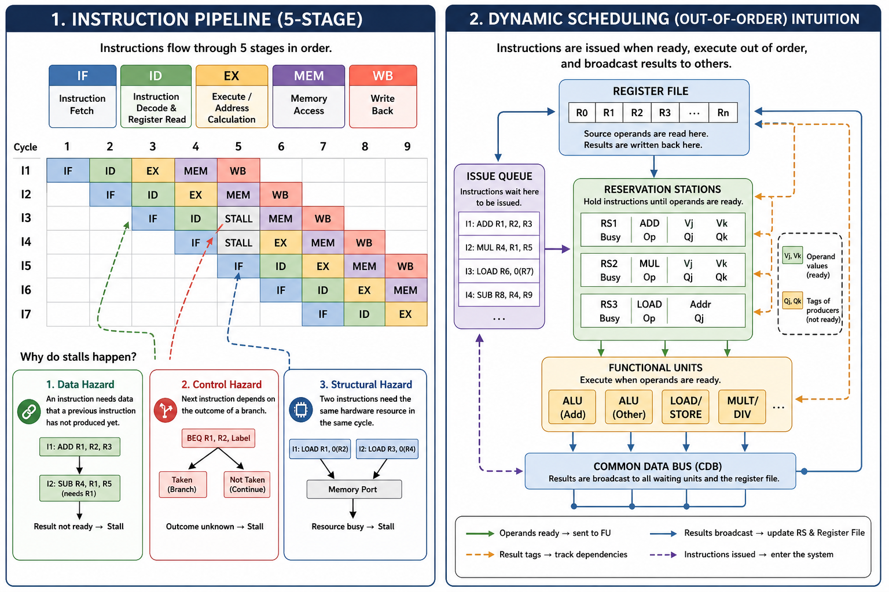
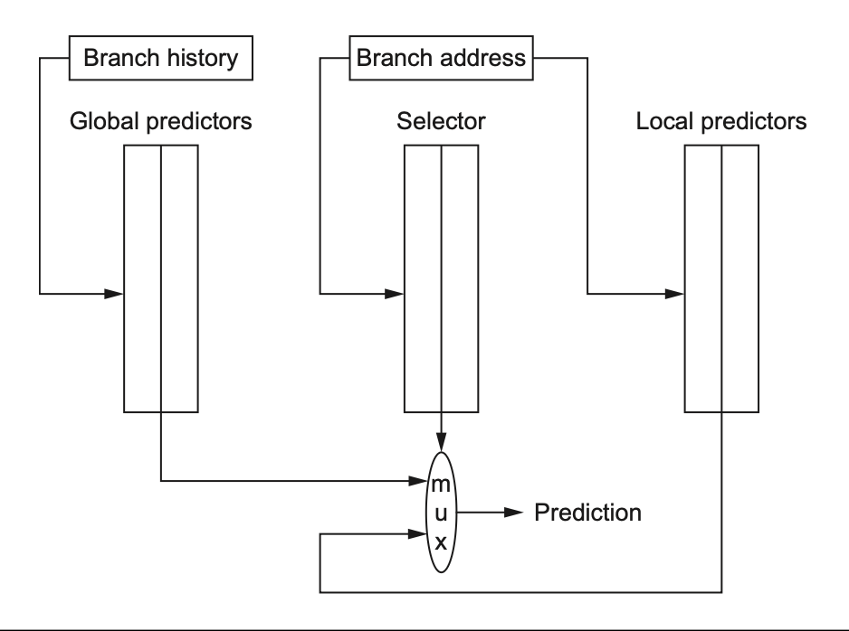
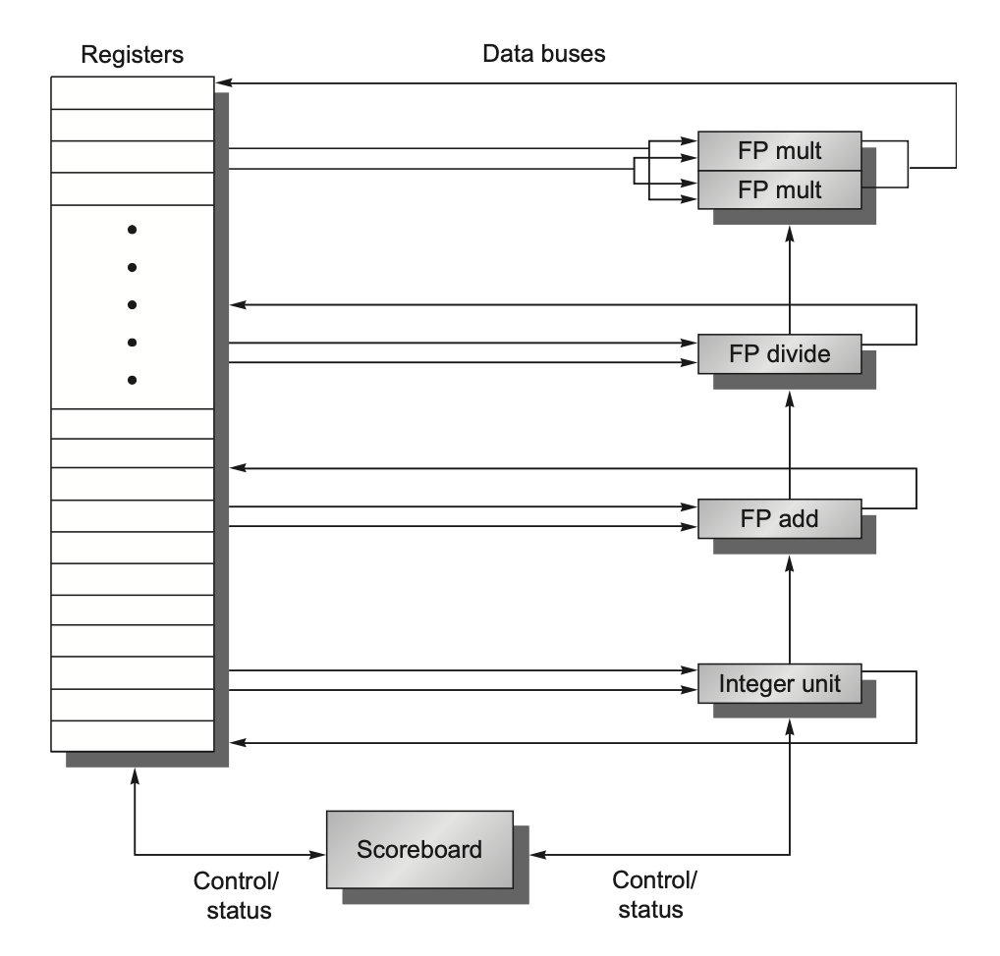
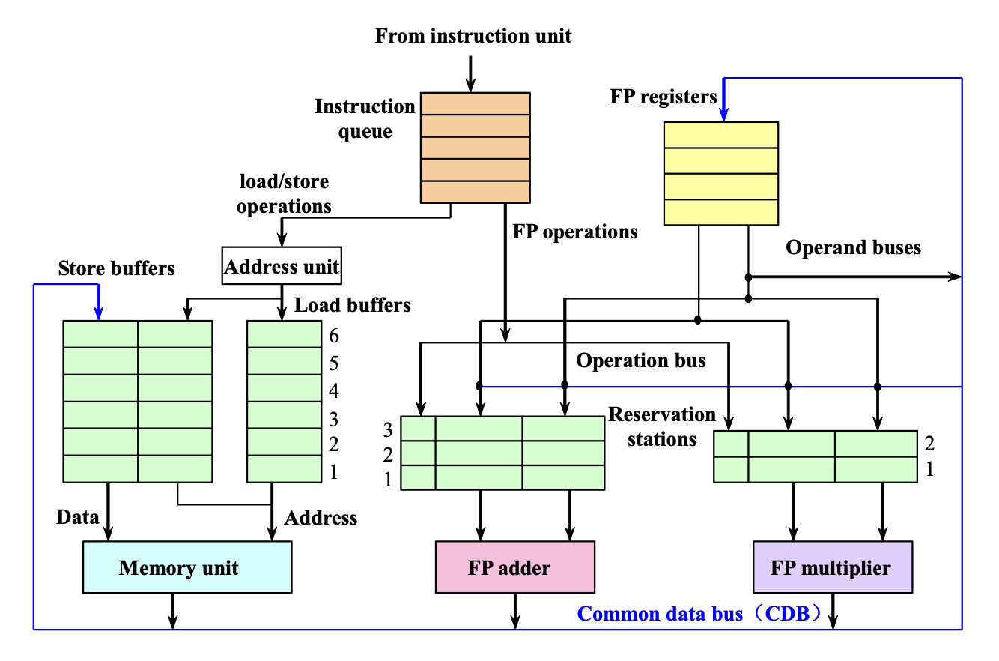
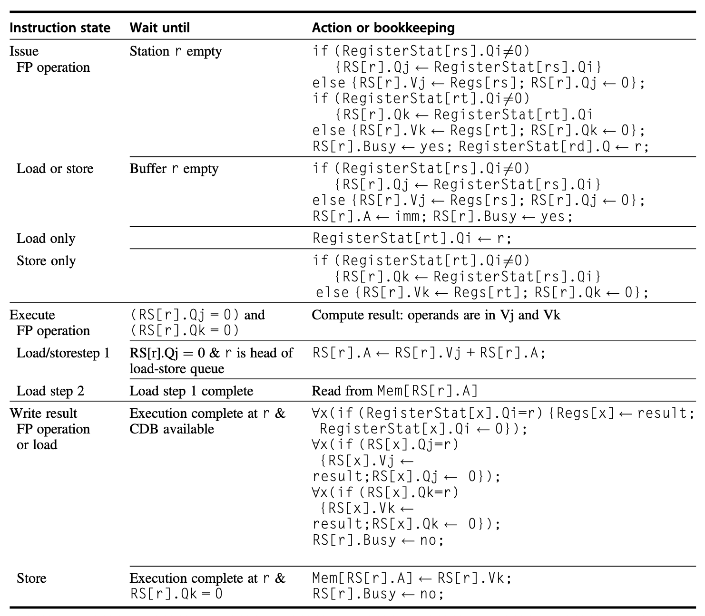
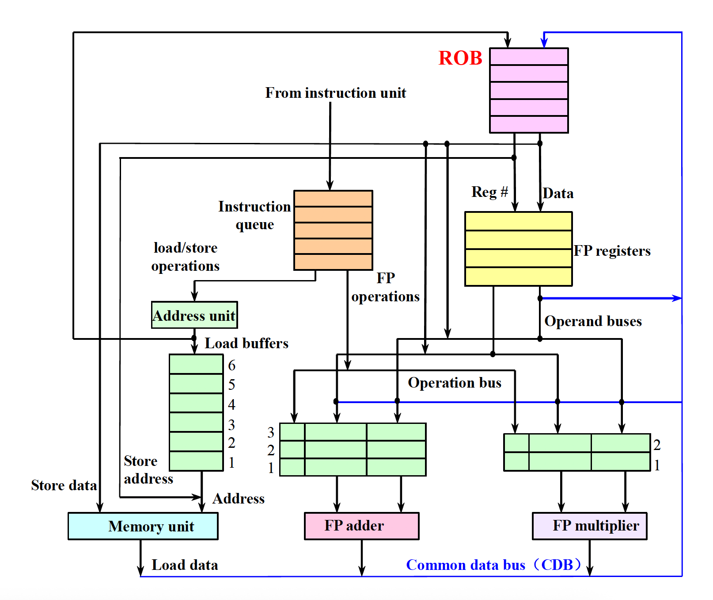
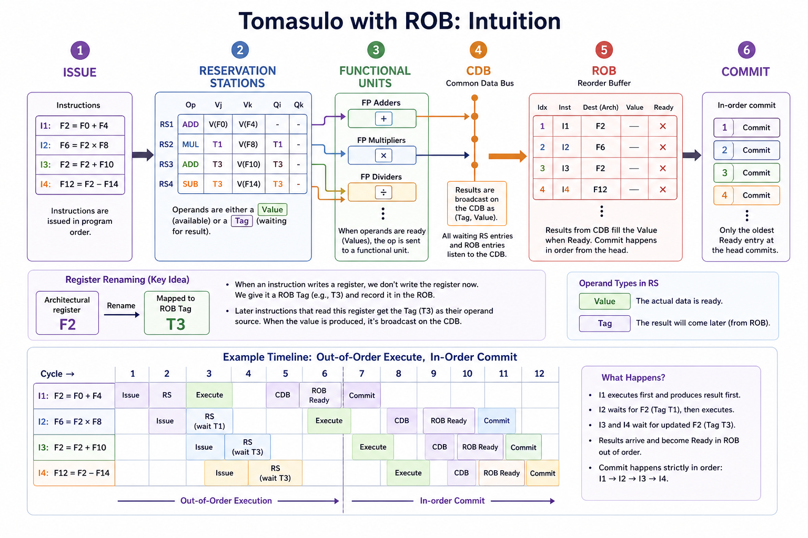
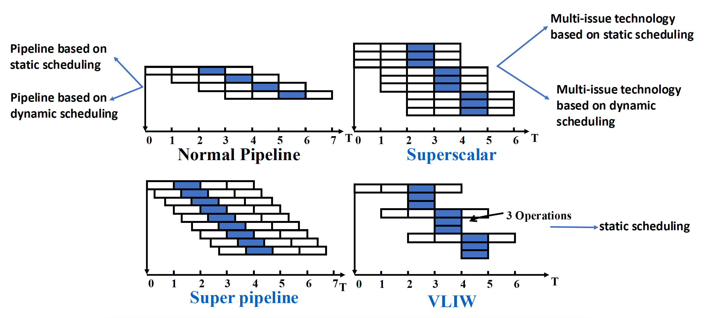
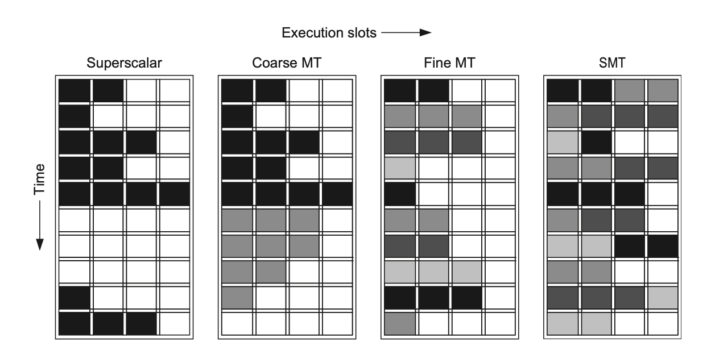

# Chap 3：指令级并行（ILP）

→ 课程索引：[CA 首页](index.md)
→ 刷题实战：[刷题实战](exam-drills.md)

本章是**第二道大题**的主力：Scoreboard / Tomasulo / ROB 的时序表，几乎每年必考。这类题步骤性极强，靠模板就能拿分。选择题则考依赖/冒险、精确异常、循环展开、分支预测、多发射。内容多，但只要把"填表流程"练熟，性价比极高。



## 1. 流水线与 CPI 拆解

经典五级流水线：

| 阶段 | 含义 |
|---|---|
| IF | 取指 |
| ID | 译码 / 读寄存器 |
| EX | 执行 / 算地址 |
| MEM | 访存 |
| WB | 写回寄存器 |

$$
\text{Pipeline CPI} = \text{Ideal CPI} + \text{Structural} + \text{Data hazard} + \text{Control stalls}
$$

ILP 的目标就是把右边那些 stall 项压下去。

## 2. 依赖 vs 冒险（选择题根基）

| 依赖（程序性质） | 含义 | 对应冒险 | 能否消除 |
|---|---|---|---|
| 数据依赖（真依赖） | 后条真用前条结果 | **RAW** | 不能，只能等/转发 |
| 反依赖 | 后条写了前条要读的名字 | **WAR** | 能，靠寄存器重命名 |
| 输出依赖 | 两条写同一名字 | **WAW** | 能，靠寄存器重命名 |
| 控制依赖 | 是否执行取决于分支 | Control | 分支预测/推测 |

!!! warning "关键辨析"
    - **Dependence 是程序本身的关系；Hazard 是某种流水线实现下因重叠执行可能出错。**
    - **RAR 不是冒险**（都只读，没冲突）。选择题问"以下哪个不是 data hazard"→ RAR。
    - RAW = true dependence，**无法靠重命名消除**；WAR/WAW 是 name dependence，可重命名消除。

??? example "例题：哪个执行顺序违反依赖（22-23 第 4 题 / 24-25 选择）"
    给一段指令，先列出真依赖链（谁写、谁读同一寄存器），再逐个选项检查是否有“读在写之前”“写顺序颠倒”。只要某选项让有 RAW 的指令乱序到源还没算出，就是错的。

??? example "例题：forwarding 解决不了哪段（22-23 第 10 题）"
    **load-use 冒险**转发解决不了：`ld x1,0(x2)` 紧跟 `and x6,x1,x7`。
    直觉：load 的数据要到 **MEM 末**才回来，紧跟的指令在 **EX 初**就要用，时间上来不及，必须停 1 拍。其他 ALU→ALU 的 RAW 都能靠 EX/MEM 转发解决。

## 3. 精确异常（选择题高频）

**精确异常**：异常发生时，能保证异常指令**之前的指令全部完成**，**之后的指令尚未生效**（可重启）。

- 实现靠 **ROB 顺序提交**（见下文）。
- 22-23 第 2 题坑点：异常指令地址写入 **`mepc`**（不是 `mtvec`，后者存异常处理程序入口）。
- 动态调度若不加 ROB，会产生**不精确异常**。

## 4. 循环展开（Loop Unrolling）

做两件事：① 减少循环控制/分支开销；② 暴露更多独立指令，让调度器填满流水线空洞。

代价：代码变大、**寄存器压力**增加、重命名没做好会引入假依赖。

??? example "例题：哪段最受益于循环展开（22-23 第 3 题）"
    选**迭代之间相互独立**的那段（如 `C[i]=A[i]+B[i]`）。带循环携带依赖的（`C[i]=C[i-1]+B[i]`）展开了也并行不了。

## 5. 分支预测

| 预测器 | 直觉 |
|---|---|
| 1-bit | 记上次跳没跳 |
| 2-bit | 饱和计数器，连错两次才翻向（抗偶然） |
| 相关预测器 (m,n) | 用最近 $m$ 个分支历史选 $2^m$ 个预测器，每个 $n$ 位 |
| 锦标赛预测器 | 全局+局部多个预测器比赛，选择器挑更准的 |
| 带标签混合预测器 | 多个不同历史长度的表，取匹配且历史最长的 |
| BTB（分支目标缓冲） | 不只预测跳不跳，还缓存跳转目标地址，命中可 0 损失 |



**(m,n) 预测器总位数**（必考公式）：

$$
\text{total bits} = 2^m \times n \times (\text{该分支地址选中的项数})
$$

??? example "例题：(2,2) 预测器有 4K 项，多少 bits（24-25 / 22-23 同型）"
    一种问法："(0,2) 有 4K 项是多少 bits？相同位数的 (2,2) 能装几项？"
    - (0,2)，4K 项：$2^0 × 2 × 4K = 8K$ bits。
    - 同位数下 (2,2)：$8K /(2^2 × 2) = 1K$ 个分支项。

??? example "例题：2-bit 预测器预测循环的 miss rate（24-25）"
    循环模式"第 3n+1、3n+2 跳，第 3n 不跳"，分析饱和计数器在稳态下每轮错几次。这类题要按状态机一步步走，画出 T/NT 序列再数错误。

??? example "例题：分支损失（24-25 选择 / 22-23 第 24 题）"
    > 分支在 EX 末才定下条件和目标地址。问 ①预测跳转且实际跳转 ②预测不跳且实际不跳 的损失。
    - 预测跳转、实际跳转：要等 EX 末才知目标，ID/EX 取的指令作废 → **2 周期**损失。
    - 预测不跳、实际不跳：照常取下一条，无需算目标 → **0** 损失。答案 **(2, 0)**。

## 6. 动态调度：把 ID 拆两半

简单流水线的硬伤是**有序发射有序执行**：一条指令停顿，后面全卡住。动态调度让硬件在运行时重排执行顺序。

把 ID 拆成：

1. **Issue（发射）**：顺序发射，检查**结构冒险**。
2. **Read operands（读操作数）**：等数据冒险消除后读操作数，**可乱序执行**。

乱序执行会引入原本没有的 WAR/WAW，但都能靠**寄存器重命名**消除。

两种实现：**Scoreboard**（记分板）和 **Tomasulo**。

## 7. Scoreboard（记分板）



集中式动态调度。四阶段：

| 阶段 | 做什么 | 检查 |
|---|---|---|
| 1. Issue | 功能单元空闲且无 WAW 才发射 | 结构冒险、**WAW** |
| 2. Read operands | 等 RAW 解除后读操作数 | **RAW** |
| 3. Execute | 功能单元执行（多周期） | — |
| 4. Write result | 不会造成 WAR 才写回 | **WAR** |

三张表：

| 表 | 记录 |
|---|---|
| Instruction status | 每条指令到哪个阶段 |
| Functional unit status | 单元忙否、做什么 op、Fi/Fj/Fk（目的/源寄存器）、Qj/Qk（源来自哪个单元）、Rj/Rk（源是否就绪） |
| Register result status | 每个寄存器将由哪个功能单元写 |

!!! danger "Scoreboard 的关键限制"
    - **不能消除 WAR/WAW**，只能靠停顿避免（Issue 阶段挡 WAW，Write 阶段挡 WAR）。
    - 没有寄存器重命名、没有前递/CDB，**Read operands 和 Write result 不能在同一拍重叠**，所以比 Tomasulo 慢。
    - 22-23 第 5 题：D 选项"Scoreboard 能检测 WAR/RAW 但不能消除"——正确。

??? example "例题：Scoreboard 时序填表（24-25 第四大题 / 22-23 第三大题）"
    ```asm
    LD   F2, 0(R0)
    LD   F4, 0(R1)
    MULTD F6, F2, F4
    ADDD F8, F0, F2
    SD   F2, 0(R0)
    SD   F4, 0(R1)
    ```
    填表口诀，逐拍推进：
    1. **Issue**：目标功能单元空闲 + 目标寄存器没有别的活跃写（防 WAW）→ 发射。否则停。
    2. **Read**：所有源寄存器都"没有在算的写"了（RAW 解除）→ 读。
    3. **Exec**：占用功能单元 latency 个周期。
    4. **Write**：检查有没有更早的指令还没读走"我要覆盖的源"（防 WAR）→ 写。
    填到"第一条 LD 处于 WR 阶段"以及"下一周期"的状态表快照即可。

## 8. Tomasulo 算法



相比 Scoreboard 更强：**保留站 + CDB + 寄存器重命名**，能消除 WAR/WAW。

- **保留站（Reservation Station）**：缓存等待执行的指令及其操作数。
- **寄存器重命名**：把"寄存器名"换成"哪个保留站会产生这个值"（tag），名字冲突被改名消除。
- **CDB（公共数据总线）**：结果一算完就广播给所有等待者（旁路），无需经过寄存器。

三阶段：

| 阶段 | 做什么 |
|---|---|
| 1. Issue | 取队首指令；有空保留站则发射，操作数有值就填值、没值就记 tag（Qj/Qk）；**无空站则结构停顿** |
| 2. Execute | 操作数齐了就执行（监听 CDB 等缺的操作数）；**RAW 靠此延迟避免** |
| 3. Write result | 结果上 CDB，广播到寄存器和所有等待的保留站 |

保留站字段：`Op, Qj, Qk, Vj, Vk, A, Busy`（Q 与 V 只有一个有效：有值用 V，没值记 Q）。

完整算法步骤表（直接对照填表）：



!!! tip "为什么能消 WAR/WAW"
    后续指令不再直接抢同一个架构寄存器名，而是等某个 tag 的结果。保留站数量 > 真实寄存器数，名字冲突被"改名"化解。

!!! warning "Tomasulo 缺点（选择题）"
    - 硬件复杂、CDB 是瓶颈（每拍只能广播 1 个结果）。
    - 仍是**不精确异常**（要加 ROB 才精确）。
    - 22-23 第 5 题 B 选项"Tomasulo 用寄存器重命名最小化 RAW"是**错的**——重命名消的是 WAR/WAW，RAW 靠等操作数。

## 9. 硬件推测与 ROB




推测 = 假设分支预测对，提前执行；错了能回滚。三大支柱：**动态分支预测 + 推测执行 + 动态调度**。

核心思想：**允许乱序执行，但强制按程序顺序提交（commit）**，从而支持精确异常。靠 **ROB（Reorder Buffer）** 缓存"已执行完但未提交"的结果。

ROB 每项：指令类型、目标（寄存器/内存地址）、值、ready 位。

四阶段（比 Tomasulo 多了 commit）：

| 阶段 | 做什么 |
|---|---|
| 1. Issue | 需**保留站和 ROB 项都有空**才发射；操作数从寄存器/ROB 取 |
| 2. Execute | 操作数齐了执行 |
| 3. Write result | 结果写 CDB → 写入 ROB 及等待的保留站 |
| 4. Commit | 到 ROB 头且确认无误才真正写寄存器/内存；分支错则清空 ROB 重启 |

!!! tip "一句话记忆"
    **Tomasulo 让执行乱序，ROB 让结果按序生效。** 后面的快指令哪怕早算完，也得等前面的慢指令先 commit。

!!! info "24-25 选择题原型"
    带投机的 Tomasulo：在 **ROB 和保留站都有空** 时可 Issue；Issue 后从 **ROB 或寄存器** 读操作数值到 **保留站**。

??? example "例题：Scoreboard vs 推测 时序对比（22-23 第三大题）"
    同一段指令，latency：add/sub=1，mul=10，div=40，**只有一个保留站**，结果广播后才释放保留站。
    - **Scoreboard 版**：列 issue / read operand / execution / write result。
    - **推测版**：列 issue / execution / write result / **commit**。
    关键差异：推测版可乱序写结果，但 commit 必须按程序顺序排队，所以后面指令的 commit 周期被前面慢指令拖住（见刷题页详解）。

## 10. 多发射与多线程



目标：CPI < 1（一拍发射多条）。

| 类型 | 调度方 | 特点 |
|---|---|---|
| 超标量 Superscalar | 硬件动态 | 每拍发射可变条数，能 CPI<1，通用计算最成功 |
| VLIW | 编译器静态 | 把多个并行操作打包成长指令，硬件简单但二进制兼容性差 |
| 动态调度超标量 | 硬件 | Tomasulo+多发射+推测，最接近现代 CPU |

!!! info "22-23 第 32 题填空"
    多发射两种基本类型：**superscalar** 和 **VLIW**；其中 superscalar 是硬件密集（硬件查冒险），VLIW 是编译器密集（软件查冒险）。第 17 题：能让 CPI<1 的是 **multiple-issue**（Scoreboard/Tomasulo/循环展开都只到 CPI=1）。



**多线程**（隐藏延迟、提利用率）：

- 细粒度：每拍切线程（轮询），隐藏长短停顿，但拖慢单线程。
- 粗粒度：只在高代价停顿（如 L2 miss）才切，切换有空泡。
- **SMT（同时多线程）**：在多发射乱序核上让**多个线程**同拍发射，靠寄存器重命名+动态调度区分线程。提升适度、能效好。

## 11. 本章考点清单

- [ ] 依赖 vs 冒险；RAW/WAR/WAW/RAR，谁能重命名消除
- [ ] forwarding 解决不了 load-use
- [ ] 精确异常定义、mepc vs mtvec、ROB 的作用
- [ ] 循环展开受益条件、代价（寄存器压力）
- [ ] (m,n) 预测器位数公式；2-bit 循环 miss rate；分支损失 (2,0)
- [ ] **Scoreboard 四阶段 + 三张表**，不能消 WAR/WAW
- [ ] **Tomasulo 三阶段 + 保留站字段**，重命名消 WAR/WAW，RAW 靠等操作数
- [ ] **ROB 四阶段**，Issue 需 RS+ROB 都空，乱序执行顺序 commit
- [ ] Scoreboard vs 推测 时序表对比
- [ ] superscalar vs VLIW；CPI<1 靠多发射；SMT

上一章 → [Chap 2](chap2.md) ｜ 下一章 → [Chap 4](chap4.md)（DLP：向量、convoy/chime、GCD、GPU）。
