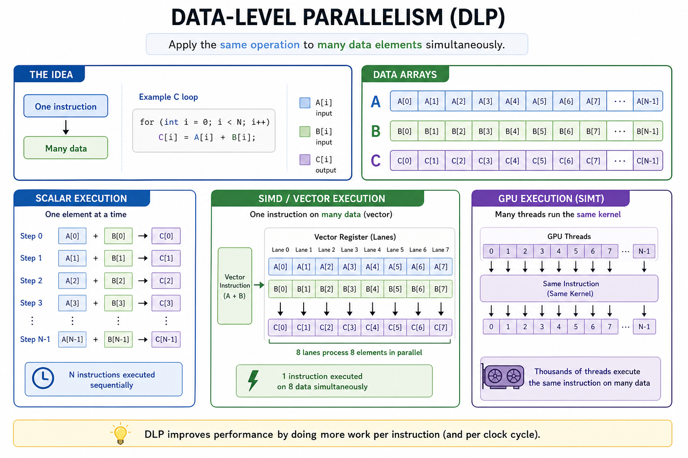
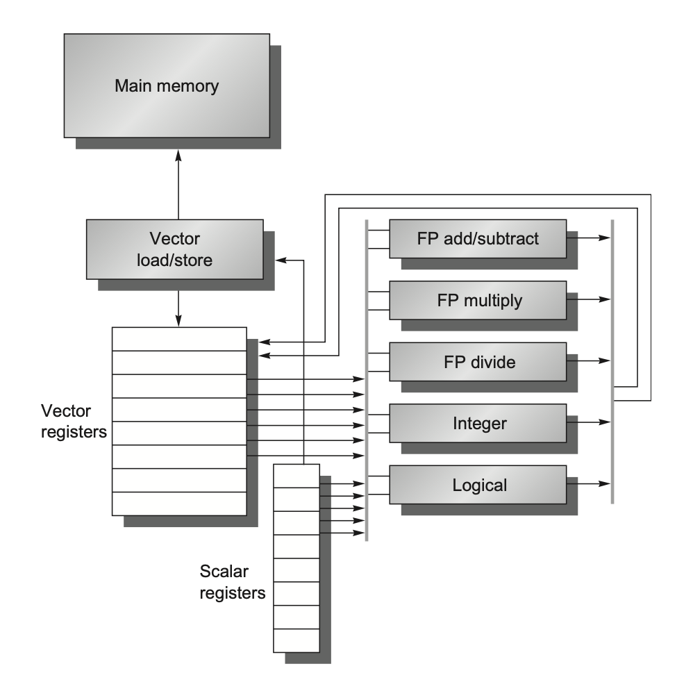
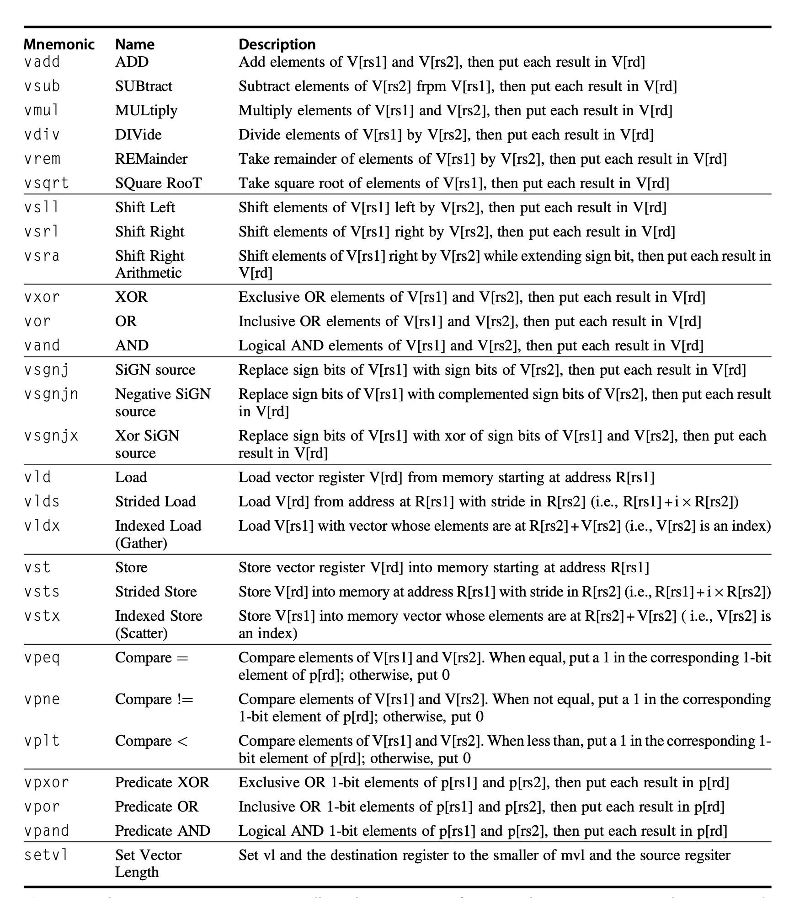
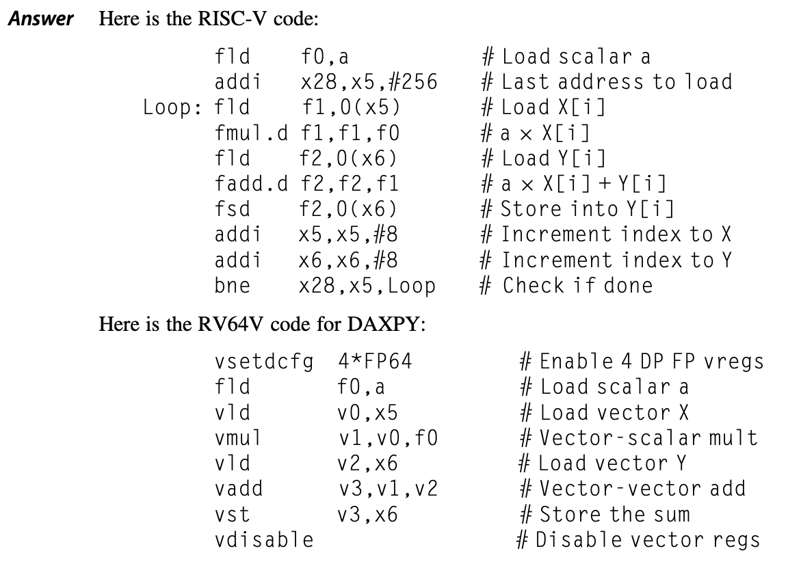
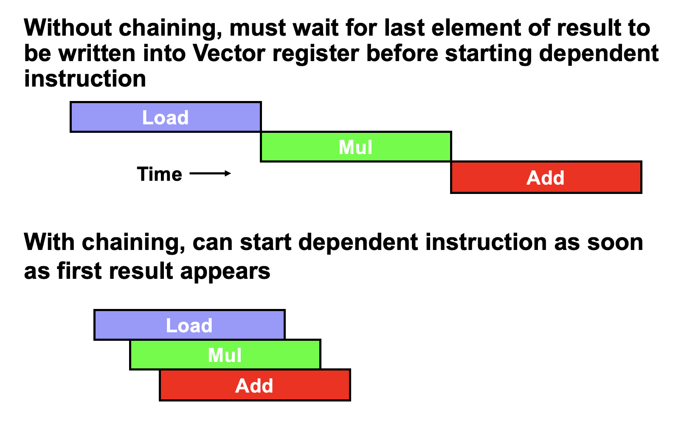
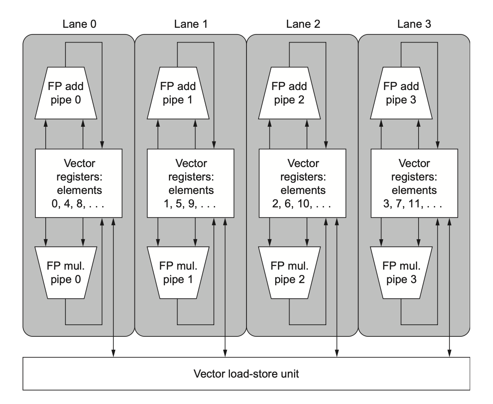
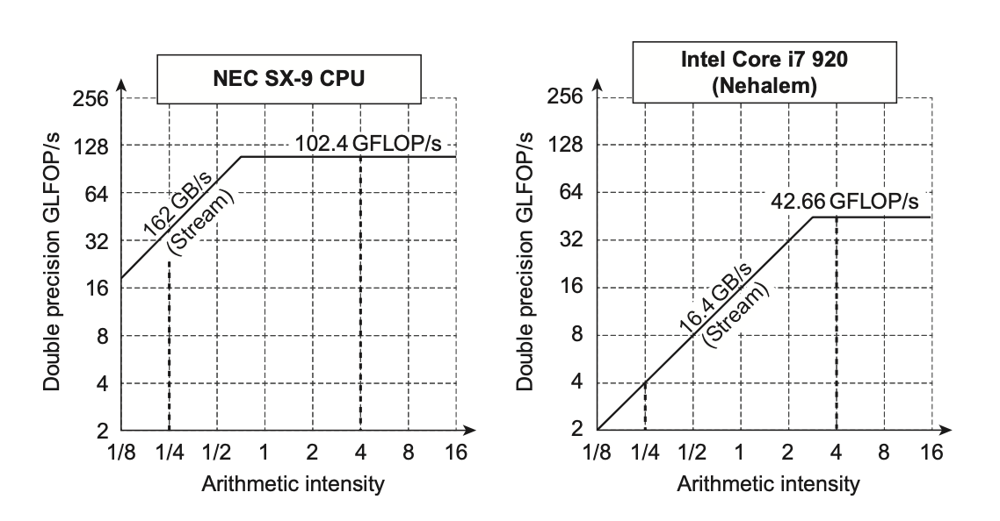
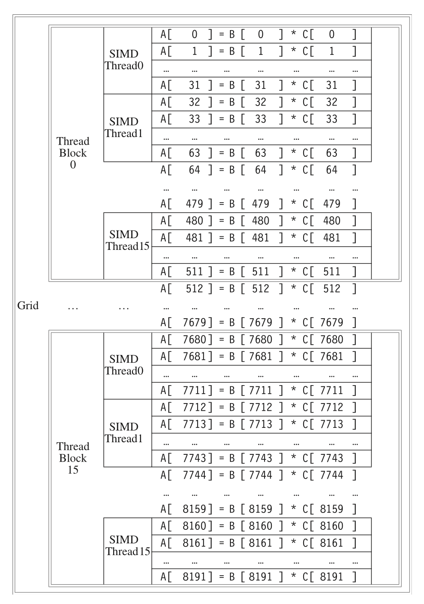
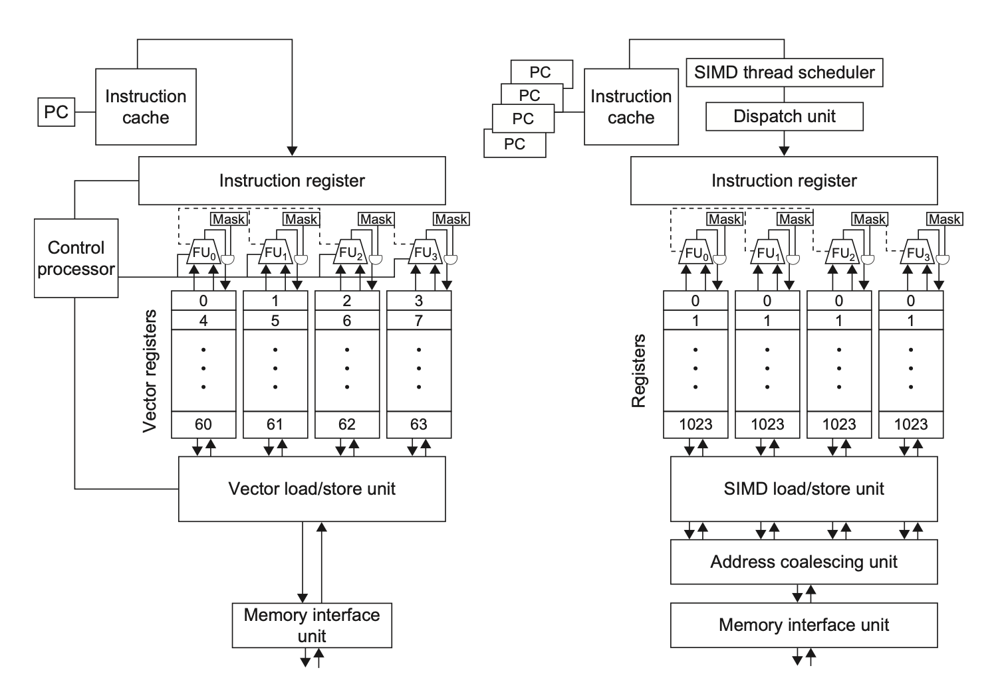

# Chap 4：数据级并行（DLP）

→ 课程索引：[CA 首页](index.md)
→ 刷题实战：[刷题实战](exam-drills.md)

本章考点：**向量执行时间**（convoy / chime / chaining，选择题"向量三连"几乎必出）、**循环依赖与向量化改写**（大题第二道常出）、GCD 测试、标量扩展与归约。GPU 部分只要定性了解 + 记术语即可。



## 1. DLP 的直觉

ILP 问的是"同一程序里多条不同指令能否并行"；DLP 问的是"**同一条操作能否作用到很多数据**"。

```c
for (int i = 0; i < n; i++)
    C[i] = A[i] + B[i];   // 每个 i 互不依赖 → 天然可并行
```

三种 SIMD 变体：**向量架构、多媒体 SIMD 扩展、GPU**。优势是程序员仍按串行思路写，底层并行加速；比 MIMD 更省电。

## 2. 向量架构



原理：把分散在内存的数据**聚拢到大向量寄存器**，在寄存器上整体运算，再写回内存。

- **向量寄存器**：RV64V 有 32 个，多读写端口，可多分区提带宽。
- **向量功能单元**：完全流水线化，每拍可启动一个新元素。
- **向量加载/存储单元**：完全流水线化，靠多内存分区供数据。
- 用一条向量指令表达大量重复操作 → 大幅减少取指/译码开销。



??? example "DAXPY：RV64V 只需 8 条 vs RV64G 要 258 条"
    
    DAXPY 即 $Y = a \cdot X + Y$。向量版指令带宽极低，这是向量架构的核心卖点。

## 3. 向量执行时间：convoy / chime / chaining（必考）

三个关键概念：

| 概念 | 含义 |
|---|---|
| **Convoy（指令组）** | 一组能一起开始执行、**无结构冒险**的向量指令。有结构冲突的要拆到不同 convoy |
| **Chime（时钟间隔）** | 执行一个 convoy 所需的近似时间。$m$ 个 convoy ≈ $m$ 个 chime |
| **Chaining（链接）** | 允许同 convoy 内存在 RAW：前一个单元的结果"前递"给后一个，无需等整条向量算完 |

执行时间近似（忽略启动开销时）：$m$ 个 convoy、向量长 $n$ → 约 $m \times n$ 周期，再加各 convoy 的**启动开销**（start-up time = 功能单元流水线深度）。



!!! warning "convoy 划分规则"
    - 无 chaining：有 RAW 的两条指令必须分到不同 convoy。
    - 有 chaining：有 RAW 也可同 convoy（结果前递）；但**结构冒险**（争同一功能单元 / 同一向量寄存器端口）仍必须拆开。

??? example "例题：向量三连（24-25 选择，cr PPT 例题型）"
    > 向量长 64，启动 1，add=7，load/store=4，mul=10（功能单元充分流水线化）。
    > ```asm
    > vld  v1, x1
    > vadd v3, v1, v2
    > vld  v4, x2
    > vmul v5, v4, v3
    > vsd  v5, x3
    > ```
    **(1) 无 chaining 总时间**：每条向量指令 = 启动开销 + 向量长 +（依赖等待）。逐条串起来：load(启4+64)→add(启7+64)→load→mul(启10+64)→store(启4+64)，把有依赖的串行相加。
    **(2) 有 chaining 分几个 convoy**：把无结构冲突、可链接的指令并到一组。两条 vld 用同一 load/store 单元会结构冲突要分开；vadd 依赖 v1，vmul 依赖 v3 和 v4……按结构冲突拆，常见结果是 **3 个 convoy**（具体见刷题页）。
    **(3) 有 chaining 总时间**：≈ Σ(每个 convoy 启动开销 + 向量长)。

    做这类题的纪律：先按结构冲突划 convoy，再每个 convoy 取"启动开销 + 向量长"，最后求和。

??? example "例题：宽向量加法周期数（22-23 第 22 题）"
    > 524 个 8B int，64-bit 加法 1 周期，512-bit 向量加法 4 周期。用 512-bit 向量加法要多少周期？
    512-bit 一次处理 512/64 = 8 个元素。需要 ⌈524/8⌉ = 66 次向量加法，66 × 4 = **264 周期**。

## 4. 向量优化（记"解决什么问题"）

| 技术 | 解决什么 |
|---|---|
| **多通道 multiple lanes** | 一拍处理多个元素，提吞吐 |
| **向量长度寄存器 vl** | 向量长 ≠ mvl 时控制实际长度 |
| **条带挖掘 strip mining** | 向量比 mvl 长时，切成多段循环处理 |
| **谓词/掩码寄存器** | 处理含 IF 的循环（IF-conversion），只让满足条件的 lane 生效 |
| **内存分区 banks** | 提供足够访存带宽 |
| **步幅 stride** | 处理多维数组非连续访问（如列主序访问） |
| **聚集-分散 gather-scatter** | 处理稀疏矩阵的间接索引访问 |



!!! info "分区冲突判据"
    当 $\dfrac{\text{banks 数}}{\text{LCM(stride, banks 数)}} < \text{bank busy time}$ 时发生分区冲突，需停顿。

## 5. SIMD 多媒体扩展 vs 向量

SIMD 扩展（MMX/SSE/AVX）起源：媒体数据位宽比 32 位窄。相比向量，它**省略**了三样东西：① 向量长度寄存器（操作数个数固定→指令数爆炸）② 步幅/聚集-分散 ③ 掩码寄存器。

为什么还流行：加到现有 ALU 成本低、所需处理器状态少（上下文切换快）、不需要向量那么大的内存带宽、不涉及虚拟内存问题。

### Roofline 模型

$$
\text{可达 GFLOP/s} = \min(\text{峰值算力},\ \text{内存带宽} \times \text{算术强度})
$$

- **算术强度**（arithmetic intensity）= 每搬运 1 字节做多少浮点运算。
- 强度低 → 受**内存带宽**限制（屋顶斜线段）；强度高 → 受**峰值算力**限制（屋顶水平段）。



## 6. GPU（定性了解 + 术语）



- **CUDA** 编程模型 = SIMT（单指令多线程）。最底层并行原语是 **CUDA 线程**。
- 一组线程打包成 **Thread Block**，在 **多线程 SIMD 处理器** 上执行。
- 两级硬件调度器：**Thread Block Scheduler**（分配块到处理器）+ **SIMD Thread Scheduler**（含记分板，调度 SIMD 指令线程）。
- **SIMD Lane** = 执行单元；GPU 靠大量线程隐藏 DRAM 延迟，故用小流式 Cache + 海量寄存器。
- 内存层级：**私有内存**（每 lane）/ **局部内存**（块内共享，~48KB）/ **GPU 内存**（全局，host 可读写）。
- 所有数据传输本质都是 gather-scatter；靠**地址合并**(coalescing)把连续地址合成块传输。



| 向量术语 | GPU 术语 |
|---|---|
| 向量化循环 | 网格 grid |
| 一条向量指令 | 线程块的工作 |
| 向量通道 lane | SIMD lane |

## 7. 循环依赖与向量化（大题第二道常出）

**循环携带依赖**(loop-carried dependence)：后续迭代依赖前面迭代产生的值 → 阻止并行。

??? example "例题①：判断是否有循环携带依赖（24-25 大题 / 22-23 第二大题）"
    ```c
    for (i=0; i<100; i++) {
        A[i+1] = A[i] + C[i];    // S1
        B[i+1] = B[i] + A[i+1];  // S2
    }
    ```
    - S1：本次用 `A[i]`，上次算了 `A[i+1]` → **循环携带依赖**，迫使顺序执行。
    - S2：本次用 `B[i]`，上次算了 `B[i+1]` → 也**循环携带**。
    - S2 用本次 S1 的 `A[i+1]` → **非循环携带**（同次迭代内）。
    结论：有循环携带依赖，不能直接并行。

??? example "例题②：寄存器重命名消除输出/反依赖（24-25 大题）"
    ```c
    for (i=0; i<99; i++) {
        A[i] = A[i] * B[i];  // S1
        B[i] = A[i] + c;     // S2
        A[i] = C[i] * c;     // S3
        C[i] = D[i] + A[i];  // S4
    }
    ```
    三类依赖：S1→S2 真依赖（`A[i]`）；S1 与 S3 对 `A[i]` 输出依赖；S2 读 `B[i]` 与 S1 间反依赖等。
    把 S3/S4 用的 `A[i]` 改名为 `A2[i]`，消除 output/anti 依赖，保留真依赖。

??? example "例题③：改写使可向量化（24-25 / 22-23 例2）"
    ```c
    for (i=0; i<99; i++) {
        A[i] = A[i] + B[i];     // S1
        B[i+1] = C[i] + D[i];   // S2
    }
    ```
    S1 用上次 S2 算的 `B[i]`（循环携带），但依赖**不是循环的**（无语句依赖自身），可拆环：
    ```c
    A[0] = A[0] + B[0];
    for (i=0; i<98; i++) {
        B[i+1] = C[i] + D[i];
        A[i+1] = A[i+1] + B[i+1];
    }
    B[99] = C[98] + D[98];
    ```

## 8. GCD 测试与依赖消除

数组下标若为**仿射**形式 $a\cdot i + b$。存数组用 $a\cdot j + b$，取用 $c\cdot k + d$，则存在依赖要求 $a\cdot j + b = c\cdot k + d$。

**GCD 测试**：若 $\gcd(c, a)$ **不能整除** $(d-b)$，则**一定无依赖**。（反之通过 GCD 不代表一定有依赖——它没考虑循环边界。）

??? example "例题：GCD 判无依赖（4 中例）"
    存 $2i$、取 $2i+3$ 即 a=2,b=0,c=2,d=3：gcd(2,2)=2，d−b=3，2 不整除 3 → **无依赖**。

**消除依赖计算**：

- **标量扩展**(scalar expansion)：把循环里复用的标量改成数组（每次迭代独立名字），如点积里 `sum` → `sum[i]`，使循环可并行。
- **归约**(reduction)：sum/max 这类，先并行算部分和（标量扩展），再用专门的归约步骤合并。依赖**加法结合律**——浮点下偶尔会有精度问题，故编译器通常需显式开关。

## 9. 本章考点清单

- [ ] convoy / chime / chaining 定义；按结构冲突划 convoy
- [ ] 向量三连：无链/有链总时间、convoy 数
- [ ] 宽向量加法周期数（⌈n/lane⌉ × latency）
- [ ] 向量优化七件套"解决什么"，尤其 strip mining / mask / stride / gather-scatter
- [ ] Roofline：算术强度低→带宽限，高→算力限
- [ ] GPU 术语对照、SIMT、内存层级（定性）
- [ ] 循环携带依赖判断、重命名消 output/anti、改写向量化
- [ ] GCD 测试：gcd 不整除差值 → 无依赖
- [ ] 标量扩展、归约

上一章 → [Chap 3](chap3.md) ｜ 下一章 → [Chap 5](chap5.md)（TLP：第三道大题主力，MESI/Directory 状态题）。
