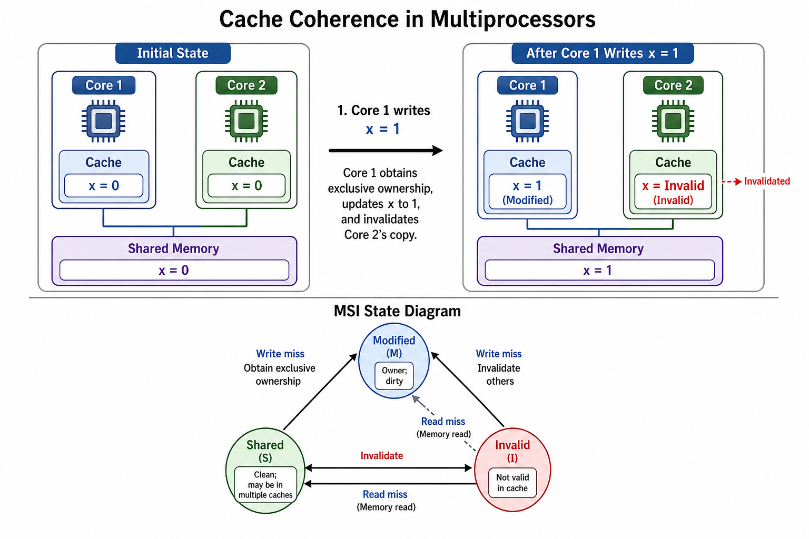
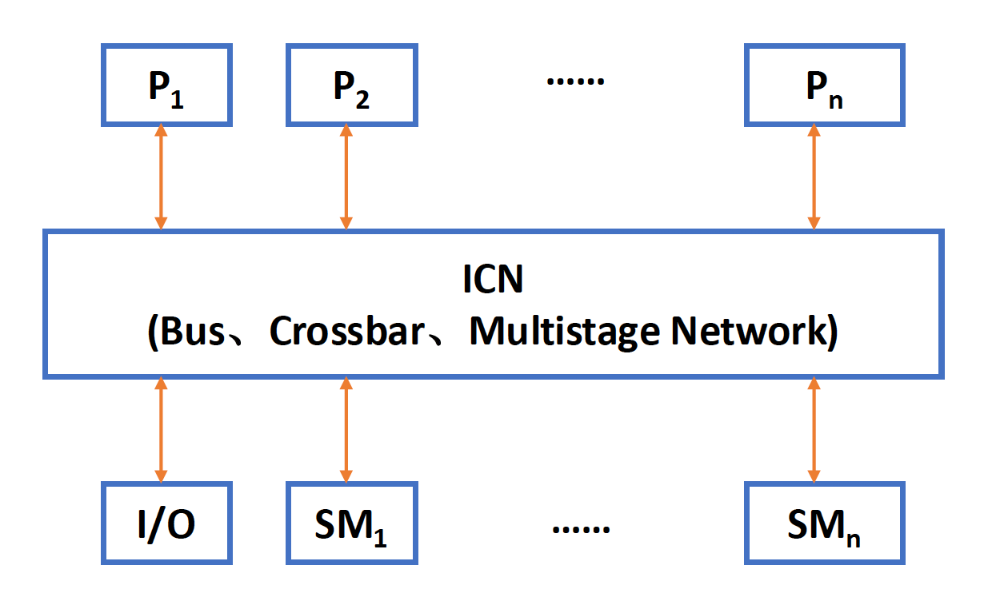
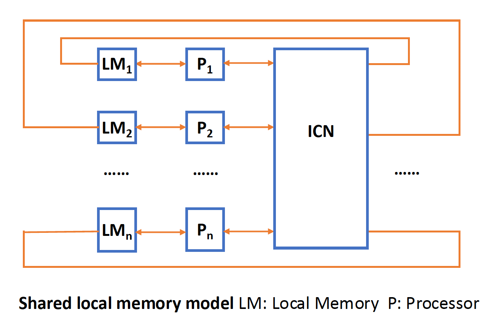
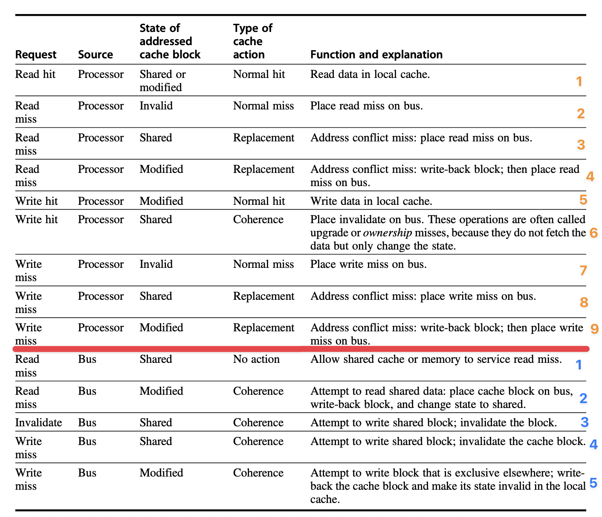
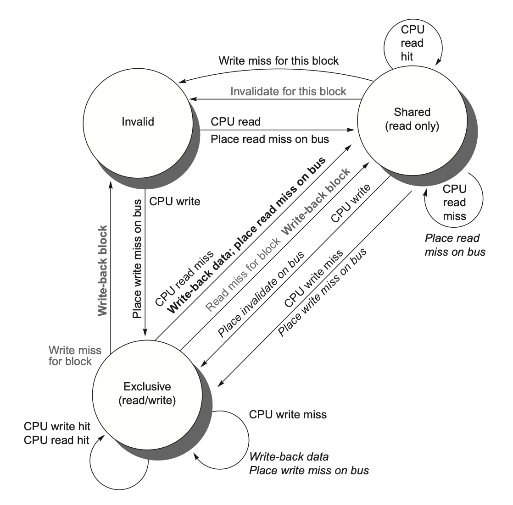
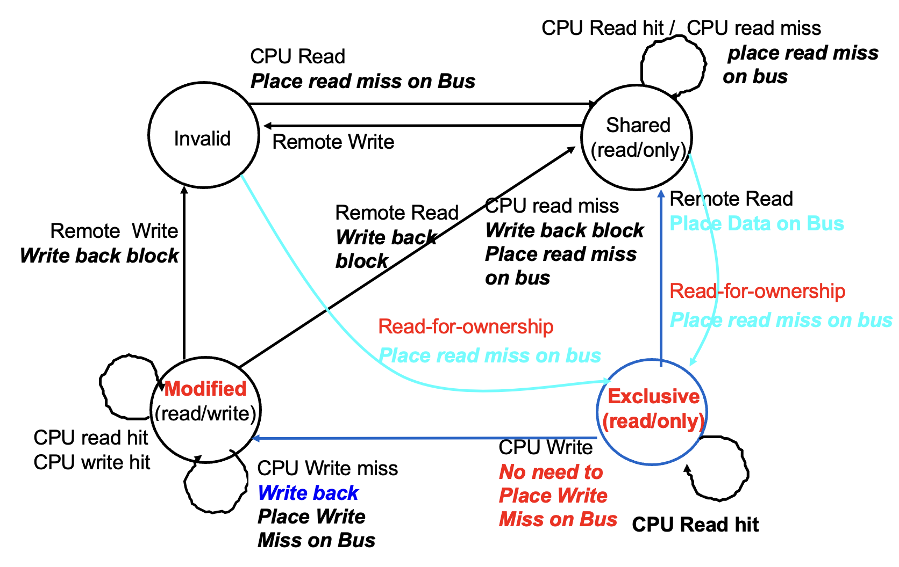
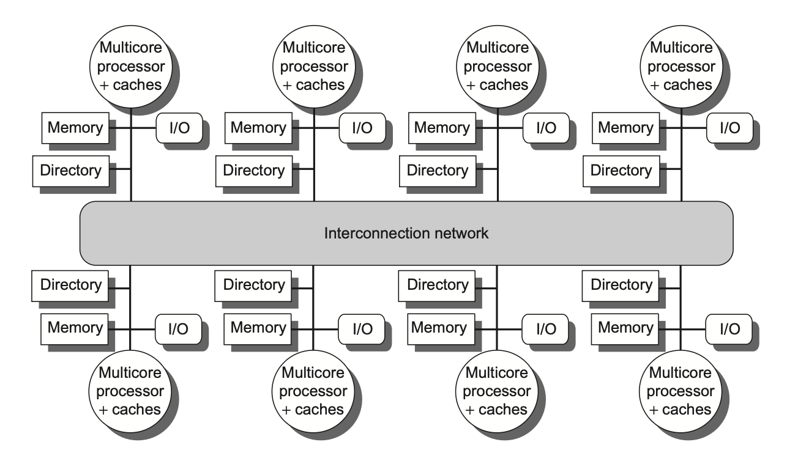
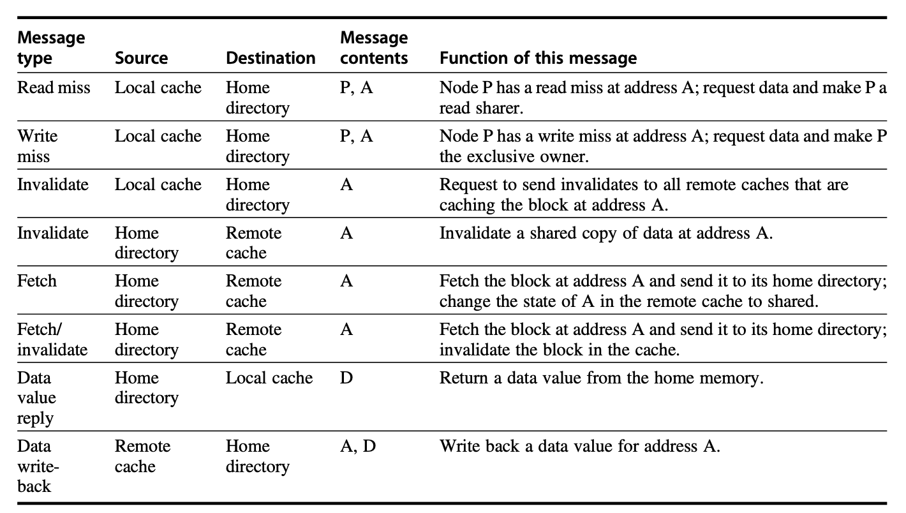
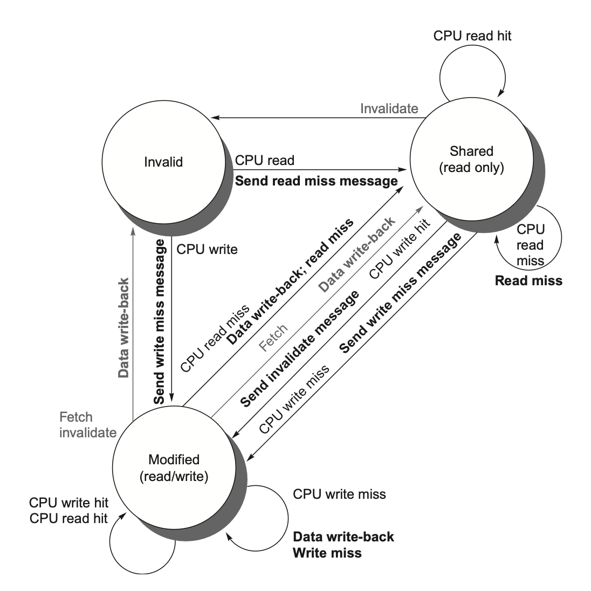

# Chap 5：线程级并行（TLP）

→ 课程索引：[CA 首页](index.md)
→ 刷题实战：[刷题实战](exam-drills.md)

本章是**第三道大题**的主力：MESI 状态跟踪、目录协议消息流程，几乎每年必考其一。选择题考 coherence vs consistency、SMP/NUMA、写无效 vs 写广播、自旋锁、内存一致性模型。状态题靠"按状态机逐步走"拿分。



## 1. 多处理器架构：SMP vs DSM

| 架构 | 别名 | 内存 | 特点 |
|---|---|---|---|
| **SMP**（对称共享内存） | UMA | 集中式单一内存 | 所有核访问任何内存字**时间相等**；核数少（≤32）；现在多数多核属此 |
| **DSM**（分布式共享内存） | NUMA | 每芯片配本地内存 | **本地快、远程慢**；可扩展到很多处理器 |




!!! tip "关键直觉"
    无论 SMP 还是 DSM，线程间都通过**共享地址空间**通信（"共享内存"指共享地址空间，不一定单块物理内存）。NUMA 下程序员看到的仍是统一地址空间，只是不同地址物理上在不同节点，延迟不同。

22-23 第 9 题坑：A（UMA 时间一致 ✓）、B（NUMA 本地快 ✓）、D（DSM=NUMA ✓）都对；**C 把 coherence 和 consistency 定义反了 → C 错**（见下节）。

## 2. Coherence vs Consistency（最爱考的辨析）

| 概念 | 关心什么 |
|---|---|
| **Coherence（一致性）** | **同一个**内存地址的多个副本是否一致——规定**读能返回哪些值** |
| **Consistency（连贯性）** | **不同**地址的读写顺序在各核看来如何——规定**写的值何时能被读到** |

一句话：Coherence 管"同一变量 x 的值对不对"，Consistency 管"x 和 y 的操作顺序别人怎么看"。

**Coherence 严格定义**三条：
1. 同一处理器写后读，中间无其他写 → 读到自己写的值（保程序顺序）。
2. 一处理器写后，足够时间间隔后另一处理器读 → 读到那个写值。
3. **写串行化**：对同一位置的写，所有处理器看到的顺序相同。

→ 概念页：[[concepts/cache-coherence]]

## 3. 写无效 vs 写广播

| 协议 | 机制 | 带宽 |
|---|---|---|
| **写无效**(write invalidate) | 写前先独占，使其他副本失效 | **省带宽**，主流 |
| 写广播/写更新(write update) | 每次写都广播新值更新所有副本 | 费带宽 |

几乎所有现代多处理器用**写无效**。22-23 第 35 题坑：A/B 都说写无效更省带宽（✓）；C 说写无效"从写到被读延迟更长"（✓，因为别人要重新取）；**D 说写广播利用空间局部性"只有第一次写要广播"是错的**——写广播每次写都要广播。

## 4. 监听 vs 目录

| 协议 | 怎么工作 | 适合 |
|---|---|---|
| **Snooping（监听）** | 所有 Cache 监听共享总线/广播介质上的请求 | 小规模、总线系统 |
| **Directory（目录）** | 目录记录每个块在哪些 Cache、是否脏 | 大规模、分布式 DSM |

监听简单但总线/带宽是瓶颈、可扩展性差；目录可扩展但更复杂。多核常在共享 L3 设目录（L3 须**包含性** inclusive）。

## 5. MSI 协议（基础三态）



三状态：

| 状态 | 含义 |
|---|---|
| **M (Modified)** | 本 Cache 独占且已改，内存是旧的 |
| **S (Shared)** | 可能多个 Cache 都有，内容与内存一致 |
| **I (Invalid)** | 本块无效 |

合并状态转换图（左 CPU 请求、右总线请求合并）：



典型流程：
1. P1 读 x → S。
2. P2 读 x → 都 S。
3. P1 写 x → 发 invalidate，P2 变 I，P1 变 M。
4. P3 读 x → P1 把 M 写回/提供数据，双方变 S。

## 6. MESI 与 MOESI 扩展

**MESI**：在 MSI 上加 **E (Exclusive 独占未改)**。

| 状态 | 含义 |
|---|---|
| M Modified | 独占且已改，内存旧 |
| **E Exclusive** | 独占但**未改**，内存新 |
| S Shared | 共享，内存新 |
| I Invalid | 无效 |

E 的好处：块在 E 状态时再写**无需发 invalidate**（已知只有自己有），静默 E→M。优化了"先读后写"场景。



**MOESI**：再加 **O (Owned)**。原 M 块被共享时可转 O（不立即写回内存），O 表示内存副本过时、本 Cache 是 owner，失效时由 owner 提供数据。

!!! info "24-25 / 22-23 选择题"
    - MESI 四状态全名：Modified / Exclusive / Shared / Invalid。
    - 22-23 第 25 题：不属于 MESI 的是 **Outdated**（干扰项）。

??? example "例题：MESI 五步状态跟踪（24-25 第三大题）"
    > 4 个处理器初始全 I，给定 MESI 转移图，求每步各处理器状态：
    > ```
    > P0 read a   → P0:E（独占，无人有）, 其余 I
    > P1 read a   → P0:S, P1:S（变共享）
    > P2 read a   → P0:S, P1:S, P2:S
    > P3 write a  → P3:M, P0/P1/P2:I（写无效）
    > P0 read a   → P3 提供数据并写回, P0:S, P3:S
    > ```
    做题纪律：read miss 无人有→E；有共享→S；有 M→对方写回双方 S。write→自己 M，其余 I。

## 7. 目录协议（DSM 大题）



目录状态（针对整块在所有 Cache 的总体状况）：

| 状态 | 含义 |
|---|---|
| Uncached | 没任何节点持有副本 |
| Shared | 一或多个节点共享，内存新 |
| Modified/Exclusive | 一个节点独占已改，内存旧，该节点是 owner |

用**位向量 Sharers** 记哪些节点持有副本。三种角色节点：

- **本地节点(local)**：发起请求的节点。
- **家节点(home)**：存目标地址内存和目录项的节点（物理地址静态划分决定）。
- **远程节点(remote)**：持有副本的节点。




三类请求处理：**read miss、write miss、data write-back**。

??? example "例题：目录协议消息流程（22-23 第四大题）"
    分布式 3 节点 P0/P1/P2，画出事件的消息序列。参考给定示例格式：
    > **P0 read 300**：
    > 1. P0 发 ReadMiss(Tag 300) 给家节点 P2
    > 2. P2 改目录 "300, {}, U" → "300, {P0}, S"
    > 3. P2 datareply 回 P0
    > 4. P0 改 cache line I→S

    **P2 read 218**（218 当前在 P0 独占 E，家节点 P1）：
    1. P2 发 ReadMiss 给 P1
    2. P1 发 Fetch 218 给 owner P0
    3. P0 写回 218 给 P1，自己 E→S
    4. P1 改目录 {P0},E → {P0,P2},S
    5. P1 datareply 给 P2
    6. P2 cache I→S

    **P0 write 210 with 8888**（210 在 P1/P2 共享 S，家节点 P1）：
    1. P0 发 WriteMiss 210 给 P1
    2. P1 发 invalidate 给 P1、P2
    3. P1、P2 改 cache S→I，回 ACK
    4. P1 改目录 {P1,P2},S → {P0},E
    5. P1 datareply 给 P0
    6. P0 cache S→E（值 8888）

    做题纪律：① 找家节点 → ② 请求方发 ReadMiss/WriteMiss → ③ 家节点看目录状态 → ④ 需要时向 owner 发 Fetch / 向 sharers 发 invalidate → ⑤ 更新目录 sharer/owner → ⑥ 更新请求方 cache 状态与值。

## 8. 同步

需要原子的"读-改-写"硬件原语：

| 原语 | 含义 |
|---|---|
| atomic exchange | 寄存器与内存值原子交换 |
| test-and-set | 测试是否 0，是则置 1 |
| fetch-and-increment | 返回旧值并原子 +1 |
| **LR/SC** | load reserved + store conditional：期间没人改过 SC 才成功 |

**LR/SC** 是 RISC-V 方式：`lr` 加载并标记保留；`sc` 若保留未被破坏才成功（写 0），否则失败（写非 0）。中间只能放寄存器-寄存器操作，且指令越少越好（防死锁/失败）。

**自旋锁**：用一致性机制把锁缓存到本地，**先在本地副本读自旋**（test），看到可用再用 exchange 抢，减少总线流量。

??? example "例题：两段自旋锁哪个好（22-23 第 34 题）"
    > 代码(a) 直接 EXCH 自旋；代码(b) 先 LL 读测试、可用才 SC。
    答案 **C：(b) 更好**，因为它**避免对不可用锁的无谓写**（写会引发 invalidate 风暴），性能更好。

**屏障 barrier**：用共享计数器 + 自旋等待 release。朴素实现有"慢进程被困"问题，用**感知反转屏障**(sense-reversing) 解决；组合树形屏障减少竞争。

## 9. 内存一致性模型

**顺序一致性 SC**：结果看起来像所有处理器操作按某全局顺序交错，且每个处理器自己的程序顺序被保留。最直观但限制性能（要等每次访存的失效都完成才能下一步）。

??? example "例题：哪个模型保证两个 if 不同时为真（22-23 第 18 题）"
    > P1: A=1;…;A=0; if(B≠0); P2: B=1;…;B=0; if(A≠0)
    答案 **A：Sequential consistency**。只有 SC 保证所有赋值在 if 前完成，排除两 if 同真的诡异交错。

**松弛一致性模型**：允许读写乱序，靠同步操作强制排序。按松弛的顺序子集分类（顺序为 R→W, R→R, W→R, W→W）：

| 模型 | 松弛了 |
|---|---|
| 全存储顺序 TSO / 处理器一致性 | 仅 W→R |
| 偏存储顺序 PSO | W→R 和 W→W |
| 弱顺序 / 释放一致性 | 全部四种 |

**释放一致性**区分 acquire（获取）和 release（释放）。RISC-V/ARMv8/C++ 都用松弛模型 + **FENCE** 指令显式排序。

!!! info "用推测隐藏 SC 延迟"
    推测处理器可乱序访存，若提交前收到该地址失效就回滚重执行——这样既保持 SC 编程模型的简单，又拿到接近松弛模型的性能。

## 10. 本章考点清单

- [ ] SMP/UMA vs DSM/NUMA，共享地址空间
- [ ] **Coherence（同地址副本一致）vs Consistency（异地址读写顺序）** 别说反
- [ ] 写无效 vs 写广播；写广播每次写都广播
- [ ] 监听 vs 目录，各自适用与瓶颈
- [ ] **MSI 三态、MESI 加 E、MOESI 加 O**；E 写无需 invalidate
- [ ] MESI 多步状态跟踪（read/write miss 规则）
- [ ] 目录协议消息流程（home/local/remote，ReadMiss/WriteMiss/Fetch/invalidate）
- [ ] LR/SC、自旋锁为何先读后抢、屏障
- [ ] SC 定义 + 哪个模型保证 if 不同真；松弛模型分类、FENCE

上一章 → [Chap 4](chap4.md) ｜ 刷题实战 → [刷题实战](exam-drills.md)。
