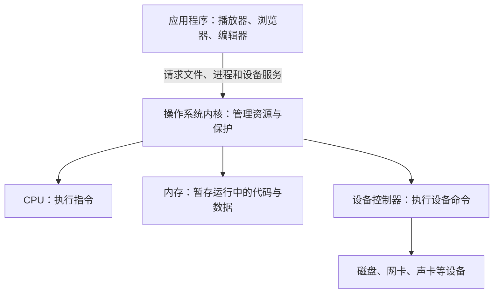

# 操作系统导论

**本章问题：音乐播放、网页下载和文件保存同时进行时，谁分配CPU和内存，谁保证程序互不破坏？**

学习顺序：

1. 认清CPU、内存、设备和操作系统的分工。
2. 用时间线区分并发、并行与设备等待。
3. 看中断和系统调用怎样把控制权交给内核。
4. 用存储层次与局部性解释缓存的作用。

## 一台电脑怎样分工

播放音乐时又下载文件，两个程序都要用CPU、内存和设备。**CPU执行指令，内存保存正在使用的指令与数据，外存长期保存文件**；键盘、网卡、磁盘等与系统交换数据，统称输入输出设备（I/O）。设备控制器接收命令、操作设备，并报告状态，CPU不必亲自完成设备内部的每一步。

操作系统（OS）把这些资源分给程序，并提供文件、进程等容易使用的抽象。**程序**是静态的指令与数据，**进程**是程序的一次运行及其状态。同一个编辑器开两份文件，可以有两个不同进程。**内核**承担核心管理工作；桌面、命令行和工具通常运行在内核之外。内核常驻内存，也不代表CPU始终执行内核。

例如，播放器需要计算音频、保留音频数据并把结果交给声卡：CPU负责计算，内存暂存数据，声卡负责输出；操作系统安排计算机会和设备访问。应用使用“打开文件”“创建进程”等接口，通常无需直接知道磁盘寄存器在哪。这种把硬件细节包装成可用对象与操作的做法，叫**抽象**。

从图上向下读是“请求怎样落实到硬件”；从下向上读是“硬件能力怎样被组织成应用可用的服务”。

## 一核怎样做多件事

单核在某一时刻只能执行一条任务流，却可以交替执行多个任务。多个活动在一段时间内交错推进，叫**并发**；同一时刻在不同执行单元上工作，叫**并行**。

例如A计算2毫秒，再等独立设备4毫秒，最后计算1毫秒；B也如此，均在0时到达。A先占CPU：

| 时间/ms | CPU | 正在做I/O的任务 |
| --- | --- | --- |
| 0—2 | A | 无 |
| 2—4 | B | A |
| 4—6 | 空闲 | A、B |
| 6—7 | A | B |
| 7—8 | 空闲 | B |
| 8—9 | B | 无 |

CPU忙了6毫秒，整个过程9毫秒，利用率为 $6/9=2/3$。计算和设备等待能够重叠，来自**多道程序设计**。单道批处理只自动接续作业；多道批处理还会利用等待空隙。**分时**用较短时间片改善交互响应；**实时**要求在截止期前完成，硬实时不能接受关键超期，软实时允许质量下降。利用率高不能保证某个任务按时完成。

并发带来共享资源的需求。分时CPU、独立地址空间体现**虚拟化**；任务推进速度和次序不固定称为总论中的**异步性**。它们解释了为什么系统还需要保护与同步。多核提供更多并行位置；分布式系统则由联网的多台机器协作，还需面对通信延迟和局部故障。

### 练习 1

自编题：单核机器只有一条CPU执行流。
A等磁盘时，CPU转去运行B。
若改成A反复检查磁盘且不让出CPU，
下列哪项解释最准确？

- A. A与B仍在并行，因二者都没有退出
- B. A已进入阻塞，因此B必然立刻运行
- C. B的响应可能变慢，设备仍可独立工作
- D. B必然不能就绪，设备也会停止工作

**答案：C。** 忙轮询占CPU，不等于阻塞。
原情境中A、B在CPU上并发而非并行；
磁盘与CPU工作仍可重叠。

## 内核怎样拿回控制权

CPU可以反复检查设备是否完成，这叫**轮询**，检查仍占用CPU。设备也可以发出**中断**，让CPU暂时转向处理入口。设备中断相对当前指令异步发生；除零、非法访问等由当前指令引起的事件叫**异常**。应用主动请求内核服务也走受控入口，称为系统调用。

处理路径是：保存返回位置和必要寄存器→识别原因→处理事件→恢复执行。硬件保存一部分现场，入口代码补存其他必要状态。漏存被改动的寄存器，会让原程序拿着错误中间值继续计算。

假设B运行时A的磁盘请求完成。内核可把A从等待改为就绪，再返回B；A只是获得了竞争CPU的资格。**中断、模式切换、进程切换是三个不同事件**。时钟中断提供重新调度的机会，也不强制每次换人。

硬件用用户态与内核态限制权限。应用通常在用户态，不能任意关闭中断或修改保护设置；系统调用进入内核，经检查后执行服务，再返回。地址保护限制空间，定时器约束占用CPU的时间，特权模式限制可执行的操作。

### 练习 2

自编题：单核上B在用户态运行。
磁盘完成A的请求，内核唤醒A后返回B。
有人说：“进内核就必然换成A运行。”
① 逐步写出模式和运行任务的变化。
② 指出错误，并说明何时才算任务切换。

**解答**

事件前：B在用户态运行。
中断时：CPU进入内核处理中断，
A由等待变为就绪；这不等于A运行。
中断后：仍返回B的用户态执行。
错误是把权限变化当成运行身份变化。
只有保存B并恢复另一任务（如A）执行，
才发生本题所说的任务上下文切换。

**判分要点**

须区分用户态→内核态→用户态与任务身份。
须写A等待→就绪，不能跳成运行。
须指出本情境没有B→A的任务切换。

## 数据为什么分层存

8个二进制位组成1字节（B）；KiB和MiB分别是 $2^{10}$、$2^{20}$ B。按字节编址时，32位地址能区分 $2^{32}$ 个字节位置。题目若用KB、MB，先看采用十进制还是二进制。

从快到慢，常见层次为寄存器→高速缓存→主存→SSD或磁盘→归档介质。快层通常小而贵，因此只保留近期有用的数据。循环反复用同一变量体现**时间局部性**；顺次扫描数组体现**空间局部性**。多个副本被修改后还要保持一致，缓存命中本身不证明内容最新。

平均访问时间按两条完整路径加权。若命中率 $h=0.9$，命中耗时 $T_h=2$ ns，未命中的完整耗时 $T_m=82$ ns，则

$$T=hT_h+(1-h)T_m=10\text{ ns}.$$

这里82 ns已含缓存查询，不能再加2 ns。以后计算TLB和缺页耗时时仍先画路径，再代入时间。

### 练习 3

自编题：缓存命中率0.8，命中耗时4 ns。
未命中整条路径共84 ns，已含缓存查询。
① 求平均访问时间，指出重复加查询的错误。
② 单CPU的两个作业均为CPU 2 ms、
独立设备I/O 4 ms、CPU 1 ms。
两作业同时到达，A先运行；CPU按FCFS，
I/O立即开始，无切换开销，画完整时间线。
③ CPU利用率提高是否保证实时截止期？

**解答**

平均为0.8×4+0.2×84=20 ns。
84 ns已含查询，不能再加4 ns。
CPU：A 0—2，B 2—4，空闲4—6，
A 6—7，空闲7—8，B 8—9。
I/O：A 2—6，B 4—8。
CPU利用率6/9=2/3，统计区间0—9 ms。
高利用率并不证明具体请求按截止期完成；
还需核对该任务的响应、执行量及截止时刻。

**判分要点**

平均值遵守完整未命中路径口径。
正确交叠两个I/O，空闲区间不得省略。
区分总体利用率与单任务截止期证据。

## 记忆要点

- CPU执行，内存暂存，设备完成I/O；操作系统分配、抽象和保护资源。
- 程序是静态内容，进程是运行实例，内核是核心管理代码。
- 并发看一段时间内是否交错推进；并行看同一时刻是否同时执行。
- 设备完成使等待任务就绪；就绪后仍要等待CPU调度。
- 缓存计算先列命中与未命中的完整路径，再按概率加权。
