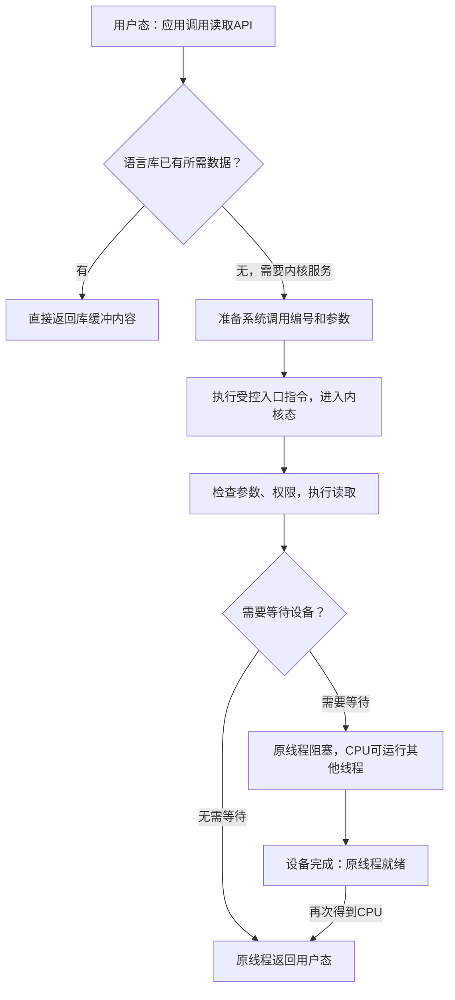

# 操作系统结构

**本章问题：程序调用一次“读文件”，怎样跨过权限边界，让内核安全地完成请求？**

学习顺序：

1. 区分应用接口、语言库和真正的系统调用。
2. 追踪用户态进入内核再返回的完整路径。
3. 理解参数检查、内核结构与策略／机制。
4. 分清编译、链接、装载、整机启动和虚拟化。

## 一次读取怎样进内核

- 先补三个词。
- **寄存器**是CPU内少量、快速的存储位置，执行指令时保存地址、操作数等；
- **程序计数器**保存下一条要执行的指令位置；
- **陷入**是通过受控入口把执行转交给内核的一类方式。
- 用户态与内核态是CPU权限状态，同一个线程也能在两种权限下先后执行。

图中“进入内核态”改变权限；“阻塞后运行另一线程”才改变执行身份。这两个动作可能接连发生，也可能只发生前者。

应用要读文件，先调用语言库提供的接口（API）。API是程序员看到的函数约定，系统调用是进入内核请求服务的边界。

例如库里已有缓冲数据时，读取可以直接在用户态返回；缓冲为空时，才可能触发内核读取。

一次API调用与一次系统调用没有固定的一对一关系，`printf`也可能先格式化并缓冲文字。

- 真正进入内核时，应用准备调用编号和参数，执行体系结构规定的陷入指令。
- CPU保存返回信息并转到内核入口；
- 内核识别请求、检查参数与权限，完成操作后返回结果和执行位置。
- 数据已就绪时，同一个线程可以立即返回；
- 等待设备时才可能阻塞并让出CPU。
- **跨权限边界不等于换运行任务。**

### 练习 1

!!! question "题目"

    自编题：读取API原先直接返回库缓冲数据。
    修改后缓冲为空，触发内核读取，
    内核数据已就绪，原线程直接返回。
    关于这次修改，哪项正确？

    - A. 增加了模式转换，未必发生任务切换
    - B. 增加了任务切换，未必发生模式转换
    - C. 仍只在用户态运行，因为入口是API
    - D. 必然等待磁盘，因为调用了读取接口

!!! success "参考解答"

    - **答案：A。** API原先可完全在用户态完成。
    - 修改后系统调用跨权限边界；
    - 题设数据已就绪，同一线程可直接返回。

## 参数为什么要检查

参数可放在寄存器、内存参数块中，或通过栈传递。这只决定“怎样取参数”，不保证参数可信。内核必须检查地址范围、读写权限、长度以及运算是否溢出。

!!! example "例子与推演"

    例如允许写的用户地址为 $[1000,2000)$，应用要求从1996开始写8字节。首地址合法，但范围是 $[1996,2004)$，越界4字节，应拒绝。半开区间中的2000不属于合法区域。

    仅检查首地址，或因为参数来自用户栈就跳过检查，都会让保护失效。

- 常见系统调用可以按用途记：创建或等待进程；
- 打开、读写文件；
- 控制设备；
- 查询时间和系统信息；
- 进程通信；
- 设置访问权限。
- 命令行解释器（shell）读取并解释命令，通常通过创建进程和执行程序完成工作；
- 它本身一般也是用户态程序。
- 系统工具、库、内核和硬件因此组成不同服务层。

## 内核内部怎样组织

决定“下一个运行谁”是**策略**；提供保存现场、恢复现场的方法是**机制**。把两者分开，替换调度策略时就不必重写整套切换代码。

| 结构 | 怎么安排服务 | 主要取舍 |
| --- | --- | --- |
| 单体内核 | 多数服务在同一内核空间直接调用 | 调用路径短，错误影响范围可能较大 |
| 分层结构 | 上层依赖下层服务 | 边界易理解，划层和跨层可能有成本 |
| 微内核 | 内核保留少量基础机制，其他服务放用户进程 | 更易隔离，消息传递和切换有开销 |
| 模块化 | 通过约定接口装入或卸载模块 | 易扩展；模块仍可能在内核态 |
| 混合结构 | 综合多种安排 | 应分析实际服务位置与调用路径 |

把文件服务移到用户态后，一条读路径可能变成“应用→内核消息机制→文件服务→内核驱动→设备→回复应用”。服务出错更难直接破坏其他地址空间，但依赖它的应用仍可能读失败或等待。

结构名称不能单独证明性能或可靠性。

### 练习 2

!!! question "题目"

    自编题：原文件服务位于单体内核内部。改造后位于独立用户态服务进程，应用用消息请求它，必要I/O仍经过内核。开发者声称“通信变快且服务错误不会影响别人”。

    - ① 写出改造后的读取路径。
    - ② 找出该断言中两个没有保证的部分。

!!! success "参考解答"

    **解答**

    - 路径：应用→内核消息机制→文件服务；
    - 服务需要设备时再经内核驱动访问设备，结果经回复消息送回应用。
    - 跨服务通信可能增加传递和切换开销，没有足够测量不能断言更快。
    - 独立地址空间可限制直接内存破坏，但服务失效仍可能使依赖者读取失败或等待。
    - 隔离收益不等于故障对外完全无影响。

    **判分要点**

    - 须体现服务在用户态且仍需内核支持。
    - 须把通信成本与隔离收益分别解释。
    - 不能把结构标签当成绝对性能或可靠性保证。

## 程序与系统怎样启动

- **编译**把源代码转成机器代码；
- **链接**把多个目标文件拼接起来，并解决“调用的函数在哪”等符号引用；
- **装载**给程序建立运行时地址空间和初始状态。
- 三者分别回答“指令是什么、依赖在哪里、运行时放在哪”。

动态链接允许部分库在装载或运行时解析；它仍需完成相应符号与地址处理。整机引导则在操作系统尚未运行时把内核带入执行，和普通应用装载处于不同阶段。

源文件先编译成目标文件，再由链接器组合代码与数据，解决符号引用，得到可执行文件。装载器建立运行需要的地址映射与初始状态，再转入入口。

动态链接还会装入依赖库；ELF中的程序入口 `e_entry` 与指定解释器的 `PT_INTERP` 有不同用途，不能把所有入口都称为动态加载器。

整机启动要先有固件或引导程序初始化必要硬件、装入内核，再转入内核初始化，建立内存管理、驱动和初始进程。

构建配置决定哪些功能被编入、作为模块或禁用；Makefile描述目标、依赖和生成规则，改变依赖后才知道应重建什么。

今年Lab 0把这些角色放在同一条链上：Docker提供工具运行环境，交叉编译器在宿主环境产生RISC-V代码，QEMU模拟目标机器，内核在其中启动。

GDB利用带符号的 `vmlinux` 调试；实验用的 `Image` 与它承担的文件用途不同。Lab 1则接着观察引导和时钟中断。

这里先认清角色，具体运行证据来自实际实验。

## 虚拟机增加了哪一层

虚拟机监控器（hypervisor）把CPU、内存与设备呈现为虚拟硬件，客户操作系统在这套硬件视图上运行。监控器可直接位于硬件之上，也可依托宿主操作系统。

容器通常共享宿主内核，隔离进程环境，与每台都运行客户内核的虚拟机不同。

虚拟CPU仍要被安排到物理CPU上。忽略同时多线程硬件，2个物理核心最多同时执行2条指令流；两台虚拟机各宣称2个vCPU，也不能让4条计算任务同时占有4个物理核心。

虚拟化提供资源视图和隔离，实际吞吐仍受硬件与调度约束。

### 练习 3

!!! question "题目"

    自编题：只允许访问用户字节区间[1000,2000)。读系统调用要写入从1996开始的8字节，整数运算无溢出，其他权限均满足。

    - ① 仅检查起始地址合法吗？应如何判断？
    - ② 参数先放用户栈，再跨入内核，能否因此省掉内核对指针和长度的检查？
    - ③ 2个物理核心，2个虚拟机各有2个vCPU；忽略SMT，四条CPU密集任务能否同时执行？

!!! success "参考解答"

    **解答**

    - 不能只检查1996；
    - 完整范围是[1996,2004)，末4字节越过2000，应拒绝这个越界缓冲区。
    - 传参位置只决定怎样取参数，不保证参数可信；
    - 内核仍须验证完整范围、权限及相应访问条件。
    - 共有4个vCPU，但只有2条物理核心执行流，最多同时执行2条任务，其余需等待或交替运行。
    - 虚拟机提供隔离与虚拟资源，不凭空增加核心。

    **判分要点**

    - 检查完整半开区间而非只验首地址。
    - 说明传参机制与安全验证是不同步骤。
    - 给2条物理并行上限并说明vCPU的调度含义。

## 记忆要点

!!! tip "本章记忆要点"

    - API是程序看到的调用约定；系统调用是请求内核服务的受控边界。
    - 用户态／内核态说明权限；线程身份说明谁在执行，二者分开记录。
    - 检查指针时看完整范围、权限与长度运算，不能只看首地址。
    - 策略决定选择，机制落实选择；结构评价需要看实际调用路径。
    - 编译产机器代码，链接解依赖，装载建运行环境；vCPU仍受物理执行位置限制。

