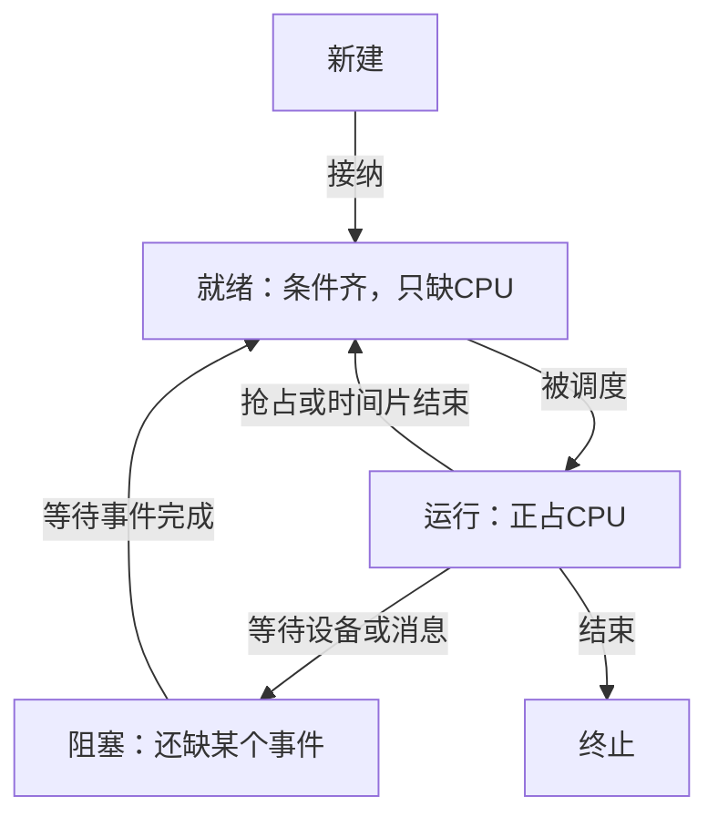
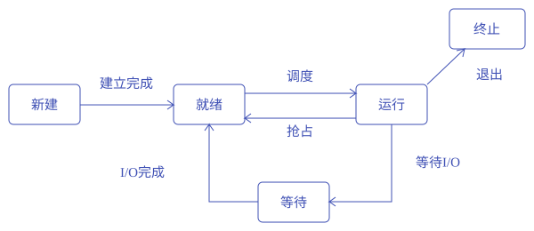

# 进程

<div class="course-notes" markdown>

**本章问题：程序暂停后为什么还能接着运行？等待磁盘的程序与等待CPU的程序有什么不同？**

学习顺序：

1. 认识进程的地址空间和PCB执行记录。
2. 按事件画就绪、运行、阻塞之间的转换。
3. 逐分支追踪fork创建与exec替换。
4. 比较共享内存、消息、管道的通信语义。

## 运行为什么需要档案

程序执行到一半要暂停，恢复时必须知道下一条指令在哪里、寄存器里存了什么、打开了哪些文件。

操作系统把这些管理信息放在**进程控制块（PCB）**：进程标识、状态、程序计数器、寄存器、调度信息、地址空间信息和资源引用。

进程地址空间通常含代码、全局数据、堆和栈。堆用于动态分配，栈保存函数调用的返回位置、参数和局部数据。进程并非只有一份代码；同一程序的两次运行也有各自的状态和资源。

设A正在算 `3+5`，结果8暂存在寄存器中，此时被暂停。以后恢复A，必须同时恢复“从哪条指令继续”和“寄存器中间值是什么”。若只保留代码文件，运行了一半的状态就会丢失。

PCB记录的是系统管理与恢复所需信息；程序实际代码、堆和栈位于相应地址空间中，不能把整个进程内容都理解为装在PCB里。



读图时给每条箭头补一个真实事件。阻塞解除后先进入就绪，因为CPU可能仍被B使用。现代系统通常调度线程；本章采用单线程进程模型说明状态，同样的等待与调度逻辑也适用于线程。

## 等CPU还是等事件

五个基本状态是新建、就绪、运行、阻塞和终止。理解它们只需问：**现在缺CPU，还是缺其他条件？**

| 事件 | 状态变化 |
| --- | --- |
| 系统接受新进程 | 新建→就绪 |
| 调度器分配CPU | 就绪→运行 |
| 时间片用完或被抢占 | 运行→就绪 |
| 等待设备、消息等条件 | 运行→阻塞 |
| 等待条件满足 | 阻塞→就绪 |
| 执行结束 | 运行→终止 |

A等待磁盘时B运行；磁盘完成使A就绪，只有调度器选中A后它才运行。**上下文切换**保存当前任务的寄存器等执行状态，再恢复另一个任务的状态，期间有管理成本。

系统调用和中断可以只进内核再返回原任务，因此不一定切换进程。




每条状态转换都由具体事件触发


### 练习 1

!!! question "题目"

    自编题：A等待设备，B占用单核CPU。
    设备完成后，调度器仍让B继续运行。
    若把记录中的A状态从“就绪”改成“运行”，
    哪项指出了该修改的根本问题？

    - A. 设备完成只保存寄存器，A仍必须等设备
    - B. 进入中断处理后，A与B能够同时占CPU
    - C. 设备完成必定切换进程，B不可能继续
    - D. 设备完成只恢复资格，A还没有得到CPU


!!! success "参考解答"

    **答案：D。** 阻塞的原因消失使A进入就绪。
    等待CPU是就绪等待；获得CPU才是运行。


    系统还可以把暂不运行的进程换出内存，称为**挂起**。阻塞挂起者的I/O完成后变成就绪挂起，仍需调入才能竞争CPU。

    长期调度决定接纳哪些作业，短期调度从就绪队列选CPU使用者，中期调度处理挂起与恢复。设备等待队列和CPU就绪队列保存的是不同等待原因。

## 创建之后从哪里继续

`fork` 的关键是“复制运行状态，然后父子分别获得返回值”。父子接下来都执行调用之后的代码；条件语句根据各自返回值把它们带入不同分支。

画创建树时，每遇一次 `fork`，先问**究竟哪些现存进程能执行到这一行**，再给每个执行者各添一个子进程。

Unix风格的 `fork` 创建子进程，父子都从调用返回处继续：父进程得到子进程标识，子进程得到0。

地址空间逻辑上独立，具体内存可用稍后介绍的写时复制共享；打开文件引用可能继承并共享同一打开实例。

看一段伪代码：

```text
v = 2
pid = fork()
if pid == 0:
    v = v + 3
    fork()
else:
    v = v + 1
```

第一次得到父P和子C。P走else，值变3；C把值改成5，再创建D。D从第二次 `fork` 后继续，因此C和D均为5。最后是3个进程，不能只数两次文字出现就套 $2^2$。

- `exec`把当前进程的程序映像替换为另一个程序，通常保留进程身份；
- `exit`结束执行并留下退出状态；
- 父进程通过 `wait` 类调用取得某个符合条件的子进程状态。
- 已退出但状态尚未回收者是僵尸；
- 父进程先退出而子仍存活称孤儿，两者不同。


### 练习 2

!!! question "题目"

    自编题：Unix风格语义，所有fork都成功。
    初始只有一个进程，无进程提前退出。
    伪代码如下，无需在本机运行：
    ```text
    x = fork()
    if x == 0:
        fork()
    ```

    - ① 执行后共有几个进程？画出创建关系。
    - ② 若父进程阻塞接收消息，消息到达后CPU仍运行另一进程，父进程处于什么状态？


!!! success "参考解答"

    **解答**

    - 第一次fork后有原父P与子C。
    - 仅C看到x等于0，执行第二次fork创建D。
    - 创建关系P→C→D，共3个进程，不是4个。
    - 消息到达使阻塞接收的条件满足，父进程进入就绪；
    - 要经调度才会运行。

    **判分要点**

    - 须指出第二次fork只有C执行。
    - 须得到3，并能追踪P、C、D的来源。
    - 须给消息到达后等待→就绪→被调度后运行。

## 两个进程怎样合作

**共享内存**让双方映射同一块存储区，数据交换可少一次复制，但要控制读写次序。

环形缓冲区常用写指针与读指针指示位置；若只用两指针并把“相等”表示空，通常留一个槽区分满与空，容量为 $N$ 时只存 $N-1$ 项。也可增加计数或额外标志用满全部槽。

共享映射不自动解决同步。

- **消息传递**通过发送与接收操作交换数据。
- 直接通信指定对方；
- 间接通信通过邮箱或端口。
- 阻塞发送可能等接收或空间，阻塞接收等消息；
- 非阻塞操作立即报告当前结果。
- 零容量缓冲要求双方会合，有界缓冲满时发送可能等，无界模型则忽略容量限制。
- 通信方式与阻塞策略是两组独立选择。

- 管道通常提供字节流，不保留每次写入的消息边界；
- 有界原子写入保证也不等同消息分帧。
- 管道为空时，如果仍有任何写端引用，读者不能认定结束；
- **所有写端关闭且存量读尽才到EOF**。
- `socket`让本机或网络端点通信；
- RPC把远程请求包装成调用，但网络超时不说明对方一定没有执行，重试需处理重复效果。


### 练习 3

!!! question "题目"

    自编题：Unix风格，初始一个进程，创建均成功。
    各进程独立地址空间，无进程提前退出。
    ```text
    v = 2
    pid = fork()
    if pid == 0:
        v = v + 3
        fork()
    else:
        v = v + 1
    ```

    - ① 最终进程数及各自v值？说明继承位置。
    - ② 阻塞挂起者I/O完成但尚未调入内存，应转入什么状态？为什么不能直接运行？
    - ③ 管道无剩余数据，但某子进程保留写端，读者能否仅因暂时没数据就判定EOF？


!!! success "参考解答"

    **解答**

    - 原父P的v为3；
    - 子C先把v改成5再创建D，所以C、D均为5；
    - 共3进程，值为{3,5,5}。
    - D从第二次fork返回处继续，不重跑加3。
    - I/O完成后为就绪挂起；
    - 需先解除挂起，再等待调度，才可能运行。
    - 不能判断EOF；
    - 仍有写端引用时可能有后续数据。
    - 在本题管道语义中，全部写端关闭且数据读尽，读操作才报告流结束；
    - 暂时为空可能阻塞。

    **判分要点**

    - 准确追踪fork返回位置与私有变量副本。
    - 区分解除阻塞、解除挂起及获得CPU。
    - 以全部写端引用关闭解释EOF条件。

## 记忆要点

!!! tip "本章记忆要点"


    - 进程恢复需要指令位置、寄存器与资源记录；PCB与进程地址空间职责不同。
    - 就绪只缺CPU；阻塞缺事件；解除阻塞后仍需调度。
    - 切换保存旧执行状态、恢复新执行状态；进入内核不自动意味着切换。
    - fork逐个分支数执行者；exec替换当前程序映像，通常保留进程身份。
    - 共享内存要同步；管道流结束要同时满足写端全关闭、数据已读尽。

</div>
