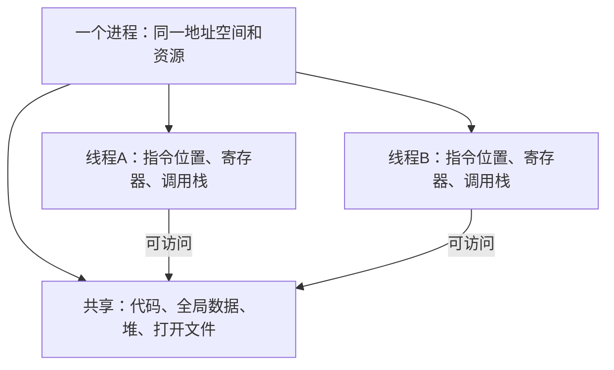

# 线程与并发

**本章问题：一个编辑器怎样同时保存文件和响应输入？增加线程后为什么有时仍然不快？**

学习顺序：

1. 对照进程资源与线程执行状态，理解共享和私有。
2. 看用户线程、内核线程和物理核心怎样映射。
3. 计算串行部分对加速比的限制。
4. 用等待关系分析线程池与线程生命周期。

## 一个进程里的多条线

编辑器保存大文件时仍能响应键盘，可以让一条线程处理保存，另一条处理界面。**线程是进程内的一条执行流**；进程提供地址空间和资源容器，线程保存继续执行所需的程序计数器、寄存器与栈。

同一进程的线程通常共享代码、全局变量、堆和打开文件，却有各自的调用栈与寄存器。各有栈只表示执行记录分开，不构成地址隔离：A把仍存活的栈对象地址交给B，B可能访问同一对象。必须同时保证对象寿命和并发访问规则。线程本地存储（TLS）则让同名变量按线程保存独立值。

两条线程都能访问堆中的任务队列，便于合作，也会产生同时修改同一对象的问题。线程私有栈保存各自函数调用过程；共享地址空间意味着“各自使用”与“别人绝对不能访问”是不同保证。

切换同一进程的线程通常无须更换整个地址空间，成本可能比进程切换低，但仍要保存执行状态。缓存可能保留，也可能因工作集变化失去效果；不能把切换说成必然清空全部缓存。

### 练习 1

自编题：两条线程共享同一进程地址空间。
把线程A栈上仍存活的对象地址交给B，
B按这个地址访问对象。哪项正确？

- A. A的栈自动变成堆，传地址改变存储归属
- B. 可能访问同一对象，独立栈不代表地址隔离
- C. 必然访问对象副本，线程栈天然互相隔离
- D. 必须先创建新进程，线程无法传递内存地址

**答案：B。** 各线程各有调用栈，但地址空间共享。
传递地址不复制对象，也不改变其寿命；
对象仍须存活，并另行处理同步。

## 谁把线程交给CPU

用户线程由用户态库管理，内核线程是内核可调度的执行实体。两层可以有不同映射：

| 映射 | 执行机会与限制 |
| --- | --- |
| 多对一 | 多条用户线程共用一个内核实体；经典模型中阻塞调用会挡住全部线程，也不能多核并行 |
| 一对一 | 每条用户线程对应内核线程；可并行，创建和管理成本较高 |
| 多对多 | 用户线程映射到一组内核实体；两层共同调度 |

例如8条用户线程映射到2条内核线程，机器有4核，忽略其他限制时并行度最多2。增加用户线程不会自动增加物理执行位置。多对多若某个内核实体阻塞，用户运行库需要知道可用执行位置的变化；内核通知与两层调度协调会增加复杂性。

## 并行能快多少

先找可同时工作的执行位置：用户线程数、可运行的内核执行实体数、物理核心数中，任何一个数量过少都可能限制并行。确定位置数后，还要找任务之间的依赖。例如必须先解码得到图像，后续图像处理才能开始，这段依赖无法靠再加线程消除。

把数组分成几段做同一种计算是**数据并行**；让不同线程分别解码、处理、写出是**任务并行**。只有彼此可独立推进的部分才能同时执行。依赖、负载不均、通信和同步都会消耗时间。

设单核总时间为 $T$，其中比例 $s$ 必须串行，其余可平均分到 $p$ 个执行位置，忽略开销：

$$T_p=T\left(s+\frac{1-s}{p}\right),\qquad S_p=\frac{T}{T_p}=\frac1{s+(1-s)/p}.$$

$T_p$ 的单位是时间，加速比 $S_p$ 无单位。单核需12秒，3秒串行、9秒可并行，只有2个执行位置时需 $3+9/2=7.5$ 秒，加速1.6倍。即使位置无限多，也要等串行3秒，极限为4倍。

### 练习 2

自编题：8条用户线程映射到2条内核线程，
机器有4核，所有工作独立且始终就绪。
单核工作共12秒，其中3秒只能串行，
其余9秒可平均分给可同时工作的线程。
忽略一切开销。
① 该组最多同时占几核？理想时间与加速比？
② 改成经典多对一，唯一内核实体
因阻塞系统调用挂起，其他用户线程能否运行？

**解答**

最多同时占2核，受2条内核线程限制。
理想时间为$3+9/2=7.5$秒。
加速比为$12/7.5=1.6$，无单位。
多对一且没有额外阻塞规避机制时，
唯一内核实体挂起，其他用户线程也不能运行。
增加用户线程数不会凭空增加内核执行实体。

**判分要点**

须取内核执行实体与核数的较小者。
须保留串行3秒，并正确给秒与无量纲比值。
须说明多对一阻塞结论的经典模型前提。

## 线程池怎样卡住

图中等待对象是工作线程资源。即使操作系统还有空闲核心，池中的子任务也没有获得工作线程的入口，因此不会自动开始。

线程池提前创建固定数量的工作线程。提交者把任务放进队列，空闲线程取任务执行，结束后继续取下一项；这样减少反复创建销毁的成本，并限制资源占用。

如果池中只有两条线程，任务A、B各占一条，又各自提交子任务a、b并同步等待，那么a、b没有空闲线程可用，A、B又不退出。多核也帮不上忙，因为池没有提供更多工作位置。可让父任务提交后返回，由完成通知继续后续步骤；简单加线程只能解决某个有限场景，不能保证任意层嵌套安全。

任务队列还要有容量与拒绝或等待策略。否则提交速度长期超过处理速度，队列和内存可能无限增长。线程池的目标同时包括效率与资源约束。

## 生命周期也要协调

线程**取消**表示请求它停止。立即强制取消可能让锁永不释放、文件状态只改一半；延迟取消让线程在约定检查点停止并执行清理。等待线程完成的 `join` 可用于确认资源能安全回收，不能只发取消请求就销毁仍被使用的数据。

多线程进程调用 `fork` 时，常见POSIX语义只把调用者复制到子进程。其他线程曾持有的锁状态却可能一起复制，子进程中没有原持锁线程来解锁，必须遵守相应创建和执行协议。信号也有进程定向与线程定向等规则，实际由哪条线程处理取决于屏蔽状态和接口约定，不能假设总广播给所有线程。

### 练习 3

自编题：固定线程池只有2个工作线程，无补偿线程。
任务A、B各占一个工作线程，分别提交子任务
a、b到同一池，然后同步等待各自子任务完成。
子任务本身无需锁且会很快结束。
① 给出谁等待谁，为什么多核也不能解困？
② 将线程数改为3能解决这个具体场景吗？
这是否证明任意嵌套任务都安全？
③ 给一种避免占用工作线程等待子任务的方案。

**解答**

A、B等待a、b完成；a、b等待空闲工作线程。
两个工作线程都被等待中的父任务占住，
因此无工作线程可取子任务，与CPU核数无关。
增至3可让第三线程先后执行a、b，解除本例。
但若3个父任务再次占满池并等待，仍可重现，
故增加固定数量不是任意嵌套安全证明。
可把父任务后半段注册为子任务完成后的继续任务，
提交子任务后立即归还工作线程，完成后再调度。
合理的依赖图调度或独立子任务执行资源也可接受，
须说明为什么不再形成所有工作线程互等。

**判分要点**

画出父等待完成、子等待执行资源的依赖。
区分解决具体2父任务与一般安全性保证。
方案必须真正释放或避免耗尽所需执行资源。

## 记忆要点

- 进程主要承载资源与地址空间；线程承载独立执行状态。
- 同进程线程通常共享堆与全局数据，各有栈，但没有天然地址隔离。
- 线程数量要经内核实体和核心数量限制，才能换成真实并行度。
- 总时间保留串行部分；理想加速也受它限制。
- 线程池任务同步等同池子任务时，检查是否耗尽全部工作线程。
