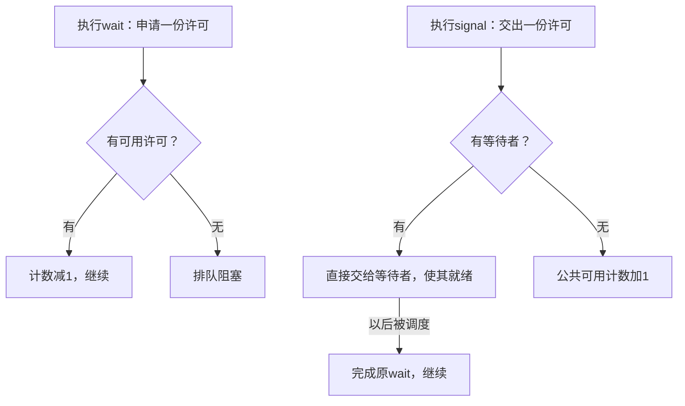

# 进程同步

**本章问题：两个线程同时改一个变量为什么会丢结果？怎样同时保证“轮到谁做”和“条件已经满足”？**

学习顺序：

1. 把一次更新拆成机器步骤，找出竞态。
2. 用互斥和原子操作保护临界区。
3. 把信号量理解为可领取或交接的许可。
4. 逐步执行生产者／消费者与条件变量。
5. 分清无死锁、公平性和多轮屏障。

## 一次加法也会冲突

这里的“同步”有两类目标。**互斥**要求同一时刻最多一个执行者修改某份共享状态；**次序协调**要求某件事发生后才能做另一件事，例如“生产出数据后才能消费”。互斥保护操作过程，条件协调保证操作时机；一个方案常常需要同时满足两者。

共享变量 `x=0`，两个线程都执行 `x=x+1`。机器可能把它拆成读取、加1、写回。若两者都先读到0，再各自写1，结果只有1。结果依赖交错次序，叫**竞态条件**；访问共享状态且需限制并发进入的代码叫**临界区**。

| 次序 | 线程A | 线程B | 共享x |
| --- | --- | --- | ---: |
| 1 | 读x到私有寄存器，得到0 | — | 0 |
| 2 | — | 读x到私有寄存器，得到0 | 0 |
| 3 | 寄存器加1，写回1 | — | 1 |
| 4 | — | 自己的寄存器加1，写回1 | 1 |

两次加法都执行了，但都基于同一个旧值0。**原子操作**保证相关步骤对并发执行者呈现为不可分割的一次操作；具体由硬件和语言约定支持，不能仅靠“这一行代码很短”判断。

临界区方案应满足：互斥，同一时刻最多一个执行者；前进，临界区空闲且有人请求时，不让无关者无限阻碍选择；有限等待，一个请求不能被无限次越过。单次运行成功不能证明所有交错都安全。

## 从标志到原子锁

“先看锁是否空闲，再写成占用”仍有两个分离步骤，两线程可同时看见空闲。TAS（测试并设置）把读取旧值并置锁合成一个不可分割操作；CAS（比较并交换）只在当前值等于期望值时原子替换。只有成功获得锁者进入，退出时释放。忙等的自旋锁持续消耗CPU；阻塞锁让等待者休眠，但有调度成本。

两线程的软件方案Peterson先声明意愿，再把优先机会让给对方。线程 $i$ 的对方为 $j$：

```text
flag[i] = true
turn = j
while flag[j] and turn == j: 等待
临界区
flag[i] = false
```

若两者都愿意进入，最后写入的 `turn` 决定谁等。例如最终 `turn=0`，线程0的等待条件要求 `turn=1`，不成立；线程1等待线程0退出。此证明假定顺序一致和相应读写原子，真实机器与语言还需适当原子变量、内存序或屏障，不能直接用普通变量照搬。


### 练习 1

自编题：顺序一致、布尔和turn读写均原子。
Peterson中Pi先置`flag[i]`=true，再置turn=j，
等待条件为`flag[j]`且turn==j。
执行顺序：P0置flag0，P1置flag1，
P0置turn=1，P1置turn=0，两者才检查条件。
① 谁可进入？另一方何时可能进入？
② 若把TAS锁改成先普通读取locked为false，
再单独写true，构造两者同时进入的交错。
③ 顺序一致证明能否直接代替真实机器内存序证明？

**解答**

最终turn=0，两flag都为true。
P0等待式要求turn=1，故为假，可进入。
P1等待式为真，先等P0退出并清flag0；
此后P1才有机会进入，仍需得到调度。
错误锁交错：P0读false，P1也读false，
P0写true进入，P1写true也进入。
普通读和写分离，不能提供原子测试并设置。
不能直接推广；真实实现须保证所需原子性与次序，
依据语言内存模型和硬件使用合适原子/屏障。
互斥也不等于获得CPU或锁的绝对时间保证。

**判分要点**

逐个代入各自等待式，不把turn赢家写反。
反例必须展示两次读取都发生在写入之前。
明确SC模型前提，不能把普通变量实现当通用锁。


## 信号量怎样交接许可

信号量用原子的 `wait` 与 `signal` 管理执行条件或资源许可。初值3表示最初有3份可用许可；成功 `wait` 取走1份，没有许可时等待；`signal` 归还或交给等待者1份。P／V是这两个操作的传统名称，常见教材中P对应wait、V对应signal。



本章图采用非负可用计数模型。直接移交后，这份许可已属于等待者，公共计数仍为0；唤醒改变等待状态，调度才让它真正执行。教材若采用“wait先减，负数表示等待人数”的模型，要跟着那套定义记录数值，不能把两套计数规则混用。

例如初值0，B先wait阻塞，A再signal：公共可用数仍为0，B已获得许可但未必运行。若A先signal且无人等待，计数变1，B随后wait可直接通过并减回0。

互斥锁也能看成初值1的信号量，但锁通常有持有者与释放约束；计数信号量适合表达“还有几个空位”或“已有几个结果”。


### 练习 2

自编题：信号量S采用非负可用许可数模型，
初值0；有等待者时signal直接移交许可，
无等待者才把可用数加1，唤醒不等于运行。
B先wait(S)而阻塞，A再signal(S)，B未调度。
有人把此刻记成“S=1，B已经运行”。
① 修正这两处记录。
② 若改成无人等待时先signal(S)，
B之后wait(S)，结果有何不同？

**解答**

第一情境：可用S仍为0，许可已移交给B，
B变为就绪，尚未在CPU上运行。
之后B恢复时，该wait完成，无需重新抢许可。
第二情境：先signal使S由0变1；
B后来wait取得许可，使S回0，不因许可不足阻塞。
信号量可保存许可；不可套用条件变量的
“无人等待时通知可能丢失”来推算此题。

**判分要点**

须按非负模型解释S为0及许可归属。
须区分唤醒与调度，不能给B运行状态。
须正确给出先signal情境中的1→0。


## 生产消费按什么顺序

先明确三个信号量各自保护什么：`empty`只数可预留的空位，`full`只数可取走的数据，`mutex`只保护队列指针和内容修改。生产者成功wait(empty)后已预留一个空位，但还要取得mutex才能真正写入；消费者成功wait(full)后已预留一项数据，再取得mutex取出。


容量1的初始空队列中，生产者先把empty从1变0，放入后把full从0变1；消费者取得full使它回0，取出后归还empty使它回1。若双方交错执行，某些许可会被提前预留，不能在任何瞬间都机械断言公共 `empty+full=N`；还应考虑正在执行的操作持有的许可。

容量 $N$ 的缓冲区设 `empty=N`、`full=0`、`mutex=1`，分别表示空位、已有数据、修改缓冲区的互斥权。

| 生产者 | 消费者 |
| --- | --- |
| wait(empty) | wait(full) |
| wait(mutex) | wait(mutex) |
| 放入一项 | 取出一项 |
| signal(mutex) | signal(mutex) |
| signal(full) | signal(empty) |

先等资源，再拿互斥权。缓冲区空时，若消费者先拿mutex再等full，它会持锁等生产者放数据；生产者又拿不到mutex，双方停住。同步许可表达“条件已满足”，mutex保护“修改不可交错”，两种职责要分开。


### 练习 3

自编题：容量1缓冲区初始为空。
信号量采用本章非负许可与移交模型。
empty=1，full=0，mutex=1。
消费者错误地执行：
```text
wait(mutex)
wait(full)
取出数据
signal(mutex)
signal(empty)
```
生产者按本章正确顺序wait(empty)、wait(mutex)。
消费者先执行到阻塞，随后生产者开始。
① 逐步说明双方在哪里停住、持有什么。
② 最小修正是什么？为什么能排除此死锁？

**解答**

消费者取得mutex，可用mutex变0；
随后因full=0阻塞，仍持有mutex。
生产者取得empty，使empty变0，
随后在wait(mutex)阻塞，无法放数据或signal(full)。
形成消费者等数据、生产者等锁的循环。
修正：消费者先wait(full)，再wait(mutex)。
空缓冲时消费者等full而不占mutex；
生产者能放数据并释放锁、移交full许可。
这里只排除该顺序导致的死锁，
不凭一次顺利交错宣称所有公平性都已证明。

**判分要点**

须指出消费者持锁等full是根因。
须准确追踪生产者已预留empty但无法取得锁。
须交换两次wait，并说明打破了哪条等待依赖。


## 管程怎样等待条件

**管程**把共享数据和操作封装起来，并控制同一时刻谁在其中执行。条件变量用于等待某个谓词成立，例如“队列非空”。`wait(condition)` 必须原子地释放管程锁并进入等待；返回前重新获得锁。

常见Mesa语义中，通知只使等待者有资格竞争锁，通知者仍可继续，其他线程也可能先改变条件。因此用 `while 条件不满足: wait`，醒来重新检查。条件变量通知通常不积存许可，无等待者时通知可能没有效果；不能套用信号量计数。Hoare语义则把执行权立即交给被通知者，推理规则不同。

读写锁允许多个读者同时读，写者必须独占。读者优先可能让写者饥饿，写者优先可能延迟读者；按到达排队的公平策略要维护额外顺序。互斥正确不自动等于公平。

## 无环与可重复屏障

五位哲学家各需相邻两支筷子，若全拿一支等另一支，形成环。统一先拿编号小者、后拿大者，使等待依赖严格向大编号增长，无法绕回起点；也可限制同时竞争人数或由服务者统一分配。排除死锁仍不保证人人不饥饿。

**屏障**要求所有参与者都到达后才继续。例如3线程各在锁内增加计数，第三位发出3个gate许可，每人取1个通过，构成一次性屏障。直接再次使用而不安全重置，计数会变4、5、6，不再触发放行；随意清零又可能混合两轮。可复用屏障必须区分代次，并协调这一轮离开与下一轮进入。


### 练习 4

自编题：5位哲学家、5支编号0—4的筷子。
每人总是先申请自己两支中编号小者，再申请大者。
① 用资源编号解释为什么排除环形等待，
这是否自动保证每位哲学家不会饥饿？
② 一个3线程的一次性屏障：count初始0，
每人持锁递增count；到3者发3个gate许可，
解锁后每人取1个gate许可通过，gate初值0。
若通过后各自直接开始下一轮，count从不重置，
第二轮会怎样？修复为何需区分不同轮次？

**解答**

若存在等待环，沿持有低号等高号的依赖，
资源编号必须严格递增并最终回到起点，矛盾。
因此排除这种环形等待，但调度或取锁不公平时，
个别人仍可能长期失败；无死锁不等于无饥饿。
第一轮3次通过恰好消费3个许可，gate回0。
第二轮count变4、5、6，没有人触发count==3，
所有参与者会停在gate，不能再次完成屏障。
修复须有代次及安全的到达/离开协议，
防止快线程消费上一轮许可或混入下一轮计数。
只说任意线程把count清0不足以证明可复用。

## 记忆要点

- 读、计算、写回可能交错；临界区要用有证明条件的互斥方案保护。
- 锁回答谁能修改，信号量还可回答有几份资源或几个结果。
- 按采用的计数模型推演许可；被唤醒只到就绪，未必立即运行。
- 生产消费先等资源许可，再拿mutex，避免持锁等对方创造条件。
- Mesa条件变量等待会释放锁，醒来先重新取得锁，再用while检查条件。
- 无死锁与无饥饿分别论证；复用屏障必须区分轮次。

**判分要点**

用严格递增导出无环，而非仅凭一次成功交错。
明确公平性是额外条件。
追踪第二轮计数及许可，并解释代次隔离必要性。
