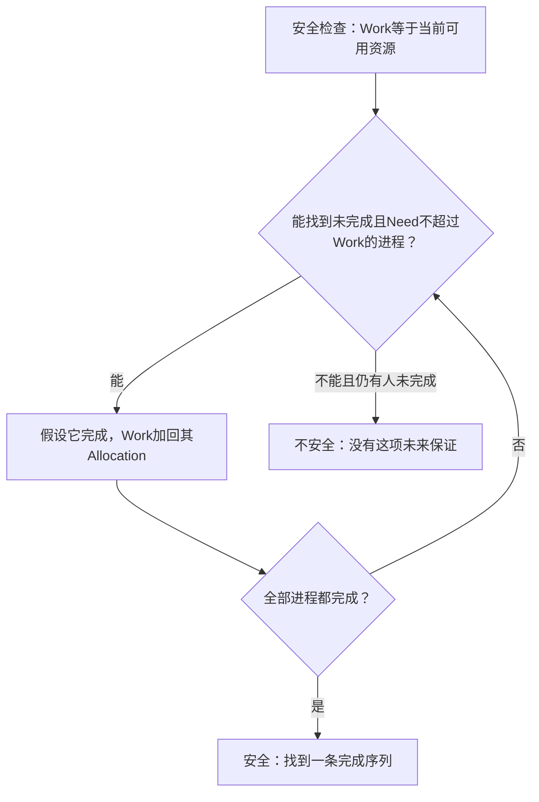

# 死锁

**本章问题：两个人各占一份资源又等对方，系统怎样判断能否继续？有空闲资源为什么仍可能拒绝申请？**

学习顺序：

1. 用等待关系区分死锁、饥饿和活锁。
2. 逐条核对四个必要条件与资源图实例数。
3. 看预防、避免、检测、恢复分别在何时介入。
4. 手算银行家安全序列与试分配。
5. 用当前请求检测，注意恢复的外部效果。

## 为什么谁都等不到

**资源实例**就是同类资源的一份可用单位，例如两台相同打印机是“打印机”这一类的两个实例。等待图分析必须看谁持有哪一份、等待哪一类，以及谁还能不等资源先完成。拥有资源者若能继续工作并最终归还，就可能解开其他人的等待。

A持有打印机等扫描仪，B持有扫描仪等打印机，而且只有持有者主动释放资源。二者各自等待对方，无法继续，形成**死锁**。饥饿则可能是某任务一直抢不到机会，其他任务仍在推进；忙着反复让步而无实质进展可形成活锁。

死锁需要四个条件同时成立：资源互斥使用；占有一些资源同时申请其他资源；已分配资源不能任意抢走；存在循环等待。它们是必要条件，不能只见“有人持锁等待”就断言已死锁。

资源分配图中，进程→资源表示请求，资源实例→进程表示已分配。每类资源仅一个实例时，环足以说明死锁；有多个实例时，环外任务可能归还另一个实例，解开等待，所以有环不充分。

### 练习 1

自编题：R有2个同类实例，S有1个。
A持R的一份并等S；B持S并等R的一份；
C持R的另一份，不再申请资源且最终会归还。
A、B各自取到所等资源后即可完成并归还。
图中存在A、B的环。哪项分析正确？

- A. C必须抢占A的资源，否则三者都无法完成
- B. 只要存在两种资源，所有状态都保证安全
- C. 仍可C后B后A完成，多实例下有环不够
- D. A与B必已死锁，资源图只要有环就足够

**答案：C。** C归还R后B能取得R并完成，随后释放S，
A得到S后也能完成；环外实例打破等待。
有环是否足够取决于资源实例和实际请求。

## 四种处理方向

**预防**从规则上破坏一个必要条件：可共享资源减少互斥；一次申请全部资源破坏占有且等待；允许安全抢占与回滚破坏不可抢占；统一按编号申请破坏循环等待。代价可能是利用率低、等待长，或某些设备根本不能安全抢占。

**避免**允许这些条件存在，但每次分配前确认仍有安全完成次序；**检测后恢复**允许先分配，定期检查当前死锁再终止或回滚；也有系统对某些低概率死锁不专门处理，依靠上层超时或人工恢复。选方案要看资源特性和代价。

## 安全状态检查什么

银行家的类比是：贷款机构每次借出资金前，确认仍有一种客户还款顺序能让所有承诺兑现。这里资金换成可重用资源，客户换成进程，完成后会归还全部占有资源。算法需要事先知道每个进程的最大需求，未知最大需求时不能直接照用这个保证。

向量可以理解为“按资源种类列出的数量”。例如Need=(1,2)、Work=(2,1)，虽然总量都为3，但第二类资源只剩1而需2，比较失败。要逐类比较，不能比较总和。

安全表示存在一种次序，使每个进程都能获得其声明的剩余需求、完成并归还资源。安全状态没有死锁；不安全只表示不能保证所有未来申请顺利完成，尚未等同已经死锁。

银行家算法记录：`Available`为空闲资源向量，`Allocation[i]`为进程已占资源，`Max[i]`为最大声明，`Need[i]=Max[i]-Allocation[i]`。向量比较必须每个分量都满足。

安全性检查先令 `Work=Available`，不断找尚未完成且 `Need[i]≤Work` 的进程，假设它完成，再令 `Work += Allocation[i]`。能标记全部进程就安全；找不到可完成者且仍有人未完成就不安全。这里加回原占有量即可，因为临时借出的剩余量完成后也会归还，净增加恰为原占有量。

例：两类资源X、Y，Available=(1,1)。

| 进程 | Allocation | Max | Need |
| --- | --- | --- | --- |
| P0 | (1,0) | (2,2) | (1,2) |
| P1 | (0,1) | (1,1) | (1,0) |
| P2 | (1,0) | (2,1) | (1,1) |

先选P1，Work从(1,1)变(1,2)；再选P0变(2,2)；最后P2变(3,2)。因此P1→P0→P2是一条安全序列。

为什么更新Work只加Allocation？设当前Work=(1,1)，P1已占(0,1)，还需(1,0)。假想借给它以后空闲变(0,1)；P1完成归还总占有(1,1)，空闲回到(1,2)。净变化正好是原来已占的(0,1)。安全检查把“借出剩余需求再全部归还”合并成一次净更新，过程无须真的执行。

## 请求先试分配

进程提出Request后，先确认 `Request≤Need`，否则超过声明；再确认 `Request≤Available`，否则暂时等待。满足数量要求后，试做三项更新：Available减请求，Allocation加请求，Need减请求，再运行安全性检查。安全才提交，否则回滚。

上例P0申请(1,0)，试后Available=(0,1)，P0的Need=(0,2)。P1、P2都还缺X，P0还缺两个Y，无人能完成，故不能批准。只检查“目前有一个X”会漏掉安全性。独立试其他请求时，必须回到原状态再算。

单实例资源图也能加“未来可能请求”的声明边：分配时若转换为分配边会形成危险环，就延迟分配。它同样是在分配之前保留未来可完成性。

### 练习 2

自编题：两类可重用资源X、Y。
Available=(1,1)，完成后归还全部占有量。
P0：Allocation=(1,0)，Max=(2,2)。
P1：Allocation=(0,1)，Max=(1,1)。
P2：Allocation=(1,0)，Max=(2,1)。
① 求Need并给原状态的一条安全序列。
② 从原状态试批P0请求(1,0)，应否批准？
③ 从原状态另试P0请求(0,1)，应否批准？
两项请求互不承接，均逐分量检查。

**解答**

Need分别为P0(1,2)、P1(1,0)、P2(1,1)。
原状态可选P1→P0→P2：
Work为(1,1)→(1,2)→(2,2)→(3,2)。
请求(1,0)不超过Need和Available，
试后Available=(0,1)，P0的Need=(0,2)。
P1需(1,0)，P2需(1,1)，无人能完成；
应回滚等待。此处不安全不等于已经死锁。
另请求(0,1)也通过数量约束；
试后Available=(1,0)，P0的Need=(1,1)。
可选P1→P0→P2，Work依次为
(1,0)→(1,1)→(2,2)→(3,2)，可批准。

**判分要点**

须按Max减Allocation算Need且逐分量比较。
须在每次试批前恢复原状态，再更新三项数据。
须用试后Allocation更新Work，最终资源总量(3,2)。
仅“有空闲资源”或仅报序列而无检查不足以答全。

## 检测与恢复

检测关注**当前未满足请求Request**，避免关注未来最大剩余Need，二者不能替代。多实例检测类似Work推演：寻找当前Request可满足者，假设它完成并归还Allocation，再继续；对未持资源者按算法初始化，最终仍持资源又不能完成的集合才是死锁候选。

例如Available=(0,0)，A占(1,0)等(0,1)，B占(0,1)等(1,0)，C占(1,0)且无新请求。C先完成后，Work=(1,0)，B可完成到(1,1)，再A完成。若C也等(0,1)，则没有人能先启动；终止B并可靠收回Y后，可依次完成A、C。

恢复可终止全部死锁者、逐个选牺牲者，或抢占可回滚资源。选择要权衡已做工作、占用资源和重复牺牲造成的饥饿。检查点保存可恢复状态，但收回资源不能撤销已打印纸张、已发送消息等外部效果，仍可能需要补偿。

### 练习 3

自编题：两类可重用资源X、Y，可用量(0,0)。
当前占有：A(1,0)，B(0,1)，C(1,0)。
当前未满足请求：A(0,1)，B(1,0)，C(0,0)。
获得当前请求后都能完成并归还全部资源。
① 用当前Request逐轮检测，给Work变化。
② 仅把C的当前请求改成(0,1)，再检测。
若终止B并可靠收回其资源，能否让其余完成？
③ 解释为何不能用历史最大声明直接替代Request，
以及为何外部打印结果不能简单靠资源回收撤销。

**解答**

第一情境可先完成C，Work从(0,0)变(1,0)；
再B，变(1,1)；再A，变(2,1)。无当前死锁。
第二情境A、C均等Y，B等X，Work为(0,0)，
无人当前请求可满足，三者均持资源且未完成。
终止B后Work=(0,1)，A完成后变(1,1)，
C再完成后变(2,1)，剩余等待可以解除。
Request描述现在在等什么；Max/Need用于
分析将来可能申请的安全性，二者问题不同。
回收锁或设备许可不撤销已打印纸张等外部结果，
恢复还需检查点、补偿或接受部分外部效果。

**判分要点**

逐分量比较Request，完成时加回Allocation。
第二情境没有可启动者，恢复后给可执行次序。
区分检测与避免，并指出恢复的外部副作用边界。

## 记忆要点

- 死锁是等待关系让相关任务都无法推进；饥饿可能只有某个任务长期得不到机会。
- 四个必要条件要同时成立；资源图有环是否足够，取决于实例数。
- 安全意味着存在按最大剩余需求完成的序列；不安全尚不能证明当前死锁。
- 银行家先查声明与空闲量，再试改三项状态、查安全，失败就回滚。
- Work逐分量比较Need，假想完成后净加Allocation。
- 检测看当前Request；回收资源不能自动撤销打印、发送等外部结果。
