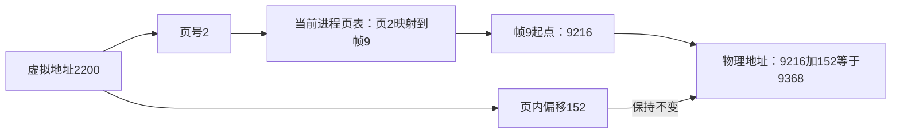
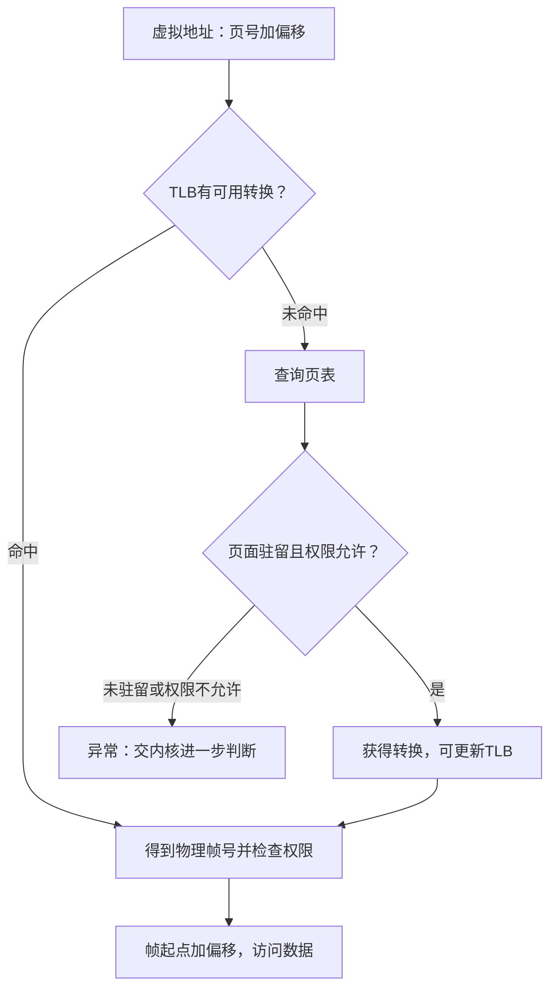

# 主存

**本章问题：两个程序都访问“地址2200”，怎样访问各自的数据？一条虚拟地址怎样变成真实内存位置？**

学习顺序：

1. 区分虚拟地址、物理地址与MMU转换。
2. 把地址拆成页号和页内偏移，完成一次分页计算。
3. 看多级页表逐层寻找映射。
4. 区分TLB未命中、页表查找与页面未驻留。
5. 最后比较连续分配、分段与段页式。

## 程序看到哪个地址

**地址**是存储位置的编号。按字节编址时，相邻地址相差1，代表相邻字节；从0开始的编号2200表示第2201个字节位置。程序生成的地址处于它自己的虚拟地址空间；物理地址指向实际内存。同样的虚拟地址在不同进程中可以映射到不同物理位置，使它们各用各的数据。

程序使用的逻辑或虚拟地址，要转换成主存中的物理地址。地址可在编译、装入或运行时绑定；运行时转换允许进程移动而保持程序看到的地址不变。执行转换的硬件叫MMU，页表是它查询的数据结构，两者不同。

连续分配给进程一整段内存，可用基址和界限保护：偏移 $d$ 满足 $0\le d<L$ 才合法，物理地址为 $B+d$，$B$ 是基址、$L$ 是长度。段内未使用部分属于内部碎片；多个空闲小洞分散、总量够却没有连续大洞，属于外部碎片。

动态分区中，首次适应取第一个够大的洞，最佳适应取最小的够大洞，最坏适应取最大的洞。空洞大小40、70、50 KiB，申请30时分别选40、40、70。释放后仅合并地址相邻的空闲区，不能越过仍被占用的区间。紧凑移动可减少外部碎片，但需支持重定位并付出复制代价。

## 把地址拆成页和偏移

分页把虚拟空间切成固定大小的**页**，物理内存切成等大的**页框**。页表记录虚拟页号到物理帧号的映射及权限，页不必物理连续。页大小 $P$、地址 $v$，则

$$p=\lfloor v/P\rfloor,\quad d=v\bmod P,\quad PA=fP+d.$$

$p$ 为虚拟页号，$d$ 为页内字节偏移，$f$ 为查得的帧号。页大小1024 B，地址2200对应第2页、偏移152；若该页映射到帧9，物理地址为 $9\times1024+152=9368$ B。转换只换页号，偏移保持不变。

页大小为 $2^b$ B时，偏移占 $b$ 位；虚拟地址 $a$ 位，页号占 $a-b$ 位。完整单级页表有 $2^{a-b}$ 项，每项 $e$ 字节，总大小 $2^{a-b}e$。例如32位地址、8 KiB页、8 B表项，偏移13位、页号19位，页表共4 MiB。分页消除外部碎片，却可能浪费最后一页的部分空间。

手算地址2200可分三步：

1. $2200=2\times1024+152$，所以它在虚拟页2内的第152号字节。
2. 查本进程页表，得到页2对应物理帧9。
3. 帧9起点是 $9\times1024=9216$；再走152字节，得到9368。

页表像一张位置对应表：页号是索引，帧号是查得的结果。页本身仍保存程序数据，页表保存的是“数据在哪里以及能否访问”。**页表项（PTE）**是页表中的一条记录，包含帧号、有效状态与权限等；一个PTE的字节大小与一页的字节大小是两个量。

分页只替换页号对应的高位位置，保留页内偏移

## 多级表按层查什么

多级页表可以理解为逐级目录：根表先选一张下级表，再在下级表中选下一张，最后得到数据帧。切分出的每段页号都只用于相应一级的索引。

完整页表可能太大，多级页表把页号再分段，只为有映射的区域建立下级表。例如32位地址按10/10/12位拆分，4 KiB一张表；仅两个顶层项有映射时，需根表1页、下级表2页，共12 KiB，不含数据页。哈希页表用哈希查大地址空间映射；倒排页表以物理帧为索引记录拥有者，节省条目但查找和共享处理更复杂。

**Sv39** 是RISC-V的一种分页地址转换方案；**VPN**表示虚拟页号，**PPN**表示物理页号。`satp`是保存地址转换配置及根页表物理页号的寄存器。**非叶表项**指向下一张页表，**叶表项**指向最终数据位置。

Sv39基本4 KiB页的低39位拆成9/9/9/12位：三级索引各9位，偏移12位，每张表有512个8 B表项，正好 $512\times8=4096$ B。64位地址中，位63到39须与位38相同，这叫合法符号扩展。每层用“本层表基址+索引×8”找到表项；本节按4 KiB基本页演算，遇到较高层叶项形成的大页时，地址拼接规则需按其页大小调整。

!!! example "例子与推演"

    例如根PPN=0x100，则根表地址是0x100000。顶层索引2，表项地址0x100010；若它指向0x200000，中层索引1，表项在0x200008；再指向0x300000，底层索引5，表项在0x300028。最终帧PPN=0x80000、偏移0x123，物理地址为0x80000123。**表项大小乘索引，页大小乘PPN**，不可交换。

## TLB节省查表时间

若每次数据访问都串行查询三级页表，就需要先访问三个PTE，再访问数据，代价较大。**TLB（快表）缓存的是近期“虚拟页→物理帧”的转换记录**，数据缓存保存的是内容，两者职责不同。

TLB未命中后，硬件或软件按体系结构规定查询页表；若页面已在内存，只需取得转换，完全可以不访问磁盘。下一章再讲合法但未驻留的页面怎样取得内容。

因此，**TLB未命中不等于缺页**。映射或权限改变时还需让旧TLB项失效；共享页也必须分别满足映射权限。

假设TLB查询 $t$、一次主存访问 $m$，命中率 $h$，未命中需查 $k$ 级页表，所有访问串行且没有缓存或缺页：

$$E=h(t+m)+(1-h)[t+(k+1)m].$$

取 $t=10$ ns、$m=100$ ns、$h=0.75$、$k=3$，命中110 ns，未命中410 ns，平均185 ns。若题目给并行查询、缓存或其他开销，要重新画路径，不能直接套这个口径。

### 练习 1

!!! question "题目"

    自编题：Sv39，4 KiB基本页、8 B的PTE，
    三个VPN字段各9位；高位符号扩展合法。
    虚拟地址各字段为`VPN[2]`=2、`VPN[1]`=1、
    `VPN[0]`=5，页内偏移0x123。
    satp根PPN为0x100；顶层有效非叶PTE
    指向表0x200000，中层有效非叶PTE
    指向表0x300000，底层叶PTE
    指向数据帧PPN=0x80000，权限满足。
    ① 求三级PTE字节地址与最终物理地址。
    ② 无缺页，TLB查询10 ns，主存访问100 ns。
    查询与访存串行，命中率0.75；
    未命中时三级页表和数据均无缓存。
    求命中、未命中路径耗时及平均耗时。

!!! success "参考解答"

    **解答**

    根表基址为$\texttt{0x100}\times4096$，
    即0x100000。
    顶层PTE：0x100000+2×8=0x100010。
    中层PTE：0x200000+1×8=0x200008。
    底层PTE：0x300000+5×8=0x300028。
    数据帧起点：0x80000×4096=0x80000000；
    保留偏移后物理地址为0x80000123。
    命中：10+100=110 ns。
    未命中：10+3×100+100=410 ns。
    平均：0.75×110+0.25×410=185 ns。

    **判分要点**

    须用8乘索引、4096乘PPN，不能交换。
    须给出三级PTE地址，并保留原页内偏移。
    须未命中计3次页表加1次数据访存，
    且只加一次TLB查询，不把此路径误作缺页。

## 分段再分页

分段按代码、数据等逻辑单位划分，每段有基址与长度；地址是段号加段内偏移。段长2048 B时，偏移2048已越界，最后合法位置是2047。变长段容易形成外部碎片，分页则用固定大小块。

段页式先检查段号、段长与权限，再把合法段内偏移拆成页号和页内偏移，查该段页表。段长2300 B、页1024 B时，偏移2300仍然非法，即使第三页已映射且还有空间。交换把暂不使用的数据移出内存，但正在DMA使用的页面可能需要固定，不能任意搬走。

### 练习 2

!!! question "题目"

    自编题：按字节编址，虚拟地址32位。
    页大小8 KiB，页表项8 B，采用完整单级页表。
    某同学把偏移写成3位，页表写成8 KiB，
    并断言“TLB未命中就必须读磁盘”。
    ① 修正偏移位数、页号位数及页表大小。
    ② 说明TLB未命中是否足以推出缺页。
    ③ 另一独立分段模型：段长2048 B，
    偏移2048能否访问？

!!! success "参考解答"

    **解答**

    8 KiB为$8192=2^{13}$ B，偏移13位。
    页号为$32-13=19$位，有$2^{19}$页。
    页表大小为$2^{19}\times8=2^{22}$ B，
    即4 MiB。8 B是页表项大小，不能当页大小。
    TLB未命中只是没有缓存转换；
    页表可指向已驻留帧，不一定读磁盘。
    分段合法偏移满足$0\le d<2048$，
    所以2048恰好越界，末个合法偏移是2047。

    **判分要点**

    须区分页大小与PTE大小，并正确给各单位。
    须解释未命中与未驻留的不同证据。
    须用严格小于段长度判断边界。

### 练习 3

!!! question "题目"

    自编题：三个独立场景，地址和编号均从0开始。
    ① 空闲区[0,40)、[60,130)、[150,200)，
    大小单位KiB，按地址低端分配30 KiB，
    分别用首次、最佳、最坏适应，列分配区间。
    随后释放[40,60)，各策略最大空闲区多大？
    ② 段长2300 B，页1024 B，页0、1、2
    分别映射到帧7、3、9。求段内偏移2200的
    物理地址，并判断偏移2300是否有效。
    ③ 32位虚拟地址，页4 KiB，PTE 4 B，
    两级索引10/10位；仅两个不同顶层项各有映射，
    按整页分配根表和下级表，共占多少KiB？

!!! success "参考解答"

    **解答**

    首次和最佳均分配[0,30)，余[30,40)。
    释放[40,60)后与[30,40)、[60,130)合并，
    最大空闲区[30,130)，大小100 KiB。
    最坏分配[60,90)，余[90,130)。
    释放后[0,40)与[40,60)合并成[0,60)，
    不能跨越仍占用的[60,90)，最大为60 KiB。
    2200=2×1024+152，地址9×1024+152=9368 B。
    2300等于段长，越界，即使末页仍有映射。
    根表1页、两个下级表各1页，共12 KiB。
    没有映射的顶层项不必配下级表。

    **判分要点**

    各策略从原状态独立开始，释放仅合并相邻空闲。
    先检查段长，再分页转换，保留字节单位。
    页表计根表和已分配下级表，不计文件数据页。

## 记忆要点

!!! tip "本章记忆要点"

    - 虚拟地址属于程序视图；MMU用映射把它转成物理地址。
    - 页号用除法取商，偏移用余数；查到帧号后乘页大小再加偏移。
    - 页大小决定偏移位数；PTE大小决定页表存储开销与表项地址。
    - 多级页表每层索引乘PTE大小；帧号或PPN乘页大小。
    - TLB缓存转换，TLB未命中不等于页面不在内存。
    - 分段先查长度与权限，合法偏移再进入分页转换。
