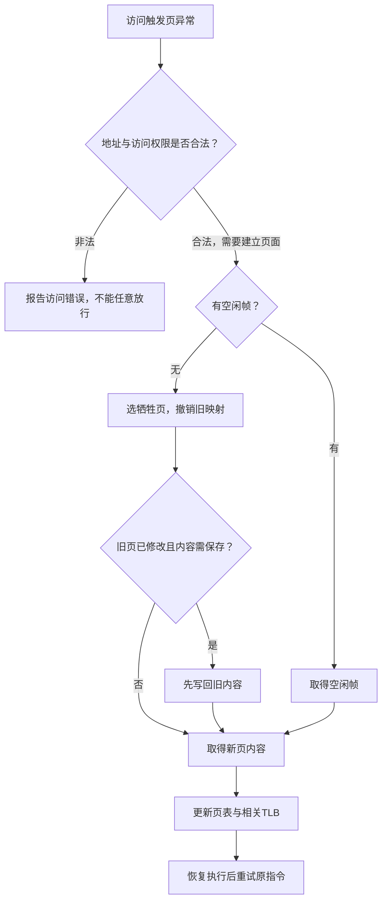

# 虚拟内存

**本章问题：程序访问的数据暂时不在内存时怎么办？内存放不下所有页面，又应该留下哪些？**

学习顺序：

1. 从上一章的页表状态进入合法缺页处理。
2. 追踪旧页保存、新页取得与原指令重试。
3. 分别按装入次序、最近访问和引用位做页面置换。
4. 用工作集与局部性解释抖动和访问顺序。
5. 区分写时复制、文件映射与内核分配。

## 页面可以暂时不在内存

上一章解决了“页已经在内存，怎样找到它”。虚拟内存进一步允许一部分页暂时没有物理帧。页表需要同时记录映射、权限和驻留状态；**驻留集**是当前实际在内存中的页面集合。

进程可用虚拟空间很大，当前驻留集却只占其中一部分。

虚拟内存让进程使用独立地址空间，只把当前需要的部分装入主存。访问页时，页表状态可能表示尚未驻留，产生**缺页异常**。内核先检查地址与权限是否合法；非法访问不能靠随意分配一页放行。

合法缺页的路径是：确认来源→找空闲帧或选牺牲页→必要时写回脏页→取得所需内容→更新页表与转换缓存→重试指令。进程等待设备期间阻塞，完成后先就绪，再等调度。

首次匿名页可以清零得到，写时复制可在内存中复制，所以缺页不一定读磁盘。

**脏页**是自上次保存后已修改的页；若唯一的新内容还在这个帧中，覆盖前必须保存。**干净页**若能从原文件或其他后备存储重新取得，通常可以直接丢弃该内存副本。

页面来源可能是文件、交换区、清零的新匿名页或共享页副本，因此异常处理的每一条路径都应按来源判断。

- **写时复制（COW）**让父子先只读共享同一页；
- 某一方写入时触发保护异常，内核建立私有副本、修改映射并重试。
- 共享值10时子写11，父仍读10、子读11；
- 若有空闲帧且源页驻留，不必读取磁盘。

这里应用本来具有写入这块数据的逻辑权限；只读映射用来捕获第一次写入。普通无权限写入与COW有意设置的写保护需要由内核区分，不能把所有保护错误都当成COW。

### 练习 1

!!! question "题目"

    自编题：程序有权读虚拟页5，但页5未驻留。内核选中一个已修改且必须保留内容的旧页，无空闲帧；所需磁盘操作都能成功。错误方案：“直接覆盖旧页；调入页5后，跳过原读取指令，并让该线程立即运行。”

    - ① 指出数据保存与指令恢复的两处错误。
    - ② I/O完成后若CPU仍给另一线程，请求线程先进入何种状态？

!!! success "参考解答"

    **解答**

    - 旧页是脏页且内容必须保留，覆盖前须写回，不能丢弃它的最新修改。
    - 还须使旧映射及相关TLB条目失效，再调入页5并建立正确映射。
    - 调度回来后重启引发缺页的读取指令，不能跳过这次读取。
    - I/O完成使等待线程就绪，尚未运行；
    - 真正恢复执行还需CPU调度。

    **判分要点**

    - 须以脏页保存要求解释写回，不能一律丢弃。
    - 须明确重启原指令并维护映射一致性。
    - 须给等待→就绪→调度后运行的顺序。

## 没有空帧时换谁

- 手算时先选一种记录顺序，并始终保持一致。
- FIFO队列记录“谁最早装入”，命中不改变装入时间；
- LRU队列记录“谁最久没用”，每次命中都要移动；
- OPT需要向引用串后面看下一次使用距离，未来不再使用者可以优先淘汰。
- 它们判断的时间依据不同，不能共用同一套更新规则。

FIFO换最早装入者，命中不改入队次序；LRU换最长时间未使用者，每次命中也更新最近性；OPT换未来最晚再用者，作为理想比较基准，需要预知未来。

3帧初始全空，访问1、2、1、3、4、2、1。下表FIFO从最早装入排到最晚，LRU从最久未用排到最近，星号表示缺页：

| 引用 | FIFO | LRU |
| --- | --- | --- |
| 1 | 1* | 1* |
| 2 | 1,2* | 1,2* |
| 1 | 1,2 | 2,1 |
| 3 | 1,2,3* | 2,1,3* |
| 4 | 2,3,4* | 1,3,4* |
| 2 | 2,3,4 | 3,4,2* |
| 1 | 3,4,1* | 4,2,1* |

第3次访问1命中，LRU把1移到最近端；所以访问4时淘汰2，随后访问2要再淘汰1，最后访问1又缺页。LRU共6次，FIFO共5次。算法优劣不能由单个串保证，LRU并非每串都胜过FIFO。

## Clock用一位近似最近性

精确维护LRU成本较高。Clock把帧排成环，每帧有引用位R，访问置1；缺页时从指针开始，见R=1就清0并向后，见R=0就替换，新页置1，再移动到下一帧。命中一般不移动指针，以题设为准。

!!! example "例子与推演"

    例如页(1,2,3)、R=(1,0,1)、指针在帧0。访问4时，清帧0的R，换掉帧1的2，得到页(1,4,3)、R=(0,1,1)，指针到2。

    增强Clock再看修改位M：优先找未引用且干净的(0,0)页，脏页可能需要写回；具体扫描轮次需按题目定义。

FIFO可能发生**Belady异常**：增加帧数反而增加缺页。LRU、OPT具有栈包含性质，在其标准模型下增加帧不会出现这种异常。首次装入也算缺页，不能漏计。

## 工作集与抖动

固定分配可按进程大小或比例给帧，可变分配随需求调整；局部置换只换自己的帧，全局置换可影响其他进程。**工作集**是最近一个窗口中访问过的不同页面集合，重复访问只算一个。

引用1、2、1、3、4，窗口为最近3次，第4次后集合为{1,2,3}，第5次后为{1,3,4}。它描述近期需求，可能大于当前驻留帧数。

活跃进程总需求超过内存时，频繁换入换出导致**抖动**；再增加并发进程可能更差，应减少并发量或为工作集提供足够帧。

### 练习 2

!!! question "题目"

    自编题：普通Clock有3帧，按0→1→2循环。初始页为1、2、3，R位为1、0、1，指针在0。命中置R=1且不移指针；缺页从指针扫描，遇R=1清零继续，遇0替换并置1，指针移下一帧。

    - ① 依次引用4、3、5，逐次写帧、R和指针。
    - ② 工作集窗口为最近3次引用，独立引用串1、2、1、3、4，在第4次和第5次后集合各为何？
    - ③ 父子COW共享值10的驻留只读页，引用数2；子进程写11，说明双方结果及是否必然读盘。

!!! success "参考解答"

    **解答**

    - 引用4缺页：清帧0的R，替换帧1中的2；
    - 页(1,4,3)，R(0,1,1)，指针2。
    - 引用3命中：状态不变，指针仍2。
    - 引用5缺页：清帧2的R，再替换帧0中的1；
    - 页(5,4,3)，R(1,1,0)，指针1；
    - 共2次缺页。
    - 第4次最近三项2、1、3，集合{1,2,3}。
    - 第5次最近三项1、3、4，集合{1,3,4}。
    - 子写触发保护异常，复制驻留源页到新帧后写11；
    - 父仍读10，子读11，双方不再写同一共享副本。
    - 若已有可用帧，复制内存即可，不必读盘。

    **判分要点**

    - 按指针和R推进，命中不得随意移动指针。
    - 工作集取指定窗口并去重，不能等同当前驻留集。
    - COW保留父值，说明保护异常不必意味着磁盘读取。

    - 普通访问耗时 $T$，缺页概率 $p$，一次缺页访问的总耗时 $F$，则平均为 $(1-p)T+pF$。
    - 取100 ns、0.00002、5 ms，先把5 ms换成5,000,000 ns，得到199.998 ns。
    - 若F已包含最终重试，不再额外加一次访存。

### 练习 3

!!! question "题目"

    自编题：3帧初始全空，首次装入也计缺页。引用串为1,2,1,3,4,2,1。

    - ① 分别按FIFO和LRU写每步队列与缺页数。FIFO由最早装入到最晚；LRU由最旧到最新。
    - ② 最后4次引用的工作集及大小是多少？
    - ③ 独立时间模型：普通访问100 ns，缺页概率0.00002；一次缺页访问总耗时5 ms，已包含最终重试访问。求平均耗时。

!!! success "参考解答"

    **解答**

    - FIFO队列：1；
    - 12；
    - 12；
    - 123；
    - 234；
    - 234；
    - 341。
    - FIFO缺页位置为1、2、4、5、7，共5次。
    - LRU队列：1；
    - 12；
    - 21；
    - 213；
    - 134；
    - 342；
    - 421。
    - LRU缺页位置为1、2、4、5、6、7，共6次。
    - 第3次命中1会更新LRU次序，FIFO不更新。
    - 最后4次引用是3、4、2、1，工作集为{1,2,3,4}，大小4，工作集统计最近访问，不受驻留3帧限制。
    - 5 ms=5,000,000 ns。
    - 平均为0.99998×100+0.00002×5,000,000，得到199.998 ns，约200 ns。
    - 已含重试，不再多加100 ns。

    **判分要点**

    - 须逐步更新LRU命中次序且首次装入计缺页。
    - 须区分工作集与当前驻留集合，重复页只计一次。
    - 须统一ns单位并遵守总耗时包含重试的口径。

## 映射与内核分配

`mmap`把文件内容映入地址空间。共享映射的修改可按接口对其他映射者可见；私有映射修改通常进入私有副本，不因此改原文件。可见性与掉电持久化是不同保证，仍需相应刷回协议。

伙伴分配把内存拆成按自身大小对齐的二次幂块。1024 KiB中连续申请两个100 KiB，各向上取128 KiB，得到[0,128)、[128,256)。

释放后只有**同大小且正好互为伙伴**的空闲块才能合并，逐层回到大块；相邻并不足够。Slab则缓存特定类型的内核对象，复用已经组织好的小对象，减少反复初始化和碎片。

局部性决定帧是否够用：4×4数组每行一页，只有2帧，按行访问一行的4项后才换行，缺页4次；按列形成0、1、2、3反复循环，LRU下每次再用前都已被淘汰，缺页16次。

优化访问次序有时比机械增加并发更有效。

### 练习 4

!!! question "题目"

    自编题：独立场景：Buddy管理[0,1024) KiB，块按2的幂并按自身大小对齐，总选可用最低地址。A申请100 KiB，B再申请100 KiB。

    - ① 各获哪个区间？只释放A时能否与B合并？再释放B，说明连续合并到1024 KiB的过程。
    - ② 文件字节原值0，P做私有映射写1；无其他写入，是否因此把文件持久内容改为1？共享映射的修改对别人可见是否等于掉电不丢？
    - ③ 4×4数组每行恰占一页，2帧初始空，LRU；完整按行与按列扫描，分别缺页几次？

!!! success "参考解答"

    **解答**

    - A获[0,128)，B获[128,256)，各128 KiB。
    - 只释放A时，伙伴B仍占用，不能合并。
    - 释放B后两块合成[0,256)，再与[256,512)合为[0,512)，再与[512,1024)合为1024 KiB。
    - 私有映射写入属于私有副本，不因此修改原文件；
    - 共享可见性也不等于持久化，须满足相应刷回保证。
    - 按行每页连续用4次，4次首次访问缺页，共4次。
    - 按列页序列为0,1,2,3重复4轮，复用距离超2帧，每次访问均缺页，共16次。
    - 增加缓存命中需改善局部性，不能只看访问总次数。

    **判分要点**

    - 向上取幂、地址对齐，伙伴须同大小且都空闲。
    - 区分私有副本、共享可见与稳定存储。
    - 给页引用串或逐轮依据，不能只报4与16。

## 记忆要点

!!! tip "本章记忆要点"

    - 缺页先判合法性，再取得内容；缺页或保护异常不必都读磁盘。
    - 需保留的脏页先写回；新映射建立后重试原指令。
    - FIFO记装入次序，LRU记最近访问，Clock记引用位与扫描指针。
    - 工作集统计指定近期窗口中的不同页；驻留集统计当前在内存的页。
    - 活跃需求超过可用帧会抖动；良好访问次序能显著降低缺页。
    - 文件修改可见与稳定持久化分别判断；私有映射通常保留私有副本。

