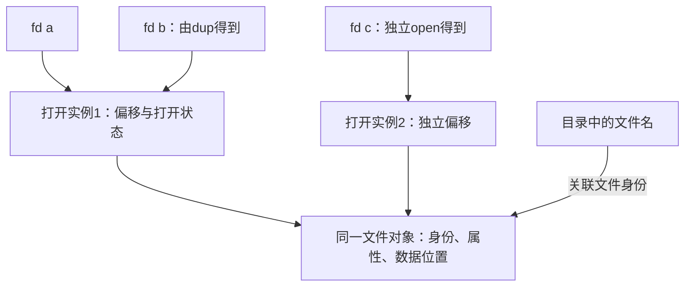

# 文件系统接口

**本章问题：文件名、文件描述符和文件内容分别是什么？删除一个名字后，已打开的文件为什么还能读？**

学习顺序：

1. 从打开、读取、定位和关闭认识文件接口。
2. 分清名字、打开实例、文件对象三层引用。
3. 按路径逐层查找，理解硬链接与符号链接。
4. 检查文件与目录权限，区分可见和持久化。

## 文件把存储变成什么

文件让程序按名字与字节位置访问内容，例如读取文本第100个字节，而不用先告诉程序它位于哪台设备的哪个物理块。文件名帮助查找，打开后得到的句柄帮助后续操作，文件偏移记录这次访问走到了哪里；这几个信息分别承担不同工作。

磁盘只提供存储位置，程序更希望使用名字和内容。**文件**把一组数据组织成可命名、可访问的对象，常有类型、大小、所有者、权限和时间等属性。文件内容可以被视为字节流，也可按固定或变长逻辑记录解释；记录组织由接口和格式约定决定。

常见顺序是创建或打开→读写或定位→关闭。`open`取得访问对象的句柄，Unix风格中叫**文件描述符（fd）**；`read`从当前偏移读数据并推进偏移；`write`写入；`seek`改变位置；`close`释放打开引用。调用成功与实际处理的字节数要看返回值，不能只按请求长度推断。

## 名字、打开实例与内容

沿箭头判断谁影响谁：a与b汇入同一打开实例，所以任意一方读取推进的是同一个偏移；c汇入另一个实例，读取不会改变a、b的偏移。三者最后都到同一文件对象，所以看到的文件身份和内容来源相同。

把三层分清：目录项把**名字**关联到文件身份；文件对象保存身份、属性与存储关系；**打开实例**保存本次打开的偏移与状态，进程fd再引用它。同一文件可以有多个名字，也可以被独立打开多次。

`dup(a)`通常让新fd引用a的同一打开实例；独立再 `open` 则有独立偏移。`fork`继承的fd也可能共享打开实例。这说明共享偏移要看引用关系，不能只看“是否同一文件”。

例：文件内容为0123456789，a=open(file)，b=dup(a)，c=open(file)，初始偏移全0。

| 操作 | 读到内容 | a、b共享偏移 | c偏移 |
| --- | --- | --- | --- |
| a读2字节 | 01 | 2 | 0 |
| b读3字节 | 234 | 5 | 0 |
| c读1字节 | 0 | 5 | 1 |
| b定位到1 | — | 1 | 1 |
| a再读2字节 | 12 | 3 | 1 |

## 路径怎样找到文件

绝对路径从根目录出发，相对路径从当前目录出发；`.`表示当前目录，`..`表示父目录。当前为 `/home/u/notes` 时，`../draft.txt`得到 `/home/u/draft.txt`。系统逐层搜索目录项，并检查路径上每层的搜索权限。

单级目录容易重名，两级目录按用户分组，树形目录允许逐层组织。共享链接会使结构出现图，遍历时需注意重复访问与环。挂载把另一个文件系统接到一个目录位置，改变该路径下当前可见的内容；底层原有文件通常被遮盖，并未因挂载而删除。

顺序访问沿当前位置处理；直接访问按字节或记录编号定位。固定长度记录长 $L$ 时，第 $i$ 条记录从 $iL$ 开始；变长记录则需扫描或索引。索引访问先按键找到记录位置，再读取内容，这个“索引”与下章的磁盘块索引属于不同层次。

### 练习 1

自编题：Unix风格文件内容为0123456789，
偏移从0计；读取均完整成功，无并发操作。
a=open(file)，b=dup(a)，c=open(file)，
两个独立open的初始偏移都为0。
依次操作：a读2字节；b读3字节；c读1字节；
b绝对定位到偏移1；a再读2字节。
① 各次读取内容及最终a、b、c偏移？
② 当前目录/home/u/notes时，
相对路径../draft.txt解析为什么？

**解答**

a与b共享打开实例，c有独立实例。
a先读01，共享偏移到2。
b读234，共享偏移到5。
c读0，c的偏移到1。
b定位到1，把a、b的共享偏移都设为1。
a再读12，共享偏移到3。
最终a、b偏移为3，c偏移为1，单位均为字节。
相对路径解析为/home/u/draft.txt。

**判分要点**

须按打开实例移动偏移，不能给dup建立独立偏移。
须让b的定位影响a，并保持c不受影响。
须从给出的当前目录解释父目录符号。

## 删除名字后还有什么

硬链接是多个目录项指向同一文件身份；符号链接保存目标路径。删除一个硬链接只减少名字引用，其他硬链接和已打开fd仍可访问。符号链接的目标路径若消失，它成为悬空链接，即使文件还有其他名字。

例如a与b是硬链接，s保存路径a，fd已打开a。删除a后，b和fd继续有效，s失效；再删除b，fd仍保留打开引用。直到没有硬链接、没有打开及其他必要引用，系统才可回收内容。这些结论采用Unix风格对象模型，删除名字与关闭引用是不同操作。

### 练习 2

自编题：采用本章Unix风格对象模型。
同一文件有两个硬链接名字a、b。
进程已通过a打开文件得到fd，之后删除名字a，
名字b和fd都仍存在，文件未被修改。
有人说“a删了，fd和b必然马上失效”。
① 分别追踪名字、打开实例和文件身份。
② 仅关闭fd后能否据此断定数据空间回收？

**解答**

删除a只移除一个目录名字；
b仍指向同一文件身份，已有fd仍引用打开实例，
打开实例继续关联原文件，故二者不必失效。
关闭fd减少打开引用，但b这个名字仍存在，
不能据此断言文件数据空间已经回收。
这里依赖题设Unix风格语义，
不推广为所有系统的删除规则。

**判分要点**

须分别解释目录项、打开实例、文件对象。
须指出硬链接b和打开fd是不同保留关系。
须避免把删除一个名字等同于回收文件本体。

## 权限与共享保证

目录可以看作“名字到文件身份的表”。列出这张表的名字需要目录读权限；已知名字后在表中寻找条目需要搜索权限；添加或删除条目涉及目录写权限。文件自身读写权限控制内容，因此“能读取文件”与“能删除文件名”可能得到不同答案。

Unix常用r/w/x表示读、写、执行权限，分别给所有者、组和其他人。文件的r允许读内容；目录的r允许列名字，x允许按名字搜索，w影响增删目录项，通常还需目录x。删除文件主要看父目录权限，不能只看文件本身是否可写。

例如目录710、文件640，Bob属于该组但非所有者。目录组权限只有x，文件组权限有r：知道名字时可读文件，不能列目录，也不能删除条目。八进制位中r=4、w=2、x=1；ACL可进一步给特定主体列出权限，具体匹配规则按系统约定。

多个程序同时访问时还要确定一致性语义：修改何时对其他读取者可见，偏移是否共享，是否需要锁，以及何时真正持久化到设备。缓存可见不等于掉电不丢，统一文件接口也不自动保证不同文件系统具有相同同步语义。

### 练习 3

自编题：Unix风格；除以下条件外无额外ACL或限制。
Alice拥有目录/d和文件/d/a，两者所属组G。
目录权限710，文件640；Bob在G且不是所有者。
① Bob知道文件名，能读a、列目录、删除a吗？
② Alice建硬链接/d/b和符号链接/d/s→a，
并open(a)得fd后依次unlink(a)、unlink(b)。
此时s和fd能否访问原文件？何时可回收？
③ 在/d挂载另一个文件系统后，原文件数据
是否被删除？从新/d路径还能直接找到原b吗？

**解答**

Bob有目录搜索x但无r、w；文件组权限为r。
因此可按已知路径读a，不能列目录或删除条目a。
删除a后s保存的目标路径a失效，成为悬空链接。
fd仍引用原打开实例，删除b后也可继续访问。
无硬链接、fd关闭且无其他引用时才可回收。
挂载改变该路径下的可见内容，不删除底层数据。
原b此前已经被unlink；挂载不会使它重新出现。
即使原名字未删除，也会被挂载视图遮盖，
不能把“当前路径找不到”都解释为文件本体已回收。

**判分要点**

逐层检查目录搜索与文件读权限，删除看父目录。
分别追踪软链接路径、硬链接数、打开引用。
注意b先已删除，不能声称卸载后必然恢复b。

## 记忆要点

- 文件名用于查找，fd引用打开实例，打开实例保存本次访问偏移。
- dup与继承可能共享打开实例；独立open通常有独立偏移。
- 硬链接指向文件身份；符号链接保存路径，目标路径消失会悬空。
- 删除名字与关闭打开引用分别计数，最后引用消失后才可回收。
- 文件权限管内容，目录权限管列名、搜索和改条目。
- 挂载改变路径视图；修改对别人可见仍需另查持久化保证。
