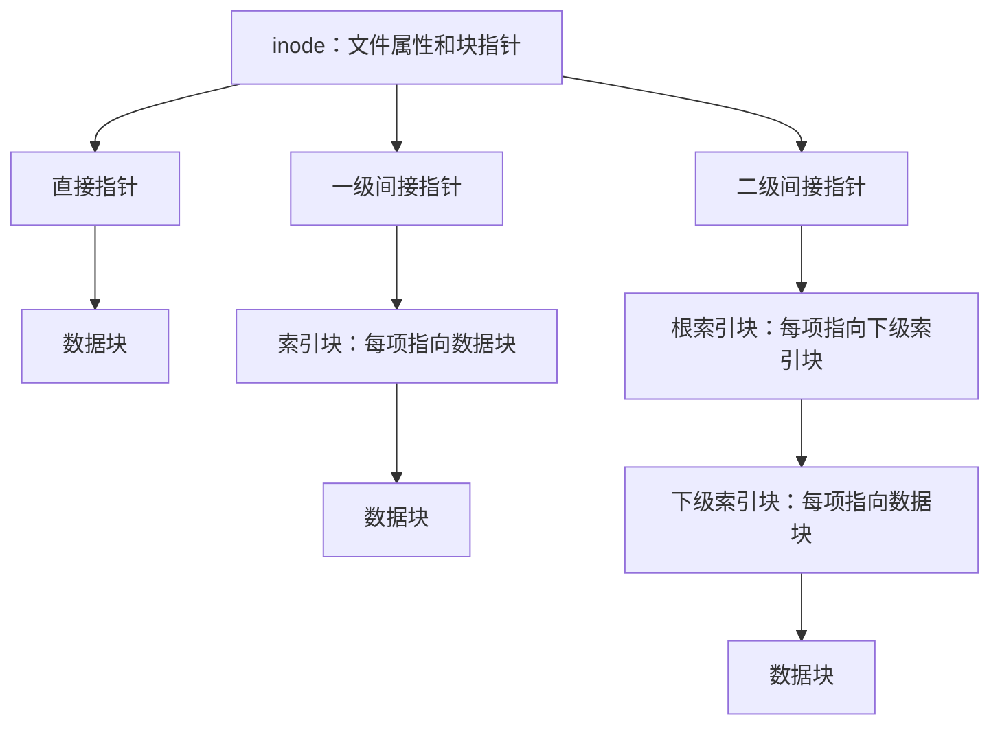

# 文件系统实现

**本章问题：read请求文件第264200字节，系统怎样定位到真实磁盘块？文件增长和断电又怎样处理？**

学习顺序：

1. 把文件字节偏移拆成逻辑块号和块内偏移。
2. 比较连续、链式与索引分配的定位路径。
3. 逐级计算inode直接和间接指针。
4. 分别统计数据块、索引块和空闲位图开销。
5. 用日志提交点分析崩溃后的恢复。

## 从字节位置找到磁盘块

**逻辑块号**数的是“文件中的第几块”，**物理块号**数的是“设备上的第几块”。它们之间的对应由文件系统维护。文件第0块可位于设备块700，第1块可位于块20；文件读取顺序因此无需与物理位置连续。

应用读文件偏移，文件系统要把它变成设备上的块位置。文件控制块（FCB）记录大小、权限和数据位置，Unix常用inode表示此类信息；目录项保存名字到文件身份的对应，查目录可用线性表或哈希等结构。

设块大小 $B$，文件字节偏移 $x$，先算逻辑块号 $q=\lfloor x/B\rfloor$、块内偏移 $d=x\bmod B$，再根据分配结构找到物理块。块编号和文件字节偏移不能混为一谈。

VFS（虚拟文件系统）给不同文件系统提供统一操作接口，例如同样调用read，再由具体实现完成地址转换与读盘。接口统一不意味着分配方式、日志范围和持久化保证相同。

## 三种分配如何取舍

| 方式 | 如何找到第q块 | 主要取舍 |
| --- | --- | --- |
| 连续分配 | 起始块号+q | 顺序与随机访问快，增长和外部碎片难处理 |
| 链式分配 | 从头沿指针走q步 | 易增长，不适合直接随机访问，指针占空间 |
| 索引分配 | 查索引项 | 支持直接定位，索引块也占空间 |

如果1024 B块的前4 B放链指针，净数据容量是1020 B。文件偏移2040恰在第2号链节的数据起点，即相对物理块起点偏移4 B。FAT把“下一块”的链接集中到分配表；缓存FAT后可少读链节，但寻找目标仍需沿逻辑链追踪，不能把链表当数组直接定位。

### 练习 1

自编题：链式分配的每块为1024 B，
块开头4 B保存下一块指针，其余存数据。
文件偏移从0编号，访问偏移2040 B。
有人直接算“块号1、块内偏移1016”。
① 修正数据链节号与块内字节偏移。
② 另一独立位图管理8200个块，
每块一位、位图块1024 B，需多少字节和块？

**解答**

每个链节净数据容量1024−4=1020 B。
2040=2×1020+0，故是第2号链节，
即从第0号开始的第三个数据链节。
数据区偏移为0，块开头有4 B指针，
所以目标相对块起点偏移为4 B。
位图需8200/8=1025 B，
占$\lceil1025/1024\rceil=2$块。
指针和位图都是管理开销，不能当文件数据。

**判分要点**

须先扣块内指针，再除净数据容量。
须区分链节编号、数据区偏移与块起点偏移。
须按位而非字节计位图，并对物理块数向上取整。

## 多级索引逐层计算

**inode**保存文件大小、权限等元数据与数据定位信息；Unix目录项把名字关联到inode身份，名字通常不放在inode中。**直接指针**直接给出数据块位置；**一级间接指针**给出一张指针表的位置；**二级间接指针**给出一张“指向下级指针表”的表的位置。每加一级，就多查一层表，也覆盖更多数据块。

计算“最多能存多少数据”时数最下层数据块；计算“文件实际占多少空间”时还要数已使用的索引块；计算“读一次需要几次I/O”时只数路径上未缓存的块。这三个问题使用同一张图，但计数对象不同。

一个索引块能放 $n=B/e$ 个指针，$e$为每个指针的字节数。若inode含 $D$ 个直接指针、各一个一级和二级间接指针，则最大数据块数为 $D+n+n^2$；数据容量再乘B，索引块占用另算。

例：B=1024 B，e=4 B，D=2，故n=256。直接区覆盖逻辑块0—1，一级区覆盖2—257，二级区从258开始；最大数据容量 $(2+256+256^2)\times1024=67,373,056$ B。

访问偏移264200：先除块大小，得到逻辑块258、块内偏移8；减去直接与一级覆盖的258块，二级相对编号0，再拆成 $0\times256+0$。于是读二级根第0项→下级索引第0项→数据块的第8字节。inode已缓存，其他块未缓存时，共3次块I/O。

一般地，若目标逻辑块落在二级区，先算相对编号 $r=q-D-n$，再算根索引 $i=\lfloor r/n\rfloor$、下级索引 $j=r\bmod n$。这里 $q$ 是逻辑块号，$D$ 是直接指针数，$n$ 是一张索引表的指针数。除法得到“第几张下级表”，余数得到“那张表的第几项”；读完表后仍需读真正的数据块。

若文件恰有260 KiB，需260数据块；直接覆盖2块，一级覆盖256块，剩2块走二级。只需一级索引1块、二级根1块、下级索引1块，共3索引块，总占263块。不要预先分配所有可能用到的二级索引块，也不要把索引容量算成用户数据。

### 练习 2

自编题：块1024 B，指针4 B。
inode含2个直接、1个一级、1个二级间接指针。
除地址结构外没有其他大小限制，无稀疏文件。
① 最大数据容量是多少字节？
② 文件恰为260 KiB，需几数据块和索引块？
③ 访问字节偏移264200，inode已缓存，
其他索引及数据块均未缓存。
给出索引路径、块内偏移和所需块I/O次数。
逻辑块和索引项均从0编号。

**解答**

每索引块可容纳1024/4=256个指针。
最大数据块数2+256+256²=65794，
数据容量65794×1024=67,373,056 B。
260 KiB需260个数据块；直接覆盖2块，
一级覆盖256块，剩2块走二级。
需一级索引1块、二级根1块、下级索引1块，
合计3索引块，数据加索引共263块。
264200=258×1024+8。
直接块0—1，一级块2—257，二级从258开始。
相对二级编号0=0×256+0，
取二级根第0项→下级第0项→数据块偏移8 B。
需读根、下级、数据共3次块I/O。

**判分要点**

须把最大数据容量与索引占用分开。
须仅分配使用到的索引块，不能预建全部二级表。
须先扣直接和一级范围，访问数含数据块。
inode已缓存，所以不再额外加inode读取。

## 空闲块怎样登记

位图用每块一位表示占用或空闲，约定1的含义后才能修改。管理N块需 $\lceil N/8\rceil$ 字节；再按位图存储块大小向上取整。8200块需1025 B，若位图块1024 B，就要2块。

假设1为空闲，低位对应较小块号。块1007位于字节 $\lfloor1007/8\rfloor=125$ 的第7位；原字节255，分配该块需清位7，变成 $255-128=127$。只改这一位，其他块的状态不变。

空闲链表串起空闲块；成组法在一个空闲块里记录一组其他空闲块地址；计数法记录连续空闲区的起点和长度。它们都在回答“哪里还有空间”，与文件自身的数据索引分开。

## 缓存与崩溃恢复

缓存保留近期块，预读提前取可能马上访问的块，延迟写合并更新并减少I/O，但扩大断电前尚未持久化的窗口。写入完成的含义必须按接口约定判断。

创建文件可能同时改位图、inode和目录。若只把位图写成占用就掉电，其他结构还没更新，会留下不一致。日志把这些关联更新作为事务处理。一种简化重做协议是：先把完整更新日志写到稳定存储→稳定写入提交记录→再写正式元数据。

在这个协议下，有稳定提交记录就重做该事务所有最终值；即使位图已写过，也可以重复写相同值，这叫幂等。没有稳定提交则丢弃事务；此结论依赖“提交前不改正式位置”的前提。其他日志协议可能使用撤销或组合方式。

只记录元数据的日志主要保障结构一致，不能自动保证最新文件正文保存成功。恢复检查还要区分丢失更新、泄漏块、重复分配和目录引用等问题，不能见“有日志”就省去协议条件。

### 练习 3

自编题：① 位图管理16384块，每块1位，1为空闲。
最低有效位对应较小块号，字节和位均从0编号。
求位图字节数、块1007所在字节及位号。
字节125初为255，分配1007后该字节为何值？
② 采用正文简化重做日志：提交前不改正式元数据，
全部日志稳定后才稳定提交，之后回写正式位置。
提交稳定、位图已回写、inode与目录未回写就崩溃。
恢复如何做？若没有稳定提交，处理为何不同？
③ 仅有元数据日志，能否断言最新文件正文已保存？
VFS的统一read接口是否改变这个保证？

**解答**

位图16384/8=2048 B。
1007=125×8+7，对应字节125的位7。
分配要清位7：255−128=127，其他位不变。
已稳定提交则重做位图、inode、目录全部最终值；
位图重复写同一值须幂等，不能只恢复未写部分。
未稳定提交时丢弃事务日志，正式元数据保持旧值，
此结论依赖题设提交前不改正式位置。
元数据日志不自动保证最新用户数据已持久保存。
VFS统一调用路径，不让底层不同文件系统
凭空具有相同日志范围或持久化保证。

**判分要点**

位、字节、块三个单位清晰，按位号正确清位。
以稳定提交记录决定恢复，说明幂等与协议前提。
区分元数据一致性、用户数据持久性和接口统一。

## 记忆要点

- 文件偏移先除块大小得到逻辑块与余数，再查物理位置。
- 块内有指针等开销时，先扣掉它，再计算净数据容量。
- inode直接到数据；一级间接多一张表；二级间接多两张表。
- 容量数数据块，占用数数据和索引，I/O数路径上未缓存块。
- 位图每块只占一位，字节与存储块都要向上取整。
- 日志按稳定提交点恢复；元数据一致性不自动保证最新正文持久保存。
