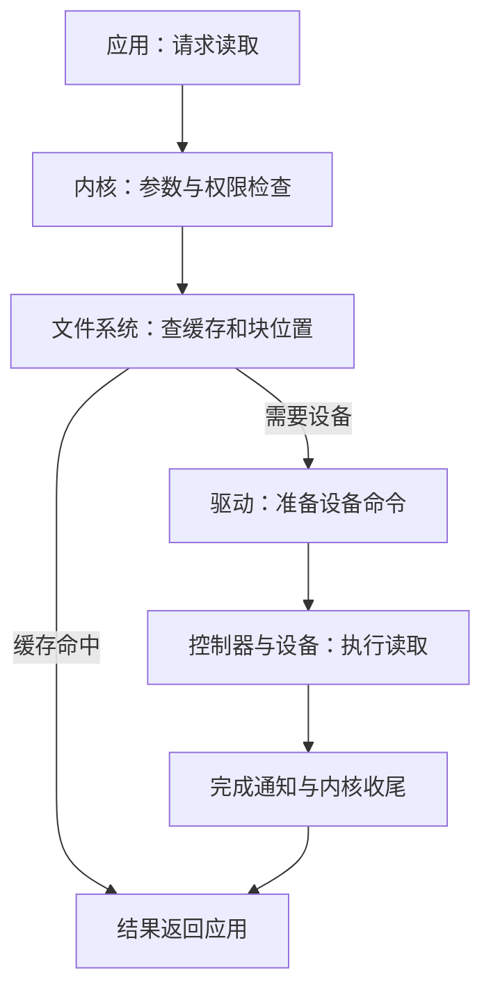
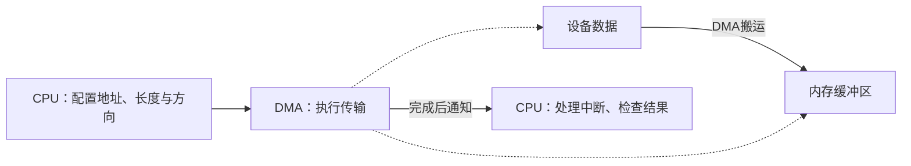
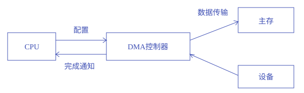

# I/O系统

**本章问题：应用读一个文件时，内核、驱动、控制器和DMA各做什么？函数返回后数据何时才可使用？**

学习顺序：

1. 沿read请求认清文件系统、驱动和控制器。
2. 分别判断谁发命令、谁搬数据、谁通知完成。
3. 区分阻塞、非阻塞和异步接口。
4. 用单／双缓冲时间线解释工作重叠。
5. 核对实际完成长度、缓冲区寿命与错误重试。

## 一个请求经过哪些层

**驱动**是内核中或受控环境中的软件，把通用请求翻译成某类设备懂的命令；**控制器**是接收命令、操作实际设备的硬件。二者名字接近，却位于软件与硬件两侧。

缓存已有内容时，读取可以在上层完成，没有必要每次都走到实际设备。

应用调用read，内核检查参数与权限，文件系统寻找数据位置，驱动把请求转换为设备命令，控制器操作设备，结果再沿调用路径返回。数据若在缓存中，可以省去本次设备访问。

驱动屏蔽设备差异，内核I/O层提供缓冲、排队、保护和错误处理。

块设备按块定位，字符设备常处理连续字符流，网络设备处理报文；统一接口保留共同操作，也可能通过专门控制命令暴露设备特性。应用通常不能直接任意操纵控制器，设备访问仍受权限检查。

## CPU怎样知道设备状态

控制器通常有状态、命令和数据寄存器。CPU先看设备是否就绪，写命令和必要参数，再观察完成或错误。

MMIO把设备寄存器映入地址空间，用内存访问形式操作；独立I/O地址空间则使用专门端口指令。寄存器可能有读清零等副作用，不能当普通内存随意重复访问或缓存。

**轮询**反复读状态，响应方式简单，却持续占CPU。**中断驱动**让设备完成后通知CPU；硬件与入口代码保存现场，识别并确认中断来源，执行处理，恢复后返回或调度。

中断可以有优先级、屏蔽与嵌套规则，处理期间改动的状态必须可正确恢复。

今年Lab 1的时钟中断也遵循这条链：配置入口和使能条件→预约定时事件→进入处理并保存现场→识别原因→处理并预约下一次→恢复与返回。

同步异常的返回地址是否前进、前进多少，应看指令和异常类型，不能给所有事件机械加4。

## 谁来搬运数据

- 把三个问题分开：**CPU写命令**告诉设备做什么；
- **CPU或DMA搬运**决定数据怎样进入内存；
- **轮询或中断**决定CPU怎样得知状态。
- DMA与中断可以组合，因此用DMA的设备仍常常发中断。

若DMA写入的内存正被CPU缓存，双方看到的副本可能需要按硬件规则协调；若地址映射改变，设备也不能继续写到已失效的位置。维护映射、缓存一致性和缓冲区寿命仍是系统提交I/O时的工作。

中断主要回答“怎样通知”，DMA（直接存储器访问）回答“谁搬数据”。CPU先配置地址、长度与方向，DMA在设备和内存间搬运，完成后通常再中断通知CPU收尾。

DMA减少逐字搬运的CPU工作，但CPU仍负责提交、权限与映射、错误处理，应用仍需处理数据。DMA也会占用总线或内存带宽：周期窃取交替占用传输机会，突发传输连续占用一段。

提交成功不等于数据已到达；传输期间还要保护缓冲区寿命，并按体系结构处理缓存一致性。

CPU负责配置和收尾，DMA负责主要的数据传输

### 练习 1

!!! question "题目"

    自编题：设备改用DMA搬运一批数据，
    完成后发一次中断。哪项正确描述此改造？

    - A. DMA消除设备延迟，提交后数据必已全部可读
    - B. CPU仍配置和收尾，DMA主要负责数据搬运
    - C. CPU完全退出I/O，中断也由DMA代替处理
    - D. DMA仅负责通知，数据仍逐字节由CPU搬运

!!! success "参考解答"

    - **答案：B。** DMA回答谁搬数据，中断回答怎样通知。
    - CPU仍准备传输并处理完成或错误；
    - DMA不保证提交瞬间完成，也可能争用带宽。

## 返回与完成分开看

可以用一个判断表记接口：

| 接口 | 暂时没有结果时 | 后续如何得到结果 |
| --- | --- | --- |
| 阻塞 | 当前调用线程等待 | 条件满足、被调度后继续调用 |
| 非阻塞 | 立即报告当前状态 | 按接口重试或等待就绪通知 |
| 异步 | 成功提交后先返回 | 等待对应请求的完成事件 |

“可读就绪通知”表示现在可以尝试读取；“该次读取完成通知”表示某个已提交操作结束。就绪与完成是不同事件，解释接口时要看通知究竟承诺了什么。

**阻塞I/O**让调用线程等待条件满足，完成后变就绪，获得CPU才继续返回。**非阻塞I/O**立即报告当前可处理量或“暂不可完成”，后者不保证后台已经保留待完成操作。

**异步I/O**先提交请求再返回，通过之后的完成事件报告结果。

!!! example "例子与推演"

    例如0时提交异步读，4时才报告完成，那么1时不能因为提交函数已返回就读取目标缓冲区。须确认对应请求完成、状态成功和有效字节范围，遵守接口的可见性约定。

    若调用只成功读取2048 B，后半2048 B尚未写入，就不能当作4096 B完整结果使用。

阻塞或异步是应用接口语义，DMA或CPU搬运是设备实现方式，两者不能互相推出。采用DMA的阻塞调用仍会让线程等；采用异步接口也不保证性能必然更高。

### 练习 2

!!! question "题目"

    自编题：按本章异步I/O定义分析，文件块未缓存，设备用DMA完成读取。时间0提交成功并立即返回；时间1设备未完成；时间4完成事件到达，缓冲区此后可用。程序在时间1读取目标缓冲区，称“返回就完成了”。

    - ① 定位错误并给出使用缓冲区的正确条件。
    - ② 若改为非阻塞读取并返回“暂不可完成”，是否可据此认定后台已有待完成操作？
    - ③ 若改为阻塞接口，完成时CPU仍执行B，调用线程的状态如何变化？

!!! success "参考解答"

    **解答**

    - 提交返回只是接受请求，时间1结果仍未就绪。
    - 应在收到该请求的完成通知并确认成功后使用，本题最早为时间4；
    - 还要遵守接口的可见性约定。
    - 非阻塞的“暂不可完成”不证明有后台保留操作，调用者需按接口重试或等待就绪通知。
    - 阻塞版本中调用线程等待设备，时间4完成后变就绪，B仍运行；
    - 获得CPU后才继续并返回给调用者。
    - DMA搬运方式不决定阻塞或异步接口语义。

    **判分要点**

    - 须区分提交、设备完成和缓冲区可用。
    - 须按本题定义区分非阻塞重试与异步完成机制。
    - 须区分完成唤醒与真正获得CPU，不能直接运行。

## 缓冲怎样让工作重叠

- 缓冲暂存传输数据，协调速度与粒度差异；
- 缓存保留副本供后续复用；
- 假脱机（spooling）把请求先排在外存中，由后台服务者依次提交独占设备，例如打印队列。
- 三者可以同时出现，职责不同。
- 设备分配还要决定独占、共享、等待顺序以及异常后如何释放资源。

考虑3块数据，设备每块读取4 ms，CPU直接处理每块2 ms；无复制与其他开销，同一缓冲区不能同时读入和处理。

单缓冲读完才计算，处理后才能重用：读1 0—4、算1 4—6、读2 6—10、算2 10—12、读3 12—16、算3 16—18，总18 ms。

双缓冲交替使用两个区，允许设备读下一块时CPU处理上一块：

| 工作 | 第1块 | 第2块 | 第3块 |
| --- | --- | --- | --- |
| 设备读入/ms | 0—4 | 4—8 | 8—12 |
| CPU处理/ms | 4—6 | 8—10 | 12—14 |

总14 ms。第三次读取复用第一区，而它在6时已处理完，依赖满足。按这个特定模型，n块的双缓冲时间为 $T+(n-1)\max(T,C)+C$，T为单块读取时间、C为处理时间。

若还有缓冲区复制成本或共享总线限制，就需要重新排时间线。

## 出错后怎样继续

错误可能来自设备、驱动、超时或用户参数。内核把结果和实际完成量传给应用，应用再决定重试、停止还是报告。重试前需确认操作能否重复：读通常较容易重试，写入或外部动作可能已经部分发生。

异步或DMA操作尚未结束时，不能释放或复用它仍使用的缓冲区。完成通知解决“何时结束”，返回长度解决“哪些字节有效”，权限与所有权解决“谁可以改”，三者缺一不可。

性能优化则先找瓶颈：设备、CPU或带宽中最慢的阶段限制流水线吞吐，增加缓冲只能帮助重叠，无法消除那一阶段的必需工作。

### 练习 3

!!! question "题目"

    自编题：设备每读块4 ms，CPU直接处理该块2 ms。共3块，初始空；设备与CPU可并行，同一缓冲区不能同时读入和处理，无复制及额外开销。

    - ① 单缓冲与双缓冲各画读入/处理时间线和总时间。
    - ② 将设备改为DMA搬运，能否据此省掉CPU处理2 ms？
    - ③ 另一次读取请求4096 B，接口明确返回2048表示前2048 B成功有效；后半尚未写入。应用能否处理全部4096 B？异步提交返回时能否立即释放仍被DMA使用的缓冲区？

!!! success "参考解答"

    **解答**

    - 单缓冲：读1 0—4，算1 4—6；
    - 读2 6—10，算2 10—12；
    - 读3 12—16，算3 16—18，共18 ms。
    - 双缓冲：读1 0—4、读2 4—8、读3 8—12；
    - 算1 4—6、算2 8—10、算3 12—14，共14 ms。
    - 第三次读重用第1区，它已在6时释放，依赖满足。
    - DMA搬运不替代应用对每块必须做的2 ms计算。
    - 仅前2048 B有效，不能使用未写入的后半数据。
    - 提交返回不代表DMA完成，须按完成协议维持缓冲区寿命、所有权和可见性，不能立即释放复用。

    **判分要点**

    - 所有区间满足设备串行、CPU串行和缓冲所有权。
    - 明确18与14 ms，区分搬运与应用计算。
    - 按实际完成字节数和完成通知判断数据及缓冲寿命。

## 记忆要点

!!! tip "本章记忆要点"

    - 驱动是软件翻译层，控制器是硬件执行者，缓存可能省去本次设备访问。
    - 轮询／中断管状态通知，CPU／DMA管数据搬运，两组选择分开理解。
    - 提交返回、设备完成、线程得到CPU与缓冲区可用分别核对。
    - 双缓冲让设备读下一块与CPU处理上一块重叠，吞吐仍受慢阶段限制。
    - 只处理成功完成的字节；在DMA仍使用缓冲区时保持它的寿命与所有权。

