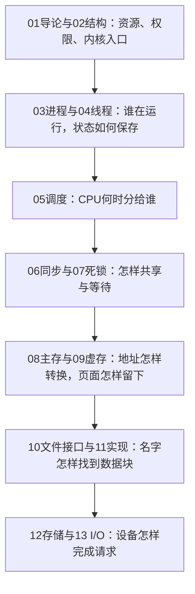

# 操作系统

操作系统的主线是：**让多个程序安全地使用CPU、内存和设备，并把硬件组织成进程、地址空间、文件等可用对象。** 本笔记按13章连续讲解，每章先提出具体问题，再解释术语、机制和例子，最后给记忆要点；图用于说明结构、事件与依赖。

## 学习路线

先建立运行模型，再学习计算题。遇到状态题按“事件→状态”推演；调度题按下一个事件推进；地址和文件定位题先分解编号与偏移；性能题先列完整路径并统一单位。

## 顺序目录

| 章 | 笔记 | 本章要回答的问题 |
| --- | --- | --- |
| 01 | [操作系统导论](01-os-introduction.md) | 谁管理资源，并让程序交错推进？ |
| 02 | [操作系统结构](02-os-structures.md) | 应用怎样进入内核，系统怎样组织？ |
| 03 | [进程](03-os-process.md) | 运行状态如何保存、创建与通信？ |
| 04 | [线程与并发](04-os-threads.md) | 一份资源容器内怎样容纳多条执行流？ |
| 05 | [CPU调度](05-os-cpu-scheduling.md) | CPU先给谁，怎样计算等待与响应？ |
| 06 | [进程同步](06-os-synchronization.md) | 共享修改与条件等待怎样协调？ |
| 07 | [死锁](07-os-deadlocks.md) | 能否找到完成顺序，何时拒绝分配？ |
| 08 | [主存](08-os-main-memory.md) | 虚拟地址怎样定位物理内存？ |
| 09 | [虚拟内存](09-os-virtual-memory.md) | 未驻留页怎样取得，内存不足换谁？ |
| 10 | [文件系统接口](10-os-file-interface.md) | 名字、打开实例与内容如何关联？ |
| 11 | [文件系统实现](11-os-file-implementation.md) | 文件字节怎样找到设备块？ |
| 12 | [大容量存储](12-os-mass-storage.md) | 怎样调度磁盘并处理存储冗余？ |
| 13 | [I/O系统](13-os-io.md) | 请求怎样完成，结果何时能用？ |

## 使用与范围

笔记是理论学习教辅，覆盖上述13章，包含已有42道自编练习及答案、判分要点。正文数值例子用于演示方法；标为“自编题”的练习用于检查同型理解，均不宣称为本班历年原题或官方标准答案。可先独立推演再看答案；读完或笔记已生成都不能替代实际作答与实验结果。

编写依据包括浙大课程资料、学生课程笔记和公开教材目录的覆盖核查。学生笔记中的历史教学安排只作背景，**今年考试范围、A4携带规则和评分要求仍应以本班通知为准**。参考入口：[NoughtQ课程资源](https://github.com/NoughtQ/ZJU-Courses-Resources/tree/main/OS-D3QD)、[WintermelonC课程笔记](https://github.com/WintermelonC/WintermelonC_Docs/tree/12183f324d59df832add19b4bbe1bbb33f58a1b1/docs/zju/compulsory_courses/operating_system)。

Lab 0／1在相关章节中只用于解释工具、启动和中断的角色；13章理论教材不代表13项实验，也不声明实验已经完成。Lab 2—6的具体任务和提交细则未在本笔记中补造；实验操作与提交应另依当期讲义。
