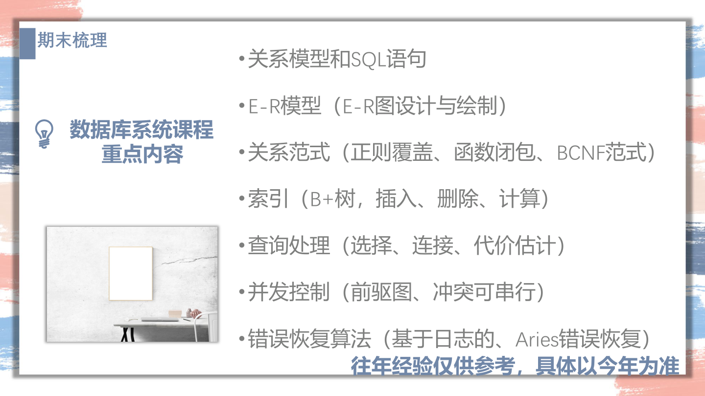
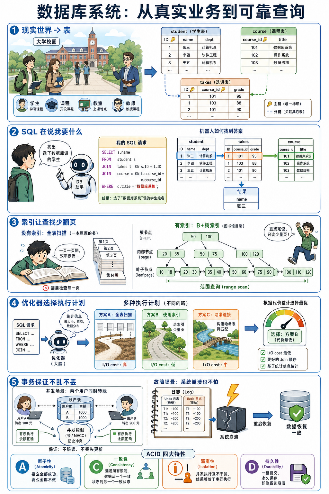

## 0. PPT 01 备考建议：这门课到底考什么

PPT 先给了整门课的考试地图。先看这张图，后面所有章节都围绕这些点展开。



数据库期末的题型很稳定。它看起来内容多，其实大题几乎都在考下面八件事：

| 题型 | 你第一眼要看什么 | 第一笔 |
|---|---|---|
| SQL / 关系代数 | 表、主键、外键、查询目标 | 写 `SELECT ... FROM ... WHERE ...` 骨架 |
| E-R 图 / 关系模式 | 名词、动词、数量关系 | 圈实体，连联系，标 1:N / M:N |
| 范式 / 函数依赖 | 属性集合和 FD | 算闭包，找候选键 |
| B+ Tree / 索引 | 阶数、叶子容量、插入删除 key | 找 leaf，再 split / borrow / merge |
| 查询处理 / 查询代价 | block 数、buffer 数、算法名 | 先把 tuple 换成 block |
| 查询优化 | 关系代数树和选择条件 | 选择下推、投影下推、小表先 join |
| 并发控制 | schedule 里的 read/write 顺序 | 找冲突边，画前驱图 |
| Recovery / ARIES | log、checkpoint、LSN | Analysis -> Redo -> Undo |

最重要的一句话：

```text
数据库考试不是背定义，是看到题以后知道第一笔写什么。
```

所以每章我都会固定给你四个东西：

```text
这章在讲什么
考试怎么问
标准做题模板
最容易错在哪里
```

## 0.1 一张图看懂整门课的主线

如果把这门课串成一个故事，它其实是「一条数据从写进数据库到被查出来」的完整旅程。



五个模块各管一段：

| 模块 | 章节 | 这一段在解决什么问题 |
|---|---|---|
| 建模与查询语言 | 01 关系代数 · 02 SQL | 怎么把现实拼成表，再用查询语言取出来 |
| 设计 | 03 E-R · 04 范式 | 表该怎么设计才不冗余、不出异常 |
| 物理存储 | 05 存储 · 06 索引 | 数据在磁盘上怎么放、怎么加速查找 |
| 查询执行 | 07 查询处理 · 08 查询优化 | 同一句 SQL，数据库怎么跑得快 |
| 可靠性 | 09 并发 · 10 恢复 | 多人同时改、崩溃后怎么不乱、不丢 |

考试的八种大题（上表）就分布在这五个模块里。复习时按模块推进，比从第一页读到最后一页更有效。

## 0.2 各模块一句话定位

```text
关系代数：SQL 的低配动作表，σ 筛行、π 挑列、⋈ 拼表。
SQL：把自然语言翻译成「取哪些列 + 从哪些表 + 怎么连 + 怎么筛/分组」。
E-R：名词找实体、动词找联系，再按规则转成 schema。
范式：算闭包、找候选键，用 FD 判断坏表并无损分解。
存储：一切以 block 为单位，先把 tuple 数换成 block 数。
索引：B+ 树容量与高度估计，插入 split、删除 borrow/merge。
查询处理：数 block transfer 和 seek，掌握各种 join 的 cost。
查询优化：选择/投影下推让中间结果变小，估 join size。
并发：画前驱图判可串行化，2PL、死锁、多粒度锁。
恢复：WAL + ARIES 三遍（Analysis → Redo → Undo）。
```

每章的讲义都会落到「这类题第一笔写什么」和「A4 纸怎么记」。整门课的详细目录见 [DB 首页](index.md)。
