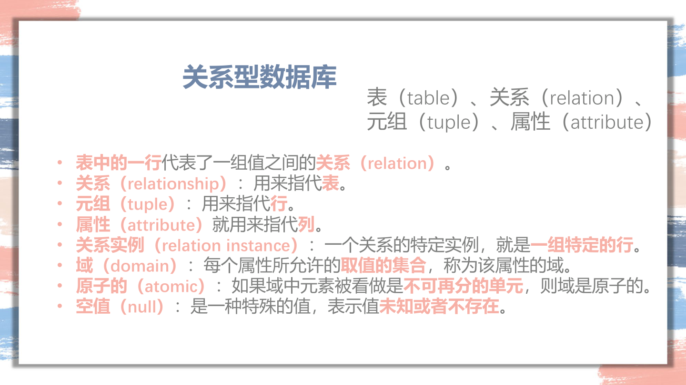
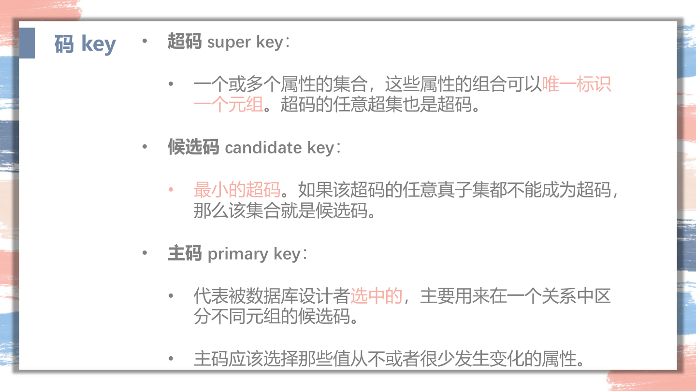
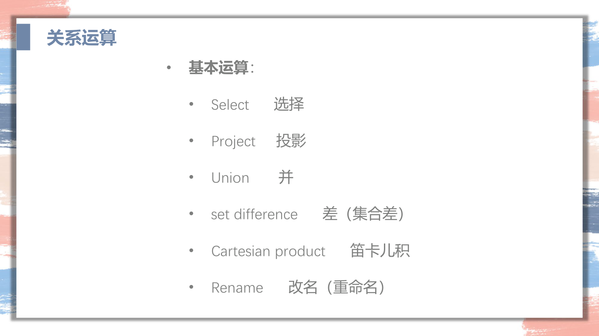
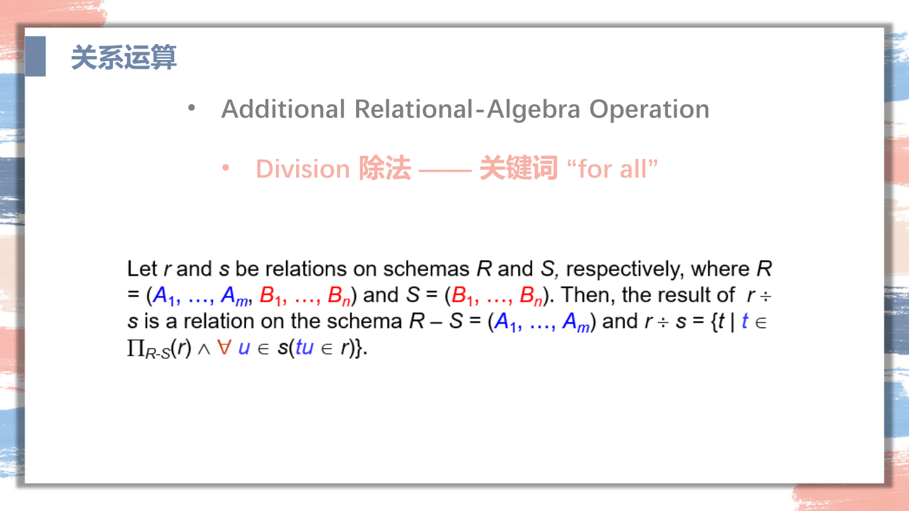

## 1. PPT 02 关系模型与关系代数：SQL 的积木

这一章是后面 SQL、E-R、范式的前置语言。考试很少单独大题考关系代数，但它的符号会在查询优化（第 8 章）里反复出现，而且“关系代数 ↔ SQL”的对应关系是你读懂任何查询题的底座。所以这一章要会两件事：

```text
1. 看到一个关系代数表达式，能翻译成人话和 SQL。
2. 看到一句自然语言查询，能写出对应的 σ / π / ⋈。
```

数据库最底层的画面很朴素：

```text
一张关系表 = 一张规则很严格的 Excel。
一行 tuple = 一条记录。
一列 attribute = 一个属性。
```

贯穿全章的例子（大学数据库）：

```text
student(sid, name, major)
takes(sid, cid, score)
course(cid, title, dept)
```

三张表分工：

```text
student：人是谁。
takes：谁选了什么课，成绩多少。
course：课是什么。
```

SQL 和关系代数的目标都是同一句话：

```text
把分散在多张表里的信息，按条件重新拼成你要的结果。
```

### 1.1 基本名词：表、行、列、域、空值



| 词 | 人话 | 例子 |
|---|---|---|
| relation / table | 一张表 | `student(...)` |
| tuple | 一行记录 | 某一个学生 |
| attribute | 一列属性 | `sid`, `name`, `major` |
| domain | 某列允许的取值范围 | `score` 是数字，`gender` 是枚举 |
| relation instance | 某一时刻表里的所有行 | 当前 student 表内容 |
| atomic | 一个格子里只放一个不可再拆的值 | 不要把多个手机号塞进一个格子 |
| NULL | 未知或不存在 | 不是 0，也不是空字符串 |

关于关系的两个数学事实，选择题会问：

```text
关系是“元组的集合”，所以理论上没有重复行，也没有固定顺序。
属性是 atomic 的，即每个格子只能放一个不可再分的值（第一范式 1NF 的要求）。
```

`NULL` 很容易考：

```text
NULL 表示“未知”或“不存在”，不是 0，也不是空串。
任何和 NULL 的算术或比较，结果都是 unknown。
所以不能写 = NULL，要写 IS NULL / IS NOT NULL。
```

### 1.2 Key：怎么唯一认出一行



key 的核心问题是：

```text
我用哪些属性，能唯一定位一行？
```

用集合语言说，属性集合 $K$ 是 super key，当且仅当：对任意两行 $t_1 \neq t_2$，都有 $t_1[K] \neq t_2[K]$。也就是 $K$ 的取值在整张表里不重复。

四个词，从宽到窄：

| 词 | 定义 | 关键点 |
|---|---|---|
| super key | 能唯一识别一行的属性集合 | 可能带多余属性 |
| candidate key | 最小的 super key | 去掉任何一个属性就不再唯一 |
| primary key | 设计者选中的那个 candidate key | 一张表只选一个 |
| foreign key | 本表的属性引用另一张表的 primary key | 维持参照完整性 |

例子：

```text
student(sid, name, major)
takes(sid, cid, score)
```

- `student.sid` 是 primary key，唯一识别一个学生。
- `takes` 里识别一行需要 `(sid, cid)` 的组合，所以它的 primary key 是 $\{sid, cid\}$。
- `takes.sid` 是 foreign key，引用 `student.sid`。

foreign key 的约束含义（参照完整性）：

```text
takes 里出现的每个 sid，必须能在 student 表里找到对应的行。
```

这就是后面 SQL 里 `REFERENCES` 的来源。

### 1.3 关系代数总览：六个基本算子 + 几个派生算子



关系代数不要当成抽象数学，它就是 SQL 的低配动作表。先看全表，再逐个讲：

| 操作 | 符号 | 人话 | SQL 对应 |
|---|---|---|---|
| Select | $\sigma_{\theta}(r)$ | 筛行 | `WHERE` |
| Project | $\pi_{A_1,\dots,A_k}(r)$ | 挑列 | `SELECT` |
| Union | $r \cup s$ | 并起来 | `UNION` |
| Difference | $r - s$ | A 有但 B 没有 | `EXCEPT` |
| Cartesian product | $r \times s$ | 两张表暴力两两配对 | 没写连接条件的多表 `FROM` |
| Rename | $\rho_{x}(r)$ | 改名 | `AS` |
| Intersection | $r \cap s$ | 交集（派生） | `INTERSECT` |
| Join | $r \bowtie_{\theta} s$ | 按条件拼表（派生） | `JOIN` |
| Natural join | $r \bowtie s$ | 按同名列相等拼表 | `NATURAL JOIN` |
| Division | $r \div s$ | “满足所有”（派生） | 双层 `NOT EXISTS` |
| Assignment | $temp \leftarrow E$ | 把中间结果存起来 | `WITH` / 临时表 |

其中 $\{\sigma, \pi, \cup, -, \times, \rho\}$ 是六个**基本算子**，其余都能用它们拼出来。考试如果问“哪些是基本运算”，答这六个。

### 1.4 Select 与 Project：横着筛行，竖着挑列

**Select（选择）** $\sigma_{\theta}(r)$：保留 $r$ 中满足条件 $\theta$ 的行。

```text
σ_{major='CS'}(student)
```

人话：从 student 里挑出专业是 CS 的学生（行变少，列不变）。条件 $\theta$ 里可以用 $=, \neq, <, >, \le, \ge$，以及 $\wedge$（与）、$\vee$（或）、$\neg$（非）。

**Project（投影）** $\pi_{A_1,\dots,A_k}(r)$：只保留列出的那几列。

```text
π_{name, major}(student)
```

人话：只看姓名和专业两列（列变少，行不变）。注意一个数学细节：

```text
投影结果是“集合”，会自动去重。
所以 π_{major}(student) 得到的是去重后的专业列表。
```

这正好对应 SQL 里 `SELECT DISTINCT`。SQL 默认不去重（多重集语义），是 SQL 和纯关系代数的一个区别。

两个算子串起来：

$$\pi_{name}\big(\sigma_{major='CS'}(student)\big)$$

读作：先筛出 CS 学生，再只看名字。

### 1.5 集合运算：Union / Difference / Intersection

三个集合算子要求两个关系**相容**（union-compatible）：列数相同，且对应列的 domain 相同。

```text
union（∪）：r 或 s 里出现的行。
difference（−）：在 r 里、但不在 s 里的行。
intersection（∩）：r 和 s 都有的行。
```

交集是派生的，因为：

$$r \cap s = r - (r - s)$$

例子：找“选了 CS101 但没选 CS102”的学生 sid：

$$\pi_{sid}\big(\sigma_{cid='CS101'}(takes)\big) - \pi_{sid}\big(\sigma_{cid='CS102'}(takes)\big)$$

### 1.6 笛卡尔积与 Join：把两张表拼起来

**笛卡尔积** $r \times s$：把 $r$ 的每一行和 $s$ 的每一行两两配对。如果 $r$ 有 $n_r$ 行、$s$ 有 $n_s$ 行，结果有 $n_r \times n_s$ 行。

光有笛卡尔积没意义，要配合 select 把“拼错的组合”筛掉。比如要把学生和他选的课拼起来：

$$\sigma_{student.sid = takes.sid}(student \times takes)$$

这个“笛卡尔积 + 选择”太常用了，于是定义 **theta join**：

$$r \bowtie_{\theta} s = \sigma_{\theta}(r \times s)$$

所以上面那句等价于：

$$student \bowtie_{student.sid = takes.sid} takes$$

> 这一步等价关系（$\sigma_{\theta}(r \times s) = r \bowtie_{\theta} s$）在第 8 章查询优化里会被反过来用：把笛卡尔积加选择识别成一个 join，从而用更快的 join 算法。

### 1.7 Natural join：同名属性自动相等，既方便也危险

**Natural join** $r \bowtie s$ 的规则：

```text
自动找两张表里所有同名属性，要求它们都相等；
再在结果里把重复的同名列只保留一份。
```

例子：

$$student \bowtie takes \bowtie course$$

如果同名连接列正好是 `sid` 和 `cid`，这一句就把三张表正确拼起来了，很省事。

危险之处来自 docx 笔记里那个经典坑：

```text
student(sid, name, dept_name)
takes(sid, cid)
course(cid, title, dept_name)
```

如果直接 `(student ⋈ takes) ⋈ course`，natural join 会同时按 `cid` **和** `dept_name` 连接，等于偷偷加了一条“学生所在系 = 课程开课系”的条件，结果就错了。

所以做题要会用 `join ... using`，显式指定只按哪个属性连：

```text
(student ⋈ takes) join course using (cid)
```

A4 规则：

```text
natural join 只在确认所有同名列都应该相等时使用；
否则改用 theta join 显式写连接条件，或用 using 限定连接列。
```

### 1.8 Rename 与 Assignment：自连接和分步计算

**Rename** $\rho_{x}(r)$ 给关系或属性改名，最重要的用途是**自连接**：同一张表要参与两次时，必须改名区分。

例子：找有重名（title 相同）但 cid 不同的课程对。需要把 `course` 用两次：

$$\pi_{c_1.title}\Big(\sigma_{c_1.title = c_2.title \,\wedge\, c_1.cid \neq c_2.cid}\big(\rho_{c_1}(course) \times \rho_{c_2}(course)\big)\Big)$$

**Assignment** $temp \leftarrow E$ 把一个子表达式的结果命名存下来，让复杂查询能分步写，对应 SQL 的 `WITH` 或临时表。

### 1.9 Division：看到“所有 / 每一个”就想到它

**Division** $r \div s$ 服务于全称量词。它的信号词是：

```text
for all / 所有 / 每一个 / 选了全部…… / 参加了所有……
```

定义直觉：设 $r$ 的属性是 $R$，$s$ 的属性是 $S \subseteq R$，令剩下的属性是 $R - S$。那么

$$r \div s = \{\, t \mid t \in \pi_{R-S}(r) \ \text{且对} \ s \ \text{中每个} \ u, \ (t,u) \in r \,\}$$

人话：在 $r$ 里，找那些“把 $s$ 中**所有**值都配齐了”的 $t$。

经典例子：找选修了**所有** CS 课程的学生。

```text
设 R1 = π_{sid, cid}(takes)         -- 每个学生选了哪些课
设 S  = π_{cid}(σ_{dept='CS'}(course)) -- 所有 CS 课的 cid
答案 = R1 ÷ S
```

读法不是“他选了哪些课”，而是反过来：

```text
对一个学生，检查是否“不存在某门 CS 课他没选”。
```

这正是 SQL 里用双层 `NOT EXISTS` 表达全称量词的来源（详见第 2 章 SQL）。你不一定要熟练手写 division 的基本算子展开，但要记住：

```text
看到“所有 / 每一个”，关系代数想 division，SQL 想双层 NOT EXISTS。
```



### 1.10 把一句查询翻译成关系代数（完整示范）

题目：

```text
查询 CS 专业中选了 Database 课程的学生姓名。
```

第一步，定位信息在哪：

```text
姓名 name、专业 major 在 student。
选课关系在 takes。
课程名 title 在 course。
```

第二步，先拼表，再筛行，最后挑列（从里往外写）：

$$\pi_{name}\Big(\sigma_{major='CS' \,\wedge\, title='Database'}\big(student \bowtie takes \bowtie course\big)\Big)$$

第三步，翻译成 SQL（注意用显式连接条件，避开 natural join 的坑）：

```sql
SELECT s.name
FROM student AS s, takes AS t, course AS c
WHERE s.sid = t.sid
  AND t.cid = c.cid
  AND s.major = 'CS'
  AND c.title = 'Database';
```

对照表，记住三组核心对应：

| 关系代数 | SQL | 动作 |
|---|---|---|
| $\sigma_{\theta}$ | `WHERE` | 横着筛行 |
| $\pi_{A}$ | `SELECT` | 竖着挑列 |
| $\bowtie$ | `JOIN` / `FROM`+连接条件 | 拼表 |

### 1.11 关系代数 A4 规则

```text
relation 是元组的集合（无重复、无序），tuple 是行，attribute 是列，格子要 atomic。
super key 能唯一识别一行；candidate key 是最小的 super key；primary key 选一个；foreign key 指向别表的 primary key。
六个基本算子：σ、π、∪、−、×、ρ。其余（∩、⋈、÷）都是派生的。
σ_θ 筛行（WHERE）；π 挑列且去重（SELECT DISTINCT）。
∪/−/∩ 要求两关系相容；r∩s = r−(r−s)。
theta join：r ⋈_θ s = σ_θ(r × s)，第 8 章优化会反向利用这条等价。
natural join 按所有同名列相等并去重，慎用；不确定就用 using 或显式 theta join。
自连接必须用 ρ 改名区分。
division（÷）对应“所有 / for all”，SQL 用双层 NOT EXISTS。
翻译查询：先定位信息在哪张表，再“拼表 → 筛行 → 挑列”从里往外写。
```
