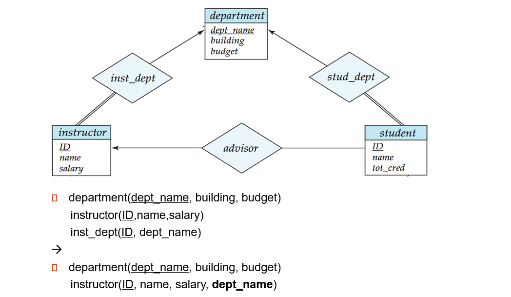

## 3. PPT 03 E-R 图：先画真实世界，再落成表

这一章以 `第六章 ER模型.docx` 为主要讲解来源。PPT 给了 E-R 图符号表，但真正要会的是：看到一段业务描述，能判断哪些是实体、哪些是联系、箭头/双线/弱实体/多值属性分别会怎样影响最后的关系模式。

E-R 图不要当成画图题。它其实是在问：

```text
真实世界里有哪些“东西”？
这些东西之间有什么“关系”？
每个关系是一对一、一对多，还是多对多？
某些东西是不是必须参加这个关系？
最后怎么变成 SQL 里的表？
```

下面这张图可以保留，因为符号本身靠视觉记忆更快。


### 3.1 实体和联系：名词多半是实体，动词多半是联系

题目给一段需求时，先不要急着画。先圈词。

比如题目说：

```text
一个大学有 department、instructor、student、course、section。
一个 instructor 属于一个 department。
一个 department 可以有多个 instructor。
一个 student 可以有 instructor 作为 advisor。
一个 course 可以开多个 section。
```

第一轮圈名词：

```text
department
instructor
student
course
section
```

这些通常会变成实体，也就是将来数据库里的表。

第二轮圈动词或业务关系：

```text
instructor belongs to department
student has advisor instructor
course has section
```

这些通常会变成联系。联系是否单独建表，取决于它是一对多还是多对多。

考场第一笔：

```text
实体先列出来，主键先标出来，再处理联系。
```

### 3.2 箭头：不要背方向，问“固定一边能对应几个”

E-R 图里的箭头本质是基数约束。最稳的方法是两句话：

```text
固定左边一个，看右边能有几个。
固定右边一个，看左边能有几个。
```

例子：

```text
一个 department 可以有多个 instructor。
一个 instructor 只能属于一个 department。
```

所以这是：

```text
department 1 : N instructor
```

转换成关系模式时，通常不需要为这个联系单独建表，而是把“一端”的主键放到“多端”：

```text
department(dept_name, building, budget)
instructor(ID, name, salary, dept_name)
```

其中：

```text
instructor.dept_name references department(dept_name)
```

这就是 Word 笔记里说的：多对一联系 `inst_dept` 可以省略，把 `dept_name` 加进 `instructor`。

如果是多对多，比如：

```text
student takes course
```

一个学生可以选多门课，一门课也可以被多个学生选。这个联系必须单独变成一张表：

```text
takes(student_id, course_id, grade)
```

主键通常是两端主键组合：

```text
primary key (student_id, course_id)
```

### 3.3 双线和单线：它在说“必须有”还是“可以没有”

Word 笔记里特别强调了 participation。

双线表示全参与：

```text
每一个该实体都必须参加这个联系。
```

单线表示部分参与：

```text
有些实体可以不参加这个联系。
```

例子：

```text
instructor 双线连到 inst_dept
```

人话：

```text
每个老师都必须属于某个系。
```

对应到表里就是：

```text
instructor.dept_name 通常不能是 NULL。
```

如果：

```text
department 单线连到 inst_dept
```

人话：

```text
一个系可以暂时没有老师。
```

所以不要误以为“有 department 表，就一定要有 instructor 指向它”。

再看 advisor：

```text
student 单线连 advisor
```

意思是：

```text
不是每个学生都有导师。
```

因此 `advisor` 关系里可以没有这个学生对应的行，或者学生表里的 advisor 字段可以为空，取决于设计方案。

### 3.4 联系上有属性：属性跟着联系走

有些属性不属于任何单个实体，而是属于“这一次关系”。

比如：

```text
student takes course，grade 是成绩。
```

`grade` 不是学生自己的属性，也不是课程自己的属性。它属于“某个学生选某门课”这件事。

所以多对多联系表应该写成：

```text
takes(student_id, course_id, grade)
```

如果一个多对一联系带属性，常见处理是把联系属性也放进多端表。比如：

```text
instructor belongs to department since_date
```

可以变成：

```text
instructor(ID, name, salary, dept_name, since_date)
```

因为每个 instructor 只对应一个 department，这个 `since_date` 可以跟着 instructor 走。

### 3.5 弱实体：自己站不稳，要借强实体的主键

弱实体的关键词是：

```text
自己的属性不能唯一识别自己，必须依赖另一个强实体。
```

Word 笔记里的例子是 `section`。

一个教学班 section 可能有：

```text
sec_id
semester
year
```

但这些不一定全局唯一。它往往还要依赖课程：

```text
course_id
```

所以转换时要把强实体的主键拷贝进弱实体：

```text
section(course_id, sec_id, semester, year, building, room_number)
primary key (course_id, sec_id, semester, year)
foreign key (course_id) references course(course_id)
```

记忆句：

```text
弱实体的主键 = 强实体主键 + 自己的部分键。
```

如果弱实体和强实体之间的 identifying relationship 上还有属性，这些属性通常也转移到弱实体表里。

### 3.6 多值属性：一列里不能塞一串值

多值属性在 E-R 图里常用花括号表示，比如：

```text
{ phone_number }
```

意思是：

```text
一个 instructor 可以有多个 phone_number。
```

关系数据库不喜欢一格里塞多个值。不要写：

```text
instructor(ID, name, phone_numbers)
```

更标准的做法是单独建表：

```text
instructor(ID, name, salary)
instructor_phone(ID, phone_number)
```

其中：

```text
primary key (ID, phone_number)
foreign key (ID) references instructor(ID)
```

这样一位老师有三个电话，就在 `instructor_phone` 里放三行。

Word 笔记里还提到 `time_slot` 的情况：如果一个 `time_slot_id` 对应多个具体上课时间，也可以把多值属性单独拆成：

```text
time_slot_detail(time_slot_id, day, start_time, end_time)
```

但如果拆完后原来的 `time_slot` 表只剩一个孤零零的 `time_slot_id`，有时可以简化成只保留明细表。这是设计选择，不是死规则。

### 3.7 复合属性、派生属性、递归联系

复合属性：

```text
address = street + city + zip
```

转换到关系模式时，通常直接存最底层属性：

```text
street, city, zip
```

派生属性：

```text
age 可以由 birth_date 推出来。
```

派生属性不一定要存。考试里看到 `age()` 或虚线椭圆，就知道它可以从别的属性计算得到。

递归联系：

```text
course 和 course 自己之间有 prerequisite 关系。
```

这不是两个实体，而是同一个实体扮演两个角色：

```text
prereq(course_id, prereq_id)
```

两个字段都外键指向 `course(course_id)`，但含义不同：

```text
course_id：这门课
prereq_id：它的先修课
```

### 3.8 特化与概化：父类和子类

特化是从上往下分：

```text
person -> student / employee
```

概化是从下往上合：

```text
student / employee -> person
```

考试会问两个词：

```text
disjoint / overlapping
total / partial
```

disjoint：

```text
一个父类实体最多属于一个子类。
```

overlapping：

```text
一个父类实体可以同时属于多个子类。
```

total：

```text
父类里的每个实体都必须属于某个子类。
```

partial：

```text
父类里可以有实体不属于任何子类。
```

例子：

```text
person 分成 student 和 employee
```

如果一个人可以既是学生又是员工，就是 overlapping。

如果系统里还有访客 person，不属于 student/employee，就是 partial。

### 3.9 E-R 转关系模式总模板

这张 Word 示例可以保留，因为它展示了实体、联系、箭头、双线在同一张图里如何配合。



写 schema 时按这个顺序走：

```text
1. 每个强实体 -> 一张表。
2. 复合属性 -> 拆到底层属性。
3. 多值属性 -> 单独建表，带上原实体主键。
4. 弱实体 -> 自己属性 + 强实体主键；主键是组合键。
5. 1:N 联系 -> 把 1 端主键放到 N 端。
6. M:N 联系 -> 单独建联系表，主键通常是两端主键组合。
7. 联系有属性 -> 放到联系表；若 1:N 且不单独建表，可放到 N 端。
8. 递归联系 -> 单独表里给同一实体的主键起两个角色名。
9. 最后补 primary key 和 foreign key。
```

考场最容易丢的不是“看不懂图”，而是漏写约束：

```text
主键要标。
外键要标。
全参与通常要考虑 NOT NULL。
多对多不要硬塞到其中一张实体表里。
```

### 3.10 E-R 题 A4 规则

```text
名词找实体，动词找联系。
1:N：把 1 端主键放进 N 端。
M:N：单独建联系表，两端主键组成主键。
联系属性跟着联系表；若 1:N 可放 N 端。
弱实体主键 = 强实体主键 + 自己部分键。
多值属性单独建表。
双线是全参与，表里常体现为 NOT NULL 或必须存在对应关系。
递归联系要给同一实体的两次参与起不同角色名。
```
