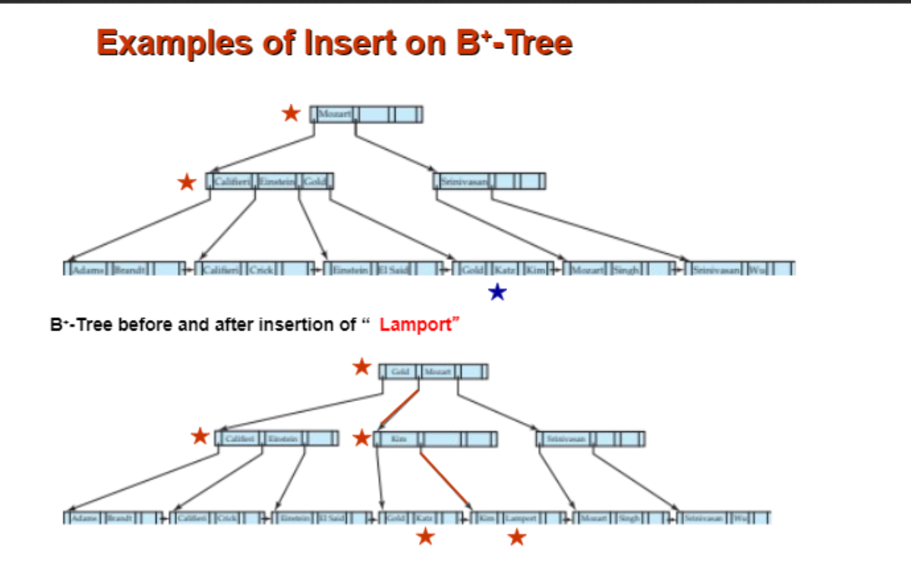

## 6. PPT 06 数据库索引：数据库的目录、路牌和缓冲树

这一章以 `第十章 索引.docx` 为主要讲解来源。PPT 给了索引分类和 B+ 树图；Word 笔记把 order `n`、高度估计、批量装载、LSM-tree、Buffer Tree 这些考试细节讲得更完整。

先抓主线：

```text
索引不是数据本身，而是帮你更快找到数据的目录。
B+ Tree 是最常见的磁盘索引，因为它每个节点正好做成一个磁盘 block，分叉很多，树很矮。
```

### 6.1 索引最先问：数据文件是不是按这个 key 排的

索引里常见两组词：

```text
primary / clustering index
secondary index
dense index
sparse index
```

先看 primary 和 secondary。

primary index / clustering index：

```text
数据文件本身就是按这个 search key 排列的。
```

secondary index：

```text
索引按某个 search key 排，但数据文件本身不按这个 key 排。
```

2021 样卷踩点：

```text
student 表按 sId 顺序存储，但 B+ tree 建在 dId 上。
```

它不是 primary index，因为文件不是按 `dId` 排的。它是 secondary index。

再看 dense 和 sparse。

dense index：

```text
数据文件里的每个 search-key value，都在索引里有索引项。
```

sparse index：

```text
只为部分 search-key value 建索引项。
```

sparse index 为什么通常要求数据文件有序？

因为它像字典页眉：

```text
索引告诉你某个范围从哪一页开始；
接下来你顺着数据文件往后扫。
```

如果数据文件本身不按 search key 排，稀疏索引就没法保证“从这里开始往后扫”能找到目标。

考试判断句：

```text
secondary index 通常是 dense。
sparse index 通常用于按 search key 排序的 primary/clustering file。
```

### 6.2 多级索引：索引太大，就给索引再建索引

如果一级索引也很大，放不进内存，每次查索引本身也要很多 I/O。

解决办法：

```text
把磁盘上的主索引看成一个顺序文件；
再在它上面建一个稀疏索引。
```

如果外层索引还是大：

```text
继续套娃，形成多级索引。
```

这就是 B+ 树的思想来源：

```text
根节点是最高级目录；
中间节点是中间目录；
叶子节点是最底层目录。
```

插入或删除数据时，别忘了：

```text
所有相关层级的索引都可能要更新。
```

### 6.3 B+ Tree 的画面：内部节点指路，叶子节点存条目

B+ Tree 里有两类节点：

```text
internal node：只放 key 和 child pointer，用来指路。
leaf node：放 search key 和 record pointer，或者直接放记录本身。
```

叶子节点之间通常还用链表连起来：

```text
查单点：从 root 一路往下。
查范围：先定位到范围起点所在 leaf，再沿叶子链表向右扫。
```

这张 Word 图保留，因为 B+ 树插入和分裂靠图看一遍会更快。



### 6.4 order n：内部节点看孩子数，叶子节点看 key 数

这门课的记法是：

```text
内部节点最多 n 个 child pointer，最多 n-1 个 key。
内部节点最少 ceil(n/2) 个 child pointer。
叶子节点最多 n-1 个 key。
叶子节点最少 floor(n/2) 个 key。
```

写成公式就是：内部节点孩子数 $\in [\lceil n/2 \rceil,\ n]$，叶子 key 数 $\in [\lfloor n/2 \rfloor,\ n-1]$。

几个常见值直接背熟：

| n | 内部节点最多孩子 | 内部节点最少孩子 | 叶子最多 key | 叶子最少 key |
|---|---:|---:|---:|---:|
| 3 | 3 | 2 | 2 | 1 |
| 4 | 4 | 2 | 3 | 2 |
| 5 | 5 | 3 | 4 | 2 |
| 6 | 6 | 3 | 5 | 3 |

你之前 2021 样卷的关键错点就是：

```text
n = 3 时，叶子最多不是 3 个 key，而是 2 个 key。
```

因为 `n` 对内部节点说的是最多孩子数；叶子的 key 容量是 `n-1`。

### 6.5 B+ Tree 查找：每下一层就是一次读节点

查 `key = 38`：

```text
1. 读 root。
2. 根据 root 里的分隔 key 选择 child pointer。
3. 读 internal node。
4. 继续选择 child pointer。
5. 到 leaf 后在 leaf 内找 38。
```

因为每个节点通常就是一个磁盘 block，所以树高很重要：

```text
树越矮，随机 I/O 越少。
```

B+ 树分叉很大，真实数据库中树高通常不大，这就是它适合磁盘的原因。

### 6.6 插入：叶子溢出就 split，父节点也可能连锁 split

插入模板：

```text
1. 从 root 找到目标 leaf。
2. 把 key 插入 leaf，保持有序。
3. 如果 leaf 没超过 n-1 个 key，结束。
4. 如果 leaf 溢出，split 成两个 leaf。
5. 把右 leaf 的第一个 key 复制到父节点。
6. 如果父节点也溢出，继续向上 split。
7. 如果 root 溢出，新建 root，树高加一。
```

最容易混的是 leaf split 和 internal split。

| 分裂位置 | 父节点拿到什么 | 这个 key 还留在原节点吗 |
|---|---|---|
| leaf split | 右 leaf 的第一个 key | 留在 leaf 里 |
| internal split | 中间 key | 不留在 internal 里 |

记忆：

```text
叶子 split 是“复制一个路标给父亲”。
内部 split 是“真正把中间路标提上去”。
```

### 6.7 删除：先借，借不到再合并

删除模板：

```text
1. 找到 key 所在 leaf，删除。
2. 如果 leaf key 数仍不少于 floor(n/2)，结束。
3. 如果 underflow，先看相邻兄弟能不能借一个 key。
4. 能借：borrow，并更新父节点分隔 key。
5. 不能借：merge 两个 leaf，并从父节点删除对应分隔 key。
6. 父节点如果 underflow，继续向上处理。
7. root 如果只剩一个 child，删掉 root，树高下降。
```

删除题三大坑：

```text
借完或合并后忘记更新父节点分隔 key。
兄弟自己刚好最低占用，还硬借。
root shrink 忘记处理。
```

考试画树时，别追求一步到位。每次只做一件事：

```text
删 leaf -> 检查 underflow -> borrow/merge -> 检查 parent。
```

### 6.8 B+ Tree 高度估计：先算一个节点能放多少指针

Word 笔记给了一个典型计算。

假设：

```text
block size = 4096 bytes
pointer size = 4 bytes
key size = 18 bytes
```

内部节点有：

```text
n 个 pointer
n-1 个 key
```

所以容量约束是：

$$n \cdot 4 + (n - 1) \cdot 18 \leq 4096$$

化简：

$$n \leq \left\lfloor \frac{4096 + 18}{4 + 18} \right\rfloor = 187$$

所以：

```text
内部节点最多 187 个孩子。
内部节点最少 ceil(187/2) = 94 个孩子。
叶子节点最多 186 个 key。
叶子节点最少 floor(187/2) = 93 个 key。
```

如果有 1,000,000 条记录，叶子最多放 186 条索引项：

$$\text{最少 leaf 数} = \lceil 1000000 / 186 \rceil = 5377$$

如果叶子按最低占用 93 条算：

$$\text{最多 leaf 数} = \lceil 1000000 / 93 \rceil = 10753$$

高度判断的思路：

```text
一层 leaf 能覆盖多少 key？
root + leaf 两层能覆盖多少？
root + internal + leaf 三层能覆盖多少？
```

三层最大覆盖：

$$187 \times 187 \times 186$$

它远大于 1,000,000，所以三层够。

做题注意：

```text
题目说 height 时，先确认是否把 root 和 leaf 都算作层。
```

### 6.9 B+ Tree 文件组织：叶子可以直接放记录

普通 B+ 树索引的叶子常放：

```text
search key + record pointer
```

B+ tree file organization 则可以让叶子直接放记录本身。

这样做的效果：

```text
表的数据本身就按照 B+ 树叶子顺序组织。
```

范围扫描会很自然：

```text
定位到第一个 leaf 后，沿叶子链表顺序读记录。
```

### 6.10 批量装载：不要一条条插，先排序再自底向上建树

如果一次性有大量 key 要建立 B+ 树，逐条插入会产生很多随机 I/O 和半满节点。

更好的做法：

```text
1. 先按 search key 排序。
2. 从左到右尽量填满 leaf。
3. 再由 leaf 层向上构建 internal nodes。
4. 按层从下往上写回磁盘。
```

Word 笔记强调一个好处：

```text
叶子节点在磁盘上连续存放，顺序扫描或 merge 时 I/O 很少。
```

如果两棵自底向上构建的 B+ 树要 merge：

```text
直接顺序读两边 leaf，像归并排序一样 merge key，然后重建一棵新树。
```

这比对旧树反复插入新 key 更像批处理，I/O 更友好。

### 6.11 LSM-tree：写入先攒在内存，满了顺序刷到磁盘

LSM-tree 是写优化结构。

画面：

```text
L0：内存中的小树。
内存满了 -> 顺序写到磁盘。
磁盘上同层文件太多 -> merge 成更大的下一层。
```

好处：

```text
写入从随机写变成顺序写，磁盘 I/O 更友好。
```

坏处：

```text
查询一个 key 时，可能要在 L0、L1、L2... 多层里找。
```

优化：

```text
Bloom filter。
```

Bloom filter 先告诉你：

```text
这个 key 不可能在某棵树里。
```

如果“不可能”，就不用真的去查那棵树。

### 6.12 Buffer Tree：插入请求先停在内部节点 buffer

2025 review 出现了 Buffer Tree。它不是普通 B+ Tree。

普通 B+ Tree：

```text
每次 insert 都一路走到 leaf。
```

Buffer Tree：

```text
内部节点有小 buffer。
insert 先进入上层 buffer。
buffer 满了，再批量下推到孩子。
```

做题模拟：

```text
1. 新 key 先进入 root buffer。
2. root buffer 满了，把 key 按范围分给 child buffer。
3. child buffer 满了继续往下推。
4. 到 leaf 后才真正插入 leaf。
5. leaf 满了按普通 B+ Tree split。
```

优点：

```text
把很多小插入攒成批量下推，减少 I/O。
```

注意查询：

```text
查一个 key 或范围时，不能只看 leaf。
路径上 buffer 里还没下推的 key 也可能是答案。
```

### 6.13 索引题 A4 规则

```text
primary/clustering：数据文件按 search key 排。
secondary：索引 key 与数据文件顺序不同。
dense：每个 search-key value 都有索引项。
sparse：只记录部分 key，通常要求文件按 key 有序。
B+ tree order n：内部最多 n 个孩子；叶子最多 n-1 个 key。
n=3：内部最多 3 个孩子/2 个 key，叶子最多 2 个 key。
leaf split：右 leaf 第一个 key 复制到父节点。
internal split：中间 key 上移，不留在原 internal。
delete：先 borrow，不能 borrow 再 merge，最后检查 root shrink。
Buffer Tree：insert 先进 buffer，满了批量下推；查询要看 buffer。
```

容量公式：$n \cdot p + (n-1) \cdot k \leq block\_size$。
