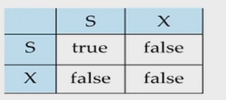

## 9. 事务与并发控制：多个人同时改账本，数据库怎么不乱

这一章以 `第十三章 事务管理.docx` 和 `第十四章 并发控制.docx` 为主要讲解来源。PPT 把并发控制放在后半段；Word 笔记补齐了 ACID、异常、schedule、冲突可串行化、视图可串行化、可恢复调度、2PL、死锁、多粒度锁。

先抓住全章主线：

```text
事务管理问：一件事怎样保证要么全做、要么全不做？
并发控制问：很多事务交错执行时，结果能不能等价于某个串行顺序？
```

### 9.1 事务：数据库里“一件完整的事”

事务是访问并可能更新数据库的一段程序执行。

经典例子是转账：

```text
A = A - 50
B = B + 50
```

这两步必须作为整体存在：

```text
不能只扣 A，不加 B。
不能让别人看到中间状态。
commit 后即使系统崩溃，也不能把这次转账弄丢。
```

### 9.2 ACID：四个字母分别保护什么

| 字母 | 名称 | 人话 |
|---|---|---|
| A | Atomicity 原子性 | 要么全做，要么全不做 |
| C | Consistency 一致性 | 事务前后数据库满足业务规则 |
| I | Isolation 隔离性 | 并发事务互相看不到乱七八糟的中间结果 |
| D | Durability 持久性 | commit 后，崩溃也不能丢 |

并发控制主要保护：

```text
Isolation
```

恢复系统主要保护：

```text
Atomicity + Durability
```

### 9.3 事务状态：失败后要回滚

常见状态：

```text
active：事务正在执行。
partially committed：最后一条语句执行完，准备提交。
committed：提交成功，结果必须持久。
failed：执行中出错或提交失败。
aborted：回滚完成，事务影响被清掉。
```

考点不是画状态图，而是理解：

```text
事务失败时，已经做过的修改不能半残留在数据库里。
```

这就是后面日志恢复的任务。

### 9.4 并发异常：四种“不隔离”的表现

#### Lost update 丢失修改

两个事务都读同一个值，然后都写回。

```text
T1 读 A=100，准备 A=A-50
T2 读 A=100，准备 A=A-10
T1 写 A=50
T2 写 A=90
```

T1 的修改被 T2 覆盖，好像从没发生过。

#### Dirty read 读脏数据

```text
T1 写 A=50，但还没 commit。
T2 读到 A=50，并基于它继续操作。
T1 abort。
```

T2 读到的是一个后来被撤销的值。

#### Non-repeatable read 不可重复读

同一个事务里两次读同一行，结果不同。

```text
T1 第一次读 A=100。
T2 修改 A=80 并提交。
T1 第二次读 A=80。
```

问题是：T1 执行期间被别的事务影响了。

#### Phantom 幻影

同一个事务里两次执行同一个范围查询，行数变了。

```text
T1 查询 salary > 10000 的员工，有 5 行。
T2 插入一条 salary = 20000 的员工并提交。
T1 再查，变成 6 行。
```

区别：

```text
不可重复读：同一条已有记录的值变了。
幻影：同一查询条件下，多了/少了记录。
```

### 9.5 隔离级别：越高越安全，越低越并发

从高到低：

| 隔离级别 | 允许什么问题 |
|---|---|
| Serializable | 四类问题都不允许 |
| Repeatable Read | 通常防 dirty read / lost update / non-repeatable read，但可能有 phantom |
| Read Committed | 只保证不读未提交数据；不可重复读和 phantom 可能发生 |
| Read Uncommitted | 连 dirty read 都可能允许 |

Word 笔记里的记忆：

```text
读提交：只读别人已经 commit 的数据。
读未提交：别人还没 commit 的修改也可能读。
```

考试如果问“哪个隔离级别防 phantom”，通常答：

```text
Serializable。
```

### 9.6 Schedule：把多个事务的读写排成一条时间线

Schedule 是：

```text
多个事务中 read/write/commit/abort 操作的交错顺序。
```

串行调度：

```text
T1 全部执行完，再 T2 全部执行。
```

串行调度一定隔离，但太慢。

并发调度：

```text
T1 执行一点，T2 执行一点，再回到 T1...
```

我们希望它虽然交错，但结果像某个串行顺序。

这就是可串行化：

```text
一个并发 schedule 如果等价于某个 serial schedule，就叫 serializable。
```

### 9.7 冲突：不同事务、同一数据、至少一个写

两个操作冲突，必须同时满足：

```text
1. 属于不同事务。
2. 访问同一个数据项。
3. 至少一个是 write。
```

所以：

```text
read-read 不冲突。
read-write 冲突。
write-read 冲突。
write-write 冲突。
```

冲突的本质：

```text
这两个操作不能随便交换顺序，否则可能改变结果。
```

### 9.8 冲突可串行化：画前驱图，看有没有环

做题模板：

```text
1. 每个事务 Ti 画成一个点。
2. 从左到右扫描 schedule。
3. 找所有冲突操作对。
4. 如果 Ti 的冲突操作在 Tj 前面，画 Ti -> Tj。
5. 图有环：不是 conflict serializable。
6. 图无环：是 conflict serializable；拓扑序就是等价串行顺序。
```

例子：

$$r_1(A) \quad w_2(A)$$

冲突，并且 T1 在前：$T_1 \to T_2$。

如果又有：

$$w_2(B) \quad r_1(B)$$

冲突，并且 T2 在前：$T_2 \to T_1$。

两条边成环：$T_1 \to T_2 \to T_1$，所以不可冲突串行化。

### 9.9 视图可串行化：比冲突可串行化更宽

Word 笔记补了 view serializability。它比 conflict serializability 宽，但考试通常不要求复杂判定。

一个 schedule 和某个 serial schedule 视图等价，需要满足三件事：

```text
1. 读到初始值的事务相同。
2. 每次 read 读到的是同一个事务写出来的值，也就是 reads-from 关系相同。
3. 每个数据项最后由哪个事务写入相同，也就是 final write 相同。
```

结论：

```text
每个 conflict-serializable schedule 都是 view-serializable。
反过来不一定。
```

如果考选择题：

```text
Conflict serializable => View serializable。
View serializable 不一定 conflict serializable。
```

### 9.10 可恢复调度：读了谁的脏值，就必须等谁先提交

Recoverable schedule 的规则：

```text
如果 Tj 读了 Ti 写过的数据，
那么 Ti 必须先 commit，Tj 才能 commit。
```

为什么？

```text
如果 Tj 先 commit，而 Ti 后来 abort，
Tj 已经把基于脏数据的结果提交给用户，恢复就尴尬了。
```

Cascading rollback 级联回滚：

```text
T11 读了 T10 的脏值；
T12 又读了 T11 的脏值；
T10 abort 后，T11/T12 都要跟着回滚。
```

Cascadeless schedule：

```text
事务只能读取已经提交的数据。
```

它能避免级联回滚。

考试排序：

```text
Strict schedule 通常更强；
Cascadeless 防级联回滚；
Recoverable 是最低要求。
```

### 9.11 S 锁和 X 锁：读共享，写独占

锁是悲观并发控制：

```text
访问数据前先申请锁，防止别人同时做冲突操作。
```

两种基本锁：

```text
S lock：shared lock，共享锁，读之前申请。
X lock：exclusive lock，排他锁，写之前申请。
```

兼容矩阵：

| 已有锁 | 新申请 S | 新申请 X |
|---|---|---|
| S | 可以 | 不可以 |
| X | 不可以 | 不可以 |

人话：

```text
很多人可以同时读。
有人写时，别人不能读也不能写。
```

### 9.12 2PL：先只加锁，再只放锁

Two-Phase Locking：

```text
增长阶段：只能加锁，不能放锁。
收缩阶段：只能放锁，不能再加锁。
```

lock point：

```text
一个事务拿到最后一个锁的时刻。
```

重要结论：

```text
所有事务遵守 2PL，则 schedule 一定 conflict serializable。
等价串行顺序可以按 lock point 排。
```

但注意：

```text
2PL 是 conflict serializable 的充分条件，不是必要条件。
```

也就是说：

```text
有些 schedule 明明 conflict serializable，但不是 2PL 生成的。
```

### 9.13 Basic / Strict / Rigorous 2PL

Basic 2PL：

```text
先加锁后放锁；一旦放锁就不能再加锁。
```

Strict 2PL：

```text
X 锁一直持有到 commit 或 abort。
```

好处：

```text
避免别人读到未提交写入，减少 dirty read，保证可恢复性更好。
```

坏处：

```text
X 锁持有更久，别人等更久，并发度下降。
```

Rigorous / Strong 2PL：

```text
所有锁，包括 S 和 X，都持有到 commit 或 abort。
```

更保守，也更容易保证严格性。

### 9.14 锁转换：先读后写，不必一开始就 X 锁

有时事务先读，后来才决定写。

如果一开始就加 X 锁：

```text
太保守，别人连读都不能读。
```

如果先放 S 锁再加 X 锁：

```text
可能违反 2PL。
```

所以有锁升级：

```text
S -> X：upgrade，必须在增长阶段。
X -> S：downgrade，通常在收缩阶段。
```

带锁转换的 2PL：

```text
增长阶段：加锁、升级。
收缩阶段：放锁、降级。
```

### 9.15 死锁：等待图有环

典型死锁：

```text
T1 锁住 A，想要 B。
T2 锁住 B，想要 A。
```

谁都不放，谁都继续不了。

等待图 wait-for graph：

```text
Ti 等 Tj 放锁，就画 Ti -> Tj。
```

如果等待图有环：

```text
出现死锁。
```

这张 Word 图保留，因为 lock table / wait-for graph 题靠图会更快。



处理死锁：

```text
在环里选一个事务 rollback，释放它的锁。
如果题目要求“释放最多锁”，就在环里选持锁最多的事务。
```

避免死锁的两种思路：

```text
1. 一次性拿到所有需要的锁；拿不到就一个都不拿。
2. 给数据项规定访问顺序，大家都按同一顺序加锁。
```

### 9.16 Tree protocol：不满足 2PL，也能保证冲突可串行化

Tree protocol 是基于图的协议。

规则：

```text
1. 只有 X 锁。
2. 第一个锁可以加在树的任意节点。
3. 之后要锁某节点，必须已经锁住它的父节点。
4. 锁可以随时释放。
5. 释放后不能再重新锁同一个节点。
```

性质：

```text
保证 conflict serializable。
不会死锁。
但不一定 recoverable，可能读脏数据。
```

为什么不会死锁？

```text
大家都沿着树的父到子方向申请锁，不会形成循环等待。
```

### 9.17 多粒度锁：表上先打“意向标记”

有时锁一条记录，有时锁整张表。

粒度：

```text
粗粒度：database / table。
细粒度：page / record / attribute。
```

问题：

```text
如果某条记录已经被 X 锁锁住，另一个事务能不能给整张表加 S 锁？
```

为了快速判断，引入意向锁：

```text
IS：intent shared，表示下面某些子节点将加 S 锁。
IX：intent exclusive，表示下面某些子节点将加 X 锁。
SIX：当前节点加 S，同时下面某些子节点将加 X。
```

人话：

```text
意向锁是在父节点贴告示：
下面有人要读/写，请后来者别只看父节点空不空。
```

常见规则：

```text
要在子节点加 S，父节点先加 IS 或 IX。
要在子节点加 X，父节点先加 IX 或 SIX。
加锁从根往下。
解锁从叶往上。
释放父节点前，子节点必须已经解锁。
```

SIX 为什么和 S 冲突？

```text
SIX 表示当前节点整体被读，同时某些孩子会被写。
另一个事务给当前节点加 S，等价于想读所有孩子。
但某些孩子正在被 X 写，所以冲突。
```

### 9.18 并发控制 A4 规则

```text
冲突：不同事务 + 同一数据 + 至少一个写。
前驱图：先发生的冲突操作所在事务 -> 后发生事务。
前驱图有环：不是 conflict serializable。
前驱图无环：是 conflict serializable，拓扑序为等价串行序。
Conflict serializable 一定 view serializable，反之不一定。
Recoverable：读了谁写的值，就等谁先 commit。
Cascadeless：只读已提交数据，避免级联回滚。
S 锁读，X 锁写；S/S 兼容，其他冲突。
2PL：先加锁后放锁；保证 conflict serializable，但不是必要条件。
Strict 2PL：X 锁持有到 commit/abort，防 dirty read。
等待图有环：死锁。
Tree protocol：非 2PL，但保证 conflict serializable 且无死锁。
多粒度：IS/IX/SIX 是父节点上的意向标记。
```
