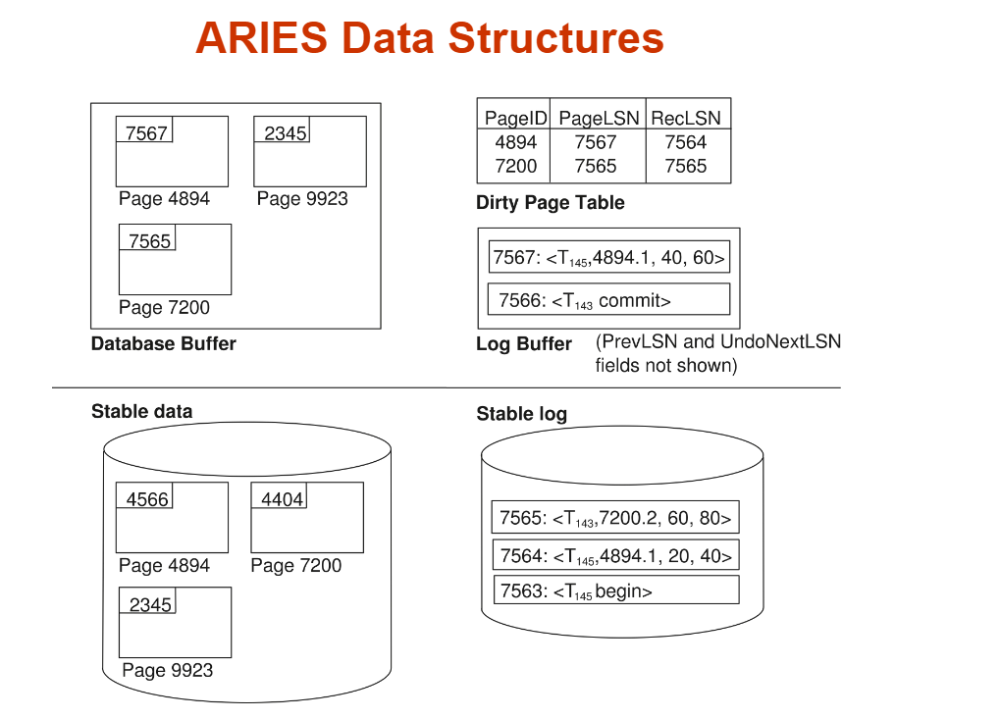

## 10. PPT 10 错误恢复：崩溃后，数据库怎样回到正确世界

这一章以 `第十四章 数据恢复.docx` 为主要讲解来源。PPT 给了 ARIES 三阶段，Word 笔记把 WAL、checkpoint、group commit、fuzzy checkpoint、logical undo、LSN、DPT、ATT、CLR 的做题含义讲得更完整。

先抓住恢复系统的目标：

```text
commit 的事务不能丢。
没 commit 的事务不能残留。
崩溃时内存丢了，磁盘可能只写了一部分，数据库要靠日志恢复。
```

### 10.1 WAL：先写日志，再改数据库

Write-Ahead Logging：

```text
先把“我要怎么改”写进稳定存储里的日志；
再去改真正的数据页。
```

为什么？

```text
如果系统改了一半崩溃，恢复时至少还能从日志知道发生过什么。
```

日志通常被假设在 stable storage 里：

```text
理想上不会因为普通故障丢失。
现实里靠多副本、磁盘冗余等方式近似实现。
```

### 10.2 Redo 和 Undo：一个负责补做，一个负责撤销

Redo：

```text
已经 commit 的事务，如果修改还没完全落到磁盘，就重新做一遍。
```

Undo：

```text
崩溃时还没 commit 的事务，把它已经做过的影响撤掉。
```

一句话：

```text
Redo winners，Undo losers。
```

winners：

```text
崩溃前已经 commit 的事务。
```

losers：

```text
崩溃时仍未 commit 的事务。
```

### 10.3 日志记录：恢复时不是猜，是顺着日志重放

常见日志：

```text
<Ti start>
<Ti, X, old_value, new_value>
<Ti commit>
<Ti abort>
<checkpoint L>
```

`old_value` 用来 Undo：

```text
把 X 恢复成旧值。
```

`new_value` 用来 Redo：

```text
把 X 重新设置成新值。
```

如果 T2 是用户主动 abort：

```text
系统会按日志把 T2 做过的操作撤销；
撤销时还会写补偿日志。
```

如果撤销过程中又崩溃，补偿日志能告诉恢复系统：

```text
这一步 Undo 已经做过了，不要重复搞乱。
```

### 10.4 checkpoint：不用每次从日志开头重来

没有 checkpoint：

```text
恢复要从日志文件开头扫到 crash 点。
```

日志很长时太慢。

checkpoint 的作用：

```text
告诉恢复系统：这里之前很多修改已经安全反映到数据库里了。
```

传统 checkpoint 大致步骤：

```text
1. 把日志记录刷到稳定存储。
2. 把内存中的脏块写回磁盘。
3. 写入 <checkpoint L>，L 是当时活跃事务集合。
```

恢复时：

```text
从最近 checkpoint 附近开始；
先得到当时活跃事务；
再往后扫描到 crash 点，更新 redo/undo 信息。
```

### 10.5 Force / No-force：commit 时要不要立刻刷数据页

force：

```text
事务 commit 时，必须把它改过的数据页立刻写回磁盘。
```

好处：

```text
commit 后不太需要 redo。
```

坏处：

```text
每次 commit 都要等数据页 I/O，慢。
```

no-force：

```text
事务 commit 时，不要求数据页马上写回磁盘。
```

好处：

```text
commit 快，buffer 可以自己决定何时刷页。
```

坏处：

```text
崩溃后，已 commit 事务可能需要 redo。
```

现代数据库通常偏向 no-force，所以恢复算法要能 redo。

### 10.6 Group commit：多个 commit 日志攒一起刷

如果每个事务 commit 都立刻刷一次日志：

```text
I/O 次数很多。
```

Group commit：

```text
把多个 commit 日志攒在 log buffer 中；
一次刷到磁盘；
一起确认 commit。
```

直觉：

```text
不是每个人单独打车，而是凑一车一起走。
```

它减少刷盘次数，但仍要满足 WAL：

```text
commit 返回给用户前，相关日志必须已经到稳定存储。
```

### 10.7 Fuzzy checkpoint：checkpoint 时不让全世界停下来

普通 checkpoint 如果要求事务都停下、脏页都刷完，会很重。

Fuzzy checkpoint：

```text
checkpoint 时记录当前脏页表和活跃事务表；
脏页可以之后慢慢刷。
```

等这些脏页都安全写出后：

```text
这个 checkpoint 才变成成功 checkpoint。
```

磁盘上会有指针指向：

```text
最后一个成功 checkpoint。
```

恢复从那里开始更安全。

### 10.8 物理 Undo 和逻辑 Undo

物理 Undo：

```text
把某个数据项恢复到 old value。
```

例子：

```text
X: 100 -> 150
Undo 时把 X 设回 100。
```

逻辑 Undo：

```text
撤销一个操作，而不是简单恢复旧值。
```

为什么需要逻辑 Undo？

Word 笔记的场景是：

```text
T1 把 C 减 100。
T2 读到 T1 改后的 C，又基于它做了合法提交。
```

如果 T1 abort 时直接把 C 恢复成 T1 前的旧值，可能会抹掉 T2 的合法修改。

所以逻辑 Undo 记录逆操作：

```text
T1 做了 C = C - 100。
Undo T1 时做 C = C + 100。
```

看到这些词要警觉：

```text
operation-end
operation-abort
logical undo
```

它不是普通 old/new value 恢复题。

### 10.9 ARIES 的一句话：重复历史，再撤销失败者

ARIES 的核心口号：

```text
Repeating history during Redo, then Undo losers.
```

也就是：

```text
先把数据库恢复到 crash 前一瞬间的状态；
再把 crash 时没完成的事务撤掉。
```

三阶段：

```text
Analysis：分析 crash 时谁还活着，哪些页是脏的。
Redo：从最早可能没刷盘的位置开始，重复历史。
Undo：撤销 loser transactions。
```

不要跳过 Analysis。2025 review 很喜欢直接问 DPT/ATT/CLR。

### 10.10 LSN、PageLSN、DPT、ATT、CLR

这张 Word 图保留，因为 ARIES 的数据结构靠表格更容易对齐。



核心术语：

```text
LSN：Log Sequence Number，日志编号，越往后越大。
PageLSN：某个数据页已经反映到哪个 LSN。
ATT：Active Transaction Table，活跃事务表。
DPT：Dirty Page Table，脏页表。
CLR：Compensation Log Record，补偿日志记录。
```

ATT 里通常记：

```text
TransID：事务编号。
Status：running / committing / aborting。
LastLSN：这个事务最后一条日志的 LSN。
```

DPT 里通常记：

```text
PageID：页号。
RecLSN：这个页从什么时候开始变脏。
```

RecLSN 是 Redo 起点的关键。

更准确地说：

```text
RecLSN 是让该页进入 dirty 状态的第一条 update 日志。
```

人话：

```text
从 RecLSN 之前，这个页的修改大概率已经安全；
从 RecLSN 开始，这个页可能有没刷盘的修改，所以 Redo 要从最小 RecLSN 看起。
```

CLR 用来记录 Undo 已经做过的事情：

```text
Undo 某条 update 时，写一条 CLR。
CLR 里有 UndoNextLSN，告诉下一个要撤的是哪条日志。
```

### 10.11 Analysis 阶段：从 checkpoint 扫到 crash，重建现场

Analysis 从最近 checkpoint 开始，扫描到 crash。

目标：

```text
1. 得到 crash 时的 ATT。
2. 得到 crash 时的 DPT。
3. 得到 Redo 起点。
```

扫描规则：

```text
遇到事务 update：事务加入/更新 ATT，LastLSN 更新。
遇到某页 update：如果页不在 DPT，加入 DPT，RecLSN 设为这条 update 的 LSN。
遇到 commit：事务状态改为 committing。
遇到 end：事务从 ATT 移除。
```

扫描结束后：

```text
ATT 中还没 end 的事务，就是 loser transactions。
```

Redo 起点：

```text
DPT 中最小的 RecLSN。
```

如果题目问：

```text
Which log record is the first to be redone?
```

第一反应：

```text
找 DPT 里的 min RecLSN。
```

### 10.12 Redo 阶段：不是所有日志都真的重做

Redo 从：

```text
min RecLSN
```

开始向后扫描到 crash。

ARIES 叫 repeating history，所以 winners 和 losers 的历史都先考虑 redo。

但每条日志是否真的 redo，要检查。

对一条更新页 P 的日志，常见跳过条件：

```text
1. P 不在 DPT：跳过。
2. log.LSN < DPT[P].RecLSN：跳过。
3. 磁盘上 P 的 PageLSN >= log.LSN：说明这条修改已经在页上，跳过。
```

否则：

```text
Redo 这条日志，并把页的 PageLSN 更新到 log.LSN。
```

这里最容易错的是：

```text
Redo 阶段不是只 redo committed transactions。
它是先重复历史，之后 Undo losers。
```

### 10.13 Undo 阶段：从 loser 的 LastLSN 往回撤

Undo 输入：

```text
Analysis 后 ATT 里剩下的 loser transactions。
```

起点：

```text
每个 loser 的 LastLSN。
```

ARIES 通常每次选择当前最大的 LSN 往回撤。

撤一条普通 update 时：

```text
1. 执行反向操作。
2. 写一条 CLR。
3. 根据 PrevLSN 或 UndoNextLSN 找这个事务上一条需要撤的日志。
```

撤到事务 start：

```text
写 <Ti abort> / <Ti end>，事务结束。
```

如果遇到 CLR：

```text
不要再 undo CLR 本身；
沿着 CLR 的 UndoNextLSN 继续往前。
```

记忆：

```text
CLR 是“我已经替你撤过这一步了”的路标。
```

### 10.14 一道 ARIES 题怎么下手

不要直接写答案。按三张表走。

第一步，画日志表：

```text
LSN | TransID | PageID | PrevLSN | 操作
```

第二步，Analysis：

```text
从 checkpoint 开始扫。
边扫边更新 ATT 和 DPT。
最后标出 losers 和 min RecLSN。
```

第三步，Redo：

```text
从 min RecLSN 扫到 crash。
逐条用 DPT/PageLSN 判断 redo 或 skip。
```

第四步，Undo：

```text
把 losers 的 LastLSN 放入待撤集合。
每次取最大 LSN 撤。
撤 update 写 CLR。
沿 PrevLSN / UndoNextLSN 继续。
撤到 start 写 end。
```

考场最常见输出：

```text
ATT 是什么？
DPT 是什么？
Redo 从哪条日志开始？
哪些日志会被 redo？
哪些事务是 losers？
Undo 顺序是什么？
会写哪些 CLR？
```

### 10.15 Recovery A4 规则

```text
WAL：先写日志，再改数据库页。
Redo winners，Undo losers；ARIES 先 redo history，再 undo losers。
checkpoint 减少恢复扫描长度。
no-force commit 快，但崩溃后可能需要 redo。
group commit 把多个 commit 日志一起刷盘。
fuzzy checkpoint 记录 ATT/DPT，脏页之后慢慢刷。
逻辑 Undo 撤销操作，不是简单恢复 old value。
LSN 是日志编号；PageLSN 是页已反映到的日志编号。
ATT 记录活跃事务和 LastLSN。
DPT 记录脏页和 RecLSN。
Analysis：重建 ATT/DPT，找 losers 和 min RecLSN。
Redo 从 DPT 最小 RecLSN 开始。
Redo 跳过条件：页不在 DPT；LSN < RecLSN；PageLSN >= LSN。
Undo 从 losers 的 LastLSN 往回撤；每撤一条 update 写 CLR。
CLR 不再被 undo，沿 UndoNextLSN 继续。
```
