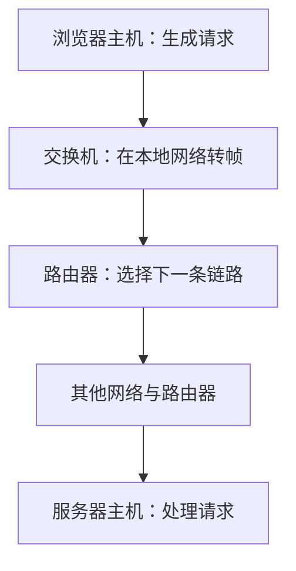
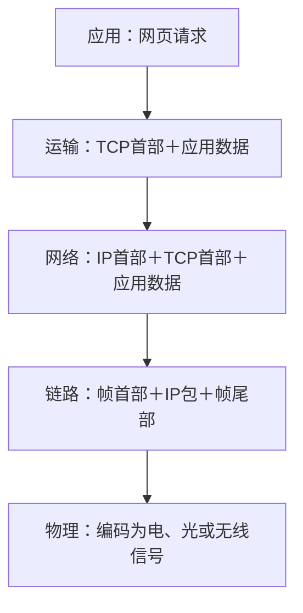

# 概述

本章回答：网页数据经过多台设备，为什么能到达，为什么需要等待？按下面顺序建立整门课的坐标：

1. 认清主机、链路、交换机、路由器。
2. 用五层模型分配通信任务，理解协议与封装。
3. 比较电路交换、报文交换、分组交换。
4. 区分容量、实际速度与四种时延。
5. 从单包时间线推到多包流水线，再计算开销与排队。

## 一次网页访问

浏览器向服务器请求网页，服务器把文字、图片送回来。两端运行程序的设备叫主机或端系统；相邻设备间传送信号的通道叫链路；路由器负责把数据送往下一条链路。一次访问通常要经过多跳。

一次端到端通信由多段相邻节点之间的传输组成。

- 局域网 LAN 覆盖一个相对有限的区域，广域网 WAN 连接较远地区，MAN 表示城域网。
- 这是按覆盖范围分类；
- 有线/无线、公用/专用则是另外的分类维度。
- 互联网是许多网络互联形成的网络。
- 接入网连接用户与运营商网络，骨干网承担大范围汇聚传送；
- 它们描述所在位置和作用。

画网络图时，节点表示设备，边表示连接。若 $n$ 个节点两两用一条无向链路相连，每个节点连接另外 $n-1$ 个节点，每条链路被数两次，故需要 $n(n-1)/2$ 条。

星形网络只连接中心与其他节点，需 $n-1$ 条，代价是更依赖中心。

## 各层分别负责什么

通信必须遵守协议：语法规定消息格式，语义规定字段含义，时序规定发送顺序和时间要求。例如请求中的地址放在哪里属于语法，收到错误码如何处理属于语义，等待多久重试涉及时序。

把全部通信工作分层，就能单独更换某一部分。浏览器使用下层提供的传输服务，只要服务接口不变，换网卡通常无需改浏览器。

| 教学五层 | 要解决的问题 | 数据单位 |
|---|---|---|
| 应用层 | 请求什么服务、交换什么内容 | 报文 |
| 运输层 | 数据交给主机里的哪个程序，是否需要可靠传输 | TCP 报文段、UDP 数据报 |
| 网络层 | 跨越多个网络，下一跳去哪里 | IP 数据报/分组 |
| 数据链路层 | 在当前链路上交给谁、怎样识别一帧 | 帧 |
| 物理层 | 怎样用电、光、无线信号传比特 | 比特 |

OSI 七层在运输层上还有会话、表示、应用三层；会话层组织对话，表示层处理数据表示，应用层服务应用。

TCP/IP 四层把教学模型的物理层与链路层合称网络接口层，上面依次为网际、运输、应用。答题时先认清指定模型。

- 同层双方按**协议**通信；
- 某层向上层提供**服务**；
- 本机相邻层通过**接口**使用服务。
- 对等通信是逻辑关系，数据实际仍沿本机各层下降、经过线路、在对方各层上升。
- LISTEN、CONNECT、SEND、RECEIVE 等服务原语描述本机请求下层做什么，不必与线上消息一一对应。

- 发送端逐层添加控制信息，称为封装。
- 例如应用数据加 TCP 首部，再加 IP 首部，最后加帧首尾。
- 接收端反向解析，称为解封装。
- 某层的载荷包含上层的数据及其首部。
- 普通二层交换机主要看帧地址；
- 路由器看 IP 地址选路，再为下一条链路重新封装帧；
- 端系统最终处理应用内容。

**首部**是放在数据前面的控制字段，**载荷**是本层承载的内容。层次变了，载荷范围也变了：IP 的载荷包括 TCP 首部和应用数据。下面是发送端的封装过程；接收端沿反方向解析。

记忆分工时只问五个问题：应用传什么，运输交给哪个程序，网络送往哪个地址，链路下一站交给谁，物理怎样传信号。具体协议放到后续章节展开。

## 数据怎样共享链路

电路交换先建立连接并预留资源，通信结束再释放。分得一个固定时隙的用户即使不说话，时隙也可能空着。它适合需要稳定资源的通信，但存在建立时间和空闲浪费。

报文交换以整个消息为单位存储转发：中间设备收齐整份消息后再发送。分组交换把消息切成小块，各组带控制信息，收齐一组就可转发。

小分组能够在不同链路上同时前进，形成流水线，也避免一份长消息一直占据出口。

- 分组按需竞争出口称为统计复用。
- 空闲用户不占固定份额，突发流量可以更充分利用链路；
- 同时到来的分组仍需排队，缓冲区满会丢包。
- 数据报方式让分组独立转发；
- 虚电路方式先建立逻辑路径，再用标识沿路径转发。
- 虚电路并不自动预留整条电路的带宽。

“面向连接”描述通信前是否建立状态；“可靠”描述是否提供差错恢复、按序等保证。两者要分别判断，不能只凭是否建立连接推断可靠性。

## 两种速度与四种时间

比特 bit 只有 0、1，字节 Byte 含 8 bit。网络速率通常按十进制：$1\text{ Mb/s}=10^6\text{ bit/s}$。所以 $2\text{ MB/s}=16\text{ Mb/s}$。容量题若明确使用 1024 进制，则依题意换算。

| 指标 | 含义 |
| --- | --- |
| 带宽 | 在速率语境中指链路容量； |
| 吞吐量 | 是单位时间实际成功传送的数据量； |
| 有效吞吐量 | 只计算有用应用数据。 |

- 串联 100、20、50 Mb/s 链路，在没有其他限制时，持续吞吐量最多为瓶颈的 20 Mb/s。
- 时延描述一份数据要等多久，高吞吐量和低时延是不同指标。

设分组长 $L$ bit，速率 $R$ bit/s，距离 $d$ m，信号传播速度 $v$ m/s：

$$t_{\mathrm{发送}}=L/R,\qquad t_{\mathrm{传播}}=d/v.$$

发送是把比特逐个放进线路，传播是信号在介质中前进。处理时延用于检查和选路，排队时延用于等待出口空闲；一次转发的总时延由这四项组成。

!!! example "例子与推演"

    - **情境**
        - 例如 1500 B 分组经过 12 Mb/s、长 400 km 的链路，传播速度为 $2\times10^8$ m/s。
    - **逐步分析**
        - 发送时间为 $1500\times8/(12\times10^6)=1$ ms；传播时间为 $400000/(2\times10^8)=2$ ms。
        - 忽略处理排队，第一比特在约 2 ms 到，最后比特在 3 ms 到。
        - 速率加倍使发送时间减半，距离不变时传播时间保持 2 ms。

往返时间 RTT 是一次往返所需时间，题目若已给 RTT，不能再乘 2。

时延带宽积 $R\times t_{\mathrm{传播}}$ 表示一条满载链路中约有多少比特同时在传播；若采用 RTT 作时间，表示维持往返流水线可能需要的在途数据规模。

这个乘积可以直接用单位理解：$(\text{bit/s})\times\text{s}=\text{bit}$。上例链路的时延带宽积为 $12\times10^6\times0.002=24000$ bit，即 3000 B。这些比特同时分布在线路不同位置。

它描述在途容量；一个 1500 B 包能否进入线路，并不要求它大于这个容量。

### 练习 1

!!! question "题目"

    【自编】一条链路的距离、介质、分组长度均不变，
    只把速率从10 Mb/s提高到20 Mb/s。
    忽略处理和排队，下列哪项正确？

    - A. 发送时延减半，传播时延不变
    - B. 发送时延不变，传播时延减半
    - C. 发送和传播时延都减半
    - D. 发送和传播时延都不变

!!! success "参考解答"

    **答案：A。** 发送时延为长度除以速率，因速率翻倍而减半；传播时延为距离除以传播速度，条件未变。

### 练习 2

!!! question "题目"

    【自编】主机更换网卡，但保持上层服务接口和功能不变。
    浏览器代码无需改变，最直接体现什么？

    - A. 分层让对等应用直接绕过物理链路
    - B. 分层让上层可通过接口使用下层服务
    - C. 分层让每个网络分组完全没有首部
    - D. 分层让所有中间设备只处理应用数据

!!! success "参考解答"

    **答案：B。** 接口隔离部分下层实现变化；对等通信仍经过下层，封装开销仍存在，
    中间设备也不因此处理应用数据。

## 多跳怎样画时间线

存储转发要求收到完整分组后才能向下一跳发送。一个分组经过 $H$ 条相同速率链路，忽略处理排队，每条传播时间为 $p$，发送时间为 $s=L/R$，完整到达时间是 $H(s+p)$。

连续发送 $N$ 个等长分组时，第一个分组仍需上述时间，之后每隔 $s$ 到达一个，因此末组到达时间为

$$T=(H+N-1)L/R+Hp.$$

!!! example "例子与推演"

    例如 4 个分组经过 3 条链路，每条发送 1 ms、传播 2 ms。首组 9 ms 完整到达，随后是 10、11、12 ms。不能把 9 ms 乘 4，因为不同链路可以同时发送不同分组。

遇到不等速链路或不同长度分组，就逐组画时间线。每一跳的开始发送时刻取“本组已完整到达”和“出口发送完上一组”两者的较晚值，再加本跳发送与传播时间。这一规则比记更多特殊公式可靠。

把这一规则写成三个可执行步骤，设本跳发送时间为 $s$、传播时间为 $p$：

$$\begin{aligned}
t_{\mathrm{开始}}&=\max(t_{\mathrm{本组收齐}},t_{\mathrm{上组发完}}),\\
t_{\mathrm{发完}}&=t_{\mathrm{开始}}+s,\\
t_{\mathrm{下站收齐}}&=t_{\mathrm{发完}}+p.
\end{aligned}$$

$\max$ 表示取较大值：数据到齐和出口空闲两个条件都满足，才能开始。

!!! example "例子与推演"

    例如第一跳发送 1 ms、第二跳发送 3 ms，两跳传播各 2 ms，连续发送三个包：

    | 包 | 中间路由器收齐 | 第二跳开始 | 第二跳发完 | 终点收齐 |
    |---|---:|---:|---:|---:|
    | 1 | 3 ms | 3 ms | 6 ms | 8 ms |
    | 2 | 4 ms | 6 ms | 9 ms | 11 ms |
    | 3 | 5 ms | 9 ms | 12 ms | 14 ms |

    包 2 等了 $6-4=2$ ms，包 3 等了 $9-5=4$ ms。最后一个比特离开发送端后，发送端就可以发下一个包；它不需要等上一个包到达终点。因此流水线能够重叠传播时间。

### 练习 3

!!! question "题目"

    【自编】3个等长分组连续经过2条存储转发链路。每组1000 B，两条链路均为8 Mb/s，每条传播时延2 ms；忽略其他开销。

    - ① 第一个与第三个分组何时完整到达？
    - ② 同学把单组时延乘3，错在哪里？

!!! success "参考解答"

    **解答**

    - 每条发送时间为1000×8/(8×10⁶)=1 ms。
    - 第一个完整到达：2×(1+2)=6 ms。
    - 第三个完整到达：(2+3−1)×1+2×2=8 ms。
    - 不同链路可同时处理不同分组；
    - 乘3得到18 ms，重复累加了本可重叠的流水线时间。

    **判分要点**

    - 1分：Byte转bit并得1 ms。
    - 1分：首组6 ms，末组8 ms，单位正确。
    - 1分：指出不同链路可并行，非同链路重叠发送。
    - 公式或逐事件时间线均可。

## 开销与排队怎么算

若每帧载荷 $P$ B、首尾开销 $O$ B，无空隙和重传，链路满载时有效速率为 $R\times P/(P+O)$。

例如 10 Mb/s 链路传 800 B 载荷加 200 B 开销，有效率为 8 Mb/s。

有帧间隔、前导码、重传时，这些还要算入占用时间；不能只扣 IP 首部就称作应用有效速率。

设平均到达率为 $\lambda$ 帧/s，每帧服务时间为 $s$ 秒，利用率 $\rho=\lambda s$。稳定队列通常要求长期输入不超过处理能力，但平均负载较小仍可能因突发而排队。

只给利用率，通常不足以唯一计算排队时延，还需要到达与服务模型。

稳定长期观察中，Little 定律为 $\bar N=\lambda\bar T$：平均系统内帧数等于平均到达率乘平均逗留时间。若只算等待队列，则使用排队时间，不含服务时间。

例如每秒到 400 帧、平均逗留 5 ms，系统平均 2 帧；其中服务时间 1 ms，则排队平均 $400\times0.004=1.6$ 帧。平均值允许不是整数。

### 练习 4

!!! question "题目"

    【自编】链路持续满载，线路速率12 Mb/s。每帧载荷900 B，首尾共100 B；无重传或空隙。另一次稳定队列观察：到达率600帧/s，平均总逗留时间5 ms，单帧服务时间1 ms。

    - ① 求满载有效数据率。
    - ② 求平均系统帧数与平均排队帧数。
    - ③ “平均输入低于容量，所以从不排队”错在哪？

!!! success "参考解答"

    **解答**

    - 满载有效率为12×900/1000=10.8 Mb/s。
    - 平均系统帧数600×0.005=3帧。
    - 平均排队时间5−1=4 ms，排队帧数2.4。
    - 系统数包含服务中帧，不能都当排队数。
    - 平均负载低仍可有突发到达并产生等待。

    **判分要点**

    - 有效比例分母包含100 B开销，得10.8 Mb/s。
    - Little定律使用秒，得到3与2.4两个均值。
    - 平均帧数可非整数；
    - 指出突发性与统计边界。

## 记忆要点

!!! tip "本章记忆要点"

    - 分层分任务：应用内容、程序端点、跨网寻址、本跳交付、信号传输。
    - 协议约束对等层，服务向上提供能力，接口是本机使用能力的入口。
    - 发送看包长与速率 $L/R$，传播看距离与介质 $d/v$；处理和排队另计。
    - 多包题先画首包，再看流水线；不等速时逐跳取两个就绪时刻的较大值。
    - 吞吐量受瓶颈约束，有效速率还要扣开销；高容量不会自动消除传播时延。
    - 排队取决于到达和服务过程；Little 定律使用相同统计边界与稳定长期平均。

下一章：[物理层](02-cn-physical.md)。返回：[课程路线](index.md)。

