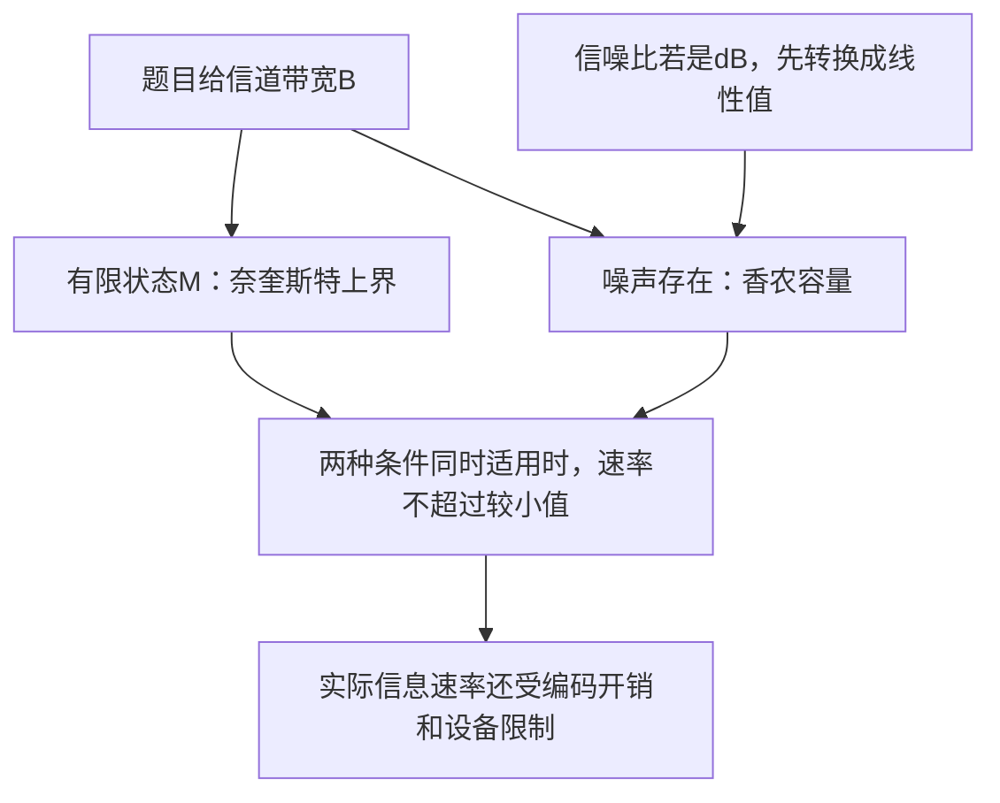
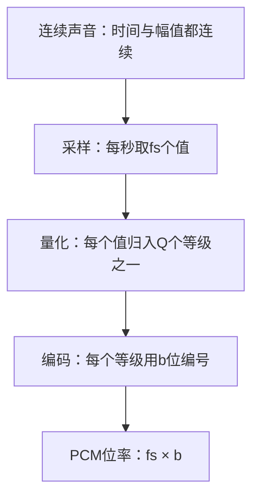

# 物理层

本章回答：0、1 怎样变成可传输的信号，信道为何有速率上限？学习顺序：

1. 区分数据、信号与传输方向。
2. 用“状态数×每秒次数”理解码元和比特率。
3. 在明确条件下使用奈奎斯特与香农公式。
4. 逐位画编码，再理解载波调制与介质。
5. 按采样→量化→编码计算声音码率。
6. 按频率、时间或码序列区分复用方式。

## 从比特到信号

网线里传播电信号，光纤里传播光，无线链路传播电磁波。物理层要让接收端从这些信号中恢复比特，因此既要约定“哪种信号代表什么”，也要约定接头、引脚、电平和发送顺序。接口的机械特性描述外形，电气特性描述电压等，功能特性描述各引脚作用，规程特性描述操作顺序。

数字数据可以用连续变化的载波传送；模拟声音也可以先数字化。数据与信号是两个观察对象，不能看到无线电就认定承载的是模拟数据。

单工只允许一个方向；半双工允许双向但不能同时进行；全双工允许同时双向。发送与接收还必须对齐时间：若每位持续 1 ms，接收方需要知道在哪些时刻判决电平。异步传输可用起止位重新同步，同步传输通过时钟或连续帧结构保持同步。

## 码元承载多少比特

一个码元是持续一定时间、供接收端判别的一种信号状态。每秒发送多少码元叫码元速率，单位 baud；每秒携带多少 bit 叫比特率。若可可靠区分 $M$ 种状态，每码元能表示 $\log_2M$ bit，码元速率 $R_s$ 对应

先理解 $\log_2$：它问“2 的几次方等于这个数”。例如 $2^3=8$，故 $\log_2 8=3$。三个二进制位能写出 000—111 共八种组合；八个信号状态分别承载这八种组合，才得到每码元 3 bit。课堂通常使用 $M=2^k$ 的等概率状态模型。

$$R_b=R_s\log_2M.$$

例如 2000 baud、四种状态，每个状态可对应 00、01、10、11，因此原始比特率为 4000 bit/s。改成八种状态，每码元 3 bit，速率成为 6000 bit/s。只有状态可分辨且没有编码冗余时，才可直接把它作为数据位率；若编码率为 $k/n$，每 $n$ 个线路位只包含 $k$ 个信息位，有效位率还需乘 $k/n$。

频率 $f$ 表示每秒振动次数，单位 Hz；周期为 $1/f$。物理信道的带宽 $B$ 表示允许通过的频率范围宽度，也用 Hz。它与 bit/s 量纲不同，必须经过信道和调制条件才能建立关系。

实际信道会衰减信号，不同频率的衰减和传播时间可能不同，造成波形失真；噪声又会扰动判决。相邻码元的波形拖尾互相干扰称为码间串扰。提高状态数量可以让每码元带更多 bit，同时也让状态之间更难区分。

### 练习 1

【自编】发送设备从四状态改成八状态，
码元速率仍为2000 baud，无编码冗余，
且所有状态仍可可靠区分。哪项正确？

- A. 原始比特率从4000升为8000 bit/s
- B. 原始比特率不变，仍为4000 bit/s
- C. 原始比特率从4000升为6000 bit/s
- D. 原始比特率不变，仍为2000 bit/s

**答案：C。** 四状态每码元2 bit，八状态每码元3 bit；
2000×3=6000 bit/s，码元率没有翻倍。

## 速率上限的条件

在课堂理想带限低通信道模型中，奈奎斯特公式给出无噪声条件下的上界：

$$R_b\le 2B\log_2M.$$

$B$ 是 Hz 带宽，$M$ 是信号状态数。它体现带宽限制码元变化速度。含噪声时，还受香农容量限制：

$$C=B\log_2(1+S/N).$$

$S/N$ 是信号功率与噪声功率的**线性比值**；若题目给分贝，先用 $S/N=10^{\mathrm{SNR}_{dB}/10}$ 转换。30 dB 对应 1000，不能把 30 直接代进对数。

例如 $B=3000$ Hz、$M=4$、线性信噪比为 15，两个上界都是 12000 bit/s。把状态数改为 8 后，奈奎斯特项增至 18000，但香农项仍为 12000，传输仍须同时满足两个限制。上界也不意味着现实设备一定能达到它。

两条公式分别限制不同环节：带宽有限时，信号变化过快会让相邻码元难以区分；噪声存在时，把信号状态分得更细也会增加判错风险。

上例的计算顺序是：$\log_2 4=2$，所以奈奎斯特项 $2\times3000\times2=12000$；$1+15=16$，$\log_2 16=4$，所以香农项 $3000\times4=12000$。若题目改给 15 dB，则应先算 $10^{1.5}\approx31.62$，不再是线性值 15。

香农公式这里采用带宽 $B$、信号功率 $S$、加性白高斯噪声功率 $N$ 的模型；它给理论容量。奈奎斯特式采用理想无噪声低通信道、有限可区分状态的课堂模型。不能只看到同一个字母 $B$，就把所有介质无条件代入。

### 练习 2

【自编】采用课堂带限低通信道模型：
带宽3000 Hz，线性信噪比为15，四状态。
① 分别计算奈奎斯特与香农上界。
② 改为八状态后，能否据此宣称达到18 kb/s？

**解答**

奈奎斯特：2×3000×log₂4=12000 bit/s。
香农：3000×log₂(1+15)=12000 bit/s。
八状态时奈奎斯特项变18000 bit/s，
但香农仍是12000 bit/s，所以不能宣称18 kb/s。
两个上界都需满足；上界也不是实际可达保证。

**判分要点**

1分：区分线性15与15 dB，不再转换。
1分：两个初始结果均为12 kb/s。
1分：改制后受12 kb/s约束，说明必要上界。

## 常见编码如何读

基带编码直接用电平或跳变表示数据。下面采用一套明确约定；遇到题目给相反约定时依题意画。

| 编码 | 规则 | 同步特点 |
|---|---|---|
| NRZ | 1 高、0 低，每位维持电平 | 连续相同位没有跳变 |
| NRZI | 遇 1 在位首翻转，遇 0 保持 | 连续 0 缺少跳变 |
| Manchester | 1 为低→高，0 为高→低 | 每位中间有跳变，占用更多信号变化带宽 |
| 差分 Manchester | 每位中间跳变；此处约定位首有跳变表示 0 | 由相对变化判位，需记录前一状态 |
| AMI | 0 用零电平，1 交替用正、负电平 | 抑制直流，长 0 仍有同步问题 |

画 NRZI 时从给定初始电平逐位更新。假设初始低，数据 11010：第一个 1 翻成高，第二个 1 翻成低，0 保持低，1 翻成高，0 保持高，结果为高、低、低、高、高。AMI 同一数据则可为正、负、零、正、零。Manchester 每位写一对半位电平，不能把位间跳变也当成新数据。

编码时每一列代表一位持续的时间。“翻转”表示高变低、低变高；NRZI 需要沿用上一列末尾的电平。按本节约定，11010 的完整记录为：

| 第几位 | 数据 | NRZI 位首动作 | 本位电平 | Manchester 前半／后半 | AMI |
|---|---:|---|---|---|---|
| 1 | 1 | 初始低→高 | 高 | 低／高 | 正 |
| 2 | 1 | 高→低 | 低 | 低／高 | 负 |
| 3 | 0 | 保持低 | 低 | 高／低 | 零 |
| 4 | 1 | 低→高 | 高 | 低／高 | 正 |
| 5 | 0 | 保持高 | 高 | 高／低 | 零 |

Manchester 的位中跳变兼有数据表示和同步作用。差分 Manchester 每位中间都跳变，再根据位首是否跳变解释数据；画图时先按规则处理位首，再画位中，最后把末电平带到下一位。

4B/5B 用 5 位码组表示 4 位数据，选择有利于同步的码字，有效比例为 $4/5$。它常与线路编码配合；“增加冗余位”本身不等于能够纠正任意错误。

### 练习 3

【自编】数据10110。采用下列明确约定：
NRZI初始低；位首遇1翻转，遇0保持。
Manchester：1为低→高，0为高→低。
AMI初始第一个1为正，后续1正负交替。
① 分别写五位的NRZI电平与Manchester半位对。
② 写AMI电平，说明长串0的同步风险。

**解答**

NRZI五位为高、高、低、高、高。
Manchester半位对：低高、高低、低高、低高、高低。
AMI为正、零、负、正、零。
AMI长串0维持零电平、缺少跳变，时钟恢复困难；
不能说“正负交替就让所有数据都有足够跳变”。

**判分要点**

逐位使用前一电平更新NRZI，初始条件明确。
Manchester每位中间跳变，按给定方向编码。
AMI只在1出现时交替，解释长0边界。

## 调制与传输介质

当信道适合传某个频段的信号时，可以改变载波来承载数据：ASK 改幅度，FSK 改频率，PSK 改相位；QAM 同时利用幅度和相位。星座图上每个点是一种信号状态，16-QAM 每码元带 4 bit。相同平均功率下，点更密通常需要更好的信噪比。

铜线成本低，受衰减和电磁干扰影响；双绞通过绞合减小干扰。光纤带宽高、长距离衰减小且不受普通电磁干扰，单模减少多路径色散，适合更长距离；多模容许多种传播模式。无线支持移动，但信道共享、遮挡、干扰和多径都影响质量。

更换介质不会使传播时间消失。若地面到卫星为 36000 km，一次“地面甲→卫星→地面乙”路径约 72000 km，按 $3\times10^8$ m/s 算是 240 ms；沿同样路径回复的传播往返约 480 ms。先数题目实际经过几段，再代距离，不能看到“卫星”就固定乘某个次数。

## 声音如何数字化

PCM（脉冲编码调制）分成采样、量化、编码。采样每隔一段时间取一个幅值；量化把幅值归入有限等级；编码给每个等级编二进制编号。对于理想限带、最高频率为 $f_{\max}$ 的信号，一般重建保证使用 $f_s>2f_{\max}$；课堂计算题常把 $2f_{\max}$ 当作奈奎斯特临界速率。恰在等号处可能受边界频率和相位影响，例如只采到正弦波的零点；实际设计保留余量，并在采样前用抗混叠滤波限制频率。

采样决定何时取值，量化决定保留多少幅值精度，编码给等级编号。

若有 $Q=2^b$ 个量化等级，每个样本用 $b$ bit，PCM 位率为 $f_sb$。注意：这里的采样定理针对模拟信号的采样，上面的奈奎斯特速率公式针对数字通信信道，不可混用字母和对象。

例如幅度范围为 $[-1,1]$ V，分成 8 个等宽区间，区间宽 $\Delta=2/8=0.25$ V。用区间中点重建时，样本 0.30 V 落入 $[0.25,0.50)$，重建为 0.375 V，重建减真实值的误差为 0.075 V。无过载时最大绝对误差不超过 $\Delta/2$。提高采样率不能直接消除幅值量化误差，提高量化位数也不能修复已发生的混叠。

8000 sample/s、每样本 8 bit 的语音需要 64 kb/s。sample/s、bit/sample 和 bit/s 三种单位写出来，乘法关系就清楚了。

## 多人如何共用线路

频分复用 FDM 把频谱分成不同频段，通常留保护带；时分复用 TDM 把时间分成周期性时隙；波分复用 WDM 在光纤上使用不同波长，本质类似频分。同步 TDM 每轮固定给各路时隙，空闲用户的时隙不自动转让；统计 TDM 按实际需求分配，但需标识数据归属并考虑排队。

例如 4 路各 8 kb/s，每帧从每路取 1 bit，再加 1 个同步位。每路每秒需取 8000 次，因此帧率为 8000 帧/s，每帧 5 bit，线路位率为 40 kb/s，有效总位率为 32 kb/s。若每帧取的是一个 8 bit 样本，就要按样本数求帧率，不能仍把每个样本当成 1 bit。

码分复用 CDM 给各用户分配码片序列。设甲码为 $(1,1)$、乙码为 $(1,-1)$，两码点积为 0，称为正交。用户以码发送 1，以负码发送另一二元符号；接收叠加信号与甲码求点积再除码长，便可恢复甲的符号。例如甲发 $+1$、乙发 $-1$，叠加为 $(0,2)$；与甲码点积除 2 得 1，与乙码点积除 2 得 $-1$。理想同步、功率控制和正交条件是这种简单恢复成立的前提。

OFDM 把高速数据分到许多正交子载波，各子载波可采用 QAM 等调制。正交关系允许频谱重叠仍可分离；循环前缀用来减轻适当范围内的多径影响，但会占时间。若有效符号长 80 μs、前缀 20 μs，有效时间比例为 $80/100=0.8$，计算位率要扣此开销。

### 练习 4

【自编】3路各8 kb/s，等时隙同步TDM。
每帧每路取1 bit，另加1 bit同步位。
① 求帧率、总线路位率和有效数据率。
② 一路暂时无数据，固定分配不变时会怎样？

**解答**

每路每秒要8000个时隙，故帧率8000帧/s。
每帧3个数据位加1个同步位，共4 bit。
总线路位率32000 bit/s，有效数据率24000 bit/s。
一路无数据，其固定时隙仍占用；
若另两路保持8 kb/s，有用数据率降为16000 bit/s，
总线路位率仍为32000 bit/s。

**判分要点**

1分：帧率8000帧/s，非24000帧/s。
1分：区分32 kb/s线路位率与24 kb/s有效率。
1分：固定时隙不会自动转让，空闲后有效率16 kb/s。

## 接入方式放回路径

DSL 利用铜线不同频段提供数据接入；FTTH 把光纤延伸到用户，PON 通过无源分光连接多个用户，上行要协调共享时隙。蜂窝系统把地域划小区，通过基站接入，用户移动时需要切换。接入速率较高不保证目标服务器或骨干路径也同样快。

经典 T1 是另一种同步复用算例：每 125 μs 一帧，每帧 24 路各 8 bit 加 1 个帧位，共 193 bit，故位率为 $193\times8000=1.544$ Mb/s。无论名称是什么，统一从“每帧多少 bit × 每秒多少帧”开始。

### 练习 5

【自编】语音已理想限带至3 kHz，以8 ksample/s采样。
均匀量化范围`[−1,1]` V，共16级，取区间中点。
区间左闭右开，最大值1 V特别归最后区间。
① 样本0.20 V落在哪个区间？重建值和误差？
② 求每路PCM码率；两路同步TDM每帧
各取一个完整样本，另加1同步位，求线路位率。
③ 改走光纤能否消除已有量化误差？

**解答**

区间宽度2/16=0.125 V。
0.20落在[0.125,0.25)，中点0.1875 V。
误差按重建减原值，为−0.0125 V。
每样本4 bit，每路8000×4=32 kb/s。
每帧4+4+1=9 bit，帧率8000帧/s；
线路位率72 kb/s，有效总码率64 kb/s。
光纤不能恢复在量化阶段已丢失的幅值信息。

**判分要点**

明确区间、中点、误差符号；不把0.20直接舍入整数。
区分4 bit/sample、8000帧/s和72 kb/s。
介质改善传输不等于消除量化损失。

## 记忆要点

- 码元是一次可判别的信号状态；baud 数次数，bit/s 数信息位。
- $R_b=R_s\log_2M$；先确认状态可区分，信息速率再扣编码冗余。
- 奈奎斯特看带宽和状态数，香农看带宽和线性信噪比；dB 先转换。
- 编码逐位跟踪初始电平；Manchester 每位分两半，AMI 只在 1 出现时交替。
- PCM 位率等于样本数每秒乘位数每样本；混叠和量化误差来自不同阶段。
- TDM 统一算每帧位数乘帧率；空闲固定时隙仍会占用线路。

上一章：[概述](01-cn-overview.md)。下一章：[数据链路层](03-cn-data-link.md)。返回：[课程路线](index.md)。
