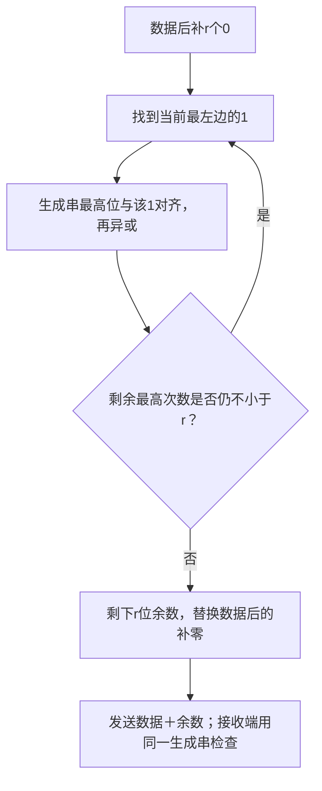
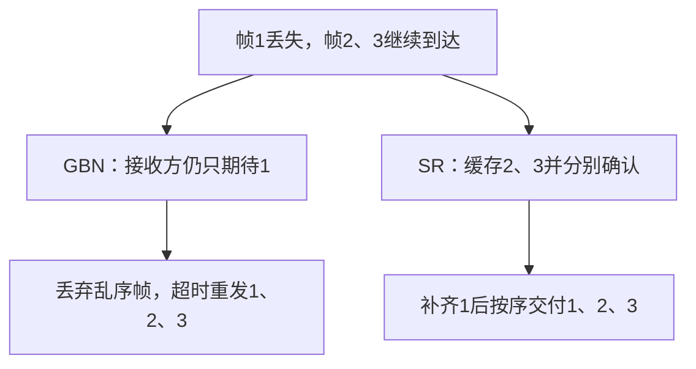
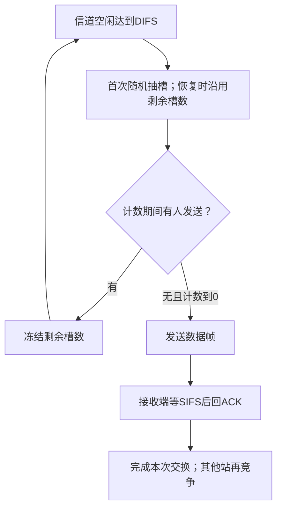

# 数据链路层

<div class="course-notes" markdown>

本章回答：一段链路上的比特，怎样形成边界清楚、能够检查和交付的帧？学习顺序：

1. 用边界和填充规则完成成帧。
2. 分开检错、纠错与重传，手算一次 CRC。
3. 从停止等待推到滑动窗口，再比较 GBN 与 SR。
4. 理解共享有线／无线信道的竞争过程。
5. 跟踪交换机学习、生成树去环与 VLAN 隔离。

## 比特怎样组成一帧

物理层交来连续比特，链路层需要判断“这一段从哪里开始、在哪里结束、交给谁”。它把数据组织成帧，添加地址、类型和检错等控制信息。同一网络层分组经过不同链路时，可以被装进不同格式的帧。

成帧可用长度字段或特殊边界标志。若数据恰好包含标志，就要转义，使任意数据仍可传输，这叫透明传输。

字节填充在特殊字节前插入转义字节；比特填充常约定发送端在连续五个 1 后插入 0，接收端去掉这个 0。标志 01111110 因而不会直接出现在经过填充的载荷里。

填充改变线路长度，去填充后应恢复原数据。

!!! example "例子与推演"

    例如数据 `01111110` 内含六个连续的 1。发送端数到第五个 1 就插入 0，变成 `011111010`；接收端按同样计数规则删除插入的 0，恢复原串。

    真正的帧边界标志保持原样，不对标志本身做这一填充。


## 发现差错与恢复差错

检错判断收到的码字是否符合规则，纠错还要确定原来的数据。两个等长码字不同的位数称为汉明距离。

若有效码字间最小距离为 $d_{\min}$，保证检测 $s$ 位差错需要 $d_{\min}\ge s+1$；保证纠正 $t$ 位差错需要 $d_{\min}\ge2t+1$。

- 奇偶校验增加一位，使 1 的总数满足偶数或奇数规则；
- 偶数个位翻转可能漏检。
- 海明单错纠正码把校验位放在位置 1、2、4、8 等，分别检查位置编号二进制中对应位为 1 的位置；
- 检查结果组成出错位置编号。
- 例如 7 位码中，检查位 1 与 4 不满足偶校验、位 2 满足，综合征为二进制 101，指向第 5 位。
- 它依赖单错模型，不能把多位差错都按单错纠正。

互联网校验和将数据分成固定宽度字，按反码加法求和，高位进位回卷到低位，再取反。它和下面 CRC 的异或除法不同，做题先确认算法。

CRC 把比特串看成二进制多项式。生成串最高次数为 $r$，就在数据后补 $r$ 个 0，用生成串做模 2 除法，得到 $r$ 位余数，再用余数替换补零。模 2 减法就是按位异或，无借位。

CRC 是循环冗余校验。这里的“多项式”只是比特位置的另一种写法：`1011` 表示 $x^3+x+1$，最高次数为 3，故需要 3 位校验余数。

异或 XOR 按对应位计算：相同为 0，不同为 1；例如 `1101 XOR 1011 = 0110`。



以数据 1101、生成串 1011 为例，$r=3$：

```text
1101000 XOR 1011000 = 0110000
0110000 XOR 0101100 = 0011100
0011100 XOR 0010110 = 0001010
0001010 XOR 0001011 = 0000001
```

余数 001，发送 1101001。接收方除以同一生成串；余数非零说明检出差错，余数为零仅表示通过检查。若错误多项式刚好是生成多项式的倍数，也可能漏检。

CRC 本身不负责重传，更不能用于抵抗有意篡改。

每步为什么这样对齐？第一行最左的 1 位于第 1 位，生成串向右补零后与它对齐；第二行最左的 1 在第 2 位，生成串右移一位。

异或会消去当前最高位，直到剩余值只能占最后 3 位。即使余数实际只有一个 1，也要补足为 `001`，保持校验字段宽度。


### 练习 1

!!! question "题目"

    【自编】数据1011，CRC生成串1101。

    - ① 给出补零串、模2除法余数及发送码字。
    - ② 收到码字除以1101余数为0，能否断言无错？


!!! success "参考解答"

    **解答**

    - 生成串最高次数3，先补3个0：1011000。
    - 模2步骤：1011000异或1101000=0110000；
    - 再异或0110100=0000100，余数100。
    - 发送1011100，它除以1101的余数为000。
    - 余数0只能说未检出错误；
    - 错误多项式若是生成多项式的倍数，仍可能通过。

    **判分要点**

    - 1分：补3位而非4位，用异或不借位。
    - 1分：余数100，码字1011100。
    - 1分：零余数非无错证明，指出漏检条件。

## 确认与重传

停止等待协议每发送一帧就等确认 ACK；到时未收到确认则重传。ACK 可能丢失，因此“超时”不能证明数据未到。

接收方用序号识别重复帧：重复帧可以重新确认，但不能再次交付上层。最简单情况下用 0、1 交替编号。

设数据帧发送时间 $s=L/R$，单向传播时间 $p$，忽略 ACK 发送和处理。发一帧到确认回来需 $s+2p$，停止等待的链路利用率为 $s/(s+2p)$。长距离链路上的等待会很明显。

滑动窗口允许最多 $W$ 帧尚未确认，使后面的帧在前面确认返回之前出发。无差错、相同帧长等简化条件下，利用率为 $\min(1,Ws/(s+2p))$。满载所需窗口至少为 $\lceil(s+2p)/s\rceil$。这是时间条件，还必须满足序号空间约束。

| 协议 | 接收乱序帧 | 确认与重传 | $m$ 位序号的标准约束 |
|---|---|---|---|
| GBN 后退 N 帧 | 丢弃，接收窗口 1 | 累计确认；超时从缺口重传已发未确认帧 | 发送窗口最多 $2^m-1$ |
| SR 选择重传 | 缓存接收窗口内帧 | 分别确认，重传未确认帧 | 等大收发窗口最多 $2^{m-1}$ |

SR 需要区分上一轮迟到的旧帧和这一轮新帧，因此收发窗口不能把序号空间占满。GBN 的 ACK 有时表示“已连续收到的最后一帧”，有时表示“下一帧”，必须跟题目约定。

- **窗口**是当前允许发送或接收的一段序号范围；
- 确认推进后，范围向前移动。
- $m$ 位编号只有 $2^m$ 个值，最后一个编号后会回到 0。
- 以 SR 的 3 位序号为例，编号为 0—7。
- 若收发窗口都为 5，接收方收到 0—4 后，新接收窗口为 5、6、7、0、1；
- 此时旧帧 0 的重传可能被当成新帧 0。
- 让两窗口之和不超过序号空间，才能在标准条件下避免这种交叠。

利用率公式也来自时间线。停止等待一次占用发送时间 $s$，之后仍要等约 $2p$ 传播才有下一次机会，所以有效发送比例为 $s/(s+2p)$。

窗口为 $W$ 时，一个确认周期最多填入 $Ws$ 的发送时间；它超过周期也只能达到利用率 1，故取 $\min(1,Ws/(s+2p))$。ACK 的发送时间和处理时间若不可忽略，要加入周期分母。

“满载窗口”同时受两种约束：时间上要足够大，序号上又不能过大。例如 $s=1$ ms、$p=4$ ms，需要至少 9 帧才能不断流；3 位 SR 只允许等窗口最大 4 帧，因此该序号配置无法满载。

!!! example "例子与推演"

    - 例如发出 0、1、2、3，1 丢失，GBN 收到 0 后只期待 1，随后 2、3 都丢弃；
    - 若 ACK 表示下一期待帧，三次都回复 ACK1。
    - SR 则可缓存 2、3，等 1 补齐后连续交付 1、2、3。
    - 即使接收方已收到 2，若其 ACK 丢失，发送方仍可能重传 2；
    - 两端记录不能混为一张表。
    - 双向都有数据时，可把 ACK 附在反向数据帧上，称为捎带确认，但不能无限等待数据而拖延确认。





### 练习 2

!!! question "题目"

    【自编】无差错窗口协议：帧长1000 bit，速率1 Mb/s，单向传播4 ms，ACK发送和处理时间忽略。序号3 bit，等大小SR窗口采用允许的最大值。

    - ① 最大窗口及利用率是多少？
    - ② 改成GBN且用其最大窗口，利用率是多少？


!!! success "参考解答"

    **解答**

    - 帧发送时间1 ms，确认周期1+2×4=9 ms。
    - 序号空间为8；
    - 等窗口SR满足2W≤8，最大4帧。
    - SR利用率4/9，约44.4%。
    - 标准GBN接收窗口1，发送窗口最大7帧。
    - GBN利用率7/9，约77.8%，未达到100%。

    **判分要点**

    - 1分：区分SR最大4与GBN最大7。
    - 1分：周期9 ms包含一次帧发送和往返传播。
    - 1分：4/9与7/9，保留百分比或精确分数。

### 练习 3

!!! question "题目"

    【自编】GBN与SR均用3位序号，发送窗口4，初始发0—3。帧1丢失，0、2、3按此顺序到达。GBN的ACK表示下一个期待帧；SR单独确认帧号。SR对2的ACK另丢失，其余ACK均到达发送方。

    - ① 写GBN三次ACK及超时应重发哪些帧。
    - ② SR接收方缓存什么？发送方哪些帧未确认？
    - ③ SR重发1成功后，又因丢ACK重发2，接收方应否再次交付2，如何回应？


!!! success "参考解答"

    **解答**

    - GBN依次回ACK1、ACK1、ACK1。
    - 超时重发1、2、3；
    - 收到0的ACK后0已确认。
    - SR已交付0，缓存2、3，接收窗口左边界仍1。
    - 发送方知道0、3已确认，但1、2未确认。
    - 重发1到达后可按序交付1、2、3。
    - 之后重复2属于前一接收窗口的重复帧，应再次确认2，但不再次交付上层。

    **判分要点**

    - GBN累计与SR单独确认不得混用。
    - 区分实际收到的数据与发送方已知的确认。
    - 重发2不能重复交付；
    - 正确回应可终止无谓重传。

## 共享介质如何竞争

多台设备共用一条信道时，同时发送可能碰撞。

纯 ALOHA 有数据即发送，一帧持续 $T$，前后共 $2T$ 的其他起发可能与它重叠；时隙 ALOHA 只在槽边界发送，脆弱期减为 $T$。

在理想泊松尝试模型中，负载 $G$ 是每帧时间内的平均尝试数，吞吐量分别为 $Ge^{-2G}$、$Ge^{-G}$，最大值分别为 $1/(2e)$、$1/e$。这是模型结果，不能直接当成所有网络的固定效率。

这里 $e\approx2.718$ 是自然常数，因此两个最大值约为 0.184 和 0.368，表示归一化后每帧时间成功发送的帧数。

泊松模型描述尝试时间的随机性；题目未给这种模型时，不应强行用这两个数代替实际效率。

- CSMA 先监听再发送，但传播需要时间，两端仍可能同时听到空闲。
- 1-坚持在空闲时立即发，忙时持续监听；
- 非坚持遇忙先随机等一段；
- p-坚持在适用的时隙模型中以概率 $p$ 发送。
- 令牌轮流授予发送权，位图预先预约，二进制竞争逐位筛选高优先级，都是用协调开销减少冲突的办法。

经典半双工以太网使用 CSMA/CD，发送中检测碰撞。最远端碰撞信息可能经过往返传播才回来，因此最小帧发送时间要满足 $L_{\min}/R\ge2\tau$，其中 $\tau$ 为最坏单程传播时间。

经典以太网最小 MAC 帧 64 B，最大未标记帧 1518 B，包含地址到 FCS，不含 8 B 前导码/SFD 与帧间隔。

计算线路占用时还要加前导码和 96 bit 时间的帧间隔。

碰撞后采用二进制指数退避：第 $n$ 次碰撞从 $0$ 到 $2^{\min(n,10)}-1$ 随机选槽数，经典槽长为 512 bit 时间。

10 Mb/s 时一槽 51.2 μs，第 3 次碰撞可选 0—7，选到 2 就等 102.4 μs；两站独立均匀选择同槽的概率为 $1/8$。

现代全双工交换链路不用 CSMA/CD。

## 交换机如何转发

- 交换机从帧的**源 MAC 地址**学习“此地址在哪个入端口”，再查**目的 MAC 地址**决定转发。
- 未知单播和广播通常向同 VLAN 的其他转发端口泛洪；
- 已知目的只送对应端口；
- 目的就在入端口则过滤。

MAC 地址是链路层地址；这里的端口是交换机上的连接口，与运输层 TCP/UDP 端口号含义不同。**泛洪**表示复制到当前 VLAN 中其他允许转发的端口，不包括收到该帧的入端口。

!!! example "例子与推演"

    例如空表交换机 1、2、3 口连接甲乙丙。甲发给乙，先学甲→1，因乙未知向 2、3 泛洪；乙回复时学乙→2，甲已知所以只转 1。

    交换机分隔冲突域，但同 VLAN 的广播仍能跨端口，不能把它当成广播隔离设备。


### 练习 4

!!! question "题目"

    【自编】空表交换机的1、2、3口各接甲、乙、丙，
    属于同一VLAN；甲先向乙发帧，乙再回复甲。
    无其他流量或表项老化，哪项符合实际？

    - A. 首帧只转2口，回复泛洪到1、3口
    - B. 首帧泛洪到1、2口，回复只转3口
    - C. 首帧只转3口，回复泛洪到1、2口
    - D. 首帧泛洪到2、3口，回复只转1口


!!! success "参考解答"

    **答案：D。** 先从源MAC学习甲→1，乙未知故向其余口泛洪；回复时学习乙→2，
    目的甲已知故只转1口。

### 练习 5

!!! question "题目"

    【自编】共享半双工网络改为每端口全双工交换链路，
    所有端口仍在同一VLAN。下列哪项正确？

    - A. 端口不再靠CSMA/CD竞争，广播仍可跨端口
    - B. 端口仍必须靠CSMA/CD竞争，广播仍可跨端口
    - C. 端口不再靠CSMA/CD竞争，广播必被完全隔离
    - D. 端口仍必须靠CSMA/CD竞争，广播必被完全隔离


!!! success "参考解答"

    **答案：A。** 全双工点对点链路不运行CSMA/CD；普通交换机隔离冲突，
    不自动隔离同一VLAN的广播。

## 点对点链路的 PPP

PPP 不需要争抢共享以太网：先由 LCP 建立和配置链路，可选认证，然后由各网络层协议的 NCP 完成相应配置，最后才传相应网络层数据。

例如认证成功但 IPv4 的 NCP 尚未就绪，还不能据此进入 IPv4 数据传输。

PPP 提供封装、协议标识和检错，基础 PPP 不保证自动重传所有错误帧。异步链路可用字节转义，同步链路可用比特填充。终止时释放链路状态。

若题目涉及 ATM 承载，ATM 信元总长 53 B、载荷 48 B；AAL5 将数据加 8 B 尾部，再填充到 48 B 整数倍。

例如 100 B 数据加尾部后 108 B，需要 3 个信元，线路占 159 B。


### 练习 6

!!! question "题目"

    【自编】经典10 Mb/s半双工以太网发生第4次冲突。退避时隙512 bit，采用二进制指数退避。

    - ① 随机槽数范围？若抽到3，要退避多久？
    - ② 两站独立均匀抽取，相同槽数概率多少？
    - ③ 另一条PPP链路已完成LCP及认证，IPv4对应NCP尚未打开。此时能否发IPv4数据？能否靠PPP自动可靠重传所有坏帧？


!!! success "参考解答"

    **解答**

    - 第4次冲突槽数0—15，16种。
    - 时隙512/(10×10⁶)=51.2 μs，3槽153.6 μs。
    - 相同槽数概率16/256=1/16。
    - PPP还需相应NCP就绪，不能只凭认证成功发IPv4。
    - 基础PPP提供封装和检错，不自动提供ARQ可靠重传。

    **判分要点**

    - 范围包含0与15；
    - 退避153.6 μs且单位正确。
    - 同槽概率1/16，不把任意指定一对的概率当结果。
    - 区分LCP、认证、NCP；
    - 检错不等于可靠重传。

## 无线为什么还要确认

无线站发送时难以像有线以太网那样可靠检测碰撞，所以 802.11 用 CSMA/CA，并以 ACK 判断一次单播是否确认成功。

一个接入点 AP 及关联站构成基本服务集 BSS，SSID 标识服务集名称；信标帮助发现网络，关联后才能按相应规则交换数据。

基础 DCF 中，站先等信道空闲达到 DIFS，再倒数随机退避槽。遇到别人发送就冻结剩余计数，重新空闲满足规定间隔后继续倒数。

接收端成功收数据后等更短的 SIFS 回 ACK，使同一次交换优先完成。




ACK 属于当前交换，其他站在忙时冻结退避计数。

甲剩 2 槽、乙剩 5 槽，连续空闲 2 槽后甲发送，乙还剩 3 槽并冻结，不能从 5 重来。甲收不到 ACK 时可能数据丢失，也可能只是 ACK 丢失。

隐藏站彼此听不到却都能干扰同一接收端。RTS/CTS 可让接收端告知周围站本次交换的预计持续时间；站根据 Duration 字段维护本地 NAV 计时，在预约期推迟竞争。

暴露站则可能因听到别人而不必要地退让。RTS/CTS 有额外开销，不能称为消除所有无线碰撞。

无线帧可能需要同时区分当前无线发送端 TA、接收端 RA、最终源和目的；跨 AP 转发时这些角色未必相同。

ToDS/FromDS 字段帮助解释地址用途，不能机械把第一个地址永远认作最终目的。


### 练习 7

!!! question "题目"

    【自编】基础DCF中甲抽到2槽、乙抽到5槽。DIFS之后已有2个完整空闲槽，甲开始发数据。乙能听到甲；成功单播由接收方在SIFS后回ACK。

    - ① 乙此时剩几槽，接下来怎样恢复倒数？
    - ② 丙听不到甲，却听到甲接收端的CTS，其中Duration覆盖该交换，丙应怎样处理？
    - ③ 甲未收到ACK，能否认定接收方必未收到数据？


!!! success "参考解答"

    **解答**

    - 乙剩3槽，甲交换期间冻结。
    - 信道重新空闲并满足规定间隔后，继续剩余3槽；
    - 不能从5槽重来，也不能忙时继续减。
    - 丙按Duration维护NAV，在预约期间推迟竞争。
    - 甲无ACK只说明交互未确认，可能数据未到，也可能数据已到而ACK损坏或丢失。

    **判分要点**

    - 正确记录5−2=3及冻结/恢复条件。
    - CTS由接收端发出，NAV是本地预约计时状态。
    - 给出ACK丢失反例，避免无ACK即数据未到。

## 环路与 VLAN

二层帧通常没有 IP 那样逐跳递减的 TTL，交换机形成环路可能造成广播风暴和 MAC 表反复变化。

生成树 STP 选 Bridge ID 最小的根桥，每个非根桥选择到根累计代价最小的根端口，每段选一个指定端口，冗余端口不转发普通数据，逻辑上去掉环路。

代价相同时再按桥和端口标识比较。

!!! example "例子与推演"

    例如 A、B、C 的 ID 为 1、2、3，AB、BC 代价各 4，AC 为 10。

    根是 A，C 经 B 到 A 只需 8，故 C 的 BC 口是根端口，AC 的 C 端成为冗余非转发端。这里比较累计代价，直接相连也可能更贵。


VLAN 把交换网络划成多个逻辑广播域。接入口通常把未标记终端流量归入指定 VLAN；trunk 在桥间承载多个 VLAN，常用 802.1Q 标签标识归属。

VLAN10 的 ARP 广播可经允许该 VLAN 的 trunk 到另一交换机，但不会自动交给 VLAN20 终端。跨 VLAN 通信需要三层转发。

VLAN 分广播域，STP 去环路，两者解决的问题不同。

**广播域**是一个广播帧能到达的范围；**冲突域**是共享介质上发送会相互碰撞的范围。全双工交换端口无需争抢共享线，VLAN 则控制哪些端口属于同一广播范围。

两者分别讨论信道竞争和广播传播。


### 练习 8

!!! question "题目"

    【自编】交换机A、B、C构成三角形，Bridge ID为1、2、3。链路代价：AB=4，AC=10，BC=4，无其他桥。

    - ① 求根桥、B与C根路径及哪端冗余口不转发。
    - ② A、C各接VLAN10与20终端。两VLAN共用题设生成树，桥间链路允许二者；普通接入口未带标签。A的VLAN10主机发ARP广播，C的哪些终端能收到？
    - ③ 增加VLAN10是否让STP不再需要？


!!! success "参考解答"

    **解答**

    - 根为A。
    - B经AB到根代价4。
    - C经CB→BA代价8，优于直连AC的10。
    - BC上B为指定端、C为根端；
    - AC上A为指定端，C的AC端口为冗余非转发端。
    - 假定所述生成树供这两VLAN使用，广播沿A→B→C，只交给C的VLAN10终端，不交给VLAN20。
    - VLAN划广播域，不自动消除每域内部冗余环路。

    **判分要点**

    - 根路径按累计代价而非最少跳数，C选8。
    - 准确指出AC的C端不转发，保留物理连接。
    - VLAN10广播不跨到20，STP与VLAN职责不同。

## 记忆要点

!!! tip "本章记忆要点"


    - 成帧确定边界，填充保证任意载荷可传；线路长度与原数据长度分开。
    - CRC 补生成串次数对应的零，按最左 1 对齐异或；通过检查只表示未检出。
    - ACK 丢失会造成重复，序号让接收方再次确认而避免重复交付。
    - 窗口时间条件与序号条件一起检查；GBN 丢乱序，SR 缓存并分别确认。
    - 交换机学源 MAC、查目的 MAC；全双工、VLAN、STP 分别解决竞争、广播范围和环路。
    - 无线退避遇忙冻结；ACK 证明本次交互被确认，未收到 ACK 不能判定数据必丢失。


上一章：[物理层](02-cn-physical.md)。下一章：[网络层](04-cn-network.md)。返回：[课程路线](index.md)。

</div>
