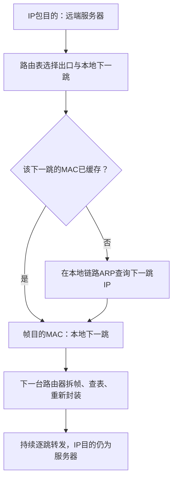
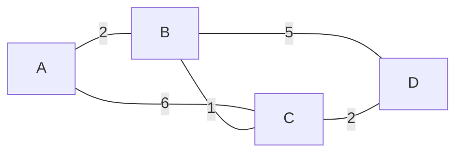

# 网络层

本章回答：数据跨越不同网络时，怎样根据目的地址选择下一站？学习顺序：

1. 区分端到端目的与当前下一跳。
2. 从二进制前缀计算子网，再做分配和聚合。
3. 用最长前缀匹配查表，用 ARP 找本地下一跳。
4. 读 IPv4 首部，按 MTU 和 8 B 单位分片。
5. 推演 DV／Dijkstra，比较域内与域间路由。
6. 把 DHCP、NAT、组播和 IPv6 放回数据路径。

## 把目的与下一跳分开

主机甲访问另一个网络的服务器，帧只负责送到当前链路的下一站，IP 分组则保留跨网络的目的地址。网络层负责寻址和逐跳转发。路由是形成路径和转发表的过程，转发是每个分组到达后查表选择出口的动作。

IP 提供尽力而为的数据报服务：分组可能丢失、重复或乱序，需要可靠性时由其他机制补足。数据报各自携带目的地址；虚电路先建立路径、沿途保存状态，再按局部虚电路标识转发，标识可以逐段改变。建立逻辑连接不必等于预留固定带宽。

## 读懂 IPv4 地址

IPv4 地址有 32 bit，通常分四段十进制，每段 8 bit。`192.168.8.142/26` 的 `/26` 表示前 26 bit 是网络前缀，剩余 6 bit 标识该前缀内的地址。掩码的前 26 bit 为 1，其余为 0，即 255.255.255.192。

8 bit 可表示 $2^8=256$ 个值，即 0—255。二进制从左到右的位权为 128、64、32、16、8、4、2、1；所以 142 写成 `10001110`，因为 $142=128+8+4+2$。前缀长度决定哪些位固定，掩码用 1 标出这些位。

网络地址等于 IP 与掩码按位与。最后一段 142 是二进制 `10001110`，与 `11000000` 得 `10000000`，即 128。主机位全 1 得 191，因此整个块为 128—191，普通广播子网的可用主机为 129—190，共 $2^6-2=62$ 个。`/31` 点对点和 `/32` 单地址另有用途，不套减 2 规则。

按位与 AND 的规则是“两个位都是 1，结果才是 1”。这个子网保留前三段的 24 位，再保留第四段前 2 位，步骤如下：

```text
地址最后一段：10001110   （142）
掩码最后一段：11000000   （192）
按位与结果：  10000000   （网络地址128）
主机位全1：   10111111   （广播地址191）
```

网络前缀 `10` 固定，后六位可取 000000—111111。普通广播子网把全 0 留给网络地址、全 1 留给广播地址，故主机位组合减去两种。这里的地址通常配置在网络接口上，一台多接口主机或路由器可以拥有多个 IP。

做题也可按块大小求：这一段有 6 个可变位，块长 64，边界为 0、64、128、192。142 落在 128 块。两个地址前三段相同仍可能不同子网，必须结合前缀长度比较。

VLSM 为不同大小需求分配不同前缀。普通子网要容纳 50 台主机，最少保留 6 主机位，选 `/26`；分配应按块边界对齐并避免重叠。CIDR 聚合反过来合并连续、对齐且拥有共同前缀的块：192.168.8.0/24 与 192.168.9.0/24 可精确合成 192.168.8.0/23；9 与 10 虽相邻，却不能精确合为一个 `/23`，因为两者跨越对齐边界。

VLSM 是可变长子网掩码，CIDR 是无类别域间路由。分配时先对大需求选最小够用的块：50 台需 $2^h-2\ge50$，取 $h=6$，所以前缀 $32-6=26$。聚合时看共同二进制前缀：第三段 8=`00001000`、9=`00001001`，只差最后 1 位，前面共 $16+7=23$ 位相同；9 与 10=`00001010` 差两位，不能精确用 `/23` 包住且仅包住这两个块。

私有 IPv4 常用 10.0.0.0/8、172.16.0.0/12、192.168.0.0/16；它们不能直接当作全局公网地址。历史 A/B/C 类地址用于理解旧式默认边界，现代 CIDR 题应采用明确给定的前缀。


### 练习 1

【自编】主机地址192.168.8.142/26，普通IPv4广播子网。
求掩码、网络地址、广播地址和可用主机范围。
同学认为192.168.8.200可直接二层送达，
在本机没有特殊路由时，这一判断是否正确？

**解答**

掩码255.255.255.192；每块64个地址。
142落在128—191块：网络192.168.8.128，
广播192.168.8.191，主机192.168.8.129—190，
可用62个。200属于192—255块，不在本子网。
正常应交给可达网关，不能只比较前三段。

**判分要点**

1分：掩码与128—191块边界。
1分：主机范围排除网络/广播地址，62个。
1分：200异网段，判断用/26而非默认/24。


## 查表后怎样发出去

主机也有路由表。在只有常规直连路由和默认网关的题中，可先判目的是否在本地子网：在本地就直接交给目的主机，异网段交给网关；若题目给特殊路由，要按路由表匹配。ARP（地址解析协议）在本地链路中查询“某个 IPv4 地址对应什么 MAC”。ARP 请求可广播，收到回答后缓存映射。去远端时查询的是本地网关 MAC，ARP 广播不会由普通路由器替你找远端 MAC。

路由器采用最长前缀匹配：在所有匹配目的地址的表项中选前缀最长的。若表中同时有 10.0.0.0/8、10.1.0.0/16、10.1.2.0/24 和默认 0.0.0.0/0，目的 10.1.2.9 匹配四项，选 `/24`，因为它最具体。




IP 负责跨网络目的，MAC 负责本跳交付；有 NAT 等机制时字段还可能被改写。

## 首部与分片

IPv4 首部的版本字段为 4；IHL 用 4 B 为单位表示首部长，通常 IHL=5 即 20 B；总长度含首部和数据。TTL 每经过路由器转发递减，耗尽时丢弃，可触发 ICMP 超时消息。协议字段标识上层，如 TCP、UDP；首部校验和只保护 IPv4 首部。

首字节十六进制 `46` 表示版本 4、IHL=6，即首部 24 B；若总长度字段为 `003C`，则总长 60 B，载荷为 36 B。先解释字段单位，再做减法。

MTU 是链路能承载的最大 IP 分组大小。IPv4 分组过大且 DF=0 时可以分片，各片各有首部，使用相同标识归属于原分组；MF=1 表示后面还有片。片偏移以 **8 B** 为单位，表示本片数据相对原数据的起点，因此非末片数据长度必须是 8 的倍数。目的端重组，路由器通常不替它完成重组。

先扣首部，再把数据空间向下取整到 8 B 的倍数。若 MTU 为 $M$ B、各片首部长 $h$ B，则非末片最大数据量为

$$8\left\lfloor\frac{M-h}{8}\right\rfloor\text{ B}.$$

$\lfloor\ \rfloor$ 表示向下取整。例如 MTU=819 B、首部=20 B，虽剩 799 B，非末片最多只能放 $8\lfloor799/8\rfloor=792$ B。末片可小于这个量且不必为 8 的倍数。DF 是禁止分片标志，MF 是更多分片标志；两者分别控制“能否拆”与“后面还有没有”。

例如总长 2020 B、首部 20 B，出口 MTU=820 B：原数据 2000 B，每个非末片最多 800 B，分片如下。

| 片 | 数据长度 | 含首部总长 | 偏移 | MF |
|---|---:|---:|---:|---:|
| 1 | 800 | 820 | 0 | 1 |
| 2 | 800 | 820 | 100 | 1 |
| 3 | 400 | 420 | 200 | 0 |

核对 $800+800+400=2000$；偏移从原数据起点算，不包含首部。若 DF=1 而出口不能承载，路由器应丢弃并在适用条件下反馈需要分片的 ICMP 信息。ICMP 用于错误报告与诊断，如 ping 的回显、traceroute 利用的超时；它不保证错误报告一定送达，也不保证原分组恢复。


### 练习 2

【自编】甲192.168.1.10/24向192.168.2.20发包，
网关192.168.1.1，ARP缓存为空，无NAT。
甲首个承载该IP包的帧应采用什么目的地址？

- A. IP为网关，MAC为远端主机
- B. IP为远端主机，MAC为网关
- C. IP为网关，MAC为广播地址
- D. IP为远端主机，MAC为远端主机

**答案：B。** 甲通过ARP获取本地网关MAC，再将目的IP仍为远端主机的包封装给网关；
ARP广播不跨路由器找远端MAC。

### 练习 3

【自编】IPv4总长2020 B，首部20 B，无选项，DF=0。
出口MTU为620 B，各分片首部均20 B。
求每片的数据长度、总长度、偏移字段与MF。
最后核对数据总量；偏移不含首部。

**解答**

原数据2020−20=2000 B。
非末片最多600 B，600是8的倍数。
四片数据长：600、600、600、200 B。
总长度：620、620、620、220 B。
偏移：0、75、150、225，单位8 B。
MF依次：1、1、1、0。
数据和2000 B；含四份首部共2080 B。

**判分要点**

1分：先扣20 B，非末片数据按8 B对齐。
1分：四片长度正确且数据和2000 B。
1分：偏移由0/600/1200/1800除8，MF正确。


## 路由信息怎样更新

距离向量 DV 让每个路由器告诉邻居“我到各目的多远”。设 $c(x,v)$ 是 x 到邻居 v 的代价，$D_v(y)$ 是邻居报告的到 y 距离，x 重新比较所有当前候选：

$$D_x(y)=\min_v\{c(x,v)+D_v(y)\}.$$

例如 A 到 B 为 2、到 C 为 5，B 到 D 报 2、C 报 3，则 A 选经 B，代价 4。后来 B 改报 10，当前候选变成 12 与 8，A 应改经 C；不能拿失效的历史最小值 4 继续比较。

同步轮次题中，每轮只使用上一轮的表。设链为 A—B—C—D，代价依次 2、1、3，另有 A—D 代价 12：

| A 的表 | 到 A | 到 B | 到 C | 到 D |
|---|---:|---:|---:|---:|
| 初始只知直连 | 0 | 2 | 无穷 | 12 |
| 第 1 轮 | 0 | 2 | 3 | 12 |
| 第 2 轮 | 0 | 2 | 3 | 6 |

B 在第 1 轮才学会经 C 到 D 为 4，A 要到第 2 轮才能用它。故障后，邻居可能互相相信一条实际依赖自己的旧路径，形成计数到无穷。水平分割、毒性逆转和触发更新可缓解问题，但不能随意宣称消除所有动态环路。

链路状态 LS 则把本地链路及代价传播出去，各节点建立拓扑数据库，再独立算最短路。序列号和老化帮助区分新旧信息。Dijkstra 从源点开始，反复选暂定距离最小的未确定点，再经它松弛邻居。

例如 AB=2、AC=6、BC=1、BD=5、CD=2。从 A 出发先暂记 B=2、C=6；确定 B 后改 C=3、D=7；确定 C 后改 D=5；最后确定 D。到 D 的路径 A→B→C→D 代价 5，下一跳是 B，不能把最终目的 D 填到下一跳栏。

“松弛”就是比较旧距离与经过新确定节点的候选距离，保留较小值。边权非负时，Dijkstra 可按下表操作：

| 操作后 | 已确定节点 | 到 B 暂定距离 | 到 C 暂定距离 | 到 D 暂定距离 |
|---|---|---:|---:|---:|
| 从 A 初始化 | A | 2 | 6 | 无穷 |
| 选 B，检查 B 的邻边 | A、B | 2 | $\min(6,2+1)=3$ | $2+5=7$ |
| 选 C，检查 C 的邻边 | A、B、C | 2 | 3 | $\min(7,3+2)=5$ |
| 选 D | A、B、C、D | 2 | 3 | 5 |



DV 与 LS 的记忆差异在“知道什么”：DV 知道邻居报来的距离，用邻居代价加通告；LS 收集拓扑，再在本机计算整条路径。同步 DV 题严格隔开轮次，不能在同一轮连用别人刚更新的信息。

## 配置与地址转换

DHCP 让主机取得 IP、掩码、网关、DNS 等租约配置，常见四步为 Discover→Offer→Request→ACK。ACK 表示配置确认，不能证明所有路由、DNS 和远端服务都正常。

NAT 改写地址，常见 NAPT 还改端口，使多个内网连接共享公网地址。例如 10.0.0.2:5000 与 10.0.0.3:5000 分别映射为公网地址的 40001、40002；回复按映射还原。服务器看到的是改写后的源地址和端口。映射需要状态，外部主动发起连接通常还需明确规则，NAT 本身也不等于完整防火墙。


### 练习 4

【自编】无向边AB=2、BC=1、CD=3、AD=12。
DV初始化只知自己和直连邻居。
每轮交换上一轮表，再同时更新；无故障。
① 写A初始、第一轮、第二轮到A/B/C/D的距离。
② 第二轮到D的下一跳是谁？
③ DHCP ACK同时给A网关和DNS地址，
是否因此保证经该路径能访问任意网站？

**解答**

A初始为(0,2,∞,12)。
第一轮为(0,2,3,12)，第二轮为(0,2,3,6)。
第一轮B从C得知到D为1+3=4，
A第二轮才能采用2+4=6，下一跳B。
DHCP ACK确认租约配置，不保证路由、DNS服务
和网站应用均正常，更不保证任意目标都可达。

**判分要点**

按同步轮次，不能第一轮偷用B刚更新的4。
A到D最终代价6、下一跳B，非直接写D。
区分获得配置与端到端成功。


## 三种路由协议

自治系统 AS 是采用统一管理与路由政策的一组网络。AS 内部可用 RIP 或 OSPF，AS 之间常用 BGP。

RIP 是距离向量协议，以跳数为度量，经典最大可达距离为 15，16 表示不可达。OSPF 使用链路状态，Hello 发现邻居，邻接建立后同步链路状态数据库；广播网络的 DR/BDR 减少相关邻接与通告开销，DR 不必成为所有数据的必经转发点。

OSPF 用区域减少详细拓扑传播范围。区域边界路由器 ABR 连接区域并传递区域间可达性，ASBR 引入外部路由；一个区域内的详细数据库不等于掌握其他区域所有内部链路。区域类型取决于配置，不能只因“单出口”就叫 stub。

BGP 传播前缀及路径属性，AS_PATH 记录经过的 AS，有本 AS 号的路径通常应因环路风险拒绝。选路服从政策，不能一概选 AS 数最少的路径。例如题设先比本地偏好，偏好 200 的三 AS 路径可胜过偏好 100 的两 AS 路径；只有候选合法、可达后才比较这些优先级。

## 一份数据交给多人

单播发给一个接口；广播发给广播域所有成员；组播发给某个组的成员。IGMP 用于 IPv4 主机向本地路由器报告组成员关系，不负责单独计算全网组播树。

简单反向路径转发 RPF 检查组播分组是否从“本机通往源地址的单播方向”到来，错误接口来的副本可丢弃，再结合树和剪枝减少重复与无成员分支。若通往源 S 的接口为 x，副本从 y 来，就不通过该检查。任播让多个节点提供同一服务地址，由路由选择一个适合的实例；“近”通常是路由意义上的近。


### 练习 5

【自编】① OSPF中area1的路由器能否只凭自身区域LSDB，
声称掌握area2每条内部链路？ABR做什么？
② 本地BGP政策明确先比较本地偏好，再比路径长。
两可达候选：`[20,30]`偏好100；`[40,50,30]`偏好200。
选哪条？若自身AS号是50，后一通告应怎样处理？
③ 到源S的单播下一跳接口是x，组播副本从y到达。
按简单RPF会怎样？IGMP能否单独计算全网组播树？

**解答**

区域内详细拓扑不等于全AS所有内部链路；
ABR连接区域并传播相应区域间可达性与代价。
自身AS不在路径时按给定政策选偏好200的长路径。
若自身为AS50，含50的AS_PATH提示环路，应拒绝；
不能先用高偏好接受有自身AS的环路路径。
从y而非x来的副本不通过所设RPF检查。
IGMP维护本地成员关系，组播路由还需另外机制。

**判分要点**

明确区域信息边界与ABR职责。
政策可优于路径长度，但环路检查仍适用。
RPF按到源方向检查；成员管理不等于路由计算。


## IPv6 与其他转发方式

IPv6 地址 128 bit，通常写成十六进制组；一处连续全零组可用 `::` 压缩，一条地址中只能这样压缩一次。基本首部固定 40 B，使用扩展首部承载附加信息，不设置 IPv4 那种首部校验和。IPv6 用邻居发现代替 ARP，用组播等机制完成相应功能，没有 IPv4 式广播；路由器不在途中分片，过大时反馈，源端据路径条件调整或分片。

双栈让设备同时运行 IPv4/IPv6；隧道把一种协议分组装入另一种协议传输。移动 IP 则区分长期归属地址与当前位置的转交地址，通过有认证的绑定使数据到达移动节点；传统方式可能形成先到归属网络再转交的三角路径。


### 练习 6

【自编】距离向量中，A到邻居B代价2、到C代价5。
此前B宣称到D为2，C宣称为3，A经B到D为4。
现B更新到D为10，C仍为3，无其他候选路径。
A能否保留旧距离4？求新距离与下一跳。

**解答**

不能保留：原4依赖B的旧通告，已不再有效。
经B的新候选为2+10=12，经C为5+3=8。
应更新为距离8、下一跳C。
修正规则应重新比较当前候选，不只接受更小通告。

**判分要点**

1分：解释旧路由失效原因。
1分：候选12和8，新下一跳C。
1分：指出只取新值与历史最小值会保留失效路由。

### 练习 7

【自编】将IPv4发送程序迁到IPv6，路径某跳MTU不足。
关于地址解析和分片，哪项迁移方案正确？

- A. 继续使用ARP，要求中间路由器分片
- B. 改用邻居发现，要求中间路由器分片
- C. 改用邻居发现，由源端处理分片需求
- D. 继续使用ARP，由源端处理分片需求

**答案：C。** IPv6用邻居发现而非ARP；中间路由器不做IPv4式分片，
源端应按路径条件调整发送或处理分片。


MPLS 在入口压入标签 push，中间按标签交换 swap，适当位置弹出 pop。标签在对应转发上下文中局部有效，同一个 IP 分组可以先带标签 100，再改成 40；标签不等于全网不变的目的 IP。标签栈的 S 位标记是否为栈底，具体弹出哪个标签由转发表动作决定。把帧地址、IP 地址、端口、标签分别放回各自层次，才能跟踪一次跨层转发。


### 练习 8

【自编】主机H为10.1.2.70/26，网关10.1.2.65。
目的D为203.0.113.9，ARP为空；无代理ARP或特殊路由。
边界NAPT把H:5000映射到198.51.100.2:41000。
核心入口push标签100，中间按表swap为40，出口pop。
① H先ARP问谁？首个数据帧目的IP与MAC指向谁？
② 服务器看到的源IP、端口是什么？
③ 标签100、40能否当作全网不变的目的IP？

**解答**

H属于10.1.2.64/26，D异网段。
H先ARP查询10.1.2.65，数据帧目的MAC为网关MAC；
该帧所承载IP包目的仍为203.0.113.9。
服务器看到源198.51.100.2、端口41000。
MPLS标签在相应转发上下文局部有意义，
push/swap/pop作用于标签栈，不把100改写成IP。
本题给定的不同标签仍可承载同一个IP目的。

**判分要点**

掩码判断与ARP查询的是本地下一跳。
正确区分链路MAC、原IP目的与NAPT源字段。
标签是局部转发标识，不是全球IP或固定端到端值。

## 记忆要点

- IP 描述跨网目的，MAC 描述当前一跳；路由计算路径，转发执行查表。
- 子网先数主机位，按位与求网络地址；减 2 只适用于通常的 IPv4 广播子网。
- 路由表选最长匹配前缀；ARP 只找本地链路上的下一跳。
- 分片先扣首部、非末片数据按 8 B 对齐；偏移基于原数据，不包含首部。
- DV 用当前邻居通告，LS 用拓扑算路；路径代价、最终目的、下一跳各填各的栏。
- DHCP 给配置，NAT 改字段；IPv6 邻居发现取代 ARP，途中路由器不分片。

上一章：[数据链路层](03-cn-data-link.md)。下一章：[运输层](05-cn-transport.md)。返回：[课程路线](index.md)。
