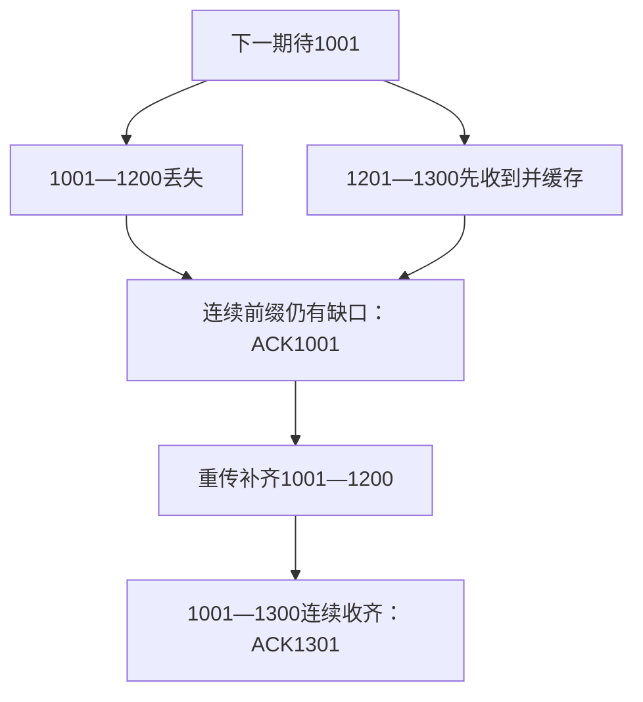
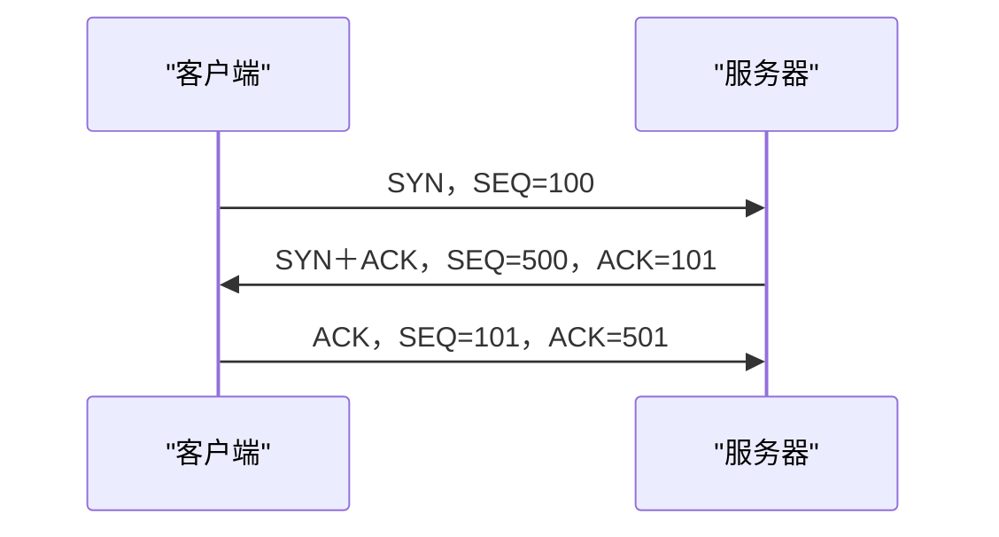
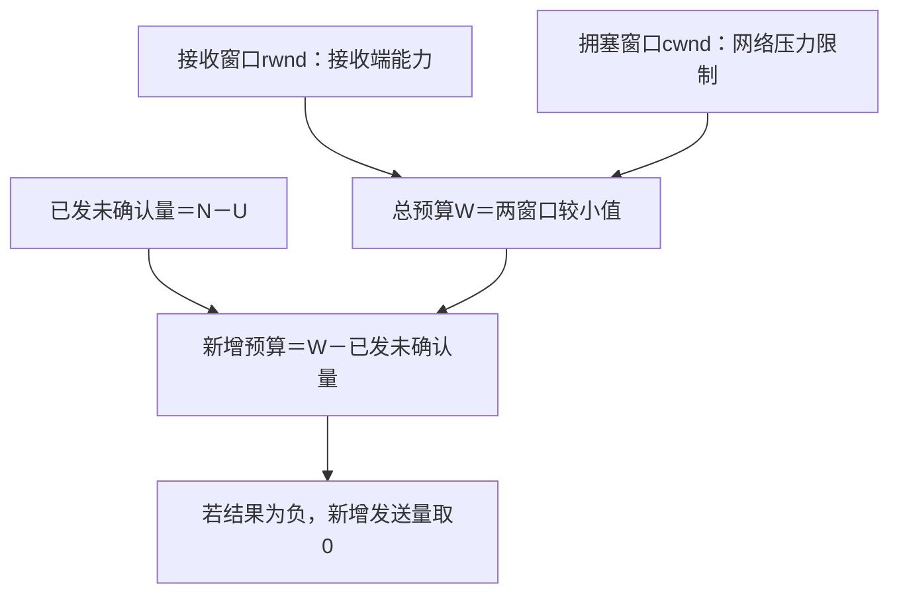

# 运输层

本章回答：数据已经到主机，怎样交给正确程序，并在丢失、乱序时可靠传送？学习顺序：

1. 从端口和四元组区分程序通信，比较 UDP 与 TCP。
2. 逐字节跟踪 SEQ、ACK 与缺口。
3. 按事件理解建立、半关闭和 TIME-WAIT。
4. 根据往返样本估计超时，再处理重传歧义。
5. 先算在途量，再分别使用接收窗口与拥塞窗口。
6. 比较超时和重复 ACK，最后理解实时播放缓冲。

## 数据交给哪个程序

IP 把分组送到主机，主机还同时运行浏览器、聊天和其他程序。运输层使用端口区分通信端点。

一个 TCP 连接通常由源 IP、源端口、目的 IP、目的端口四元组标识；同一服务器端口可以同时服务许多不同客户端。

UDP 提供无连接的数据报服务，一次发送对应一个数据报，保留消息边界，不自行保证重传和按序交付。TCP 先建立连接，提供可靠、有序的字节流。

两次各写 100 B，接收端可能一次读到 200 B，也可能分多次读取；应用需要长度字段或分隔规则确定自己的消息边界。

UDP 首部固定 8 B，包含源端口、目的端口、长度和校验和，长度含首部。

TCP 首部至少 20 B，含序号、确认号、标志和窗口等；数据偏移字段以 4 B 为单位表示首部长。

IPv4 总长 100 B、IP 首部 20 B、TCP 首部 32 B时，应用数据只有 $100-20-32=48$ B。

TCP/UDP 的校验计算还涉及 IP 地址、协议号等组成的伪首部，以检查一定程度的误投递；伪首部用于计算，不是额外发在 TCP 首部前的字段。

MSS 是一个 TCP 段可承载的最大数据字节数，MTU 则约束 IP 分组，不能把两者当成同一个长度。

!!! example "例子与推演"

    例如 MTU=1500 B，IPv4 首部 20 B、TCP 首部 20 B，没有额外首部时，能装下的 TCP 数据最多为 $1500-20-20=1460$ B。

    实际 MSS 的协商以及路径限制还要依具体条件；出现选项或隧道开销时重新扣除。

## 字节序号与确认号

TCP 给每个数据字节编号，SEQ 是本段第一个数据字节的序号；ACK 表示接收端下一期待的字节，即其前面的字节已经连续收齐。SYN 和 FIN 各占一个序号，纯 ACK 不占序号。

!!! example "例子与推演"

    例如下一期待字节为 1001，发送方先发 SEQ=1001、长度 200 B，再发 SEQ=1201、长度 100 B。

    第一段丢失而第二段收到时，中间仍缺 1001—1200，累计 ACK 仍为 1001。若接收端缓存第二段，缺失段补齐后 ACK 才变成 1301。

    累计确认取决于连续前缀，不能看到较大序号就跳过缺口。

ACK 指向最早缺失字节，补齐缺口后可以跨过已缓存的连续数据。

区间端点按字节数计算：从序号 1001 开始的 200 B，最后一字节是 $1001+200-1=1200$，下一字节是 1201。

后面 100 B 覆盖 1201—1300；连续收齐后确认 1301。ACK 本身带“下一期待序号”，因此不额外减 1。

### 练习 1

!!! question "题目"

    【自编】接收方下一期望字节为501，允许缓存乱序段。发送方发两段：SEQ=501长度200 B；SEQ=701长度100 B。第一段丢失，第二段收到。

    - ① 此时累计ACK是多少？
    - ② 第一段重传到达且第二段仍在缓存，ACK是多少？

!!! success "参考解答"

    **解答**

    - 第二段覆盖701—800，但501—700仍缺失，所以累计ACK=501，不能因收到末尾而改801。
    - 第一段补齐后501—800连续完整，ACK=801。
    - TCP序号按字节计；
    - 两段总共300 B。

    **判分要点**

    - 1分：乱序后ACK=501，解释缺口。
    - 1分：补齐后ACK=801，含缓存仍在条件。
    - 1分：范围端点正确，不按两个报文段加2。

### 练习 2

!!! question "题目"

    【自编】TCP发送方连续两次写100 B，接收方一次读到200 B。
    没有丢失或篡改，最合理的解释是什么？

    - A. TCP重传导致应用必然收到重复数据
    - B. TCP只允许每次读取与发送长度相等
    - C. TCP把两次写入改成一个UDP数据报
    - D. TCP按字节流交付，应用需另定消息边界

!!! success "参考解答"

    **答案：D。** TCP保证有序字节流而不保留写入调用边界；应用可用长度字段或分隔规则恢复消息，
    读到200 B本身不代表出错。

## 连接怎样建立

- 客户端选初始序号 $x$，服务器选 $y$，三次握手为：客户端发 SYN、SEQ=$x$；
- 服务器发 SYN+ACK、SEQ=$y$、ACK=$x+1$；
- 客户端回 ACK=$y+1$，常规无数据情形 SEQ=$x+1$。
- 双方由此确认对方可接收并同步各自序号。

SYN 是同步初始序号的标志；ACK 标志表示确认号有效。两端发送方向拥有各自的序号空间。以 $x=100,y=500$ 为例，按三个事件依次记录：

第二条确认了客户端 SYN，同时发布服务器的初始序号；第三条确认服务器 SYN。SYN 各占一个序号，因此双方第一个普通数据字节分别从 101 和 501 开始。

该图采用通常的不在握手中携带数据的课堂情形。

主动端的常见状态为 CLOSED→SYN-SENT→ESTABLISHED；被动端为 LISTEN→SYN-RECEIVED→ESTABLISHED。

最后一个 ACK 丢失时，服务器可能重传 SYN+ACK，客户端再次确认。不能只数报文数量，就忽略它们各自确认的方向与序号。

## 两个方向分别关闭

- TCP 全双工，每个发送方向独立结束。
- 甲发 FIN 后进入 FIN-WAIT-1，乙收到后确认并进入 CLOSE-WAIT；
- 甲的 FIN 被确认后进入 FIN-WAIT-2，仍可接收乙尚未发完的数据。
- 乙应用决定结束时发 FIN，进入 LAST-ACK；
- 甲收到后确认并进入 TIME-WAIT，乙收到最终 ACK 后关闭。

TIME-WAIT 通常等待 2MSL，MSL 为报文最大生存时间。它让最终 ACK 丢失时仍能回应重传 FIN，也降低旧报文干扰后续同类连接的风险。

FIN 和 ACK 有时可以合并，不能把关闭永远限定为恰好四个独立段。

FIN 表示“这一方向的数据发完了”，所以甲的 FIN 获确认后仍可接收乙的数据。以甲先关闭、乙稍后关闭为例：

| 事件 | 甲的状态 | 乙的状态 |
|---|---|---|
| 甲发 FIN | FIN-WAIT-1 | 暂仍 ESTABLISHED |
| 乙收到 FIN 并确认 | FIN-WAIT-1，直到确认到达 | CLOSE-WAIT，等待本地应用结束 |
| 甲收到该确认 | FIN-WAIT-2 | CLOSE-WAIT |
| 乙应用结束并发 FIN | FIN-WAIT-2 | LAST-ACK |
| 甲收到乙 FIN 并确认 | TIME-WAIT | LAST-ACK，直到确认到达 |
| 乙收到最终确认 | TIME-WAIT，等待期结束后 CLOSED | CLOSED |

状态描述本地已发生的事件，同一时刻两端可以不同。TIME-WAIT 通常由确认最后一个 FIN 的端点承担；同时关闭另按事件推演。

若双方几乎同时发 FIN，可经过 CLOSING；若同时主动打开，也可能经历 SYN-SENT 后收到 SYN 的路径。

RST 表示复位/拒绝等异常终止，不是正常 FIN 半关闭。判断状态时按“本端发了什么、哪些已确认、收到了什么”逐事件更新。

## 超时多久才重传

RTO 是重传超时，需根据 RTT 估计，同时容纳波动。单纯的平滑 RTT 可写成 $s'=(1-\alpha)s+\alpha r$，其中 $s$ 是旧估计，$r$ 是本次样本，$\alpha$ 是新样本权重。

旧值 80 ms、权重 1/4、样本 40 ms，更新为 70 ms；再来 100 ms，更新为 77.5 ms。这个平均值尚不是完整 RTO。

一组典型更新规则还维护偏差 $v$：

$$v'=(1-\beta)v+\beta|s-r|,\qquad s'=(1-\alpha)s+\alpha r.$$

先用**旧 $s$** 更新偏差，再更新平均；随后可按 $s'+\max(G,4v')$ 算 RTO，其中 $G$ 是时钟粒度，并施加规定的下限。做题以题给参数和下限为准。

!!! example "例子与推演"

    例如旧 $s=100$ ms、$v=20$ ms，新样本 140 ms，$\alpha=1/8$、$\beta=1/4$：$v'=25$ ms，$s'=105$ ms。

    若 $G=1$ ms，原始 RTO 为 205 ms；题设若要求至少 1 s，则最后取 1000 ms，不能把下限理解为封顶。

这里 $|s-r|$ 是绝对差，反映样本偏离旧均值多大；$v$ 是波动的平滑估计，常称 RTTVAR；$s$ 常称 SRTT。把上例展开：

$$\begin{aligned}
v'&=0.75\times20+0.25\times|100-140|=25\text{ ms},\\
s'&=0.875\times100+0.125\times140=105\text{ ms},\\
RTO_{\mathrm{原值}}&=105+\max(1,4\times25)=205\text{ ms}.
\end{aligned}$$

先算偏差再改均值，全部保持同一种时间单位。最终下限是 $\max(205,1000)=1000$ ms。

重传段的 ACK 可能对应原发送，也可能对应重传，无法确定哪次 RTT。无时间戳等消歧机制时，Karn 规则不采用这种歧义样本。超时通常还要对 RTO 退避，避免过于频繁重传。

### 练习 3

!!! question "题目"

    【自编】TCP客户端先发FIN，服务器确认后继续发剩余数据。
    此时客户端尚未收到服务器FIN。哪项正确？

    - A. 客户端可处于FIN-WAIT-2并继续接收数据
    - B. 连接双方都已关闭，服务器发送数据一定非法
    - C. 客户端应处于CLOSE-WAIT并拒绝所有数据
    - D. 客户端已进入TIME-WAIT并结束所有接收

!!! success "参考解答"

    **答案：A。** FIN只关闭发送它的一方的数据发送方向；
    其FIN获确认后可在FIN-WAIT-2等待对方FIN，仍可接收对方剩余数据。

### 练习 4

!!! question "题目"

    【自编】课堂RTT估计公式：新估计=0.75×旧估计
    +0.25×新样本。旧估计80 ms，
    随后两次样本依次40 ms、100 ms。
    求两次更新结果；能否直接把最后结果称完整RTO？

!!! success "参考解答"

    **解答**

    - 首次：0.75×80+0.25×40=70 ms。
    - 第二次：0.75×70+0.25×100=77.5 ms。
    - 不能称完整RTO；
    - 平均RTT估计还未加入波动、重传采样歧义及完整超时算法的其他规则。

    **判分要点**

    - 1分：70 ms。
    - 1分：第二次使用70而非80，得77.5 ms。
    - 1分：区分RTT估计与RTO，不能仅改名。

## 接收窗口与在途数据

接收方缓冲区有限，通过 rwnd 告诉发送方还能接受多少数据，这是流量控制。发送方另有拥塞窗口 cwnd，用来限制对网络的压力。未确认总量受两者较小值限制：$W=\min(rwnd,cwnd)$。

设 $U$ 是最早未确认字节，$N$ 是下一个尚未发送字节，则简化情况下在途数据量为 $N-U$，还能新增发送

$$\max(0,W-(N-U)).$$

!!! example "例子与推演"

    例如 $U=1001$、$N=3501$，在途 2500 B；rwnd=4000 B、cwnd=3000 B，则只能再发 500 B，即区间 $[3501,4001)$。

    右端不包含在内，这个半开区间恰有 500 个字节。窗口是未确认数据总预算，不能把它全部当成新增预算。

这三个量可按图依次计算。rwnd 来自接收端剩余接收能力，cwnd 是发送端根据网络状况维护的限制；二者需要统一为字节再比较。

rwnd=0 时需要持久定时器等探测机制，避免窗口重开通告丢失后双方永久等待。保活用来探测长期空闲连接，重传定时器用来处理未确认数据，三种定时器目的不同。

## 拥塞窗口怎样变化

网络中的缓冲和带宽也有限，大量丢包时继续猛发会恶化拥塞。经典教材模型用慢开始和拥塞避免控制 cwnd，并用门限 ssthresh 区分阶段。

慢开始每收到新数据确认就增加窗口，完整确认且无其他限制时，一轮 RTT 后近似翻倍；达到门限后进入拥塞避免，约每 RTT 增加 1 MSS。MSS 是最大段数据量。

题设初始 1 MSS、门限 4 MSS，采用整轮简化规则，则 RTT 边界依次为 1、2、4、5、6 MSS。

“每 RTT 加 1”与“每 ACK 加 1”不同，题目若给逐 ACK 规则要照规则逐项更新。

现代拥塞算法可以采用其他探测与模型，如 BBR 关注带宽和传播时延估计；Reno 的算式不能直接套到所有 TCP 实现。

### 练习 5

!!! question "题目"

    【自编】MSS=1000 B。采用题设逐RTT简化模型：初始cwnd=1 MSS，门限4 MSS；无丢包，每轮完整确认，到门限后每RTT加1 MSS。

    - ① 从开始前到经过4 RTT，写cwnd序列。
    - ② 此时rwnd=5000 B、在途2000 B，最多再发多少？

!!! success "参考解答"

    **解答**

    - 第0—4个RTT边界为1、2、4、5、6 MSS。
    - 第4边界cwnd为6000 B。
    - 未确认总量上限min(6000,5000)=5000 B。
    - 扣在途2000 B，最多新增3000 B。
    - 受接收窗口限制，不是按cwnd再发6000 B。

    **判分要点**

    - 1分：序列1、2、4、5、6且标明边界。
    - 1分：MSS转换及min得5000 B。
    - 1分：扣在途量得3000 B；
    - 流控与拥塞约束分开。

### 练习 6

!!! question "题目"

    【自编】TCP旧SRTT=80 ms、旧RTTVAR=10 ms，新样本120 ms。先更新偏差：$v\prime=0.75v+0.25|s-r|$；再更新平均：$s\prime=0.875s+0.125r$。RTO原值为s′+max(1 ms,4v′)，最终至少1 s。另有U=1001、N=3501、rwnd=4000 B、cwnd=3000 B。

    - ① 算v′、s′、最终RTO。
    - ② 当前还可发多少新字节？
    - ③ 若样本来自无时间戳的重传段ACK，应直接采纳吗？

!!! success "参考解答"

    **解答**

    - v′=7.5+10=17.5 ms，s′=70+15=85 ms。
    - RTO原值85+70=155 ms，取下限后为1000 ms。
    - 在途N−U=2500 B，有效窗口3000 B，故可新增500 B，范围[3501,4001)。
    - 重传ACK不能判断对应原发还是重传时，按Karn规则不把该歧义样本用于更新RTT。

    **判分要点**

    - 偏差用旧80而非新85；
    - 下限取最大值。
    - 窗口扣在途量2500，结果500 B。
    - 解释重传采样歧义，不能直接选更短RTT。

## 两种丢失分开处理

超时表示在等待期限内未得到确认；连续重复 ACK 则可能说明后续数据仍在到达但存在缺口。经典 Reno 在三次重复 ACK 后快重传缺失段，并进入快恢复，两者动作不同。

设题目采用门限 $\max(\text{在途量}/2,2\,MSS)$，丢失前有 10 MSS 在途，则门限为 5 MSS。

| 事件 | cwnd 的典型教材动作 |
|---|---|
| 超时 | 降至 1 MSS，重新慢开始 |
| 三次重复 ACK | 设为门限加 3 MSS，即 8 MSS，快重传 |
| 恢复中再来一重复 ACK | 临时增加 1 MSS，成为 9 MSS |
| 收到覆盖恢复范围的新 ACK | 回到门限 5 MSS，退出本次快恢复 |

临时膨胀反映已有一些段离开网络的推测，并不改变接收方实际缓冲量或 rwnd。

Reno、NewReno 等对部分确认的处理有差别；只有题目规定的新 ACK 覆盖恢复范围时，才直接使用表中最后一步。

### 练习 7

!!! question "题目"

    【自编】经典Reno教材模型，MSS=1000 B，rwnd充分大。丢失前cwnd=10 MSS且10段均在途。两种独立情形都设ssthresh=max(在途/2,2 MSS)。

    - ① 超时后门限与cwnd分别多少？
    - ② 若改为三重复ACK：触发时、再来一个重复ACK时，以及收到覆盖恢复范围的新ACK时，cwnd分别多少？
    - ③ 为什么不能把临时膨胀当作rwnd增大？

!!! success "参考解答"

    **解答**

    - 门限为5 MSS。
    - 超时后cwnd=1 MSS。
    - 三重复ACK触发快重传/快恢复，cwnd=5+3=8 MSS；
    - 再来一个重复ACK，增至9 MSS。
    - 覆盖恢复范围的新ACK到达后，退回5 MSS并退出恢复。
    - 这些是发送方拥塞控制的临时状态；
    - rwnd由接收方通告，并未因重复ACK而自动增加。

    **判分要点**

    - 两类触发共得5 MSS门限，但窗口动作不同。
    - 快恢复序列8→9→5，不混成超时重置。
    - 明确cwnd与rwnd分属网络压力和接收能力。

## 实时媒体关心什么

语音需要按时间播放，迟到的正确数据也可能没有价值。RTP 常由 UDP 承载，用序号识别缺失和乱序，用时间戳描述媒体采样时刻；RTCP 提供质量等反馈。它们本身不保证可靠重传和按时到达。

时间戳使用媒体时钟单位。8000 Hz 时钟下，相邻时间戳差 160 对应 $160/8000=20$ ms，不是 160 ms。

接收端设播放缓冲，将生成于 0、20、40 ms 的三个包统一延后 60 ms 播放，播放点为 60、80、100 ms；若到达为 45、85、95 ms，第二包迟到。

改为延后 70 ms，播放点变成 70、90、110 ms，三包都赶上，但会话延迟增加。

### 练习 8

!!! question "题目"

    【自编】RTP媒体时钟为8000 Hz，每包160个样本。包序号20、21、22，时间戳为4000、4160、4320。生成时间0、20、40 ms，到达时间45、85、95 ms。

    - ① 时间戳差160对应多久？不能直接解释成什么？
    - ② 统一在生成后60 ms播放，哪些包迟到？改成70 ms后呢？恰在播放点到达视为赶上。
    - ③ RTP序号与RTCP反馈是否保证丢包会被可靠重传？

!!! success "参考解答"

    **解答**

    - 160/8000=0.02 s=20 ms，不是160 ms。
    - 延后60 ms的播放点60、80、100 ms；
    - 只有21迟到。
    - 延后70 ms的播放点70、90、110 ms，全部赶上。
    - 更大缓冲吸收抖动，但增加交互延迟。
    - RTP提供序号和媒体时序，RTCP提供相关反馈；
    - 二者本身不能保证可靠重传或按时到达。

    **判分要点**

    - 时间戳按采样时钟换算。
    - 两套播放点与迟到判断正确，边界按题设。
    - 反馈/检测不同于交付保证，说明延迟权衡。

## 记忆要点

!!! tip "本章记忆要点"

    - UDP 保留数据报边界；TCP 提供字节流，应用自己定消息边界。
    - SEQ 是本段首字节序号，ACK 是下一期待字节；先算覆盖范围，再检查缺口。
    - SYN、FIN 各占一个序号；两端序号空间独立，关闭方向也独立。
    - RTO 包含均值与波动，先用旧均值更新偏差；歧义重传样本按 Karn 规则排除。
    - 新增发送预算等于较小窗口减在途量，结果至少为零。
    - 超时与三重复 ACK 的窗口动作分开；实时缓冲吸收抖动，同时增加播放延迟。

上一章：[网络层](04-cn-network.md)。下一章：[应用层](06-cn-application.md)。返回：[课程路线](index.md)。

