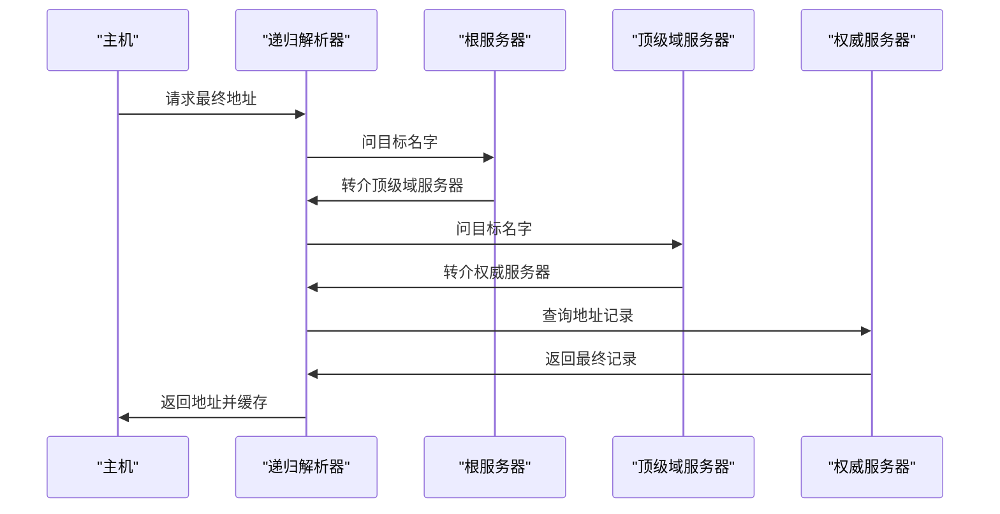
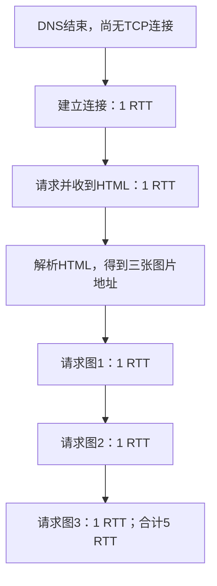

# 应用层

本章回答：浏览器、邮箱和文件传输程序，怎样组织已经能可靠传送的数据？学习顺序：

1. 从域名层级、记录类型和缓存理解 DNS。
2. 读一次 HTTP 请求与响应，辨认对象和状态码。
3. 画连接与对象的依赖顺序，再计算页面时延。
4. 分开内容缓存、TCP 连接与登录会话。
5. 跟踪邮件信封、MIME 编码和 FTP 两条连接。
6. 回到一次完整网页访问，判断哪些缓存能省步骤。

## 从域名找到服务

浏览器拿到一个网址，首先要知道服务器地址，再建立合适的连接，最后请求内容。应用层协议定义双方交换什么消息、怎样解释结果；运输层解决这些消息如何在程序间传递。一次网页访问往往涉及多个应用协议。

DNS 把域名等名字映射为资源记录。域名层级从右向左看：根在最顶端，其下是 `.com`、`.cn` 等顶级域，再向下是具体组织及子域。管理者可以把一部分子树委派出去，因此一个域名树与一台服务器保存的区域不是同一概念。

DNS 是域名系统。**资源记录**是“一类名字信息”的条目；查地址只是其中一种用途。**权威服务器**直接负责某个区域的数据；**递归解析器**替主机继续查询并缓存结果。比如 `www.example.test` 的主机标签在左侧，`.test` 是本例使用的测试顶级域名。

| 常见记录 | 保存什么 |
|---|---|
| A / AAAA | IPv4 / IPv6 地址 |
| CNAME | 别名指向的规范名字 |
| NS | 负责某区域的名称服务器 |
| MX | 邮件服务器主机名及优先值 |
| SOA | 区域管理与版本等信息 |

DNS 返回的 TTL 是缓存有效时间，和 IP 首部逐跳递减的 TTL 不同。MX 的较小优先值通常更优先，例如 `10 mx.example.test` 中的 10 既不是端口也不是 IP；还要查该主机名的 A/AAAA 得到连接地址。

## 查询为什么有多次

主机通常请求递归解析器帮它得到最终答案。递归表示被问者负责继续解决；迭代表示被问者可告诉请求方“下一步问谁”。缓存全空时，解析器常依次问根、顶级域、目标区域的权威服务器，逐步获得最终记录，再返回主机。




主机的一次请求可能引发解析器的多次顺序查询。

若解析器已缓存有效最终记录，就不用再向外查询；若主机自己已缓存，连主机到解析器这次请求都可能省去。缓存命中位置不同，时延不同。权威服务器返回 NXDOMAIN 表示名字不存在，NODATA 表示名字存在但没有所问记录类型，这些否定结果也可按规则缓存。

别名也可能增加查询：若 A 是 CNAME 指向 B，还要取得 B 的所需地址记录。委派的名称服务器名字若就在被委派子域里，会形成“先知服务器地址才能问服务器”的循环，父区可提供必要的 glue 地址记录帮助启动。

例如主机到解析器 RTT=4 ms，解析器到根、顶级域、权威依次为 10、15、25 ms，无缓存且顺序查询，总时延为 $4+10+15+25=54$ ms。若解析器已有最终记录，则为 4 ms。RTT 已经包括来回，不能再乘 2。

图采用无缓存、无别名、无额外委派的简化过程。递归与迭代描述每次查询双方的责任：主机请求解析器负责最终答案，解析器再依转介逐次问其他服务器。实际记录可能一次返回多项，应按题目给定的查询次数计算。


### 练习 1

【自编】主机无缓存，本地递归解析器已缓存有效最终A记录。
不需别名或额外查询。解析本次域名时哪项正确？

- A. 主机仍须先询问根服务器才能使用缓存
- B. 解析器无需再查询外部权威服务器
- C. 解析器必须逐次查根、顶级域、权威
- D. 最终A记录的TTL每经过路由器减一

**答案：B。** 有效最终记录可直接从解析器缓存返回；主机仍向解析器请求一次，
DNS TTL是有效时间而非IP逐跳计数。

### 练习 2

【自编】无缓存，无别名或额外委派，顺序迭代。
主机到解析器RTT=6 ms；解析器到根、
顶级域、权威的RTT依次8、12、20 ms。
① 完整查询时延多少？
② 仅解析器缓存命中最终记录时多少？

**解答**

完整时延=6+8+12+20=46 ms。
缓存命中最终记录时仅主机与解析器往返，6 ms。
这些数已是RTT，不再乘2；
缓存命中位置是解析器，不是主机。

**判分要点**

1分：完整46 ms，外部三次顺序往返。
1分：缓存后6 ms而非0。
1分：明确RTT已含往返，不重复翻倍。


## HTTP 怎样请求对象

HTTP 客户端发送请求，服务器返回状态、首部和可能的消息体。一个页面通常由 HTML、图片、脚本等多个对象组成；浏览器先读 HTML，才知道其中引用哪些资源。

```text
GET /index.html HTTP/1.1
Host: example.test
Accept: text/html

```

第一行的 GET 是方法，`/index.html` 是请求目标，最后是版本；Host 区分同一服务器地址上的不同站点；Accept 表示可接受的表示类型。空行结束首部，随后才是消息体。响应如 `HTTP/1.1 200 OK`，200 表示成功，404 表示资源未找到，不能把 404 当成 TCP 握手失败。

HTTP 是超文本传输协议；HTML 是描述网页结构的文本内容，两者分别是传输规则和所传对象。上述 GET 通常不带请求消息体，服务器的响应消息体才可能是 HTML 文件。HTTPS 表示 HTTP 通过安全机制传送，后续安全章解释其保护范围。

Content-Type 描述内容类型；Content-Length 给出消息体字节长度。在 HTTP/1.1 分块传输中，各块带长度、最后用结束块终止；它服务于消息定界。HEAD 请求得到相应首部但不传通常的响应消息体；POST 常用来提交内容。应用含义和具体方法要结合请求语义理解。

## 连一次还是多次

非持久 HTTP 每个对象建立新连接；持久连接让多个对象复用同一连接。连接复用减少握手，但是否串行、流水线、并行仍需看题目。

设 DNS 已结束，无旧 TCP 连接，忽略 TLS、传输和处理时间；握手用 1 RTT，小对象请求响应用 1 RTT。HTML 引用三张图片，共四个对象：非持久且全串行需 $4\times2=8$ RTT；持久但无流水线只握手一次，需 $1+4=5$ RTT。若持久流水线允许三图一起请求，则先握手、再 HTML、最后三图，简化为 3 RTT。浏览器必须先获得 HTML 中的图片地址，不能从时间零就假设知道所有请求。

大对象还要计算发送时间，并行也不意味着每条连接都独占整条带宽。统一先画请求依赖和连接建立，再算各阶段时间。

例如 HTML 引用三图，持久连接但无流水线时，顺序如下。每个箭头后的阶段按题设需要 1 RTT：



把图整理成计算式，设总对象数为 $K$，忽略题设允许忽略的其他开销：非持久串行为 $2K\,RTT$；持久无流水线为 $(1+K)RTT$。流水线允许连续发出多个请求，不等前一响应完成；并行则使用多条连接。二者的资源共享与时间依赖不同，不能混称为同一方式。


### 练习 3

【自编】DNS已完成，同服务器基础HTML含2张小图片。
RTT=30 ms；无旧连接，忽略TLS、发送及处理。
TCP握手1 RTT，小对象请求响应1 RTT。
① 非持久连接，所有对象串行，总时延多少？
② 改为一条持久连接、无流水线，总时延多少？

**解答**

共3个对象；非持久每个对象新建TCP，
共3×(1+1)=6 RTT=180 ms。
持久连接只握手一次：1+3=4 RTT=120 ms。
图片地址需先从HTML获知；本题不采用并行或流水线。

**判分要点**

1分：计入HTML，共3个对象。
1分：非持久6 RTT=180 ms。
1分：持久无流水线4 RTT=120 ms，连接仅建一次。

### 练习 4

【自编】同一条持久HTTP连接上的两个请求，
一个收到200，另一个收到404。可推出什么？

- A. 第二次TCP握手必然失败
- B. 第二次请求的DNS必然失败
- C. 服务器对第二项资源返回未找到
- D. 服务器因为持久连接而无法记住用户

**答案：C。** 404是应用层响应，说明请求获得了相应处理结果；
不能把资源未找到当成TCP或DNS失败，持久连接也不等于会话状态。


## 缓存与登录状态

缓存保存对象的副本。响应中的 `max-age=60` 可允许该副本在一定条件下新鲜 60 秒；新鲜时直接复用可省请求。过期后若有 ETag 版本标识，可带 `If-None-Match` 条件请求验证，未变化时服务器返回 304，浏览器使用本地消息体；304 仍然需要请求往返。

例如 0 s 收到 max-age=60、ETag=rev1，忽略 Age 等修正：30 s 再访问可用新鲜缓存；70 s 时请求验证，内容未变则收到 304。假设验证 RTT=40 ms，就仍要等约 40 ms，而非重新下载整个对象，也非零等待。`no-cache` 通常要求复用前验证，`no-store` 要求不要存储，含义不同。Vary 指明缓存匹配还需考虑哪些请求字段，如语言版本。

缓存题还可算平均时间：若本地命中概率为 $p$、命中耗时 $t_h$、未命中耗时 $t_m$，且这两类已含完整处理路径，则平均为 $pt_h+(1-p)t_m$。未命中路径是否已包含本地检查，要读清定义，避免重复加时。

HTTP 无状态表示每次请求不由协议自动保留用户业务状态。服务器可用 Set-Cookie 让浏览器保存标识，浏览器按域、路径、有效期等规则在后续 Cookie 字段中回传；服务器再用标识找到会话。TCP 连接关闭后，有效 Cookie 仍可用于新连接，所以持久连接与登录会话是两套状态。

**会话**在这里指应用保存的用户交互状态，例如登录后关联的用户身份；Cookie 是浏览器按规则保存并回传的数据。**ETag**是对象版本的标识，用于缓存验证。记忆时区分三份记录：连接记录负责运输，Cookie／会话记录负责用户状态，内容缓存记录负责复用对象。


### 练习 5

【自编】浏览器0 s收到页面：max-age=60，ETag为rev1。
简化假设无初始Age等修正；缓存允许保存和复用。
30 s、70 s各再次访问，无强制刷新，内容始终未变。
70 s时已有可用连接，条件请求往返40 ms。
① 30 s是否必须请求源站？70 s如何验证？
② 70 s收到304，是否没有页面可显示或不耗时间？
③ TCP连接关闭后，仍保存且有效的会话Cookie
能否在新连接中使用？为什么？

**解答**

30 s缓存新鲜，可直接复用，无须必发源站请求。
70 s缓存过期，发送If-None-Match rev1条件请求。
未变化时304使浏览器复用已有消息体，仍耗40 ms。
304不等于显示空白，也不等于零网络往返。
Cookie按域、路径等规则回传，可在新连接中使用；
应用会话与某条TCP连接的寿命不是同一概念。

**判分要点**

区分新鲜命中与过期条件验证。
304配合本地消息体，验证耗40 ms。
会话Cookie可跨连接，仍需满足作用范围与有效性。


## 邮件如何投递

发送端先把邮件提交给邮件服务器，服务器再通过 SMTP 向收件域服务器传送。收件人使用 IMAP 或 POP3 读取；IMAP 适合在服务器上同步文件夹和已读状态。SMTP 成功接收邮件表示对应环节接受投递，不等于收件人已经读到。

一次简化 SMTP 对话包含 EHLO、MAIL FROM、RCPT TO、DATA，消息结束后服务器给出结果。MAIL FROM 和 RCPT TO 是传输信封，DATA 内的 From、To、Subject 是可见邮件首部。可见 To 不会自动覆盖 RCPT TO 指定的实际投递收件人，密送等场景因此可以让两者不同。

MIME 为邮件加入内容类型、字符集、附件和多部分结构。Base64 把二进制编码成适合文本传输的字符，每 3 B 对应 4 字符，不足一组需填充；忽略换行等开销，$n$ 字节对应 $4\lceil n/3\rceil$ 字符。例如 300 B 得 400 字符，301 B 得 404 字符。它公开可逆，既不提供保密，也不等于压缩。

每 3 B 是 24 bit，Base64 按每 6 bit 分一组，得到四组；每组可表示 $2^6=64$ 种值，对应一个字符。$\lceil\ \rceil$ 是向上取整：301 B 需要 $\lceil301/3\rceil=101$ 组，每组最终四字符，所以为 404 字符，包括末组所需的填充字符。

## FTP 的两条连接

FTP 用控制连接传命令，数据连接传文件和目录内容。控制服务通常使用 TCP 21；传统主动方式由服务器主动连接客户端声明的数据端口，经典服务器数据源端口为 20。被动方式由服务器告知一个监听端口，再由客户端主动连接它，更适应不少 NAT 和过滤场景。

例如控制连接为客户端临时端口→服务器21，被动数据连接可为客户端另一临时端口→服务器50000。文件字节走后者，不能因控制连接一直存在就把文件也塞进21端口连接的题解。

| 服务 | 常见基础端口 | 用途 |
|---|---|---|
| DNS | 53，UDP/TCP | 名称查询等，不能概括成只用 UDP |
| HTTP / HTTPS | 80 / 443 | Web；具体运输随版本不同 |
| SMTP | 25；提交常见587 | 服务器转交/客户端提交 |
| POP3 / IMAP | 110 / 143 | 邮箱访问，另有加密端口 |
| FTP 控制 | TCP 21 | 命令与状态 |


### 练习 6

【自编】邮件已送到收件服务器，手机要同步文件夹与已读状态。
另有FTP客户端需传输文件内容。合理分工是哪项？

- A. 邮箱同步用SMTP，文件内容走FTP控制连接
- B. 邮箱同步用SMTP，文件内容走FTP数据连接
- C. 邮箱同步用IMAP，文件内容走FTP控制连接
- D. 邮箱同步用IMAP，文件内容走FTP数据连接

**答案：D。** IMAP用于访问并管理服务器邮箱状态；SMTP主要提交和传送邮件。
FTP控制连接传命令，数据连接传文件或目录内容。


### 练习 7

【自编】发送端查到other.test的MX为10 mx.other.test。
mx.other.test的A为192.0.2.30。
邮件DATA中的To写甲，但SMTP的RCPT TO指定乙。
附件为303 B，用Base64，忽略换行及MIME首部。
① 邮件服务器如何由MX找到连接地址，10是什么？
② 传输层面向谁投递？可见To是否覆盖RCPT TO？
③ 附件编码后几字符，是否因此保密？

**解答**

先取MX中的主机名，再查其A/AAAA；本例用192.0.2.30。
10是MX相对优先值，不是端口或IP。
SMTP信封RCPT TO指定实际收件人乙；
DATA里的可见To不会自动覆盖信封。
303/3×4=404字符；Base64是公开可逆编码，
不提供保密，亦不是压缩。

**判分要点**

区分MX主机名、优先值与地址记录。
说明信封与显示首部的独立性。
404字符且排除本题已忽略开销，不把编码当加密。


## 回到完整网页过程

刚接入网络的主机可能先通过 DHCP 得到地址、网关和 DNS，再用 ARP 找本地下一跳；DNS 获得服务器地址后建立连接，HTTPS 还需安全握手，随后请求 HTML 及其资源。实际访问不一定全部重做：有效租约、ARP 缓存、DNS 缓存、旧连接和新鲜内容缓存都可能省步骤。按当前已有状态逐项判断即可。

HTTP/2 在一条连接中复用多个流，减少应用层的串行等待，但如果承载它的 TCP 缺少一个字节，后续字节交付仍受该缺口影响。HTTP/3 使用 QUIC，QUIC 在 UDP 上提供可靠流、拥塞控制和安全等能力；不同流的有序交付可独立处理，不能据“底下是 UDP”断言 HTTP/3 不可靠。多路复用也不能消除共享瓶颈、丢包和拥塞的全部影响。

分析一次访问失败时同样分层：没有地址可能是配置，名字查不到可能是 DNS，连接失败涉及路径或服务监听，404 已经是应用响应。观察到哪一层的成功证据，就把后续问题定位在相应范围内。


### 练习 8

【自编】已有有效DHCP租约，网关ARP已缓存，浏览器无地址缓存。
递归解析器已有有效最终A记录；主机到解析器RTT=4 ms。
取得地址后新建HTTP/1.1 TCP，服务器RTT=20 ms。
同服务器HTML含2张小图，持久连接、无流水线，串行。
忽略TLS、发送、处理时延；握手及每次对象响应各1 RTT。
① 哪些常见配置/查询步骤本次不用重做？
② 首次打开页面含图片共多久？
③ 改成HTTP/3能否解释为“UDP所以无需可靠传输”？

**解答**

无须重跑DHCP和网关ARP。
仍问解析器一次，4 ms；解析器无需再逐级外查。
HTTP共3对象，握手1次加3次请求响应，
总4+4×20=84 ms。
不能：HTTP/3依赖QUIC在UDP上提供可靠流、
拥塞控制等机制，不是直接放弃可靠性。

**判分要点**

缓存命中位置是解析器，DNS不能记0 ms。
计入HTML与两图，持久串行84 ms。
不把UDP承载等同整个上层协议无可靠能力。

## 记忆要点

- DNS 查资源记录；递归解析器负责继续求解，权威服务器负责相应区域数据。
- DNS 缓存命中要看位置：主机命中可省查询，解析器命中仍有本地往返。
- HTTP 请求、响应、对象依赖先画顺序，再算握手、RTT 和发送时间。
- 新鲜缓存可直接用，304 是一次验证后复用；连接、会话、内容缓存分别记录状态。
- SMTP 信封决定投递，IMAP 同步邮箱；Base64 每3字节转4字符，公开可逆。
- FTP 分控制和数据连接；HTTP/3 在 UDP 上通过 QUIC 提供可靠流等机制。

上一章：[运输层](05-cn-transport.md)。下一章：[网络安全](07-cn-security.md)。返回：[课程路线](index.md)。
