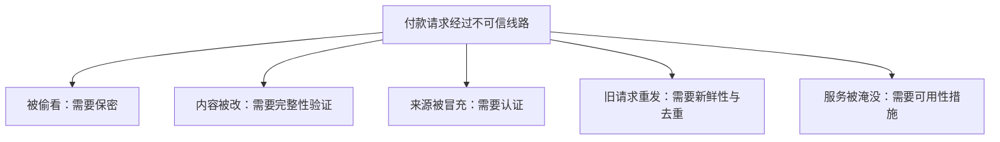
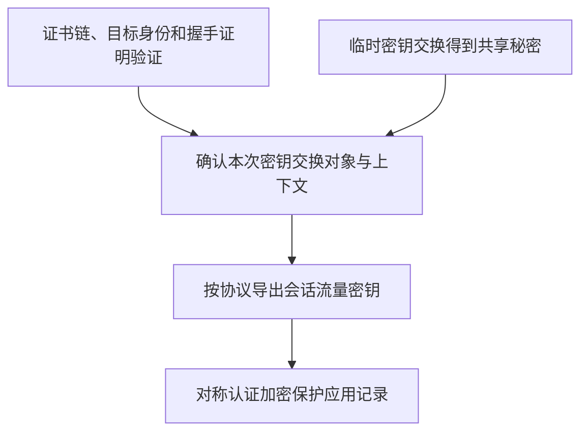
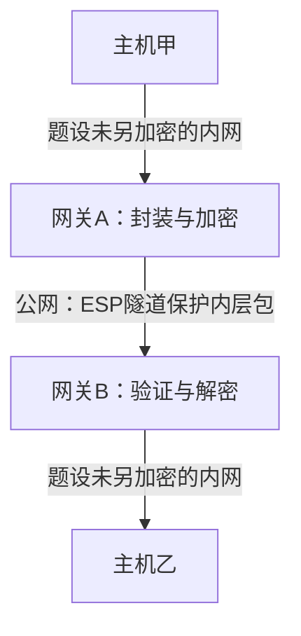

# 网络安全

本章回答：攻击者能看、改、冒充或重发数据时，需要怎样组合保护机制？学习顺序：

1. 先列攻击能力，再区分保密、完整性、认证和新鲜性。
2. 理解对称加密、一次一密与密钥重用风险。
3. 比较普通散列、MAC 和数字签名的验证者与保护范围。
4. 用小整数推演 RSA 与 DH，分开算术正确和安全条件。
5. 用证书绑定身份，用 TLS 组合认证与数据保护。
6. 画 VPN 的保护起止点，辨认仍可见的信息。

## 先问保护什么

甲给乙发送付款请求，旁观者可能偷看金额，攻击者可能修改收款人、冒充甲，或者原样重发昨天的合法请求。

不同攻击需要不同能力：保密性限制谁能读取，完整性检查内容有无被改，认证确认通信者或消息来源，新鲜性区分当前交互与旧消息，可用性要求服务仍能响应。

被动攻击只观察，主动攻击会插入、修改、删除或重放数据。加密不能自动解决拒绝服务，签名也不会自动隐藏内容。分析一道题时先写出攻击者能做什么，再看机制保护范围是否覆盖它。

## 对称加密怎样工作

设明文为 $m$，密文为 $c$，密钥为 $K$，加密写成 $c=E_K(m)$，解密满足 $D_K(c)=m$。对称加密双方共享秘密密钥，适合大量数据处理；难点之一是如何安全共享和管理密钥。

密钥长 $k$ bit 时有 $2^k$ 个候选，理想均匀密钥的穷举平均约尝试一半，但实际安全还取决于算法、模式和实现。

一次一密 OTP 用真正随机、与消息等长、秘密且只用一次的密钥，按位异或 $c=m\oplus K$。异或同一位两次会抵消，因此可解密。

异或比较对应位：相同得 0，不同得 1。例如 $1010\oplus1100=0110$，再与 1100 异或就恢复 1010。后面的密码算式与链路层 CRC 都用到这个运算。

重复密钥会破坏关键前提：$c_1\oplus c_2=m_1\oplus m_2$，泄露两个明文的关系。它未必立刻唯一确定两份明文，但已不具有一次一密的保证。

分组密码每次处理固定长度的数据块。经典 DES 的分组为 64 bit、有效密钥 56 bit；AES 分组 128 bit，密钥可为 128、192、256 bit。

认识这些参数是为了区分“块多长”和“密钥空间多大”，现实部署不能仅据历史课件的算法名称判断安全。

Feistel 结构把一块分为左右两半，一轮计算 $L'=R$、$R'=L\oplus F(R,K_i)$，$K_i$ 是轮密钥。恢复时由 $R=L'$、$L=R'\oplus F(L',K_i)$ 即可反推，因此轮函数本身不必可逆。AES 并不采用相同的 Feistel 结构。

- 多块消息还需要模式：ECB 对相同明文块产生相同密文块，容易暴露模式；
- CBC 使当前块与前一密文相关并使用 IV；
- CTR 加密计数器生成密钥流，要求同一密钥下避免重复计数输入。
- 普通加密模式不能自动认证数据，常采用带认证的加密 AEAD，同时保护保密性和完整性；
- nonce 重用等条件会影响其安全。

IV 是初始化向量，用来初始化一次加密；nonce 是按协议要求不重复使用的值。它们不必都保密，但随机性、唯一性等要求随具体方案而异，不能任意固定成相同值。

## 摘要与消息认证

散列 $H(m)$ 把任意长度消息变成固定长度摘要。抗原像要求难以从摘要反找消息，抗第二原像要求难以为给定消息找另一个同摘要消息，抗碰撞要求难以找到任意一对不同消息有相同摘要。

性质不同，不能合成一句“绝对没有重复”。

若同时发送消息和普通摘要，能修改二者的攻击者可把它们换成 $m'$ 与 $H(m')$，并不需要找到碰撞。

要验证来源，消息认证码 MAC 引入共享秘密：$t=\operatorname{MAC}_K(m)$，接收端使用同一密钥验证标签。HMAC 是规范构造，不应自行替换成任意“密钥拼接消息再散列”。

MAC 提供共享密钥范围内的来源与完整性验证，不自动保密，也不能让第三方判定究竟是哪位共享密钥者生成。

旧消息及旧标签原样重放仍可能有效，防重放还需经认证的序号、一次性挑战或时间等，并实际检查已用状态。

这里的 MAC 是 Message Authentication Code，即消息认证码，与数据链路层的 MAC 地址同名缩写但含义不同。

**标签**是随消息发送的认证结果；验证者用秘密密钥重算或按规定验证。

| 机制 | 验证需要什么 | 主要得到什么 | 单独使用的边界 |
|---|---|---|---|
| 普通散列 | 消息、公开算法 | 在摘要可信时比较内容 | 攻击者可同时替换消息与摘要 |
| 消息认证码 | 共享秘密密钥 | 来源与完整性验证 | 共享密钥者都能生成，不自动保密／防重放 |
| 数字签名 | 可信签名者公钥 | 公开可验证的来源与完整性 | 身份绑定和私钥安全仍是前提，不自动保密 |

## 公钥与数字签名

公钥体系使用一对相关密钥，公开公钥、保密私钥。面向乙的公钥加密让发送方使用乙的公钥，乙用自己的私钥解密；签名让甲用自己的私钥生成签名，其他人用可信甲公钥验证。两种操作的目的和密钥角色不同。

签名常对消息摘要及规定编码进行处理，验证支持消息完整性和签名密钥来源，内容可以仍公开。不可把任何签名算法都描述成“私钥加密”，也不能用功能可逆的算式替代一个完整安全方案。

### 练习 1

!!! question "题目"

    【自编】攻击者可修改线路上的消息和普通散列摘要。
    系统仅检查收到的摘要是否等于重算结果。
    攻击者把m与H(m)换成m′与H(m′)，会怎样？

    - A. 替换可通过检查，摘要缺少可信来源
    - B. 只要散列抗碰撞，这种替换必被发现
    - C. 只要摘要长度固定，这种替换必被发现
    - D. 替换虽能通过，但消息一定自动变密文

!!! success "参考解答"

    **答案：A。** 攻击者无需寻找碰撞，只需对新消息重新散列；未认证摘要不能独立证明来源，
    也不提供加密。

### 练习 2

!!! question "题目"

    【自编】甲只给公开公告附加数字签名，验证者持可信甲公钥。
    私钥未泄露且签名方案安全。哪项判断合理？

    - A. 公告得到来源与完整性验证，内容必被隐藏
    - B. 公告得到来源与完整性验证，内容仍可公开
    - C. 公告只能检查随机差错，来源无法得到验证
    - D. 公告只能防止旁人阅读，内容篡改无法检测

!!! success "参考解答"

    **答案：B。** 签名可公开验证消息与签名者密钥的关系，
    在可信公钥和私钥安全条件下支持来源与完整性；它不自动隐藏消息。

## RSA 的模运算

教学 RSA 选择不同素数 $p,q$，令 $n=pq$、$\varphi(n)=(p-1)(q-1)$，选与 $\varphi(n)$ 互素的 $e$，再找 $d$ 使 $ed\equiv1\pmod{\varphi(n)}$。裸算术模型中，整数消息 $0\le m<n$ 加密为 $c=m^e\bmod n$，解密为 $m=c^d\bmod n$。

模运算就是取除法余数：$17\bmod5=2$；同余符号表示除以指定模数后余数相同。互素表示最大公因数为 1，因而这里能找到所需的模逆数 $d$。公钥包含 $(n,e)$，私钥包含用于解密的 $d$ 等秘密信息。

!!! example "例子与推演"

    例如 $p=5,q=11$，则 $n=55,\varphi(n)=40$；取 $e=3,d=27$，因为 $81$ 除以40余1。消息 $m=7$ 加密为 $7^3\bmod55=13$。解密用平方取余避免写巨大数字：

    $$13^2\equiv4,\quad13^4\equiv16,\quad13^8\equiv36,\quad13^{16}\equiv31\pmod{55}.$$

    因 $27=16+8+2+1$，计算 $31\times36\times4\times13$ 并逐步取模，得到 7。小素数算例只演示可逆关系；现实安全还依赖足够强的参数、安全填充/编码以及完整协议，裸模幂不能直接用于部署。

    逐次取模的中间值是 $31\times36\bmod55=16$，再乘 4 得 $64\bmod55=9$，再乘 13 得 $117\bmod55=7$。每一步把大数缩到 0—54 之间，结果与最后一次统一取模相同。这种按指数二进制拆分、反复平方的方法叫平方乘法。

### 练习 3

!!! question "题目"

    【自编】教学裸RSA：p=3，q=11，e=3，d=7，明文整数m=4。只为模运算练习，不用于实际加密部署。

    - ① 验算ed与φ(n)关系，求密文与解密结果。
    - ② 同一OTP密钥k被用于两消息，$c_1=m_1\oplus k$，$c_2=m_2\oplus k$。异或两密文泄漏什么？
    - ③ 将裸RSA算通，是否足以证明实际方案安全？

!!! success "参考解答"

    **解答**

    - n=33，φ(n)=20；
    - ed=21，模20余1。
    - c=$4^3\bmod33=31$；
    - $31^7\bmod33=4$，恢复明文。
    - $c_1\oplus c_2=m_1\oplus m_2$，共用密钥被抵消；
    - 这泄漏两明文关系，不一定立即唯一恢复两份原文。
    - 玩具小模数易分解，裸模幂又缺安全编码/填充；
    - 功能可逆不等于符合现实安全要求。

    **判分要点**

    - 模数33、φ为20，密文31、解密4。
    - 写明OTP抵消关系，不夸称一定立即知全部明文。
    - 区分算术正确、参数强度与完整安全方案。

## 认证还需要新鲜性

付款请求即使 MAC 正确，也可能是上次交易的重放。

可把唯一订单号纳入认证范围，接收方将“检查未处理、执行、记为已处理”作为协调好的操作，防止两个并发副本都付款；去重记录还要覆盖允许重试的时期。

一次性随机挑战也必须被认证并确保不能重复使用。

挑战应绑定通信角色和上下文。若一个协议对任何挑战都用同一密钥给出相同形式的响应，攻击者可能在第二条会话把第一条会话的挑战反射回去，诱使受害者替自己计算回答。

区分发起方/响应方、方向和会话标识，可以防止这种跨会话搬用。

### 练习 4

!!! question "题目"

    【自编】系统验证消息MAC后立即执行付款。
    金额和订单号都在认证范围，但不记录处理过的订单。
    攻击者原样重发旧消息和旧MAC，能否通过密码验证？
    提出一个防止重复执行的改法，并说明新鲜性条件。

!!! success "参考解答"

    **解答**

    - 原样重放可能通过：消息与标签未改，MAC仍有效。
    - 把唯一订单号/请求编号纳入MAC认证范围，接收方原子地记录已处理编号，重复不再扣款。
    - 记录须覆盖允许重试/重放的有效期；
    - 也可用认证随机挑战并确保只用一次。
    - 只附加未认证编号、或仅重新计算MAC都不足。

    **判分要点**

    - 1分：MAC验证可能通过，完整性不等于新鲜性。
    - 1分：编号/挑战在认证范围，接收方检查状态。
    - 1分：处理与去重避免并发重复，或等价一次性设计。
    - 合理的认证时间戳方案也可，但须说明窗口内去重。

## DH 怎样建立密钥

Diffie–Hellman 让双方通过交换公开值得到相同秘密。教学模型给定素数 $p$ 和合适的生成元 $g$，甲秘密选 $a$，发 $A=g^a\bmod p$；乙秘密选 $b$，发 $B=g^b\bmod p$。

甲算 $B^a$，乙算 $A^b$，都得到 $g^{ab}\bmod p$。

!!! example "例子与推演"

    例如 $p=23,g=5,a=2,b=3$：甲发 $A=2$，乙发 $B=10$；甲算 $10^2\bmod23=8$，乙算 $2^3\bmod23=8$。窃听者看到公开值，在参数足够强时难以直接求秘密。

    但主动中间人可以替换 A、B，分别与两端建立不同密钥，因此裸 DH 没有认证对方身份。

两个结果为什么一致？甲把乙的公开值再做自己的秘密指数，得到 $(g^b)^a=g^{ab}$；乙得到 $(g^a)^b=g^{ab}$，同模数取余后相同。双方从未直接发送最终共享值。

主动中间人可以自行选秘密值、替换公开交换值，这种攻击依赖冒充能力，无需先解出甲乙原来的秘密。

用签名认证本次 DH 参数时，还要绑定双方身份和握手上下文。

若每次使用新的临时私有值、随后正确销毁，并满足完整协议的安全条件，未来长期认证密钥泄露不应直接解出过去会话，这叫前向安全；只把长期私钥用于解开所有历史会话密钥通常没有这种性质。

另一种分发方式是可信密钥分发中心 KDC。各用户先与 KDC 共享长期秘密，KDC 发给甲会话密钥及给乙的加密票据，甲再向乙出示票据并证明持有相应会话密钥。

票据、有效期和一次性认证信息承担不同职责；拿到票据不应自动获得永久、不需防重放的访问权。

## 公钥凭什么可信

证书把身份与公钥等信息绑定，由 CA 签名。验证证书要沿证书链验证签名，最终到本机已信任的根；还要检查目标身份、有效期、用途等，并按系统要求处理撤销状态。

自签名只表明由自身密钥签署，信任根必须来自预先信任，不能靠自己签自己证明可靠。

因此“签名算得正确”还不足以证明“这是我要访问的网站”。攻击者也可以有自己的合法证书，只是名字不同。本次握手签名还应覆盖正确参数与上下文，防止把别处合法签名搬到当前连接。

### 练习 5

!!! question "题目"

    【自编】教学DH选p=23、g=5，甲a=3、乙b=4。甲发$A=g^a\bmod p$，乙发$B=g^b\bmod p$。

    - ① 求A、B及双方共享值。
    - ② 攻击者可替换A和B。双方算到值是否就已认证对方？
    - ③ 用证书签名认证交换时，为什么还要核对目标身份、信任链，并绑定本次握手上下文？

!!! success "参考解答"

    **解答**

    - A=10，B=4；
    - 甲算$4^3\bmod23=18$，乙算$10^4\bmod23=18$，共享值相同。
    - 裸DH没有绑定身份，替换参数可形成两套密钥，攻击者分别与两端通信，故算出值不足以认证。
    - 证书需接到既有信任锚并匹配目标身份；
    - 签名还须绑定本次参数与上下文，阻止替换/跨会话搬用。

    **判分要点**

    - 两端独立模幂同为18。
    - 说明中间人无需破解离散对数也可替换交换。
    - 签名数学有效不是可信身份的全部条件。

## 安全通道怎样组合

TLS 把身份认证、密钥建立和记录保护组合起来。

以使用证书及临时密钥交换的现代握手为例：协商参数、交换密钥材料、验证证书及握手证明，再从共享秘密导出流量密钥，之后用对称认证加密保护数据记录。

证书不是拿来逐字节加密整张网页；不同 TLS 版本及恢复方式的具体报文顺序也不同。

公钥认证解决信任绑定，会话密钥用于后续大量数据的对称保护。

安全邮件可先签名消息，再生成随机内容密钥对消息及签名做对称加密，最后用接收方公钥保护该内容密钥。接收方先恢复密钥并解密，再验证签名。

签名用于来源和完整性，内容密钥用于批量保密，密钥封装用于让指定接收者取得它。

DNSSEC 为 DNS 数据提供可验证的来源和完整性链，不加密查询名字。DNS 的加密传输保护相应传输通道，但解析服务仍可能知道查询内容；两者保护范围不同。

## VPN 保护到哪里

IPsec 工作在网络层。AH 提供相应认证完整性能力，不提供保密；ESP 可以提供加密和完整性等能力，具体依配置。安全关联 SA 按方向管理，双向通信需要两个相应方向的关联。

传输模式主要保护上层载荷，隧道模式把原 IP 分组整体装入新 IP 分组。

主机甲经网关 A 与网关 B 建立的 ESP 隧道访问主机乙时，内层目的为乙，外层目的为网关 B。保护在 A、B 终止，甲到 A、B 到乙是否加密要另看。

外层地址、时序和包长等仍可见，因此 VPN 不能自动保证端到端全程保密或绝对匿名。

图中保护端点是两个网关，通信端点是两台主机。若要主机应用之间也受保护，还需另看 TLS 等端到端机制。

**安全关联 SA**保存一个方向所需的密钥、算法、序号等保护状态；反向通信需要反向状态。

防火墙按策略限制流量；无状态过滤按字段规则，状态检测关联已有连接状态。它不能凭空修复允许通过的应用漏洞。

无线安全也有自己的密钥层次：以 WPA2 密钥协商为例，共享的主密钥材料 PMK 与双方随机数、地址等用于导出会话密钥 PTK，四次握手确认持钥并安装相关密钥，口令并不以明文在这四条消息中传送。

无线链路加密只保护该无线链路，不能替代上层端到端保护。

### 练习 6

!!! question "题目"

    【自编】甲10.0.0.2经网关A到另一分部乙10.1.0.3。A与网关B之间建立ESP隧道，配置加密及完整性保护。两内网段没有另设加密；公网只转发外层IP。

    - ① 内、外层IP目的分别是谁？双向通信需几个方向SA？
    - ② 能否据此声称甲到乙全程加密且绝对匿名？
    - ③ 同时采用DNSSEC后，DNS查询名称是否自动保密？

!!! success "参考解答"

    **解答**

    - 内层目的为乙10.1.0.3，外层目的为网关B公网接口。
    - SA按方向管理，双向需要相应两个方向的SA。
    - 隧道保护在网关A、B终止；
    - 题设内网段未加密，不能据此声称主机到主机全程保密。
    - 外层地址、包长和时序仍可见，不是绝对匿名。
    - DNSSEC认证DNS数据来源/完整性，不加密查询名称。

    **判分要点**

    - 内外目的分清，SA方向正确。
    - 指出两个内网段与元数据边界。
    - DNSSEC的认证目标不同于DNS传输隐私。

## 记忆要点

!!! tip "本章记忆要点"

    - 先列攻击，再选能力：保密、完整性、认证、新鲜性、可用性各有目标。
    - 一次一密需要随机、等长、秘密、只用一次；复用密钥会泄露明文之间的异或关系。
    - 普通摘要须有可信来源；MAC 需共享秘密，签名需可信公钥，均不自动隐藏内容。
    - 模幂算通只证明教学关系；裸 DH 缺身份认证，裸 RSA 缺现实安全所需编码等条件。
    - 证书验证还要匹配目标身份、信任链、有效期与用途；握手绑定本次参数。
    - 防重放检查已用状态；通道保护范围由终止点决定，VPN 外层元数据仍可见。

上一章：[应用层](06-cn-application.md)。返回：[课程路线](index.md)。

