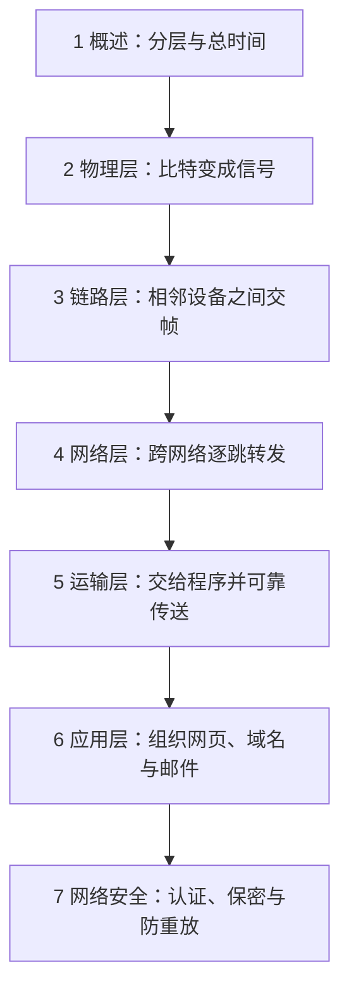

# 计算机网络

**沿着一份数据的旅程学习：信号怎样传，一跳怎样交付，跨网怎样找路，程序怎样可靠接收，应用怎样组织消息，安全机制怎样保护消息。** 本套笔记共 7 章、47 道已有练习，正文为唯一顺读教材。

## 课程路线

| 顺序 | 章节 | 本章最终能解释／计算 | 已有练习 |
|---|---|---|---:|
| 1 | [概述](01-cn-overview.md) | 分层封装、四种时延、流水线、有效速率和队列平均值 | 4 |
| 2 | [物理层](02-cn-physical.md) | 码元比特率、速率上限、线路编码、PCM、复用 | 5 |
| 3 | [数据链路层](03-cn-data-link.md) | CRC、重传窗口、竞争退避、交换机、无线、STP/VLAN | 8 |
| 4 | [网络层](04-cn-network.md) | 子网、ARP、最长前缀、分片、路由算法与协议、IPv6 | 8 |
| 5 | [运输层](05-cn-transport.md) | TCP 序号、连接状态、RTO、两个窗口、拥塞与媒体时序 | 8 |
| 6 | [应用层](06-cn-application.md) | DNS 查询、HTTP 时延与缓存、邮件编码、FTP、完整访问 | 8 |
| 7 | [网络安全](07-cn-security.md) | 保护目标、加密／认证／签名、RSA/DH、证书、TLS/VPN边界 | 6 |

## 阅读与记忆

每章先看开头的问题和学习顺序，再按正文读机制、已解例与相关练习。公式按“对象→单位→条件→代数步骤”使用；机制按“输入→本地状态→动作→对方结果”跟踪。章末记忆点用于读完回看，关键推导已放在正文中。

练习全部保留自原学习教材，题面标明【自编】，提供答案和判分要点。正文中的数值例子用于解释机制，亦为教学算例。它们不冒充历年原题、教师标准答案或今年考试预测；没有独立作答证据时，不将读完计作掌握。

## 来源与范围

现有七章依照已经建立的计网课程路线整理，参考历年浙大课程资料与学生笔记：

- [NoughtQ 浙大课程资源：CN-D3QD](https://github.com/NoughtQ/ZJU-Courses-Resources/tree/main/CN-D3QD)：历史作业、小测和术语；作者答案属于学生整理。
- [WintermelonC 计网课程笔记，固定提交版本](https://github.com/WintermelonC/WintermelonC_Docs/tree/12183f324d59df832add19b4bbe1bbb33f58a1b1/docs/zju/compulsory_courses/computer_network)：用于对照章节覆盖和术语，原笔记自述仅涵盖部分复习重点。
- 已有 ZJUCompNet 笔记、课程攻略复习资料、公开王道目录及相关笔记：用于本地备课交叉检查；未把商业教材全文复制进笔记。

本次出版补清了物理编码与采样、CRC 与窗口、子网与分片、路由迭代、TCP 字节与窗口等中间步骤，并将机制图改为 Mermaid。**今年本班课件、完整考纲和指定教材版本仍待核对，因此这里覆盖现有七章路线，不保证未知考试范围的全部细节。** 当前所列协议行为采用相应课堂模型和文中条件；实际版本或部署按另行给定条件判断。

返回：[三门课程总入口](../index.md)。
