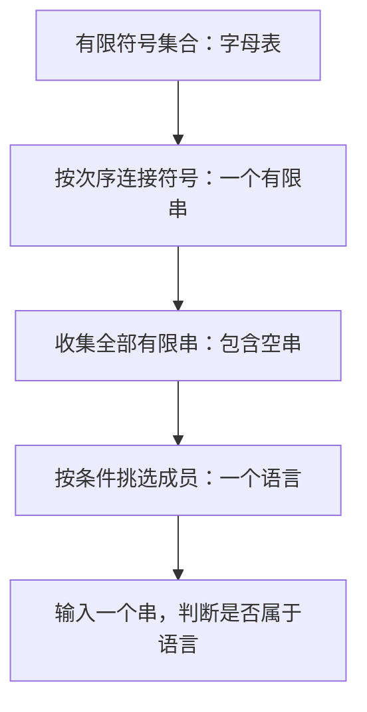

# 基础：集合、语言与证明

**本章问题：怎样把“合法输入”和“算法是否存在”写成可证明的数学命题？**

学习顺序：

1. 分清符号、字符串、集合和语言。
2. 读懂集合运算、函数与关系。
3. 按量词顺序理解“任意”和“存在”。
4. 用归纳、双向证明和闭包描述递归结构。
5. 用编号与对角法区分两种无限集合。

## 从串到语言

计算理论研究两件事：机器能识别哪些输入，以及哪些问题根本不存在算法。先把“输入”和“所有合法输入”分清，后面每一种机器都沿用这套记号。

字母表 $\Sigma$ 是有限符号集合。取 $\Sigma=\{a,b\}$，`abba` 是一个字符串，长度记作 $|abba|=4$。字符串中次序和重复都有意义；集合则不计次序和重复。长度为零的串记作 $\varepsilon$，所以 $a\varepsilon=\varepsilon a=a$。

$\Sigma^*$ 表示该字母表上的全部有限串，包括空串。语言 $L$ 就是 $\Sigma^*$ 的一个子集，例如“所有以a结尾的串”。一个串总是有限长，一个语言可以含无限多个串。

设 $A=\{\varepsilon,a\}$。$a\in A$ 表示a是其中一个元素；$\{a\}\subseteq A$ 表示集合中的每个元素都在A中。$\varnothing$ 是没有元素的空集合；$\{\varepsilon\}$ 有一个元素，该元素的长度是零。因此 $|\varnothing|=0$、$|\{\varepsilon\}|=1$、$|\varepsilon|=0$ 分别数的是不同对象。

A的幂集 $\mathcal P(A)$ 收集A的全部子集。例如 $\mathcal P(\{a,b\})=\{\varnothing,\{a\},\{b\},\{a,b\}\}$。n个元素各有选或不选两种独立决定，所以共有 $2^n$ 个子集。

语言也能运算。并 $A\cup B$ 收集两边成员，交 $A\cap B$ 只留共同成员，差 $A\setminus B$ 留A中不在B中的成员。补语言 $\overline A=\Sigma^*\setminus A$ 必须先固定字母表。

连接 $AB=\{xy:x\in A,y\in B\}$ 从两边各选一个串再拼接；$A^n$ 表示连接n次，约定 $A^0=\{\varepsilon\}$。星运算 $A^*=\bigcup_{n\ge0}A^n$ 允许任意有限次连接。

!!! example "例子与推演"

    例如 $A=\{a,bb\}$ 时，$A^2=\{aa,abb,bba,bbbb\}$，而 $A^*$ 还含空串、a、bb等。若 $B=\varnothing$，无法从B选任何串，所以 $AB=\varnothing$；但 $B^*=\{\varepsilon\}$，因为零次连接仍然允许。反转 $w^R$ 把串的次序倒过来，如 $(abb)^R=bba$；语言反转逐个反转成员。

若 $w=uv$，u叫前缀，v叫后缀；若 $w=uxv$，x叫子串，辅助串允许为空。因此空串及w本身都可以是w的前缀或后缀。连接一般不可交换，例如ab与ba不同；反转连接时还要交换顺序：$(uv)^R=v^Ru^R$。

### 四种对象先分清

| 对象 | 例子 | 能对它做什么 |
| --- | --- | --- |
| 符号 | $a$ | 作为字符串中的一位 |
| 字符串 | $ab$、$aa$、$\varepsilon$ | 求长度、连接、反转 |
| 字母表 | $\Sigma=\{a,b\}$ | 指定允许出现的符号 |
| 语言 | $L=\{\varepsilon,ab,aa\}$ | 判断成员、做并交补和连接 |

$\{x:P(x)\}$ 读作“所有满足条件 $P$ 的 $x$ 组成的集合”，冒号或竖线常都表示“满足”。$\in$ 表示属于，$\notin$ 表示不属于；$\subseteq$ 允许两个集合相等。

$|A|$ 对集合表示元素个数，$|w|$ 对串表示字符个数，先看竖线里的对象再解释。

!!! example "例子与推演"

    例如条件是“以 $a$ 结尾”，则 $a,ba,aa$ 属于语言，$b,ab,\varepsilon$ 不属于。语言无穷大时，仍可用有限条件定义它。$a^n$ 表示连续 $n$ 个 $a$，与集合的连接幂区分对象；$a^0=\varepsilon$。

## 量词与证明

$\forall$ 表示“每一个”，$\exists$ 表示“至少有一个”。在自然数 $\mathbb N=\{0,1,2,\ldots\}$ 上，$\forall n\exists m:m>n$ 为真：看到n之后选 $m=n+1$。

交换顺序得到 $\exists m\forall n:m>n$，就要求预先找到一个压过全部自然数的m；取 $n=m$ 即可反驳。**后选择的对象可以依赖前面的对象，反过来不行。** 泵引理的难点主要就在这个顺序。

- 否定量词时，逐层交换“所有”和“存在”，最后否定条件。
- 因此前一个命题的否定是 $\exists n\forall m:m\le n$。
- $P\Rightarrow Q$ 表示P成立时Q必成立；
- 证明它可以从P逐步推出Q，也可以证明逆否命题 $\neg Q\Rightarrow\neg P$。
- 逆命题 $Q\Rightarrow P$ 要另证。
- 要证两集合相等，通常分别证 $A\subseteq B$ 和 $B\subseteq A$；
- 只列若干共同元素不能完成证明。

蕴含的否定是“P成立且Q不成立”，因此反驳一个全称蕴含只需找一个满足前提、违反结论的反例。前提不成立的输入不能充当这样的反例。

反证法先假设结论不成立，推出矛盾。数学归纳法处理自然数：先证0成立，再假设任意n成立并证n+1成立。归纳步骤证明的是可重复的桥梁，列出0、1、2几个例子不能替代它。

### 练习 1

!!! question "题目"

    自编题。令 $A=\{\varepsilon,a\}$，$B=\varnothing$。

    - ① 求 $AB$、$A^2$、$B^*$。
    - ② 有人说“空语言含一个长度为0的串”。用元素个数与串长说明错在哪里。

!!! success "参考解答"

    **解答**

    - $AB=\varnothing$，因为无法从 $B$ 选串。
    - $A^2=\{\varepsilon,a,aa\}$。
    - 四种连接中，$\varepsilon a=a\varepsilon=a$ 重复。
    - $B^*=\{\varepsilon\}$，零次连接仍被允许。
    - 空语言的元素个数是0。
    - $\{\varepsilon\}$ 的元素个数是1，唯一元素长度为0。

    **判分要点**

    - 三个结果正确，并解释去重及零次连接。
    - 不把 $|\varnothing|=0$ 与 $|\varepsilon|=0$ 混成同一对象。

### 练习 2

!!! question "题目"

    自编题。在 $\mathbb N=\{0,1,2,\ldots\}$ 上判断：

    - ① $\forall n\ \exists m:m>n$。
    - ② $\exists m\ \forall n:m>n$。各写出理由，并写出
    - ①的否定。

!!! success "参考解答"

    **解答**

    - ① 真。
    - 给定 $n$ 后取 $m=n+1$。
    - ② 假。
    - 任何预先选定的 $m$，取 $n=m$ 即失败。
    - ①的否定为 $\exists n\ \forall m:m\le n$。
    - 存在量词的选择只能依赖此前给定的对象。

    **判分要点**

    - 给出依赖 $n$ 的构造和反例 $n=m$。
    - 否定时两个量词都翻转，$>$ 改为 $\le$。

### 把量词拆成动作

用 $P(n,m)$ 表示条件 $m>n$。两种次序对应不同任务：

| 命题 | 选择顺序 | 检查方法 |
| --- | --- | --- |
| $\forall n\exists m\ P(n,m)$ | 先给出任意 $n$，再为它选择 $m$ | 写一个依赖 $n$ 的规则，如 $m=n+1$ |
| $\exists m\forall n\ P(n,m)$ | 先固定一个 $m$，它必须应对所有 $n$ | 取 $n=m$ 即破坏条件 |

符号 $\neg$ 表示否定，$\land$ 表示且，$\lor$ 表示或，$\iff$ 表示“当且仅当”，要求两个方向都成立。

设 $P$ 是“数被 4 整除”，$Q$ 是“数为偶数”，则 $P\Rightarrow Q$ 为真；逆命题会被 2 反驳。逆否命题“数为奇数则不能被 4 整除”与原命题等价。

归纳法的写法也应显示依赖：证明基例；任选 $n$ 并假设命题在 $n$ 成立；在这个假设下推出 $n+1$ 成立。$n$ 代表任意一轮，因此桥梁可重复使用。

## 函数与关系

- 笛卡尔积 $A\times B$ 是全部有序对 $(a,b)$ 的集合。
- 关系 $R\subseteq A\times A$ 用 $aRb$ 表示 $(a,b)\in R$；
- 可把它画成有向边 $a\to b$。
- 函数 $f:A\to B$ 是每个输入恰有一个输出的关系。
- 单射要求不同输入输出不同；
- 满射要求B中每个元素都能输出；
- 双射同时满足两者。
- 例如 $f(n)=2n$ 从自然数到自然数是单射但不满射，从自然数到偶数集合则是双射。

双射可以把每个输出唯一地还原为输入，因而有定义在整个B上的逆函数 $f^{-1}:B\to A$。非满射会留下没有原像的元素，非单射会让原像不唯一。

等价关系满足自反、对称、传递：$aRa$；$aRb\Rightarrow bRa$；$aRb,bRc\Rightarrow aRc$。“两个整数同奇偶”满足三项，故把整数分为偶数与奇数两块。元素a的等价类 $[a]=\{b:aRb\}$ 包含与a等价的全部元素。

两类若共享元素，利用对称和传递便可证明它们相等；否则不相交。于是等价关系给出覆盖全集、互不重叠的划分。反过来，对任意划分规定“同一块中的元素相关”，三条性质立即成立。

- 偏序也要求自反与传递，但第二条是反对称：$aRb$ 且 $bRa$ 时必须 $a=b$。
- 集合包含关系是偏序，$\{a\}$ 和 $\{b\}$ 却互不包含。
- 若任意两元素都能比较，才叫全序。
- 最小元素不大于所有元素；
- 极小元素只要求没有比它更小的不同元素。
- 上述两集合构成的偏序中，两者都极小，却不存在最小元素。
- 对称和反对称也不是互相否定的说法；
- 只有自环的关系同时满足两者。

有限偏序常用Hasse图表示：较小元素放下方，只画直接相邻的比较边，省略自环和能由传递性推出的长边。例如 $1<2<3$ 只画1到2、2到3，1到3由路径表达。读图时要补回这些省略关系。

### 函数性质逐项检查

有序对 $(a,b)$ 的位置有意义，通常 $(a,b)\ne(b,a)$。若 $A=\{0,1\}$、$B=\{u,v\}$，则 $A\times B=\{(0,u),(0,v),(1,u),(1,v)\}$。从中挑若干对便得到关系；要求每个 $A$ 元素恰好出现为一个输入，才得到定义在整个 $A$ 上的函数。

对 $f:\mathbb N\to\mathbb N,f(n)=2n$：

| 性质 | 条件 | 本例检查 |
| --- | --- | --- |
| 单射 | $f(x)=f(y)\Rightarrow x=y$ | $2x=2y$ 推出 $x=y$ |
| 满射 | 每个目标元素 $b$ 都存在 $a$ 使 $f(a)=b$ | 目标中的 1 没有原像，失败 |
| 双射 | 同时单射、满射 | 将目标改成非负偶数集后成立 |

“同奇偶”关系中，$0\sim2$、$2\sim4$，于是 $0\sim4$；$\sim$ 在这里表示等价关系。类 $[0]$ 收集全部偶数，$[1]$ 收集全部奇数。每个元素只属于一个类，这正是“划分”的含义。

$[a]$ 的方括号代表一整个集合，后续自动机最小化也用这套记号。

- 偏序的“反对称”允许不同元素仅向一个方向相关；
- 若两个方向同时成立，它们必须相同。
- 在集合包含关系下，$\{a\}\subseteq\{a,b\}$，反方向不成立。
- 只含 $\{a\},\{b\}$ 的集合族中，两者均没有更小元素，故均极小；
- 它们互不比较，任何一个都不能作为最小元素。

## 从路径求闭包

关系复合要固定方向：这里 $(a,c)\in S\circ R$ 表示存在b，使 $aRb$ 且 $bSc$，即先R后S。$R^k$ 表示恰走k条R边可到达，$R^0$ 是全部自环。

| 闭包 | 定义 | 允许的路径 |
| --- | --- | --- |
| 正传递闭包 | $R^+=\bigcup_{k\ge1}R^k$ | 允许至少一步； |
| 自反传递闭包 | $R^*=\bigcup_{k\ge0}R^k$ | 还允许原地零步。 |

正闭包也可能有自环，只要原图存在回路。

!!! example "例子与推演"

    - 例如在 $\{0,1,2\}$ 上有边 $0\to1,1\to2$，则正闭包增加 $0\to2$；
    - 自反传递闭包再增加三个自环。
    - 它仍不对称，因而不是等价关系。
    - 若求最小等价关系，则把边视为双向连接，同一个连通块内补全所有有序对；
    - 本例三个元素成为一类。

顶点较多时，用布尔表D记录可达性：有边填真，无边填假。依次允许顶点k作为中途节点，对每对i、j更新

$$D[i,j]\leftarrow D[i,j]\lor(D[i,k]\land D[k,j]).$$

这里 $\lor$ 是“或”，$\land$ 是“且”。新路径要么不经过k，要么由 $i\to k$ 与 $k\to j$ 拼接。处理完第k轮，D恰记录只使用已处理顶点作为中途点的路径，这就是循环正确性的理由。

上例处理顶点1时，$D[0,1]$ 与 $D[1,2]$ 均真，故将 $D[0,2]$ 置真。求 $R^*$ 时初始再把对角线置真；求 $R^+$ 时保留原始对角线即可。有限顶点带来有限轮次，算法会结束。

### 练习 3

!!! question "题目"

    自编题。取 $A=\{0,1,2,3\}$，关系为$R=\{(0,1),(1,0),(1,2)\}$。

    - ① 列出 $R^+$ 与 $R^*$，解释自环差异。
    - ② 求包含 $R$ 的最小等价关系所对应的划分。说明为何 $R^*$ 还不是该等价关系。

!!! success "参考解答"

    **解答**

    - $R^+=\{(0,0),(0,1),(0,2),$$(1,0),(1,1),(1,2)\}$。
    - 0、1之间的正长环产生两条自环。
    - 2、3没有出边，正长路径不能从它们返回自身。
    - $R^*=R^+\cup\{(2,2),(3,3)\}$。
    - 它允许零步，因此全部元素都有自环。
    - 最小等价关系的划分为$\{\{0,1,2\},\{3\}\}$。
    - 对称性先迫使加入 $(2,1)$，传递性再连接0与2。
    - 等价关系还须包含各块内的全部有序对。
    - $R^*$ 缺 $(2,1),(2,0)$，不对称。
    - 3只需与自身关联，不必与其他元素合并。

    **判分要点**

    - 正闭包恰有6对，自反传递闭包恰有8对。
    - 用正长环与零步区分自环来源。
    - 给出两块划分，并解释对称性缺失。
    - 不能把“传递闭包”直接当成等价关系闭包。

### 可达表怎样更新

取 $0\to1\to2$。表中 1 表示存在正长路径，0 表示目前未找到；行是起点，列是终点：

| 阶段 | 第 0 行 | 第 1 行 | 第 2 行 |
| --- | --- | --- | --- |
| 初始，只记原边 | 0 1 0 | 0 0 1 | 0 0 0 |
| 允许 0 作中途点 | 0 1 0 | 0 0 1 | 0 0 0 |
| 允许 1 作中途点 | 0 1 1 | 0 0 1 | 0 0 0 |
| 允许 2 作中途点 | 0 1 1 | 0 0 1 | 0 0 0 |

第二轮补出的 $(0,2)$ 来自 $0\to1$ 与 $1\to2$。若求自反传递闭包，初始三行分别改为 1 1 0、0 1 1、0 0 1，零步路径便一直保留。

这里关系的 $R^*$ 通过“重复走边”定义；语言的 $L^*$ 通过“重复连接串”定义，两者共享零次或多次的思路，处理的对象不同。

## 递归对象怎么证明

- 合法括号串可以用有限规则定义：空串合法；
- 若u、v合法，则 `(u)v` 合法；
- 除此之外没有成员。
- 最后一句表示取满足规则的最小集合，防止任意加入非法串。
- 规则可重复任意有限次，因此有限规则也能描述无限语言。

结构归纳沿构造过程证明性质。要证每个合法括号串左右括号一样多：空串两边都是零；假设u、v各自配平，构造 `(u)v` 只是在两者原有数量之和上各加一，仍配平。

同一步也证明串长为偶数。但数目配平还不够，`)(` 就不合法。

准确判据是：总数配平，且每个前缀的左括号数不少于右括号数。生成规则显然保持这一性质。

反向，对非空且满足判据的串，找到与第一个左括号配对的右括号，也就是累计差第一次回到零的位置，便分解为 `(u)v`；u、v更短且同样满足判据。

按长度归纳，它们都能生成，于是整个串也能生成。这种“生成规则推出性质，再由性质拆回规则”的双向证明会用于文法。

### 练习 4

!!! question "题目"

    自编题。括号集合 $B$ 是以下规则生成的最小集合：$\varepsilon\in B$；$u,v\in B$ 时 $(u)v\in B$。

    - ① 结构归纳证明：串长为偶数且左右括号数相等。
    - ② 这两个条件足以推出属于 $B$ 吗？给反例。
    - ③ “规则有限，所以 $B$ 有限”错在哪里？

!!! success "参考解答"

    **解答**

    - 基例为空串：长度0，两种括号数均0。
    - 设 $u,v$ 长度为偶数且各自左右配平。
    - 新串长度为 $|u|+|v|+2$，仍是偶数。
    - 左右括号数各为两子串相应数量之和再加1，仍相等。
    - 对两个子对象都使用归纳假设，覆盖唯一构造规则。
    - 反例为 )(：长度2、数量相等，却不是合法括号串。
    - 任何非空生成串都以左括号开始，故反例不属于 $B$。
    - 有限的是描述规则，生成次数没有统一上界。
    - 反复取 $u=\varepsilon$、令 $v$ 为已有串，得到 $(),()(),()()(),\ldots$，长度不同故互不相同。
    - 因此 $B$ 无限；
    - 每个具体生成串仍有限长。

    **判分要点**

    - 基例、两个归纳假设、构造后两项性质齐全。
    - 反例同时满足两个数值条件但确实不可生成。
    - 用无限多个不同串反驳有限性，而非只说“可以递归”。
    - 可接受其他合法无限族及结构归纳写法。

## 无限集合能否编号

可数表示元素能用自然数编号，允许有限集合。全部有限串可先按长度、同长度按字母顺序排列，称长度字典序；每个串前面只有有限多个串，故最终都能轮到。

单用字典序可能一直列a、aa、aaa而轮不到b。

两个可数集合的乘积也可数：把编号对 $(i,j)$ 按和 $i+j=0,1,2,\ldots$ 分层列出，每层只有有限对。例如依次是 $(0,0)$；$(0,1),(1,0)$；$(0,2),(1,1),(2,0)$。编号公式可取 $(i+j)(i+j+1)/2+j$，每层紧接上一层，且层内j不同，故无遗漏和重复。

鸽巢原理说，把n+1件物品放进n个盒子，至少一盒放两件。有限状态机器读取足够长的串时，总会重复状态，后面正是借此证明泵引理。

全部有限串可数，但全部语言不可数。假设在非空有限字母表上，所有语言能列成 $L_0,L_1,\ldots$，同时将串列成 $s_0,s_1,\ldots$。构造

$$D=\{s_i:s_i\notin L_i\}.$$

对任意j，D与 $L_j$ 在 $s_j$ 上恰好相反，故D不等于列表中任何语言，矛盾。这叫对角法。注意区分“每个语言的成员可数”和“全部语言组成的集合可数”，前者不能推出后者。

每份程序是有限串，因此所有程序只有可数多个；每份程序至多识别一个语言，而语言不可数，故必存在任何程序都无法识别的语言。

这个计数论证证明存在性；要指出某个具体问题不可计算，还需要后面学的归约和自指证明。

### 练习 5

!!! question "题目"

    自编题。
    某证明说：“$\Sigma^*$ 可数，
    所以它的子集组成的集合也可数。”
    取非空有限字母表，找出错误。
    假设全部语言排为 $L_0,L_1,\ldots$，
    构造一个不在表中的语言，并证明。

!!! success "参考解答"

    **解答**

    - 单个子集可数，不代表全部子集组成的集合可数。
    - 将全部字符串列为 $s_0,s_1,\ldots$。
    - 定义 $D=\{s_i:s_i\notin L_i\}$。
    - 对任意编号 $j$，有$s_j\in D\iff s_j\notin L_j$。
    - 所以 $D\ne L_j$，且 $D\subseteq\Sigma^*$ 仍是语言。
    - $D$ 不在号称完整的列表里，矛盾。
    - 非空字母表保证 $\Sigma^*$ 为可数无限集。

    **判分要点**

    - 区分一个语言和全体语言两个集合层次。
    - 构造合法语言 $D$，对任意 $j$ 指明差异元素。
    - 只比较有限几个语言或说“无限所以不可数”不成立。

## 记忆要点

!!! tip "本章记忆要点"

    - 先分对象：$\varepsilon$ 是串，$\varnothing$ 是空集合，$\{\varepsilon\}$ 是含一个串的语言。
    - 量词按从左到右选择；否定时逐层交换 $\forall/\exists$，再否定条件。
    - 函数先检查每个输入唯一输出，再检查单射和满射；目标集合会影响满射。
    - 等价类构成划分；传递闭包只补路径，等价关系还要求对称。
    - 集合相等和构造正确性通常分两个方向证明。
    - 全部有限串可数，全部语言不可数；有限描述也能产生无限集合。

## 对应习题集

《计算理论分章习题集.pdf》的本章题目在 **PDF 第 8–30 页**（阅读器页序）。按[习题集学习路线与代表题](06-practice-route.md)先完成对应代表题，再挑本章未见题练习。

