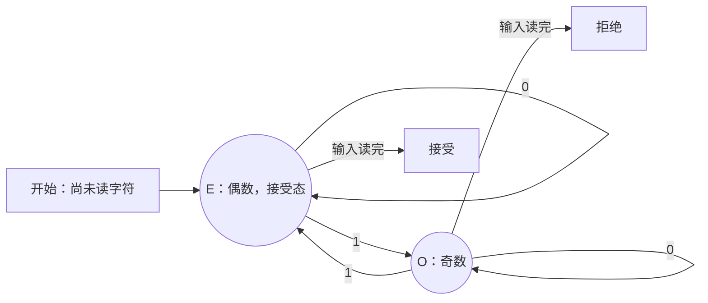
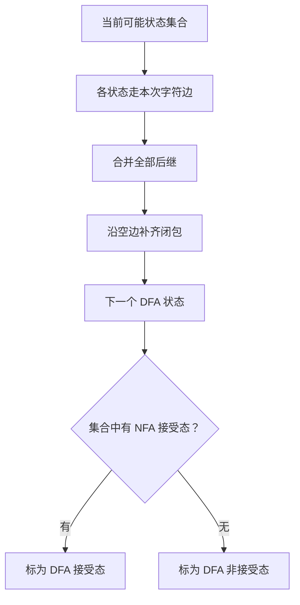
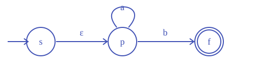
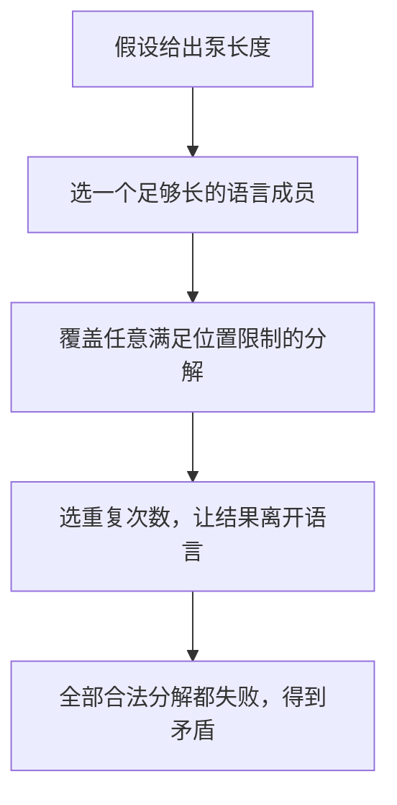

# 正则语言与有限自动机

**本章问题：只保存有限种记忆，能判断哪些字符串条件？怎样证明某个条件超出了这种能力？**

学习顺序：

1. 给每个状态一个准确含义，建立 DFA 的运行不变式。
2. 用状态集合同时记录 NFA 的全部分支。
3. 在机器和正则表达式之间转换。
4. 用积机组合条件，用等价后缀合并状态。
5. 用 Nerode 或泵引理证明非正则，再学习有限图上的判定。

## 状态就是有限记忆

检查二进制串中1的个数是否为偶数，不必记下整个输入，只需记“目前为偶数”或“目前为奇数”。每读到0，状态不变；每读到1，在两态间切换。开始时个数为零，处于偶数态；输入读完时在偶数态就接受。状态的含义贯穿整个运行，这称为不变式：初始成立，每步保持，所以最后的判断可靠。

确定性有限自动机DFA写作 $M=(Q,\Sigma,\delta,q_0,F)$：Q为有限状态集，$\Sigma$ 为输入字母表，$q_0$ 为初态，$F\subseteq Q$ 为接受状态集，$\delta:Q\times\Sigma\to Q$ 为转移函数。每个“状态、输入符号”组合都必须恰有一个后继；不允许的情况可以统一走向永不接受的死状态。到过接受态还不够，必须**读完全部输入**才检查当前态。

扩展转移 $\delta^*(q,w)$ 表示从q读完整串w的结果：$\delta^*(q,\varepsilon)=q$，$\delta^*(q,wa)=\delta(\delta^*(q,w),a)$。机器语言为 $L(M)=\{w:\delta^*(q_0,w)\in F\}$。能被DFA接受的语言称为正则语言。

### 跑一次奇偶机器

用 $E$ 表示目前有偶数个 1，用 $O$ 表示奇数个 1：

| 状态 | 读 0 | 读 1 | 输入读完后接受吗 |
| --- | --- | --- | --- |
| $E$，初态 | $E$ | $O$ | 是 |
| $O$ | $O$ | $E$ | 否 |

读 `1011` 时，状态依次为 $E\to O\to O\to E\to O$，因此拒绝；空串保持在 $E$，因此接受。图中的“接受态”只是允许在输入结束时通过检查；读入过程中仍须沿边继续运行。

$\delta$（读作 delta）处理一个字符，$\delta^*$ 处理一个完整串；这里上标星表示扩展到串的函数。递归式中的 $w$ 是已读前缀，$a$ 是追加的一个符号：先求读完 $w$ 的状态，再用 $\delta$ 处理 $a$。

## 多条路如何模拟

非确定有限自动机NFA允许一次有多条后继，且可用 $\varepsilon$ 边不消耗输入。接受条件是存在一条读完输入并到终态的路径；失败路径不妨碍成功路径。$E(S)$ 表示从集合S出发只走空边可到达的全部状态，包含S本身，也要沿连续空边一直找下去。

把NFA变成DFA时，一个新状态记录原机目前的**全部可能状态**。初态为 $E(\{q_0\})$；在集合S读a，先从每个旧态走a边，再取空闭包：$T=E(\bigcup_{q\in S}\delta(q,a))$。T若有旧终态，新状态就是终态。只生成可达集合；空集也是合法的死状态。n个旧态最多给出 $2^n$ 个集合。

对允许空边的 NFA，转移函数可写为 $\delta:Q\times(\Sigma\cup\{\varepsilon\})\to\mathcal P(Q)$，输出是状态集合；没有边时输出空集。$\bigcup$ 表示把一批集合的成员合在一起。确定化规则可以分成三个动作：从集合中每个状态走同一个字符的边；合并结果；补齐可走空边的后继。上一步已有但这次无后继的状态会消失。

完整例：NFA仅有 $s\xrightarrow{\varepsilon}p$、$p\xrightarrow{a}p$、$p\xrightarrow{b}f$，s初始、f接受。空闭包 $E(\{s\})=\{s,p\}$，$E(\{p\})=\{p\}$，$E(\{f\})=\{f\}$。记 $A=\{s,p\},B=\{p\},C=\{f\},T=\varnothing$，逐个处理得到：

空边不读字符，p上的自环允许任意多个a。

| 新状态 | 读a | 读b | 接受吗 |
| --- | --- | --- | --- |
| A，初态 | B | C | 否 |
| B | B | C | 否 |
| C | T | T | 是 |
| T | T | T | 否 |

A、B、C、T分别由空串、a、b、bb到达。该机接受零个或多个a后接恰一个b。子集构造为什么正确？对已读前缀归纳：初态收齐全部空步可能性；下一字符的计算收齐所有读字符和后续空步。因此每一步集合都不多不少，读完时含终态恰好等价于旧机有成功路径。

### 练习 1

自编题。
有NFA状态 $r,s,f$，初态 $r$，终态仅 $f$。
边为 $r\xrightarrow{\varepsilon}s$、
$s\xrightarrow{a}s$、$s\xrightarrow{a}f$；其余无边。
① 写出确定化初态及读 aa 后各状态集合。
② 若直接交换NFA终态，为何不是取补？

**解答**

初态为 $\{r,s\}$，空闭包包括自身。
读第一个 a 后为 $\{s,f\}$。
读第二个 a 后仍为 $\{s,f\}$，所以接受 aa。
交换终态后 $r,s$ 接受，$f$ 不接受。
aa 仍有始终留在 $s$ 的成功路径，仍被接受。
原机也接受 aa，因此新机不识别补语言。
正确办法是先确定化、补全，再交换终态。

**判分要点**

起点不漏 $s$，转移不把已死去分支永久保留。
给出同一个串被原机与交换终态机同时接受的证据。
解释NFA接受只需存在成功路径。

### 从具体集合算后继

沿用上表，从 $A=\{s,p\}$ 读 $a$：

1. $s$ 无 $a$ 边，贡献 $\varnothing$；$p$ 的 $a$ 边回 $p$，贡献 $\{p\}$。
2. 合并得 $\{p\}$，空闭包仍为 $\{p\}$，故到 $B$。
3. 再读 $b$ 得 $\{f\}$，故到 $C$；再读任意字符得空集 $T$。

所以 `ab` 的运行是 $A\to B\to C$，接受；`abb` 是 $A\to B\to C\to T$，拒绝。空集后没有任何运行分支，之后的集合仍为空。

## 表达式与机器互换

正则表达式从 $\varnothing$、$\varepsilon$ 和单字符开始，用并、连接、星组合。$a^*b$ 描述上一节的语言；$(ab\cup ba)^*$ 描述由ab或ba块拼出的串。连接优先于并，括号可消除歧义。表达式里的星作用于前面的整个对象。

表达式转NFA只需三种组装动作。并：新初态用空边连接两个分支的初态，两支终态用空边连接新终态。连接：第一台的终态以空边进入第二台初态。星：新增初终点并允许直接空路通过；旧终态既能空步回旧初态重复，又能空步退出。基本字符用一条字符边，空串用空边，空语言不设成功路径。按表达式结构归纳，每个积木和其语言运算一致，所以整台机器接受所需语言。

反方向用状态消去：给机器新增唯一初态和终态，用空边接入接出，边标签允许是表达式。缺边视作 $\varnothing$，平行边用并合并。消去状态k时，对所有保留的i、j更新：

$$R_{ij}\leftarrow R_{ij}\cup R_{ik}(R_{kk})^*R_{kj}.$$

$R_{ij}$ 为i到j的原标签。新增加的路径先到k，在k循环任意次，再离开；原来绕过k的路径也要保留。一次消去先保存旧标签，再对所有入边、出边组合更新，避免漏掉分支。只剩新初终点时，连接它们的标签就是答案。

上一节例子消去p，得到 $\varnothing\cup\varepsilon a^*b=a^*b$。这里自环a一定加星，表示可重复零次或多次；因此b接受，空串不接受。消状态保持的是所有成功路径的标签集合，与子集构造保持的运行集合相呼应。

### 练习 2

自编题。
字母表为 $\{a,b\}$，NFA初态 $s$、唯一终态 $f$。
仅有 $s\xrightarrow{\varepsilon}p$、
$p\xrightarrow{a}p$、$p\xrightarrow{b}f$。
① 写全部可达DFA子集及两种输入的后继。
② 消去 $p$，计算 $s$ 到 $f$ 的表达式标签。
③ 说明两种结果为何接受同一语言，并检查空串。

**解答**

令 $A=\{s,p\},B=\{p\},C=\{f\},T=\varnothing$。
初态为 $A$，唯一接受子集为 $C$。
按输入 a、b 的次序，各行后继为：
$A:(B,C)$；$B:(B,C)$；$C:(T,T)$；$T:(T,T)$。
可达见证依次为 $\varepsilon,a,b,bb$。
GNFA消去 $p$ 后，唯一成功路径标签为
$\varnothing\cup\varepsilon a^*b=a^*b$。
必须先在 $p$ 上读零个或多个a，再读一次b到f。
f没有出边，故之后不能再有字符；空串不接受。
子集构造记录原机读完各前缀后的全部可能状态，
消状态则概括同一批成功路径，所以语言不变。

**判分要点**

初始空闭包包含s和p，空集状态保留且完整。
消去公式含自环的星，不能误写为ab。
解释允许零个a但必须有一个b；拒绝空串。
状态命名不同、后续再合并A与B均可。

### 消去公式逐项代入

消去 $p$ 前，取 $R_{sf}=\varnothing$、$R_{sp}=\varepsilon$、$R_{pp}=a$、$R_{pf}=b$，因此：

$$
\begin{aligned}
R'_{sf}
&=R_{sf}\cup R_{sp}(R_{pp})^*R_{pf}\\
&=\varnothing\cup\varepsilon a^*b\\
&=a^*b.
\end{aligned}
$$

撇号表示更新后的标签。三段连接对应“进入 $p$、在 $p$ 循环、离开 $p$”。空语言与任何语言连接都为空，空串作为连接因子不改变串；这两条规则会大量用于化简。没有自环时标签为 $\varnothing$，其星为 $\{\varepsilon\}$，因此仍可直接经过该状态一次。

## 两个条件同时记

要识别两个正则语言的交，可以同时运行两台DFA。新状态是 $(p,q)$，读a变为 $(\delta_1(p,a),\delta_2(q,a))$。交集要求两个分量都接受；并集要求至少一个接受；差集要求第一个接受且第二个拒绝。这称积自动机。每个分量一直记录对应旧机的状态，故三个构造直接成立。

补语言只需在完整DFA中交换接受与拒绝态；NFA不能直接这样交换，因为“存在成功路径”的否定是“所有路径都失败”。连接和星用刚才的空边组装法，所以正则语言对并、交、补、差、连接、星封闭。“封闭”指做完运算仍在同一类语言里。反转则将NFA全部边反向，把旧终态作为新起点集合，旧初态作为唯一新终态；用一个新增初态的空边统一多个起点。

### 练习 3

自编题。
在字母表 $\{0,1\}$ 上构造DFA，
接受“1的个数为偶数且以0结尾”的串。
写状态含义、初态、转移和接受态。
用不变式说明正确，并检查空串。

**解答**

状态为 $(p,z)$，其中 $p\in\{E,O\}$ 记1的奇偶。
$z\in\{Y,N\}$ 记当前串是否以0结尾。
初态 $(E,N)$；接受态只有 $(E,Y)$。
对任意 $p,z$，读0转到 $(p,Y)$。
读1转到 $(\bar p,N)$，其中 $\bar E=O,\bar O=E$。
空前缀符合初态含义。
追加0保留奇偶并使后缀条件真；追加1则翻转并置假。
归纳后，任意前缀的两分量都精确记录所述条件。
读完接受当且仅当两条件同时成立；空串拒绝。
等价的完整转移表或状态重命名也可。

**判分要点**

所有状态对0、1都有转移，初态拒绝空串。
接受条件取“且”，不误取“或”。
给出基例与两种追加字符的更新理由。

## 哪些状态能合并

两个状态等价，要求接上**任意同一后缀**，接受结果都相同。当前都拒绝只能说明空后缀没有区别，不能说明以后没区别。最小化先删不可达态，再把接受态与非接受态分成两块；在每轮中，对各状态记录每个字符后继落在哪一块，签名不同就分开，直到不再分裂。同一块的状态合并，转移目标仍有确定的块。

对A、B、C、T表，初始划分为 $\{C\},\{A,B,T\}$。读b时A、B去接受块，T留非接受块，故下一轮是 $\{C\},\{A,B\},\{T\}$。它已经稳定：A、B的a、b后继块都相同。三个新态两两可区分：C与其他态用空后缀；AB块与T用后缀b。因此三态机已最小。

若从“已读前缀”出发，定义 $x\equiv_L y$ 当且仅当对每个后缀z，$xz\in L\iff yz\in L$。这是Nerode等价关系。不同等价类必须被机器区分，否则相同状态遇到区分后缀会作出相同判断，矛盾。

Myhill–Nerode定理：L正则，当且仅当该关系只有有限多个类。正向：DFA中到同一状态的前缀一定等价，故类数不超过状态数。反向：以类 $[x]$ 为状态，初态 $[\varepsilon]$，读a转到 $[xa]$，包含L成员的类接受。若换代表元y，$x\equiv_L y$ 保证 $xa\equiv_L ya$，所以转移定义良好。由前缀归纳，读w恰到 $[w]$，于是识别L。此构造达到类数下界；最小机除状态名称外唯一。

例如 $\{a^nb^n:n\ge0\}$ 中的前缀 $\varepsilon,a,aa,\ldots$ 两两不等价：对 $i\ne j$，后缀 $b^i$ 使 $a^ib^i$ 接受、$a^jb^i$ 拒绝。等价类无限，故非正则。

### 练习 4

自编题。
令 $L=\{w\in\{a,b\}^*:w\text{中a的个数被3整除}\}$。
① 构造三状态DFA，说明状态含义及全部转移。
② 用Nerode关系证明三个状态确实最少。
请给前缀 $\varepsilon,a,aa$ 每一对的区分后缀。

**解答**

状态 $q_0,q_1,q_2$ 记录a的个数除以3的余数。
初态和唯一终态是 $q_0$。
读a由 $q_i$ 到 $q_{(i+1)\bmod3}$；读b保持。
由前缀长度归纳，余数含义始终成立。
前缀 $\varepsilon,a,aa$ 分别到三个状态，故都可达。
$\varepsilon$ 与a用空后缀区分：前者属于L，后者不属于。
$\varepsilon$ 与aa也用空后缀区分。
a与aa用后缀a区分：aa不属于L，aaa属于L。
所以这三个前缀两两不Nerode等价，至少需三个状态。
已有三状态构造达到下界，故最小。
同余数的任意前缀接同一后缀后余数仍相同，
因此这里恰好三个等价类，没有遗漏更多类别。

**判分要点**

转移完整，接受余数0且包含空串。
每一对都给同一个后缀下相反的成员结论。
下界与可实现上界结合，不能只说“记三个数所以最小”。
其他正确区分后缀均可。

### Nerode 的两个方向

这里 $z$ 是接在前缀之后的任意串。若 $xz$ 与 $yz$ 有一次成员判断不同，就找到了**区分后缀**，从而 $x\not\equiv_L y$。同一类前缀拥有完全相同的未来接受行为。

| 证明方向 | 构造／推理 | 为什么有限 |
| --- | --- | --- |
| 已有 DFA → 有限等价类 | 到达同一状态的前缀，接任何后缀都同判 | 不同类必须到不同状态，类数至多状态数 |
| 有限等价类 → 构造 DFA | 每个类作一个状态，读 $a$ 后从 $[x]$ 到 $[xa]$ | 假设中类数已经有限 |

反向尤其要检查代表元：若 $[x]=[y]$，任意后缀 $z$ 都有 $x(az)\in L\iff y(az)\in L$；于是 $xa\equiv_L ya$，即 $[xa]=[ya]$。同一个类无论用哪个代表描述，后继类一致，转移才能成为函数。接受状态也良好定义：取后缀 $\varepsilon$，同类成员要么全属于 $L$，要么全不属于。

## 泵引理怎样使用

有p个状态的DFA读一个长度至少p的成功输入时，前p个字符产生p+1个状态记录，必有重复。重复前的部分叫x，绕回同状态的非空部分叫y，余下叫z。这个环走零次或多次，余下路径都可照走。因此若L正则，存在整数p，使每个 $w\in L,|w|\ge p$ 都能分成 $w=xyz$，满足 $|xy|\le p,|y|\ge1$，且每个 $i\ge0$ 都有 $xy^iz\in L$。

非正则证明的动作顺序是：假设有p；按p选w；对任意合法分解都找一个破坏语言的i。不能自己挑一个方便的y后就结束，因为引理只保证至少存在一种好分解。

仍以 $L=\{a^nb^n:n\ge0\}$ 为例。取 $w=a^pb^p$。任意满足位置限制的y都位于前p个a中，所以 $y=a^k$ 且 $k\ge1$。取 $i=0$ 删除它，得到 $a^{p-k}b^p$，两段数量不等，不在L中。这个结论涵盖全部合法分解，与引理矛盾。泵引理是正则性的必要条件；某语言满足它，仍不能仅凭这一点证明正则，证明正则应构造机器或表达式。

### 练习 5

自编题。
要证明 $L=\{0^n1^{2n}:n\ge0\}$ 非正则。
有人取 $w=0^p1^{2p}$，指定 $y=0$ 后删去它，
便宣布证明完成。漏洞是什么？补成完整证明。

**解答**

不能只反驳自己指定的一种分解。
反设 $L$ 正则，取泵长度 $p\ge1$。
$w=0^p1^{2p}\in L$ 且 $|w|=3p\ge p$。
任取合法 $w=xyz$，$|xy|\le p$ 且 $|y|\ge1$。
前 $p$ 位全为0，故 $y=0^k$，$1\le k\le p$。
取重复次数 $i=0$，得 $0^{p-k}1^{2p}$。
因 $2p\ne2(p-k)$，新串不在 $L$。
所有合法分解都失败，与泵引理矛盾。

**判分要点**

写明反设、泵长度、所选串归属和长度条件。
覆盖任意合法分解，不固定 $k=1$。
指定 $i=0$ 并用计数等式不成立得到矛盾。

### 泵引理的量词顺序

将“足够长且属于语言”称为合格输入，将长度限制称为合格分解，则正则语言必须满足：

$$\exists p\ge1\quad\forall\text{合格 }w\quad\exists\text{合格 }(x,y,z)\quad\forall i\ge0:\ xy^iz\in L.$$

要反驳这件事，动作顺序随否定翻转：**任意 $p$ → 选择一个合格 $w$ → 对每种合格分解 → 选择一个破坏它的 $i$**。所选 $w$ 可依赖 $p$，所选 $i$ 可依赖分解。

对 $a^pb^p$，前 $p$ 位全是 $a$，所以任意允许的非空 $y$ 都只能是 $a^k$。删除它破坏数量相等；这里能统一取 $i=0$，不需要分别枚举各个 $k$。

## 有限图上的判定

DFA只含有限状态，许多问题可化为有限图搜索。语言为空，当且仅当初态到不了任何终态。语言无限，当且仅当存在一个**从初态可达、还能到终态**的有向环：成功路径可重复该环任意次；反向，无这种环的成功路径长度有统一上界，有限字母表便只给出有限多个串。不可达环或无法通往终态的死循环都不作数。

判断两台DFA是否等价，构造“恰有一个分量接受”的对称差积机，再查语言是否为空。若找到终态，沿搜索路径读出的串就是两机答案不同的见证。广度优先搜索按边数扩展，可给最短见证。搜索状态最多为两机状态数之积，因此一定结束。

### 练习 6

自编题。
DFA字母表为 $\{a,b\}$，初态s，终态仅f。
按a、b顺序，转移行为
s:(f,t)，f:(t,t)，t:(t,t)，u:(u,f)。
① 有人看到自环便断言语言无限，找出漏洞。
② 求接受语言及有用状态，判定有限性。
③ 它与表达式 $a^*$ 等价吗？给最短区分串。

**解答**

u不可从s到达，不能出现在成功运行中。
t虽可达且有环，却不能到达终态。
有用状态须同时“从初态可达”和“能到终态”。
本机有用状态只有s、f，两者之间只有读a的一条边。
成功路径无环，接受语言恰为 $\{a\}$，所以有限。
空串已能区分：本机初态s不接受，$a^*$ 接受空串。
长度0已最短，无需继续搜更长输入。
一般等价检查可对对称差积机做可达性搜索。

**判分要点**

分别指出不可达环与无成功出口环都不能证无限。
得到精确语言、两元素有用状态集及空串见证。
不能只删不可达点后对剩余全部环下结论。

## 记忆要点

- 构造 DFA：状态含义 → 初态 → 完整转移 → 接受条件 → 不变式。
- NFA 用存在成功路径接受；确定化用集合保留全部当前可能性，空闭包每步都补齐。
- 消去状态：原边并上“入边 × 自环星 × 出边”，用旧标签计算一轮。
- 最小化比较所有未来后缀；Nerode 的有限类既给下界，也给构造。
- 泵引理反证必须覆盖所有合法分解；满足泵性质不能单独证明正则。
- 有限性看成功路径上的有用环；等价性看对称差积机是否接受任何串。

## 对应习题集

《计算理论分章习题集.pdf》的本章题目在 **PDF 第 31–94 页**（阅读器页序）。按[习题集学习路线与代表题](06-practice-route.md)先完成对应代表题，再挑本章未见题练习。
