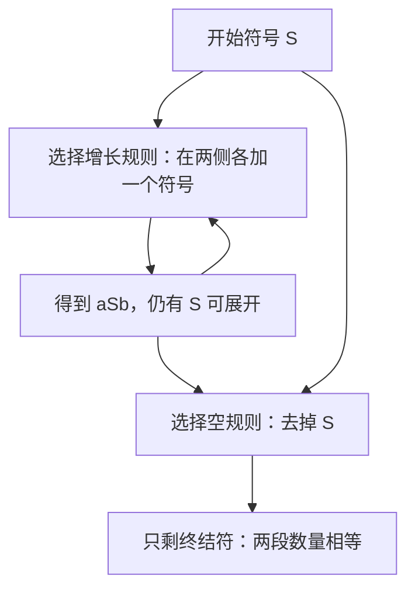
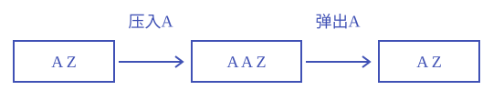
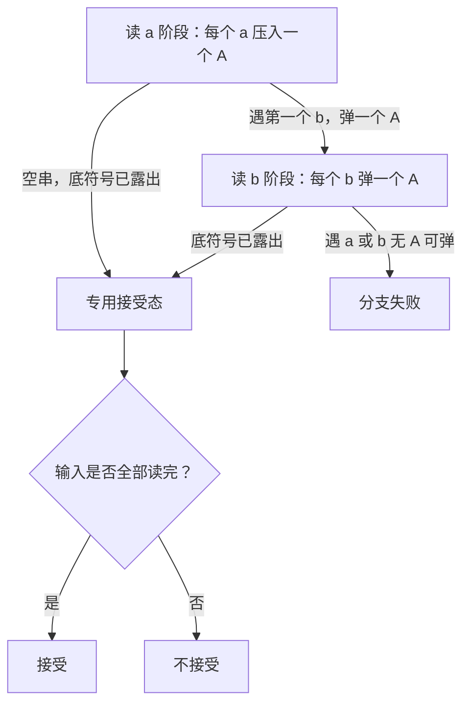
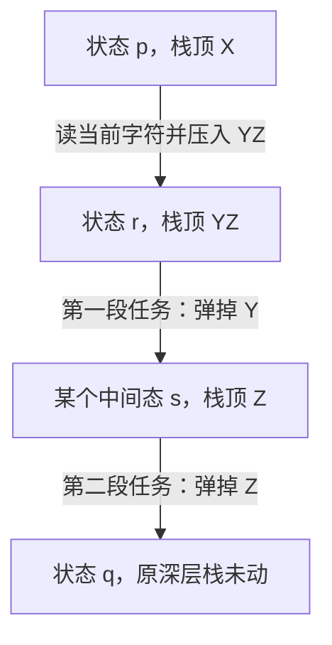

# 上下文无关语言与下推自动机

**本章问题：怎样保存没有固定上限的待匹配数量，识别成对、嵌套和回文结构？**

学习顺序：

1. 用产生式逐步生成串，证明文法恰好生成目标语言。
2. 用语法树理解推导与歧义。
3. 用栈追踪 PDA 的输入、状态和待匹配内容。
4. 完成 CFG 与 PDA 的两个转换方向。
5. 用闭包和 CFL 泵引理分析能力边界。

## 用递归生成串

有限状态无法保存任意大的计数。对 $a^nb^n$，读a时必须记下尚欠多少个b；这个数没有固定上限。本章用两种方法处理它：文法从里面向外生成配对，栈把尚未完成的匹配逐个保存。

- 上下文无关文法CFG记为 $G=(V,\Sigma,P,S)$。
- V是非终结符集合，代表待展开的部分；
- $\Sigma$ 是终结符集合，构成最终输入；
- P为有限产生式集合；
- S是开始符号。
- 每条规则 $A\to\alpha$ 的左侧恰为一个非终结符，右侧可以是终结符与非终结符混合串，也可以为空。
- 一步推导 $uAv\Rightarrow u\alpha v$ 只替换一次A；
- $\Rightarrow^*$ 表示零步或多步。

文法 $S\to aSb\mid\varepsilon$ 中竖线表示二选一。推导 $S\Rightarrow aSb\Rightarrow aaSbb\Rightarrow aabb$ 每展开一次S就多一对a、b，最后用空规则结束，故恰生成全部 $a^nb^n$。

正确性要看两边：所有推导只能形成这种结构；任意n都可展开n次再结束。CFG生成的语言称CFL，即上下文无关语言。

要生成 $a^mb^nc^{m+n}$，可取 $S\to aSc\mid T$、$T\to bTc\mid\varepsilon$。先递归m次得到 $a^mTc^m$，再递归n次得到 $a^mb^nc^nc^m$。外层负责a与c，内层负责b与c；所有选择都如此，任意m、n也都能实现。

这种“先找分层结构，再让规则各负责一层”的构造比猜规则容易检查。

### 每条规则负责什么

“终结符”表示最终结果中保留的符号，“非终结符”表示仍可继续展开的占位符。含占位符的中间串称**句型**。文法语言写作 $L(G)=\{w\in\Sigma^*:S\Rightarrow^*w\}$，这里只收集最终已无占位符的串。

对第二个文法取 $m=2,n=1$：

$$S\Rightarrow aSc\Rightarrow aaScc\Rightarrow aaTcc\Rightarrow aabTccc\Rightarrow aabccc.$$

只要仍使用 $S\to aSc$，就只增长外层；改用 $S\to T$ 后，不能返回 $S$，于是后续只增长内层。正确性可按两问写：

- **可靠性**：任意成功推导都有 $m$ 次外层增长、$n$ 次内层增长，因此只能得到 $a^mb^nc^{m+n}$。
- **完备性**：任给目标中的 $m,n$，按指定次数增长再结束，便生成该串。

只展示 `aabccc` 这一个成功例，尚未证明文法覆盖整个语言。

## 歧义看树不看顺序

语法树的根为S；内部节点标非终结符，孩子按某条规则展开；从左往右读终结叶子得到字符串。同一棵树可以先展开左子树，也可以先展开右子树。最左推导每次固定展开最左非终结符，最右推导相反。

文法有歧义，指某个终结串有两棵不同语法树，等价地有两条不同的最左推导。$S\to AB,A\to a,B\to b$ 虽可先替换A或B，但得到同一棵树，不能据此判歧义。

相反，$E\to E+E\mid E*E\mid a$ 对 `a+a*a` 可把最外层根选为加法，也可选为乘法，得到 $a+(a*a)$ 与 $(a+a)*a$ 两种树，因而有歧义。

这只证明该文法有歧义；若能另写一份无歧义文法生成同一语言，语言本身并无不可避免的歧义。只有每份生成该语言的CFG都有歧义时，才称语言固有歧义，证明要求更强。

### 练习 1

!!! question "题目"

    自编题。
    文法为 $S\to AB$、$A\to a$、$B\to b$。
    两条推导为 $S\Rightarrow AB\Rightarrow aB\Rightarrow ab$，
    以及 $S\Rightarrow AB\Rightarrow Ab\Rightarrow ab$。
    这能证明文法有歧义吗？解释并给出正确判据。

!!! success "参考解答"

    **解答**

    - 不能。
    - 两条推导仅展开顺序不同。
    - 二者的树根均为 $S$，孩子从左到右均为 $A,B$，$A$ 唯一产生 a，$B$ 唯一产生 b。
    - 因此它们对应同一棵树，语言也只有 ab。
    - 歧义要求同一个串有两棵不同语法树，等价地，有两条不同的最左推导。
    - 第二条先展开右边的 $B$，不是最左推导。

    **判分要点**

    - 指出“推导不同”不等于“树不同”。
    - 明确两条推导共享的树结构及最左条件。
    - 不能由文法歧义直接推出语言固有歧义。

### 两棵树怎样区分

对 `a+a*a`，根使用 $E\to E+E$ 时，乘法位于右子树；根使用 $E\to E*E$ 时，加法位于左子树。根的规则不同，已经足以证明树不同。用括号表示两树的结构分别为 $a+(a*a)$ 与 $(a+a)*a$。

原串没有括号，两个结构却生成同一串，因此构成歧义见证。

表达式求值中的“乘法优先”必须写进文法结构，例如将加法层与乘法层分开；它不会自动从规则 $E\to E+E\mid E*E\mid a$ 中出现。本章只需准确识别歧义及其对象层次。

## 栈怎样匹配数量

下推自动机PDA在有限控制外加一份栈，遵循后进先出。栈顶写在左边，Z为初始底符号。形式为 $(Q,\Sigma,\Gamma,\delta,q_0,Z,F)$，其中 $\Gamma$ 为栈符号集，其余状态、输入、终态含义同DFA。

转移 $(q,a,X)\mapsto(p,\gamma)$ 表示读a，把栈顶X替换为串 $\gamma$，并进入p；a为空就不读输入，$\gamma$ 为空就弹栈。配置 $(q,w,\alpha)$ 记录状态、未读输入、栈。

压入和弹出只改变栈顶，其余内容保留。

识别 $a^nb^n$ 可用 $q_a$ 压栈、$q_b$ 弹栈、$q_f$ 接受，初态 $q_a$、初栈Z。全部转移如下，未列出的动作不可执行。

| 当前态 | 输入 | 栈顶 | 后继态 | 替换串 |
| --- | --- | --- | --- | --- |
| $q_a$ | a | Z | $q_a$ | AZ |
| $q_a$ | a | A | $q_a$ | AA |
| $q_a$ | b | A | $q_b$ | $\varepsilon$ |
| $q_b$ | b | A | $q_b$ | $\varepsilon$ |
| $q_a$ | $\varepsilon$ | Z | $q_f$ | Z |
| $q_b$ | $\varepsilon$ | Z | $q_f$ | Z |

- 读aabb时依次为 $(q_a,aabb,Z)$、$(q_a,abb,AZ)$、$(q_a,bb,AAZ)$、$(q_b,b,AZ)$、$(q_b,\varepsilon,Z)$、$(q_f,\varepsilon,Z)$。
- 读a时每个a保存一个A；
- 读b时逐个消去，进入 $q_b$ 后不再读a，所以顺序也受到限制。
- 任意 $a^nb^n$ 都能完成这些动作；
- 任何成功输入也必有同样数量与顺序。

本例采用终态接受：读完输入且到F中某态，栈可以非空。空栈接受则要求读完输入且栈为空，状态任意。第三种约定同时要求终态与空栈。读完输入是三者共同条件。

直接将上表改为空栈接受会得到空语言，因为Z永不弹出；添加 $(q_f,\varepsilon,Z)\mapsto(q_f,\varepsilon)$ 才能恢复原语言。

- 一般的非确定PDA可以转换接受方式。
- 终态转空栈时，增加受保护的新底标记，旧终态可进入专用清栈阶段并最终弹掉新标记。
- 空栈转终态时，同样加新底标记；
- 旧栈消光、露出新标记才进新终态。
- 新标记避免旧机意外操作真正的空栈；
- 两种模型能力相同依靠的是这种改造。

### 练习 2

!!! question "题目"

    自编题。沿用正文识别 $a^nb^n$ 的PDA，栈顶在左。

    - ① 追踪输入 abb，说明到 $q_f$ 为何仍不接受。
    - ② 原表改成空栈接受会识别什么语言？
    - ③ 只增加哪些动作可恢复原语言的空栈接受？

!!! success "参考解答"

    **解答**

    - $(q_a,abb,Z)\vdash(q_a,bb,AZ)$，再到 $(q_b,b,Z)\vdash(q_f,b,Z)$。
    - 仍有一个 b 未读，故到终态也不接受。
    - 原表永不弹出 $Z$，改为空栈接受得到空语言。
    - 可增加专用状态 $q_e$，从 $q_f$ 经空转移弹出 $Z$。
    - $q_e$ 无后继；
    - 新的终态集合不影响空栈语义。
    - 原机接受时读完且仅余 $Z$，新动作恰能清空。
    - 反向，清空必须经 $q_f$，输入还必须读完，所以每次新接受也对应原机的接受。

    **判分要点**

    - 轨迹中栈与剩余输入同时正确。
    - 空栈接受同样要求输入耗尽。
    - 改造不接受 abb，且论证新旧接受的两个方向。
    - 其他满足相同条件的标准改造亦可。

### 三列同步追踪运行

栈中左端是栈顶，底符号 $Z$ 始终留在最右边。$\vdash$ 表示机器执行一步；每一步都应同时更新状态、未读输入和栈：

| 步骤 | 状态 | 未读输入 | 栈（左端为顶） | 动作 |
| --- | --- | --- | --- | --- |
| 0 | $q_a$ | aabb | $Z$ | 初始 |
| 1 | $q_a$ | abb | $AZ$ | 读 a，压一层 A |
| 2 | $q_a$ | bb | $AAZ$ | 读 a，再压一层 A |
| 3 | $q_b$ | b | $AZ$ | 第一个 b，切换并弹一层 |
| 4 | $q_b$ | $\varepsilon$ | $Z$ | 第二个 b，再弹一层 |
| 5 | $q_f$ | $\varepsilon$ | $Z$ | 空步到终态 |

最后一行用终态接受，底符号可以保留。若输入是 `abb`，读完第一个 b 时栈已只剩 $Z$，仍有一个 b 未读；即使空步进入 $q_f$，也无法满足输入耗尽条件。

## 猜一个中心

- 偶数回文语言 $\{ww^R:w\in\{a,b\}^*\}$ 可先把前半串压栈，再按相同字符弹栈。
- 困难是中心没有分隔符，因此PDA用非确定性猜切换时刻。
- p为压栈态，q为匹配态：对 $c\in\{a,b\}$、栈顶X，$(p,c,X)\mapsto(p,cX)$；
- 任何时刻可用 $(p,\varepsilon,X)\mapsto(q,X)$；
- 匹配规则是 $(q,c,c)\mapsto(q,\varepsilon)$。
- 栈只剩Z时弹出它并进终态，要求输入同时读完。

!!! example "例子与推演"

    - **情境**
        - 例如abba的成功分支先压a、b，栈为baZ；切换后读b弹b，读a弹a，再清掉Z。
    - **逐步分析**
        - 其他猜法可能失败，存在这条成功路径就足够。
        - 输入abab若成功，压入数量必须等于剩余数量，故中心只能在两个字符后；此时栈顶b却遇到a，失败。
        - 其他中心位置因数量不等失败，因而全部分支都失败。

若让q直接成为终态并取消配平条件，可以先把整个输入压栈，末尾再切换q，导致所有串都接受。接受条件在构造中承担实际约束。

要允许奇数回文，可再加“从p读一个任意字符、不改栈而转q”的动作，跳过中心字符，后续仍严格匹配。

### 练习 3

!!! question "题目"

    自编题。沿用正文偶数回文PDA：p压栈，q按相同字符弹栈。

    - ① 对输入abab，证明所有猜中心分支都失败。
    - ② 若将q直接设为终态且不再要求栈空，实际接受语言是什么？解释根因。
    - ③ 怎样扩展原机以接受奇数长度回文，同时保留原来的配平条件？

!!! success "参考解答"

    **解答**

    - 若在读k个字符后猜中心，剩余长度为 $4-k$。
    - 匹配阶段一字符弹一层，配平必要求 $k=2$。
    - k不为2时无法同时耗尽输入与待匹配字符。
    - k为2时栈顶是b，下一输入是a，立即不匹配。
    - 若q直接终态接受，每个输入都可先完整压入p的栈，再空步切到q；
    - 此时输入已完，故接受全部 $\{a,b\}^*$。
    - 错误是终态接受不自动检查栈中还有没有未配对字符。
    - 为接受所有长度回文，可在原机增加规则族$\delta(p,c,X)\ni(q,X)$，其中 $c\in\{a,b\}$，$X\in\{a,b,Z\}$。
    - 这一步只跳过唯一中心字符、不压栈；
    - 原空步切换保留，用于偶数回文。
    - 仍仅在q露出Z、输入读完后到专用终态f。

    **判分要点**

    - 拒绝证明覆盖每个k，不以单条失败分支代替。
    - 错误改造的语言必须识别为全集，不只是举一个反例。
    - 奇数中心只消耗一个字符且不改栈，最终配平条件保留。
    - 可接受等价的状态拆分构造。

### 猜中心为何能够工作

非确定性允许保留每一种切换选择；一个分支失败不取消其他分支。对 `abba`，成功分支如下：

| 已处理部分 | 剩余输入 | 栈 | 阶段 |
| --- | --- | --- | --- |
| 空 | abba | $Z$ | 压栈 |
| a | bba | $aZ$ | 压栈 |
| ab | ba | $baZ$ | 压栈 |
| ab | ba | $baZ$ | 空步猜中心，转匹配 |
| abb | a | $aZ$ | 读 b，弹 b |
| abba | $\varepsilon$ | $Z$ | 读 a，弹 a |

对任意成功分支，前半所压的串为 $w$；匹配阶段必须按相反次序逐个弹出，因此后半只能是 $w^R$。反向，对每个 $ww^R$，恰在中点切换的分支都会成功。接受正确性由这两个方向共同给出。

## 文法转成栈机器

CFG转PDA时，栈保存尚待匹配的句型。先压S；顶部为非终结符就选择规则展开；顶部为终结符就与下一输入匹配并弹出。以 $S\to aSb\mid\varepsilon$ 为例，初态i、模拟态q、终态f、初栈Z，全部规则为：

| 当前态 | 输入 | 栈顶 | 后继态 | 替换串 |
| --- | --- | --- | --- | --- |
| i | $\varepsilon$ | Z | q | SZ |
| q | $\varepsilon$ | S | q | aSb |
| q | $\varepsilon$ | S | q | $\varepsilon$ |
| q | a | a | q | $\varepsilon$ |
| q | b | b | q | $\varepsilon$ |
| q | $\varepsilon$ | Z | f | $\varepsilon$ |

读ab时，栈依次为 Z、SZ、aSbZ、SbZ、bZ、Z、空；对应读入a和b各一次。

若已读前缀为u，去掉底符号的栈为 $\alpha$，始终有 $S\Rightarrow^*u\alpha$：展开规则保持可推导性，匹配字符只是把待匹配部分移入已读前缀。接受时 $\alpha$ 为空，故文法确实生成该输入。

反向按任一最左推导选择展开动作，就能得到接受运行。

### 文法模拟的两种动作

对输入 `ab`，文法转 PDA 的完整记录如下。用 $\varepsilon$ 标明空输入动作：

| 动作 | 未读输入 | 栈 |
| --- | --- | --- |
| 初始 | ab | $Z$ |
| 压开始符号 | ab | $SZ$ |
| 展开 $S\to aSb$ | ab | $aSbZ$ |
| 匹配 a | b | $SbZ$ |
| 展开 $S\to\varepsilon$ | b | $bZ$ |
| 匹配 b | $\varepsilon$ | $Z$ |
| 弹底符号并进终态 | $\varepsilon$ | $\varepsilon$ |

展开不消耗输入，匹配恰消耗一个相同终结符。栈顶在左，所以替换串 $aSb$ 的左端 $a$ 会最先被处理；若实现时每次只能逐个压符号，需按反向顺序压入，才能得到相同栈序。

## 栈机器转回文法

先把PDA改成空栈接受，每步检查替换一个栈顶。用非终结符 $[pXq]$ 表示一个完整任务：从状态p开始，把栈顶X及其上方临时压入的内容全部处理掉，在q结束；更深的栈内容不动。

任务所读取的字符串就是该变量生成的串。

若 $(p,a,X)\mapsto(r,\varepsilon)$，加规则 $[pXr]\to a$；若替换为Y，加 $[pXq]\to a[rYq]$，枚举所有q；若替换为YZ，加

$$[pXq]\to a[rYs][sZq],$$

枚举所有中间态s和终点q。a可以为空。

压入YZ后一定先处理Y再处理Z，中间确实经过某个状态s，因此规则覆盖所有运行；反向把两个弹栈任务连接起来，因不碰深层栈，仍是合法运行。更长替换串相同处理。

起点加 $S\to[q_0Zq]$，覆盖所有q。

完整例取状态p、q，栈符号A、Z，p初始。转移为 $(p,a,Z)\mapsto(p,AZ)$、$(p,a,A)\mapsto(p,AA)$、$(p,b,A)\mapsto(q,\varepsilon)$、$(q,b,A)\mapsto(q,\varepsilon)$，以及p、q在Z上各自用空步弹Z。它识别 $a^nb^n$。八个变量记作

$$\begin{aligned}
U&=[pZp],\quad V=[pZq],\\
 W&=[qZp],\quad X=[qZq],\\
 C&=[pAp],\quad D=[pAq],\\
 E&=[qAp],\quad F=[qAq]
\end{aligned}$$

全部产生式为：

| 左侧 | 右侧选择 |
| --- | --- |
| S | $U\mid V$ |
| U | $aCU\mid aDW\mid\varepsilon$ |
| V | $aCV\mid aDX$ |
| W | 无 |
| X | $\varepsilon$ |
| C | $aCC\mid aDE$ |
| D | $aCD\mid aDF\mid b$ |
| E | 无 |
| F | b |

!!! example "例子与推演"

    例如D处理压入AA的动作，中间态p给出aCD，中间态q给出aDF，两种都必须枚举。W、E没有规则；C每次仍留C或引入E，三者不能生成终结串，称非生产变量。删掉包含它们的规则后，保留

    $$\begin{aligned}
    S&\to U\mid V,U\to\varepsilon,\\
     V&\to aDX,X\to\varepsilon,\\
     D&\to aDF\mid b,F\to b
    \end{aligned}$$

    于是

    $$\begin{aligned}
    S&\Rightarrow V\Rightarrow aDX\Rightarrow aaDFX\\
     &\Rightarrow aabFX\Rightarrow aabbX\Rightarrow aabb
    \end{aligned}$$

    D每递归一次增加一个a和一个b，基例b，所以恰生成 $a^kb^{k+1}$；V再补一个a，得到正次数配平串，U补空串。

### 练习 4

!!! question "题目"

    自编题。沿用正文八变量例的状态p、q，栈顶在左。转移 $(p,a,A)\mapsto(p,AA)$。

    - ① 枚举它为 $[pAq]$ 产生的全部规则。说明中间状态为什么不能只选q。
    - ② 删除非生产变量后有 $D\to aDF\mid b$、$F\to b$。给出D生成aabbb的推导，并证明D的准确语言。

!!! success "参考解答"

    **解答**

    - 中间状态可为p或q，因而有$[pAq]\to a[pAp][pAq]$，$[pAq]\to a[pAq][qAq]$。
    - 即 $D\to aCD\mid aDF$。
    - 第一次弹完上层A时可能处于任意状态，须全部枚举。
    - 先弹上层A再弹下层A，子任务不触碰更深的保留栈。
    - 本例C事后被证非生产，并不允许一般构造先漏掉它。
    - 完整推导可为$D\Rightarrow aDF\Rightarrow aaDFF\Rightarrow aabFF$$\Rightarrow aabbF\Rightarrow aabbb$。
    - 基规则产生b，即a为0个、b为1个。
    - 每用一次增长规则，前端加a、末端通过F加b。
    - 故只能生成 $a^kb^{k+1}$，其中 $k\ge0$。
    - 反向，选任意k，增长k次再把D、各F变成b即可。
    - 所以 $L(D)=\{a^kb^{k+1}:k\ge0\}$。

    **判分要点**

    - 两个中间状态对应的规则都写出，顺序不颠倒。
    - 解释弹栈任务不能操作下方保留栈。
    - 推导每一步合法，并给可靠性及完备性两个方向。
    - 把D语言误写为等量a、b不能通过。

### 弹栈任务为何要拆两段

$[pXq]$ 是一个非终结符名称，方括号里的三项依次表示起始状态、待处理栈符号、结束状态。设一次动作将栈顶 $X$ 换为 $YZ$，栈顶仍在左边：

规则中的 $a[rYs][sZq]$ 正好按顺序记录本次输入、弹 Y 的输入串、弹 Z 的输入串。中间状态事先不知道，必须枚举所有 $s$；状态有限，因此生成的规则数量仍有限。

推导模拟运行与运行拼成推导的双向对应，建立了 CFG 与非确定 PDA 的语言能力等价。

## 闭包与能力边界

CFL对并、连接、星封闭：将两份CFG的变量先改名避免冲突，并分别新增起始规则 $S\to S_1\mid S_2$、$S\to S_1S_2$、$S\to S_1S\mid\varepsilon$。反转时把每条产生式右侧反转，语法树左右镜像即可。

CFL与正则语言的交仍为CFL：PDA控制状态增加一个DFA状态，读真实字符时两者同步更新，PDA空步时DFA不动，最后同时检查两者接受条件。只用原有一份栈即可。

两个任意CFL的交则未必是CFL；例如 $\{a^nb^nc^m\}$ 与 $\{a^mb^nc^n\}$ 的交为 $\{a^nb^nc^n\}$，下面证明它非CFL。由德摩根律及并封闭，还可推出CFL不对补封闭，否则交也会封闭。

CFL也不对差封闭，否则以正则全集减去任意CFL，就会得到补封闭，与上段矛盾。

证明某语言非CFL时，可以先与一个正则语言相交隔离难点：若原语言为CFL，交集必仍为CFL；交集已知非CFL便给出反证。

CFL泵引理：若L为CFL，存在p，使每个足够长的 $w\in L$ 都有分解 $w=uvxyz$，满足 $|vxy|\le p,|vy|\ge1$，且所有 $i\ge0$ 都有 $uv^ixy^iz\in L$。这里v、y同时重复，至少一段非空。

其来源是足够高的语法树路径重复非终结符；两次出现之间的嵌套可重复或去掉。

对 $a^nb^nc^n$ 取 $w=a^pb^pc^p$。任意合法窗口vxy长度至多p，不可能同时含a和c，因为跨过完整b段还需两端字符，至少p+2长。因此窗口只在一段内或跨一条相邻边界。

取 $i=0$ 删除v、y，至少一种字符数量下降，至少另一种仍为p，三种数目不再相等。所有分解均被覆盖，矛盾。

非正则本身不能推出非CFL，$a^nb^n$ 就是反例；证明要选与目标类别对应的工具。

### 练习 5

!!! question "题目"

    自编题。
    有人说：“$a^nb^nc^n$ 非正则，故不是CFL。”
    指出漏洞，并用CFL泵引理补证它非CFL。
    要求解释窗口为何不能同时含 a 和 c。

!!! success "参考解答"

    **解答**

    - 非正则仍可能是CFL，如 $a^nb^n$。
    - 反设目标是CFL，取泵长度 $p\ge1$。
    - 选 $w=a^pb^pc^p$，属于目标且长度 $3p\ge p$。
    - 任取合法分解 $w=uvxyz$，满足$|vxy|\le p$、$|vy|\ge1$。
    - 若窗口同时含 a 和 c，必须跨过全部 $p$ 个 b，再加两端至少两个字符，长度至少 $p+2$，矛盾。
    - 故窗口至多涉及两种字符。
    - 取 $i=0$，至少一种字符减少，另有一种仍为 $p$ 个。
    - 三种计数不再相等，$uxz$ 不在目标语言中。
    - 这对每种合法分解成立，矛盾，故非CFL。

    **判分要点**

    - 不用“非正则”替代非CFL证明。
    - 写出全部长度条件，并覆盖每种窗口位置。
    - 两段同步取 $i=0$，说明至少删一个且有一类不变。

## 记忆要点

!!! tip "本章记忆要点"

    - CFG 左侧恰有一个非终结符；设计后分别证明只能生成目标串、所有目标串都可生成。
    - 歧义见证是同串的两棵不同树，或两条不同的最左推导。
    - PDA 每步同时跟踪状态、未读输入、栈；任何接受方式都要求读完输入。
    - 回文用非确定性猜中点；接受须同时核验匹配完成，不能只看切换态。
    - CFG → PDA：展开与匹配；PDA → CFG：用起态、栈符号、终态描述弹栈任务。
    - CFL 与正则语言的交封闭，与任意 CFL 的交不封闭；非 CFL 证明要覆盖所有合法泵窗口。

## 对应习题集

《计算理论分章习题集.pdf》的本章题目在 **PDF 第 95–152 页**（阅读器页序）。按[习题集学习路线与代表题](06-practice-route.md)先完成对应代表题，再挑本章未见题练习。

