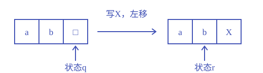
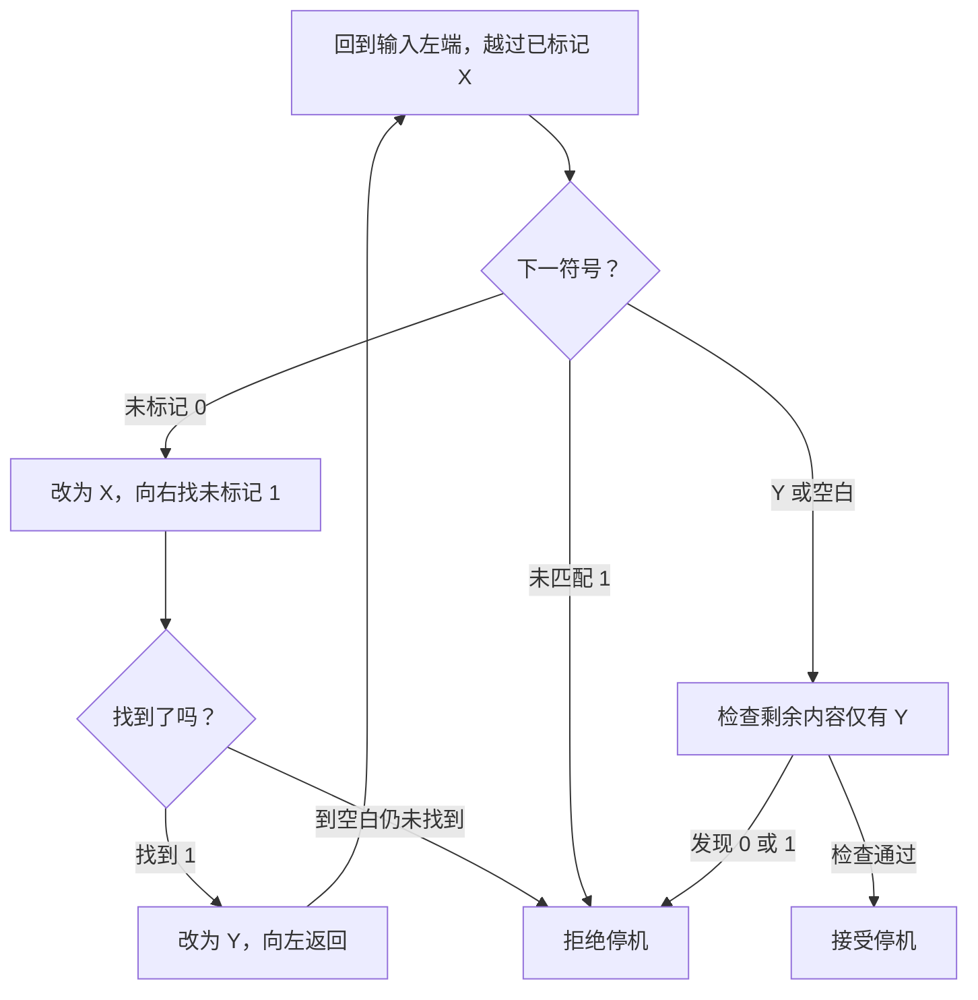
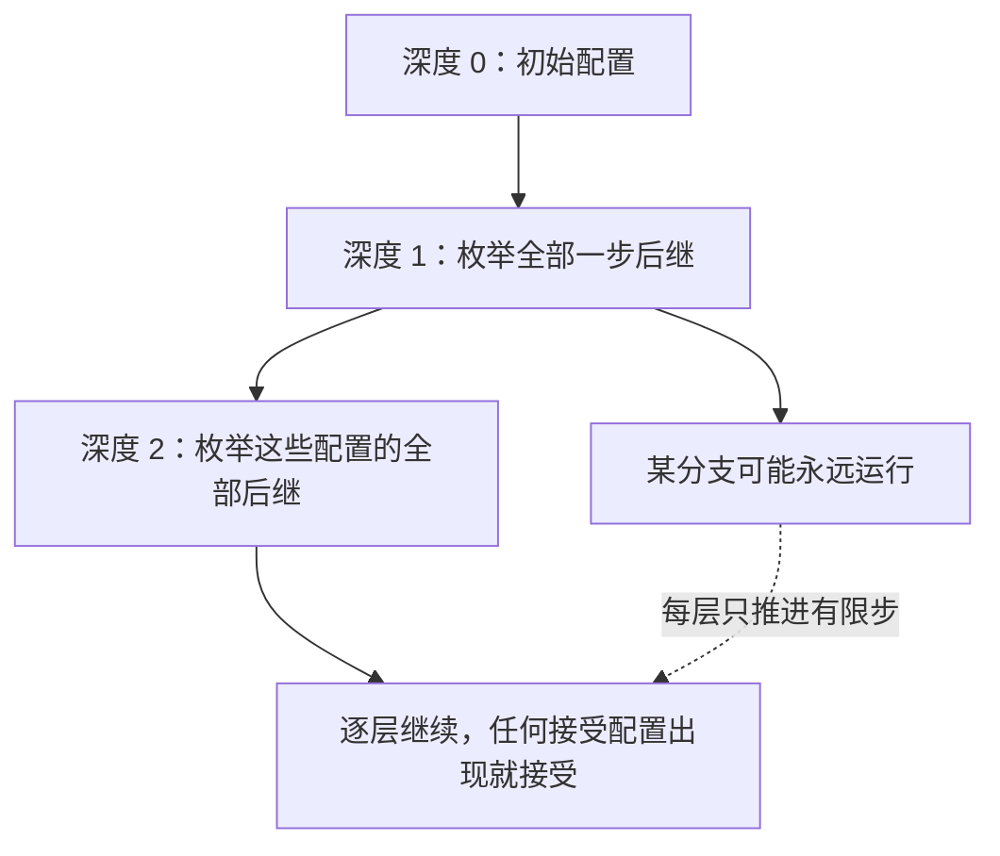

# 图灵机

**本章问题：机器允许反复访问和改写旧数据后，怎样描述一次计算，并证明它会给出正确结果？**

学习顺序：

1. 读懂纸带、转移和配置，区分接受、拒绝与无限运行。
2. 用标记法构造数量配对机器，证明正确性和停机。
3. 用明确接口组合移位、复制与多带模拟。
4. 理解图灵机与无限制文法的双向模拟。
5. 指定数值编码，区分原始递归、有界搜索和无界搜索。

## 可以反复改写的纸带

- PDA只能操作栈顶。
- 图灵机TM则有可读写纸带，读写头每步左右移动，能够回来检查和修改旧内容。
- 本章使用双向无限纸带；
- 任意有限时刻只访问有限格。
- 输入字母表 $\Sigma$ 不含空白符 $\square$；
- 带字母表 $\Gamma$ 还包含空白和工作标记。
- 有限状态集含初态 $q_0$、接受态 $q_{acc}$、拒绝态 $q_{rej}$。

- 转移 $\delta(q,a)=(p,b,R)$ 表示状态q读到a，写b，头右移一格并进入p；
- L表示左移。
- 接受、拒绝都是停机，但输出结论不同；
- 还有第三种行为是永远运行。
- 没有列出的转移在本章示例中都视为拒绝停机，具体题目若另作约定就按其约定。

配置写成 $uqv$：纸带可见内容为uv，状态为q，头指向v首格。例如 $abq\square$ 的头在右端空白。若 $\delta(q,\square)=(r,X,L)$，一步后是 $arbX$：原空白改X，头来到b。省去带段以外仍有空白。

书写配置时，状态符号的位置就是头的位置，不能只改状态名而不移位置。

一次转移同时改变纸带字符、状态和读写头位置。

输入属于 $L(M)$ 当且仅当机器M最终接受它。识别器必须接受所有成员，非成员可拒绝或永远运行；判定器还必须对每个输入停机。证明机器是判定器，除答案正确，还要证明每次循环确实推进并最终结束。

### 练习 1

!!! question "题目"

    自编题。
    配置 $abq\square$ 中，头指向右端空白。
    规则 $\delta(q,\square)=(r,X,L)$，
    $\delta(r,b)=(q_{rej},b,R)$。
    写接下来两步配置。
    这次拒绝能否说明该输入不属于停机问题？

!!! success "参考解答"

    **解答**

    - 第一步为 $ar bX$：写入 X 后头左移到 b。
    - 第二步为 $abq_{rej}X$：保留 b 后头右移到 X。
    - 机器拒绝但确实停机。
    - 因此这份机器输入对属于停机问题 $H$，却不属于接受问题 $A_{TM}$。
    - 停机不要求头位于空白，写入与移动顺序不能省略。

    **判分要点**

    - 两个配置都保留纸带改写并标出正确头位置。
    - 分清拒绝停机与无限循环。
    - 结论针对机器输入对，而不是把普通串直接当编码。

### 从配置读出一步计算

状态符号写在**当前头下字符的左边**。例如 $abq\square$ 表示 a、b 已在头左侧，头正在读空白：

| 配置 | 头下字符 | 应用规则 | 后继配置 |
| --- | --- | --- | --- |
| $abq\square$ | $\square$ | 写 X，转 r，左移 | $arbX$ |
| $arbX$ | b | 保留 b，转拒绝态，右移 | $abq_{rej}X$ |

第二步结束时纸带仍为 abX，头指向 X；拒绝是一个已经结束的计算。写规则时，$q,p$ 是状态，$a,b$ 是带符号，$L,R$ 是移动方向；进入新状态后，下一步才根据新头下字符选择规则。

| 输入类别 | 识别器必须怎样运行 | 判定器必须怎样运行 |
| --- | --- | --- |
| 属于语言 | 有限步接受 | 有限步接受 |
| 不属于语言 | 可以拒绝，也可以无限运行 | 有限步拒绝 |

“模拟了很久还没接受”尚不能确定非成员；识别器没有统一等待上限。

## 一次完整机器构造

- 先构造判定 $\{0^n1^n:n\ge0\}$ 的机器。
- 用X标记已匹配的0，用Y标记已匹配的1。
- 阶段A从左向右找第一个未标记0，把它改X；
- 阶段B继续向右找第一个未标记1，把它改Y；
- 阶段C回到输入左端，重新执行A。
- 若B走到空白仍未找到1，拒绝。
- A若越过X后先遇Y，就检查剩余全为Y，检查成功接受；
- 若遇未匹配1或其他符号，拒绝。

!!! example "例子与推演"

    例如0011的带内容依次变为 X0Y1、XXYY；第二轮回来检查，发现未匹配0已经用完且只剩Y，接受。001在第二轮找不到1而拒绝。

    0101第一轮标记后得到XY01，结束检查发现Y后还有0，拒绝。因此既比较数量，也检查所有0在1之前。

这里每轮恰好消去一个未标记0和一个未标记1，保持两者原有数量差；成功检查保证数量差为零且顺序合法。反向，任何 $0^n1^n$ 都能完成n轮配对。

每轮扫描在有限输入范围内结束，未标记0数量严格减少，所以机器对全部输入停机。空串一开始就通过尾部检查。

复杂机器可用“扫描到某标记”“返回左端”等宏组织。

宏是一段有限转移规则的缩写，接口必须写清进入时头在哪里、带内容满足什么条件、退出时头停哪里以及失败怎么处理，否则拼接两段正确程序也可能出错。

### 配对机的控制流程

找 1 的阶段可越过剩余 0 和已有 Y，取首个尚未标记的 1。返回阶段向左扫到输入前的空白，再向右一格重启；本例不写空白到输入内部，因此这个边界明确。

| 输入 | 每轮完成后的带内容 | 结束原因 |
| --- | --- | --- |
| 0011 | X0Y1 → XXYY | 只剩 X、Y，接受 |
| 001 | X0Y → XXY | 第二轮没有 1 配对，拒绝 |
| 0101 | XY01 | 未标记 0 出现在 Y 后，尾部检查拒绝 |
| 空串 | 空白 | 无需配对，接受 |

这里 001 的第二轮已把 0 标为 X 后才发现缺少 1，所以最后是 XXY；终止前的带内容不必保留原输入，判断依赖扫描过程。

每轮未标记 0 至少减少一个，且每趟扫描范围有限，从而对合法与非法排列都保证停机。

## 移位与复制

- 设带段为 `#ab□`，头停在#，要在#后插入空格得到 `#□ab□`。
- 先扫描到末尾空白，再从右向左搬：把b复制到右边空白，回到原b格；
- 把a复制到原b格，回到原a格；
- 把原a格写空白，最后回到#。
- 搬运前先用有限状态记住当前字符，移到相邻格写下。
- 原串为空时直接结束。

若从左向右直接覆盖，把a写到b的位置后，原b已经丢失。因此右移从右往左，左移从左往右；方向保证尚未搬的内容不被覆盖。若题目指定别的退出头位置，还需补上最后扫描。

- 复制w可先写分隔符@，形成 `#w@□`。
- 从左端找首个未标记字符，用状态记住它并把原格改成对应标记；
- 右移越过@和已复制区，在末尾写该字符；
- 返回#。
- 重复至@前全部标记，再清除标记。
- 对ab依次得到 `#Ab@a`、`#AB@ab`、`#ab@ab`，大写仅表示已处理标记。
- 每轮增加一个已处理原字符，故终止；
- 按原串从左往右复制，保证顺序。
- 空串得到 `#@`，同样合法。

### 右移时保存尚未搬的字符

把 `#ab□` 右移一格，按如下顺序追踪：

| 阶段 | 带内容 | 尚未搬的原字符 |
| --- | --- | --- |
| 初始 | #ab□ | a、b |
| 保存 b，写到右邻，再清源格 | #a□b□ | a |
| 保存 a，写到右邻，再清源格 | #□ab□ | 无 |

有限控制一次只需记住一个字符，字母表有限即可实现；任意长输入由多轮搬运处理。复制的策略也相同：工作标记记录“已经处理”，有限状态记录当前字符，循环逐步完成无固定上限的任务。

## 多带和分支怎样模拟

- 多带TM一步能同时读写固定k条带。
- 单带可把各带有限使用区放在分隔符之间，每段中用带帽符号标记读写头。
- 模拟一步分四阶段：扫描全部段收集k个头下符号；
- 结合旧状态算出转移；
- 再扫描改写旧头下符号并产生新头标记；
- 最后统一把新标记转成下一轮旧标记。
- 段末不够时用移位宏插入空白。

k固定且字母表有限，k个读入符号的组合只有有限多种，有限控制足以暂存。新旧头标记要区分，否则右移产生的新帽格可能在同一趟被再次处理，错误地模拟多步。

每轮开始编码真实配置，每个阶段精确落实转移，因此模拟器保持同样接受与停机行为，只是可能慢很多。

非确定TM的分支也能由确定TM模拟。将所有配置按运行步数分层，先展开深度0，再深度1、2。每个配置只有有限后继，每层有限；若某支在t步接受，第t层必被找到。

先把一条分支运行到结束可能被无限分支卡住，因此必须广度优先或交错推进。对识别能力，这保留“存在接受分支”的意义，不保证相同运行时间。

### 练习 2

!!! question "题目"

    自编题。

    - ① 将带段 #ab□ 向右移一格，得到 #□ab□。说明从左向右直接覆盖会错在哪里，写正确搬运顺序。
    - ② 单带模拟多带时，一趟扫描每遇带帽格就移头。若刚生成的新带帽格也立即处理，会出什么错？给修复方法，并说明为何有限控制能保存各带当前符号。

!!! success "参考解答"

    **解答**

    - 先把a写入右邻格会覆盖尚未保存的b，丢失原信息。
    - 正确顺序是先搬b，再搬a；
    - 每次暂存当前字符，擦除源格，写入右邻格，再回到左侧下一源格。
    - 每轮减少一个未搬字符，末尾按宏接口重定位头。
    - 若右移产生的新标记在同一扫描中再次被处理，一个模拟头可能连移多次，而原机只走了一步。
    - 旧头、新头用不同标记；
    - 本趟只处理旧头。
    - 全部处理完成后统一把新标记转换为下一轮旧标记。
    - 须先收齐所有旧头符号，按同一原机配置选择转移。
    - 带数k与字母表大小都是固定有限值，符号元组至多 $|\Gamma|^k$ 种，可编码在有限状态中。
    - 这不表示能在有限控制中保存任意长的带内容。

    **判分要点**

    - 给出实际覆盖错误及从右到左的修复顺序。
    - 识别重复处理新头造成的一步变多步错误。
    - 解释同步收集、分代标记及有限元组的条件。
    - 可接受逐带分阶段且确保每头只更新一次的其他方案。

### 练习 3

!!! question "题目"

    自编题。
    某非确定TM初步分成两支：
    左支永远右移，右支3步后接受。
    模拟器先把左支跑到结束，再检查右支。
    哪里错了？给出能保留识别能力的模拟办法。

!!! success "参考解答"

    **解答**

    - 左支永不结束，顺序等待使右支永远得不到模拟。
    - 改为按深度广度优先枚举计算树。
    - 深度0处理初始配置，逐层生成全部一步后继；
    - 每一层有限，因为机器转移规则有限、分支数有限。
    - 发现接受配置即接受，有限深度的接受分支终会被查到。
    - 若没有接受分支，模拟器不应错误接受，允许继续运行。
    - 如果树已全部耗尽，可拒绝。
    - 交错推进各分支的等价公平模拟也可。
    - 这说明识别等价，不能据此声称所有输入都停机。

    **判分要点**

    - 根因是无限分支阻塞其他分支，并非算得慢。
    - 说明每层有限及任意有限接受路径最终可达。
    - 区分识别器正确性与判定器全输入停机。

### 公平搜索按深度展开

第 $t$ 层访问运行了 $t$ 步的所有分支。每个配置的分支数有固定有限上界，因此每层有限；先完成一层再进入下一层不会永久卡在某个分支。

若有接受分支，其长度是某个有限 $t$，最终一定访问到。若无接受分支，搜索可持续进行，这符合识别器语义。

## 文法也能模拟计算

无限制文法允许规则 $\alpha\to\beta$ 的左侧含多个符号，但必须非空且至少含一个非终结符；右侧可任意，包括空串。仍是在当前句型中找到连续的 $\alpha$ 并替换为 $\beta$。

!!! example "例子与推演"

    例如规则 $S\to aSBC\mid\varepsilon$、$CB\to BC$、$aB\to ab$、$bB\to bb$、$bC\to bc$、$cC\to cc$ 生成 $a^nb^nc^n$。n为2时：

    $$\begin{aligned}
    S&\Rightarrow aSBC\Rightarrow aaSBCBC\\
     &\Rightarrow aaBCBC\Rightarrow aaBBCC\\
     &\Rightarrow aabBCC\Rightarrow aabbCC\\
     &\Rightarrow aabbcC\Rightarrow aabbcc
    \end{aligned}$$

    增长保证三类数量相等，交换把B排到C前面，最后按次序终结化；过早产生的c若挡住后方B，该分支不能成功。反向，任意n先增长n次、排好BC再终结化，必能生成目标串。

任意无限制文法都能由TM识别：从S出发广度优先枚举推导，看到目标串就接受。每层有限，任何有限推导最终都会出现；不属于语言时可能永远搜索。

- 反过来，TM可转为无限制文法。
- 关键是同时保存原输入和工作纸带：用一个非终结符 $C_{o,b}$ 代表一格，o为原输入字符或空标签 $\bot$，b为当前工作字符；
- 机器改写时只改b。
- 状态符号放在头下格左边。
- 对右移规则 $\delta(q,b)=(p,c,R)$，加入 $qC_{o,b}\to C_{o,c}p$；
- 对左移规则，加入 $C_{r,d}qC_{o,b}\to pC_{r,d}C_{o,c}$，枚举有限的相邻标签与字符。

生成阶段用边界L、R和标记G、J：$S\to LGR$，对每个输入字符a加入 $G\to C_{a,a}G$，最后 $G\to JC_{\bot,\square}$。用 $C_{a,a}J\to JC_{a,a}$ 把J左移，$LJ\to Lq_0$ 激活机器。G已经消失，此后不能继续生成原输入。

右移跨过编码边界时用 $pR\to pC_{\bot,\square}R$ 补格；最左格左移时，对相应转移加入 $LqC_{o,b}\to LpC_{\bot,\square}C_{o,c}$。

接受后用 $q_{acc}\to K$ 触发清理，$C_{o,b}K\to KC_{o,b}$ 将K左移到边界，$LK\to O$ 开始输出。输出规则为 $OC_{a,b}\to aO$、$OC_{\bot,b}\to O$，最后 $OR\to\varepsilon$。拒绝态没有清理出口。标签、状态和带符号都有限，所有这些规则族展开后仍是有限文法。

- 这几个规则族为何足够？
- 模拟开始的句型编码初始配置；
- 每次改写对应机器一步，按步数归纳始终是真配置。
- 全终结串必须经过接受清理，且清理输出始终是保存的原输入，所以生成串确实被机器接受；
- 反向，对接受输入先生成其初始编码，再照有限接受计算改写和清理，必能生成。
- 只输出工作带会出错，例如机器把输入全擦掉再接受，工作带已无法还原被接受的输入。

### 练习 4

!!! question "题目"

    自编题。有文法 $S\to S\mid aS\mid\varepsilon$。

    - ① 识别器总先沿 $S\to S$ 分支深搜，为什么会漏掉a？改用什么调度并给出保证？
    - ② TM转无限制文法时，只保存改写后的工作符号，到接受态便直接输出带内容，为何不一定生成 $L(M)$？给一台会暴露错误的机器，并说明双轨标签怎样修复。

!!! success "参考解答"

    **解答**

    - 输入a有有限推导 $S\Rightarrow aS\Rightarrow a$。
    - 深搜若困在无限自循环，永远到不了这条有限成功路径。
    - 改按推导步数广度优先；
    - 每个句型有限且规则有限，每层分支有限，因此有限深度的成功推导终会被访问。
    - 若输入没有推导，可以一直搜索，不能声称已判定。
    - 例：M接受所有输入，但接受前先擦掉整个输入。
    - 它的语言为全集；
    - 只输出最后工作带会只得到空串。
    - 双轨格 $C_{o,b}$ 中，o永久保存原输入标签，b用于模拟。
    - 后加工作格使用空标签 $\bot$，不应成为输出字符。
    - 只有模拟到接受态才允许清理；
    - 清理按原次序输出o，忽略空标签，便保留原输入而非机器的工作结果。

    **判分要点**

    - 明确有限见证为何被不公平搜索漏掉。
    - 用每层有限与成功深度有限证明公平性。
    - 给接受语言与工作输出不一致的具体机器。
    - 修复同时保留输入、忽略工作格并限制接受后清理。

## 自然数怎样输入输出

机器处理符号串，计算数值函数前必须指定编码。用一元编码 $n\mapsto1^n$ 时，0编码为空串，多参数可写为 $1^a\#1^b$。输出也按约定编码，并固定完成时头位置。

全函数对每个输入有值；部分函数只在部分输入有定义。本章约定计算部分函数时，定义域内停机输出该值，定义域外不停机。把未定义输入拒绝停机，不满足这一约定。

原始递归函数从零函数 $Z(n)=0$、后继 $S(n)=n+1$、投影 $P_i^k(x_1,\ldots,x_k)=x_i$ 开始，用复合与原始递归构造。投影只取第i个参数，复合就是把若干已知函数的输出传给另一个函数。原始递归规定

$$\begin{cases}f(\vec x,0)=g(\vec x),\\f(\vec x,n+1)=h(\vec x,n,f(\vec x,n)).\end{cases}$$

$\vec x$ 表示其他参数组成的向量，g给初值，h给已完成n轮后的更新。循环次数由输入n事先限定，子函数都停机，所以这类函数必为全函数。

加法A由 $A(a,0)=a,A(a,n+1)=S(A(a,n))$ 得到；乘法由 $M(a,0)=0,M(a,n+1)=A(M(a,n),a)$ 得到。前驱 $pred(0)=0,pred(n+1)=n$ 给出截断减法 $D(a,0)=a,D(a,n+1)=pred(D(a,n))$，故 $D(a,b)=\max(a-b,0)$，也记 $\operatorname{monus}(a,b)$。

最大值可写 $\max(a,b)=A(a,D(b,a))$。若 $b\ge a$，补上差值得b；若 $b<a$，截断差为零，得到a。表达式只复合已知原始递归函数，故仍原始递归。这种证明既要核算数值，也要说明构造合法。

### 练习 5

!!! question "题目"

    自编题。使用正文的截断减法 $D$ 与加法 $A$。

    - ① 构造 $\min(a,b)$ 的原始递归表达式。
    - ② 分别计算输入 $(2,5)$ 和 $(5,2)$。
    - ③ 用分情况证明，并说明为何原始递归。

!!! success "参考解答"

    **解答**

    - 可取 $f(a,b)=D(a,D(a,b))$。
    - $(2,5)$：内层 $D(2,5)=0$，外层 $D(2,0)=2$。
    - $(5,2)$：内层 $D(5,2)=3$，外层 $D(5,3)=2$。
    - 若 $a\ge b$，内层为 $a-b$，外层为 $b$。
    - 若 $a<b$，内层为0，外层为 $a$。
    - 故所有自然数输入上均为最小值，也覆盖0与相等情形。
    - $D$ 已由投影基值及前驱递推构造为原始递归；
    - 将两个 $D$ 与投影函数复合，所得 $f$ 仍原始递归。
    - 其他用已证原始递归函数的等价表达式亦可。

    **判分要点**

    - 不能使用允许负数的普通减法替代截断减法。
    - 数值计算和两种大小关系均正确。
    - 原始递归结论引用已建立的函数与复合封闭性。

### 练习 6

!!! question "题目"

    自编题。
    部分函数 $g(n)=n/2$ 仅在偶数处定义。
    采用一元输入输出编码，0为空串。
    实现把奇数输入拒绝停机、偶数输出一半。
    它是否按正文约定计算 $g$？如何修正？

!!! success "参考解答"

    **解答**

    - 不符合正文“未定义必须不停机”的计算约定。
    - 偶数输入 $1^{2k}$ 应停机并输出 $1^k$。
    - 特别地，空输入应停机输出空串。
    - 奇数输入应进入明确无限循环，而非拒绝停机。
    - 先检查奇偶；
    - 偶数每两枚1生成一枚1，奇数转入对任何符号均原样写回并右移的循环态。
    - 这是合法数值输入上的定义域问题，不是非法编码问题。

    **判分要点**

    - 保留偶数分支及0边界的正确输出。
    - 指出拒绝也是停机，并修成实际可执行的循环。
    - 不以“输出0”冒充函数未定义。

### 原始递归就是指定初值和更新

加法 $A(2,n)$ 的展开为：

| 参数 n | 所用规则 | 结果 |
| --- | --- | --- |
| 0 | $A(2,0)=2$ | 2 |
| 1 | $A(2,1)=S(A(2,0))$ | 3 |
| 2 | $A(2,2)=S(A(2,1))$ | 4 |
| 3 | $A(2,3)=S(A(2,2))$ | 5 |

一般递推中的 $h(\vec x,n,f(\vec x,n))$ 同时知道固定参数、当前轮号和上轮结果，定义下一轮值。$P_i^k$ 的上标 $k$ 是参数个数，下标 $i$ 是选择第几项，满足 $1\le i\le k$。

每次调用的递推次数由输入确定，所以原始递归保证全定义。

截断减法以 0 为下界，例如 $D(2,5)=0$，$D(5,2)=3$。它在自然数中输出，普通减法则可能得到负数。组合函数时必须沿用相同的数值集合和编码。

## 谓词与搜索

谓词用1表示真、0表示假。定义 $iszero(0)=1,iszero(n+1)=0$，然后 $le(a,b)=iszero(D(a,b))$ 判断 $a\le b$，$eq(a,b)=le(a,b)le(b,a)$ 判断相等。

若p取0或1，按p分段的函数可写 $pf+(1-p)g$，选择f或g；自然数减法可用D表达，因此只要p、f、g原始递归，结果仍原始递归。

- 有界搜索只检查 $0,\ldots,b$，无解可返回 $b+1$；
- 对原始递归谓词，可递推保存第一次命中位置，所以仍原始递归。
- 无界最小化 $\mu y[P(\vec x,y)=1]$ 则从0依次寻找最小命中y。
- 若每次测试都结束且存在解，搜索返回；
- 无解则一直运行。
- 对部分谓词，较早候选的测试若不停机，顺序搜索也会卡住，不能越过它宣称后面的答案最小。

!!! example "例子与推演"

    例如 $f(n)=\mu y[y^2=n]$ 在9处返回3，在2处未定义；$g(n)=\mu y[y^2\ge n]$ 总有解，计算向上取整的平方根。前者部分定义、后者全定义，取决于搜索能否保证命中。找零版本的最小化只需转换谓词真假，不能混淆约定。

加入允许未定义的最小化后得到部分递归函数，与TM可计算的部分数值函数等价。一个方向由TM逐项执行基函数、复合、有限递推和搜索。

另一个方向把有限计算过程编码成自然数，用有限检查判断编码是否为合法停机记录，再搜索首个合法记录并抽取输出；机器不停止时搜索也不返回。这给出编码证明的机制。

全可计算仍比原始递归广：把全部一元原始递归表达式有效列为 $e_0,e_1,\ldots$，每个都可求值且停机。函数 $d(n)=e_n(n)+1$ 全可计算。若d也原始递归，必等于某个 $e_k$，代入k得到 $d(k)=d(k)+1$，矛盾。

“能写递归程序”和“属于原始递归函数类”因此有严格区别。

### 练习 7

!!! question "题目"

    自编题。自然数从0起，$\operatorname{monus}(a,b)=\max(a-b,0)$。

    - ① 用原始递归积木表示“n为0时取7，否则取n+1”。
    - ② 令 $f(n)=\mu y[y^2=n]$、$g(n)=\mu y[y^2\ge n]$。计算在n为0、2、9时的值或未定义情形，说明全定义性。
    - ③ 若某部分谓词P在y=0上不停机，在y=1上返回1，能否说顺序最小化 $\mu y[P(y)=1]$ 返回1？

!!! success "参考解答"

    **解答**

    - 定义 $z(0)=1,z(n+1)=0$，则z原始递归。
    - 目标为 $7z(n)+\operatorname{monus}(1,z(n))(n+1)$。
    - 常数7来自后继与零，余下用已证加乘和复合，故原始递归。
    - 在n为0、2、9时，f依次为0、未定义、3；
    - g依次为0、2、3。
    - f在非完全平方数上无解，持续搜索，故只是部分函数。
    - g每次测试总停机，n为0时有解0，n至少1时有解y=n，所以所有输入均会遇到首次命中，g全定义。
    - 第三问不能返回1：第0次测试已永久阻塞。
    - 部分谓词的最小化要求此前测试都终止并未命中。
    - 交错找到y=1的真值，不能证明不存在更小真值，更不等于这里规定的顺序最小化语义。

    **判分要点**

    - 原始递归结论要回到基函数、递推和复合。
    - 区分无解与先前测试未定义造成的两种不终止。
    - g的总性须同时给每次测试终止和某候选必命中。
    - 不能凭“使用无界搜索”断言一定不是全函数。

## 记忆要点

!!! tip "本章记忆要点"

    - TM 一步同时改写字符、移动读写头、改变状态；配置中状态位置标出头位置。
    - 识别器保证成员最终接受；判定器另须证明所有输入停机。
    - 标记循环的证明：说明保存的性质，再给每轮严格减少的有限数量。
    - 宏写前置与后置条件；右移从右到左，避免覆盖未保存数据。
    - 模拟非确定分支和推导树要公平调度；存在有限成功路径才保证最终找到。
    - 原始递归有预定有限轮数；无界搜索可能无解，部分函数的未定义按约定以不停机表示。

## 对应习题集

《计算理论分章习题集.pdf》的本章题目在 **PDF 第 153–197 页**（阅读器页序）。按[习题集学习路线与代表题](06-practice-route.md)先完成对应代表题，再挑本章未见题练习。

