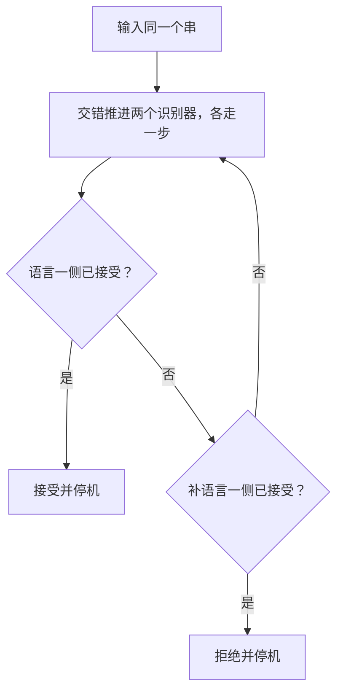
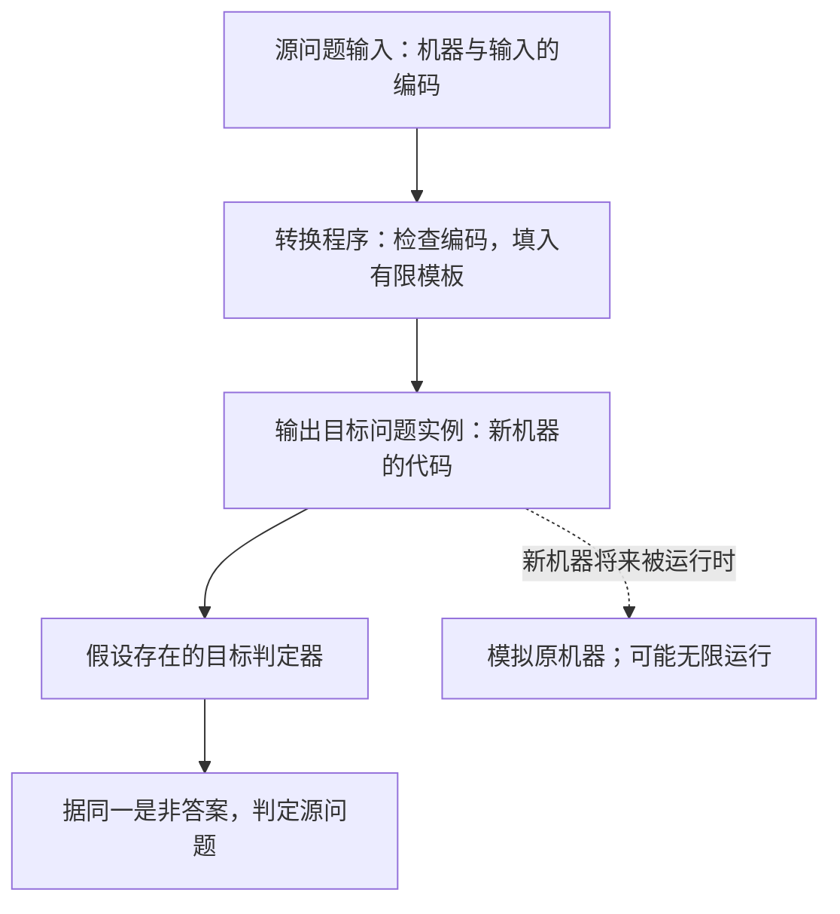

# 不可判定性

**本章问题：已经有程序描述，为什么仍无法用一个通用算法判断它会不会停机、接受什么语言？**

学习顺序：

1. 把机器编码当作普通输入，分清程序描述与程序运行。
2. 根据“成员与非成员怎样结束”区分可判定和可识别。
3. 用自指反证停机问题不可判定。
4. 写出全可计算转换，逐项证明归约的两个方向。
5. 用 Rice、闭包和公平枚举建立更多结论。

## 把程序也当成输入

前几章输入通常是a、b组成的串。本章还会输入机器描述。$\langle M\rangle$ 表示机器M的有限编码，$\langle M,x\rangle$ 表示机器与输入的配对编码。机器只有有限状态、符号和规则，可以将它们编号并用分隔符连接；检查编号、记录结构及转移是否合法是有限过程。机器编码本身与机器运行要分开：程序文件有限，不代表它运行有限。

通用图灵机U读取 $\langle M,x\rangle$，保存M的规则表、当前模拟状态、纸带和头位置；每轮查找对应规则，改写一格、移动模拟头，再进入下一轮。U自身可能多次扫描，才模拟M的一步。其配置编码始终表示M的真实配置，因此M接受、拒绝或无限运行，U都会忠实模拟。

Church–Turing论题把直观的“有效机械算法”对应到TM可计算。这是对算法概念的论题；多带TM与单带TM能力等价则是两个精确定义模型之间可证明的定理。以下不可判定结论均在明确模型中证明。

## 三种语言先分清

可判定语言也叫recursive：存在对全部输入停机的判定器。可识别语言也叫r.e.或RE：成员最终接受，非成员可拒绝或不停机。所有可判定语言都可识别，但有些可识别语言不可判定，还有些语言根本不可识别。

判断 $L(M)$ 的成员资格与判断M会不会停机不同。机器拒绝x时，$x\notin L(M)$，但M在x上确实停机。限定“前100步是否停机”则可判定：最多模拟100步，发现停机答是，否则答否。有明确时间界和没有时间界是两种不同问题。

若L及其补语言都可识别，则L可判定。对输入x交错运行两边识别器，每轮各一步，哪边先接受就按它的结论作答。x必属于其中一边，所以必有一边有限时间接受。顺序先等一台结束不可靠，第一台可能永久循环。

### 练习 1

!!! question "题目"

    自编题。
    已知 $R$ 识别 $L$，$S$ 识别 $\overline L$。
    有人先运行 $R(x)$；若它拒绝，再运行 $S(x)$。
    为何不能保证判定？给出修正及停机证明。

!!! success "参考解答"

    **解答**

    当 $x\notin L$ 时，$R(x)$ 可能永不停止，
    所以即使 $S(x)$ 会接受，也可能一直不被执行。
    应轮流各推进 $R(x)$、$S(x)$ 一步。
    $R$ 接受则接受；$S$ 接受则拒绝。
    某一方拒绝不能终止对另一方的模拟。
    每个 $x$ 恰属于 $L$ 或补语言，
    属于的那一侧必在有限步接受，交错模拟最终发现它。
    因此算法对所有输入停机，且判断正确。

    **判分要点**

    给出顺序等待失败的具体输入类别。
    公平模拟，只依据正确一侧的接受作结论。
    全输入停机理由来自两侧覆盖全集。

### 分类看的是算法保证

| 类别 | 存在怎样的机器 | 成员输入 | 非成员输入 |
| --- | --- | --- | --- |
| 可判定，recursive | 对所有输入停机的判定器 | 最终接受 | 最终拒绝 |
| 可识别，r.e.／RE | 识别器 | 最终接受 | 可拒绝或无限运行 |
| 不可识别 | 不存在识别整个语言的机器 | 无法保证所有成员都最终接受且不误接受非成员 | 无法满足识别条件 |

“不可判定”包含后两种可能：可识别但不可判定，以及不可识别。证明不可判定后，还要另证识别器是否存在，才能给出完整分类。

停机保证来自“每个输入必属于语言或其补”，属于的一侧最终接受。某侧拒绝只表明它不接受该串，仍须继续等待另一侧的接受。

## 停机为何无法判定

定义停机语言 $H=\{\langle M,x\rangle:M\text{ 在 }x\text{ 上停机}\}$。H可识别：直接模拟M，发现接受或拒绝停机就接受该编码；没有停机则继续等待。

假设H有判定器T，总能正确回答机器在指定输入上是否停机。构造机器D：收到机器编码y，询问T“y表示的机器在输入y上停机吗”；若回答会，D就无限循环；若回答不会，D就立即停机。生成D只使用假设中的算法，因此它也有合法编码 $\langle D\rangle$。

现在运行 $D(\langle D\rangle)$。若T说会停机，D按定义循环；若T说不会，D按定义立即停机。两种回答都错，故不存在这样的T。H于是可识别但不可判定。由上一节结论，$\overline H$ 不可识别，否则H及其补都可识别，会推出H可判定。

接受问题 $A_{TM}=\{\langle M,x\rangle:M\text{ 接受 }x\}$ 同样可识别但不可判定。H与它的事件不同：为了把“停机”变成“接受”，可造一台新机器，在M接受或拒绝停机后统一接受。这个改造将在归约中反复使用。

### 自指的矛盾写成两行

假设中的 $T$ 必须对每个合法机器输入对给出正确答案，包含机器把自身编码作为输入的情况：

| $T(\langle D,\langle D\rangle\rangle)$ 的回答 | 按 D 的定义执行 | 与回答冲突 |
| --- | --- | --- |
| 会停机 | D 进入无限循环 | 实际不停机 |
| 不会停机 | D 立即停机 | 实际停机 |

这里 $\langle D\rangle$ 是 D 的代码，外层配对还记录“将这份代码喂给 D”。构造 D 不需要提前运行自身，只须调用假设存在的 $T$ 并反向行动，因此是合法程序构造。

由 $H$ 到 $A_{TM}$ 的改造同样明确：新机器模拟 $M(x)$，无论 M 接受还是拒绝，只要停机就统一接受；若 M 无限运行，新机器也无限运行。因此“停机”被变成“接受”，证明 $H\le_m A_{TM}$。$A_{TM}$ 的识别器模拟到接受时才接受编码，便完成其可识别但不可判定分类。

## 归约把困难传过去

映射归约 $A\le_m B$ 要求存在**全可计算函数**f，使每个输入x都有 $x\in A\iff f(x)\in B$。全可计算表示转换过程总能停机并给出输出；它不要求输出所描述的新机器运行时也停机。若B有判定器，先算f再调用该判定器就能判定A，因此A不可判定推出B不可判定。同理，A不可识别推出B不可识别。证明目标B困难，应把已知困难的A归约到B。

完整例：$H_\varepsilon=\{\langle N\rangle:N\text{ 在空输入上停机}\}$。给 $\langle M,x\rangle$，输出机器N的代码：“忽略自身输入，写入固定x，模拟固定M，M停机时自己停机。”转换只是把M和x填入有限模板，不在转换阶段运行M。

若M在x上停机，N在空输入上就会结束；若N在空输入上结束，只可能因为M在x上停机。因此源属于H当且仅当输出属于 $H_\varepsilon$，得到 $H\le_m H_\varepsilon$，目标不可判定。另一方面，直接模拟N在空输入的行为可识别目标，所以它也属于r.e.但不recursive。

若全集是全部字符串，还需处理非法编码。从H出发时，非法串不是成员，映到固定的目标否实例；从 $\overline H$ 出发时，非法串属于补集，映到固定的是实例。合法性检查总能结束，因此不会破坏f的总定义性。

### 练习 2

!!! question "题目"

    自编题。
    令 $K=\{\langle N\rangle:N\text{ 接受 }00\}$。
    从已知不可判定的停机问题 $H$ 出发，
    证明 $K$ 不可判定且可识别。
    写出转换、总可计算性、双向条件和非法编码处理。

!!! success "参考解答"

    **解答**

    证明方向为 $H\le_m K$。
    对合法 $\langle M,x\rangle$，输出新机器 $N$：
    输入 w，若 w 不是00则拒绝；否则模拟 $M(x)$，
    只要它停机就接受，若永不停机就持续模拟。
    转换只把 $M,x$ 填入固定模板，有限步生成代码，
    不在转换阶段等待 $M(x)$。
    正向：$M(x)$ 停机，则 $N$ 接受00，目标属于 $K$。
    反向：$N$ 接受00，只能由于 $M(x)$ 已停机。
    因此源属于 $H$ 当且仅当输出属于 $K$。
    非法源编码映到恒拒绝机编码，保持否实例。
    若 $K$ 有判定器，先转换再调用它就可判定 $H$，矛盾。
    $K$ 可识别：检查编码后模拟 $N(00)$，接受时接受；
    若拒绝可拒绝，若循环则继续模拟。
    所以 $K$ 是可识别但不可判定的语言。

    **判分要点**

    源为 $H$、目标为 $K$，不可倒置。
    生成器全输入停机，新机器运行允许不停机。
    同时证明两个成员资格方向，处理非法编码。
    另给识别器，困难性本身不能证明可识别。

### 归约包含两段不同程序

实线是证明中假设得到的源判定算法；虚线说明输出代码内部的行为。**转换程序必须停机，输出代码所描述的机器可以无限运行。** 对空输入停机目标，转换仅把 $M,x$ 固定写入 N，转换结束后已经有一份有限代码。

把双向条件写成表更容易检查：

| 源事件 | N 在空输入的行为 | 目标成员资格 |
| --- | --- | --- |
| M 在 x 上停机 | 写入 x，模拟到停机，随后停机 | 属于 $H_\varepsilon$ |
| M 在 x 上不停机 | 永远模拟 | 不属于 $H_\varepsilon$ |

若证明目标 B 不可判定，需建立“已知不可判定 A → B”的归约；如果从 B 转到 A，只说明 B 可以借用 A 的算法，尚未把 A 的困难传给 B。若要证明 B 不可识别，源 A 也必须有不可识别结论。

## 有限性质也可能很难

取非空字母表。令 $E=\{\langle N\rangle:L(N)=\varnothing\}$，即接受语言为空的机器编码集合。从 $\overline H$ 出发，构造N：对任意输入w先模拟M(x)，一旦它停机便接受w，未停机则继续模拟。

若源不停机，N什么都不接受，$L(N)=\varnothing$，输出在E中；若源停机，N接受所有输入，$L(N)=\Sigma^*$，输出不在E中。所以 $\overline H\le_m E$，E不可识别。生成N始终只写代码，没有“若永远不停机就……”这种无法执行的判断。

相反，非空性可识别：将输入串列为 $s_0,s_1,\ldots$，第t轮对前t个输入各多模拟一步，任何一次接受就报告非空。若确有一个串被有限步接受，它最终一定轮到。这里 $L(N)$ 的元素是输入串，E的元素是机器编码；即使 $L(N)$ 为空或有限，满足这种性质的机器仍可能有无穷多台。

### 练习 3

!!! question "题目"

    自编题。
    取非空字母表，定义
    $F=\{\langle M\rangle:|L(M)|\le3\}$。
    有人因“至多3个串是有限的”而断言 $F$ 可判定。
    解释对象层次错误，并用 $\overline H$ 归约证明 $F$ 非r.e.。
    假定全部字符串为编码问题的全集。

!!! success "参考解答"

    **解答**

    每台机器的接受语言有限，不代表满足性质的机器编码有限。
    取合法源 $\langle M,x\rangle$，输出 $N$：
    忽略自身输入，模拟 $M(x)$；一旦停机就接受。
    生成 $N$ 只写有限模板，因此转换总可计算。
    若源属于 $\overline H$，$M(x)$ 不停机，
    则 $L(N)=\varnothing$，大小0，输出属于 $F$。
    若输出属于 $F$，$M(x)$ 必不停机；
    否则 $L(N)=\Sigma^*$ 无限，与大小至多3矛盾。
    非法源编码也在 $\overline H$ 中，映到恒拒绝机即可。
    故 $\overline H\le_m F$；已知 $\overline H$ 非r.e.，
    若 $F$ 可识别则源也可识别，矛盾，所以 $F$ 非r.e.。
    这里必须保留源问题的补集符号。

    **判分要点**

    分清 $L(M)$ 元素数与满足性质的机器编码数。
    总可计算转换、两向等价及非法源映射都完整。
    非空字母表确保全集语言无限。
    引用不可识别源，不能只从不可判定性推非r.e.。

### 编码问题的全集约定

本章默认全集为全部字符串。$H$ 等编码语言只收录合法编码，所以其补语言还包含非法编码。归约需先进行可判定的合法性检查，再决定非法串映到什么实例：

| 源语言 | 非法源串是否属于源 | 输出应满足什么 |
| --- | --- | --- |
| $H$ | 否 | 固定目标否实例 |
| $\overline H$ | 是 | 固定目标是实例 |

!!! example "例子与推演"

    例如归约 $\overline H\le_m E$，非法源映到恒拒绝机器：其语言为空，属于 E。归约 $\overline H\le_m\overline{TOT}$，非法源可映到恒循环机器。EQ 的补目标可用“恒拒绝机、恒接受机”这对语言不同的固定实例。

非空性识别器识别合法机器的非空语言；若讨论全部字符串上的 $\overline E$，还须让非法编码立即接受。这个有限检查不会改变可识别结论。

## 全输入要求更强

令 $TOT=\{\langle N\rangle:\forall w\ N(w)\text{ 停机}\}$。要证明它不可识别，从 $\overline H$ 给 $\langle M,x\rangle$ 构造N(w)：只模拟M(x)前 $|w|$ 步；若发现停机，就无限循环；否则立即停机。N的前半段总有界，代码生成更是有限模板替换。

若M(x)不停机，每个有界测试都没发现停止，所有N(w)都停机，输出属于TOT。若M(x)在t步停止，取足够长的w就会发现它，N(w)循环，输出不属于TOT。因此 $\overline H\le_m TOT$。非法源编码映到恒停机的机器即可补齐总函数。

其补语言也不可识别：改用N(w)忽略w并一直模拟M(x)，M停机它才停机。源不停机时N至少在一个输入上不停机；源停机时所有输入停机，故 $\overline H\le_m\overline{TOT}$。同一个问题及其补都不可识别是可能的。

再看 $EQ=\{\langle N,U\rangle:L(N)=L(U)\}$。固定U接受全部串。为了从 $\overline H$ 归约到EQ，构造N(w)：模拟M(x)前 $|w|$ 步，发现停机就拒绝，否则接受。源不停机则N接受全集，与U相等；源停机则足够长的串被N拒绝，与U不等。故EQ不可识别。

补EQ也不可识别：使用“等M(x)停机后才接受w”的无界模板。源不停机时N语言为空，与U不等；源停机时两者同为全集。两种结论用了两份不同模板，不能任意倒转归约箭头。DFA等价能查有限积图，任意TM的配置与等待时间没有同样的有限界。

### 练习 4

!!! question "题目"

    自编题。
    固定非空输入字母表，H为停机问题。
    给合法源 $\langle M,x\rangle$，构造两台机器：
    N(w)模拟M(x)前 $|w|$ 步，若发现停机则循环，
    否则立即接受。
    B(w)同样模拟，若发现停机则拒绝，否则接受。
    U为接受全集的固定机器。
    ① 分析源停机与不停机时，N是否对全部输入停机，
    以及B是否与U语言相等。
    ② 写两条从 $\overline H$ 出发的归约并说明结论。
    ③ 转换为何总可计算？非法源编码该如何处理？

!!! success "参考解答"

    **解答**

    若M(x)不停机，每次有界模拟都未发现停机，
    N对全部输入接受停机，B也接受全部串。
    若M(x)在t步停机，所有足够长的w都会发现它。
    N在这些w上循环，所以不属于TOT；
    B拒绝这些w，故与U不等价。
    非空字母表保证存在任意长输入；模拟也检查初始停机态。
    所以 $\overline H\le_m TOT$，映到 $\langle N\rangle$；
    并有 $\overline H\le_m EQ$，映到 $\langle B,U\rangle$。
    每条归约的两种源情况分别保持目标真、假。
    由 $\overline H$ 非r.e.，可得TOT和EQ均非r.e.。
    转换只把M、x写入模板，不运行M(x)等它停止。
    若全集含非法编码，它们属于 $\overline H$：
    第一条映到总接受机，第二条映到 $\langle U,U\rangle$。
    合法性可判定，故整体转换总可计算。

    **判分要点**

    有界未停与永不停机不能混为同一次检测。
    用任意长w把源有限停机时间变成目标反例。
    两条箭头源均为停机补语言，并处理非法正实例。
    非r.e.结论由归约闭包逆否推出，不只说不可判定。

### 有界测试如何表达全输入性质

设 M 在 x 上第 $t$ 步停机。对 N(w) 只测试前 $|w|$ 步，则两种源情况有如下差别：

| 源运行 | 短输入 w | 足够长输入 w | N 是否全输入停机 |
| --- | --- | --- | --- |
| 永不停机 | 有界测试结束，N 停机 | 同样未发现停机，N 停机 | 是 |
| 第 t 步停机 | 若尚未覆盖 t，N 停机 | $|w|\ge t$ 时发现停机，N 循环 | 否 |

有界测试检查从初始配置到指定步数的配置，包含第 0 步已停机的情况。非空字母表保证存在任意长 w，源的任何有限停机时间最终都能变成一个目标反例。N 无需检测“永远不停机”，每个输入只做有限测试；全称条件由所有长度的输入共同表达。

## Rice定理怎么判断

Rice定理：接受语言的任何非平凡语义性质，其机器编码集合都不可判定。“语义”表示只取决于 $L(M)$，两台接受同一语言的机器答案相同；“非平凡”表示至少一个可识别语言满足，至少另一个可识别语言不满足。

“语言为空”“包含固定串”“语言是正则的”都满足条件。正则性中，空语言是正例，$a^nb^n$ 是可识别的反例。“机器恰有7个状态”是描述语法性质，可直接数状态；“语言可识别”对每台识别器都真，是平凡性质。“机器对所有输入停机”取决于非成员上如何运行，同样识别空语言的两台机器可以分别恒拒绝与恒循环，故这个版本的Rice不能直接用于TOT。

证明分两种情况。设 $\mathcal C$ 为满足性质的可识别语言类，且不含空语言。固定一台T识别其中某个语言。由H的输入 $\langle M,x\rangle$ 生成N(w)：先等M(x)停机，再运行T(w)，T接受才接受。源停机时 $L(N)=L(T)\in\mathcal C$；源不停机时 $L(N)=\varnothing\notin\mathcal C$。这就是从H到目标性质的归约。

若空语言在 $\mathcal C$ 中，对可识别语言中的补类使用前一种证明。若原性质可判定，交换回答也能判定补类，矛盾。两种情况覆盖全部性质。注意Rice只给不可判定性，不能自动推出不可识别；非空性可识别而空性不可识别，二者都不可判定。

### 练习 5

!!! question "题目"

    自编题。
    令 $REG_{TM}=\{\langle M\rangle:L(M)\text{正则}\}$。
    ① 核对Rice的语义性及非平凡性。
    ② 固定识别 $\{a^nb^n:n\ge0\}$ 的T。
    构造N：先等M(x)停机，再模拟T(w)。
    有人写 $H\le_m REG_{TM}$，指出方向问题并修正。
    ③ 同一条Rice定理能直接用于TOT吗？给反例说明。

!!! success "参考解答"

    **解答**

    正则性只由接受语言决定，属于语义性质。
    空语言是正则且可识别，$\{a^nb^n\}$ 可识别但非正则，
    所以在r.e.语言类中非平凡，Rice给不可判定性。
    若源停机，N的语言为 $L(T)$，不正则；
    若源不停机，N的语言为空，正则。
    模板保持的是反向真假，应写
    $\overline H\le_m REG_{TM}$，
    或 $H\le_m\overline{REG_{TM}}$。
    使用第一条并处理非法源为固定空语言机，可进一步证非r.e.。
    第二条则足以用补封闭证明REG不可判定。
    总停机不是本版Rice所需的接受语言语义性质。
    总拒绝机与处处循环机都识别空语言，
    前者属于TOT、后者不属于TOT。
    这不表示TOT可判定，只表示该版定理不能直接套用。

    **判分要点**

    见证须是两个r.e.语言且正则性答案相反。
    根据空语言在性质中的位置修正成员资格方向。
    转换仍是写程序模板，不等待源停止。
    用同语言、不同全停机行为证明Rice条件不满足。

### Rice 的两个检查缺一不可

先看性质是否只依赖接受语言，再找两个可识别语言，分别满足和不满足它。

| 性质 | 是否只依赖语言 | 正反见证／边界 |
| --- | --- | --- |
| 语言含固定串 00 | 是 | 全集包含，空语言不包含 |
| 语言为正则 | 是 | 空语言正则，$a^nb^n$ 可识别但非正则 |
| 机器有 7 个状态 | 否 | 等价机器可以有不同状态数 |
| 机器全输入停机 | 否 | 恒拒绝机与恒循环机同识别空语言，停机行为不同 |

Rice 的结论是不可判定。要进一步证明非 r.e.，仍需找到不可识别源及保持成员资格的归约。若模板在源停机时输出非正则语言、源不停机时输出空语言，它对应 $\overline H\le_m REG_{TM}$；归约箭头必须与真假表一致。

## 闭包要写出算法

若A、B均可判定，并、交、差可先运行两个判定器再组合答案，补直接交换答案。连接AB对长n输入有n+1个切点，每次检查前半在A、后半在B；全部失败就拒绝。星 $A^*$ 对空串直接接受，对非空串枚举在各字符缝隙切或不切的全部分块，再检查每块。无需保留空块，因为删掉它们不改变连接结果。候选有限且每次判定停机，所以这些算法都停机。

若A、B仅可识别，候选检查可能不结束，必须交错运行。并等任一接受；交记录双方都接受；连接交错推进全部切点，两半都接受的切点一旦出现就接受；星同样并行推进有限所有分块方案。反转可先反转输入再调用原机；全可计算函数f的原像 $f^{-1}(A)=\{x:f(x)\in A\}$ 可先算f再调用原机。上述操作都保持可识别性。

r.e.不对补封闭，H与 $\overline H$ 就是反例；也不对差封闭，否则可用全集减H得到其补。以上并、交结论说的是有限个语言。任意语言都能写成若干单元素语言的并，但这种任意无限并未必可识别，因为可能没有算法枚举“该选哪些单元素”。若提供统一有效的识别器序列，则可同时交错推进机器编号和运行步数，识别其并。

## 枚举与判定的连接

枚举器不断打印语言中的串，允许重复和长时间无输出。语言可识别当且仅当可枚举：从识别器出发，交错模拟所有输入，接受哪个就打印哪个；从枚举器出发，对给定输入一直等它被打印，出现就接受。空语言由从不打印的程序枚举。

若L可判定，按长度字典序遍历全部串，只打印被判定为成员的串，即得到严格递增枚举。反向，若严格递增枚举器输出无限多个串，判定输入w时等待：输出等于w便接受，输出超过w便拒绝。w之前只有有限多个串，而输出无限，所以必然到达其中一种情况。

有限语言也存在判定器，可将全部成员固定写在程序里。但对任意给定枚举程序，不能靠“暂时没输出”判断它是空语言、已打印完，还是稍后继续打印。因此“有序可枚举语言存在判定器”没有提供一个统一的、把任意枚举程序自动转成判定器的上述等待算法；有限情形要分开证明。

### 练习 6

!!! question "题目"

    自编题。
    按正文的长度字典序讨论枚举。
    ① 某枚举器严格递增且输出无限多个串，
    说明怎样判定它枚举的语言，为什么总结束。
    ② 若只知道输出有限个或无限个，不知道是哪种，
    相同等待算法是否总结束？用空语言说明。
    ③ 每个单元素语言都可判定，为什么不能据此说
    它们的任意无限并都可识别？应补什么有效性条件？

!!! success "参考解答"

    **解答**

    给输入w，模拟枚举器；输出等于w则接受，
    输出比w大则拒绝。
    w以前只有有限多个串，严格递增且无限输出必越过w，
    所以两种事件至少发生一种，算法总停机。
    若枚举空语言则永无输出，同一算法对每个w都不结束。
    有限语言本身可用有限表判定；这是判定器存在性，
    不等于能从任意枚举程序统一算出那张有限表。
    任意语言都能写成单元素语言之并，包含非r.e.语言。
    问题在于“该列哪些元素”未必能有效确定。
    可补充：存在总可计算过程，按编号生成各语言识别器。
    对编号及运行步数交错展开，发现任一接受便接受，
    此时有效无限并确实可识别；非成员可永久等待。

    **判分要点**

    证明终止使用长度字典序的有限前驱与无限输出两个条件。
    不把枚举器暂时无输出当成成员资格的否定证据。
    区分存在判定器和从任意描述统一构造判定器。
    无限并需要统一有效给出的识别器序列和公平调度。

## 记忆要点

!!! tip "本章记忆要点"

    - 可判定要求所有输入停机；可识别只保证成员最终接受。拒绝停机属于停机事件。
    - 公平交错能发现有限成功见证，不能把“暂时没接受”当作否定答案。
    - 停机自指反证：假设有总判定器，再构造与其预测相反的机器。
    - 归约写四项：总可计算转换、成员的正向、成员的反向、非法编码；困难从源传到目标。
    - 判定程序语言性质与运行性质要分开；Rice 需语义性和非平凡性，仅给不可判定结论。
    - 有序无限枚举能判成员；任意枚举的短暂无输出不提供结束证据。

## 对应习题集

《计算理论分章习题集.pdf》的本章题目在 **PDF 第 198–262 页**（阅读器页序）。按[习题集学习路线与代表题](06-practice-route.md)先完成对应代表题，再挑本章未见题练习。
