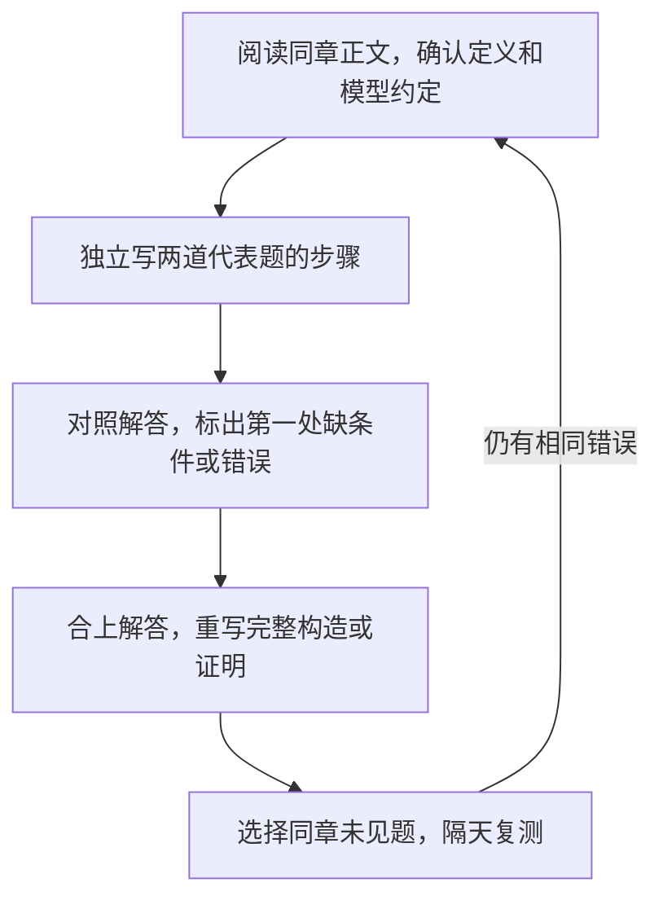

# 习题集学习路线与代表题

先读一章正文，再完成该章两道代表题，最后到同章题集中选择未见题检验迁移。本页补充练习路线；理论知识仍沿用前面的五章正文。

配套文件为《计算理论分章习题集.pdf》，共 **308 个 PDF 页**。材料把教材练习、历史作业、小测、试卷和补充题重新按章编排。五章有 653 个连续编排标签，含综合部分为 722 个；一个标签可能有多个小问，也可能与其他来源重复，这些数字不表示独立原题的数量或已经掌握的题数。

## 怎样查找原题

**本页“PDF 页”指阅读器从 1 开始数的物理页；“印刷页”指纸面页码。正文印刷页 = PDF 页 − 1。** 例如 PDF 第 63 页对应印刷第 62 页。题目标头里另有“原来源页”，它指原教材或原卷，不能拿来定位本习题集。

| 正文 | PDF 页 | 印刷页 | 编排标签 |
| --- | --- | --- | --- |
| [基础：集合、语言与证明](01-toc-basics.md) | 8–30 | 7–29 | 1.1–1.62 |
| [正则语言与有限自动机](02-toc-regular.md) | 31–94 | 30–93 | 2.1–2.150 |
| [上下文无关语言与下推自动机](03-toc-context-free.md) | 95–152 | 94–151 | 3.1–3.142 |
| [图灵机](04-toc-turing.md) | 153–197 | 152–196 | 4.1–4.110 |
| [不可判定性](05-toc-undecidability.md) | 198–262 | 197–261 | 5.1–5.189 |

综合部分在 PDF 263–301 页，题源目录在 302–307 页，校订参考说明在 308 页。题源目录中的 `W017`、`W020` 等编号标明出处；本页代表题会同时保留编排题号、页码及原题编号，便于检查条件。

资料入口：[浙大课程攻略共享计划 · 计算理论](https://qsctech.github.io/zju-icicles/%E8%AE%A1%E7%AE%97%E7%90%86%E8%AE%BA/)。门户可用于寻找教材、原作业、历史试卷与对应解答。习题集主要收录题面；某条来源名称带“答案”或“解析”，也不表示本文件包含其完整解答。找答案时先确认原题号与全部条件一致。

## 每章怎样学

每章按同一个流程推进，要求留下实际推导，不能只凭“看懂答案”判断完成。

作答开头写清对象与要求：输入是什么，语言成员条件是什么，要构造机器、给文法、判断语言类别，还是证明算法不存在。再写所用方法和成立条件。最后用边界输入检查，例如空串、计数为零、最小允许计数；证明题还须检查每个方向和每种分解是否覆盖。

错题只记录三个内容：**漏掉的条件、正确机制、下一题如何识别这种情况**。重做时遮住答案，重新写关键步骤；只有换一题仍能完成，才有迁移证据。

## 第一章：先分清对象

读[基础正文](01-toc-basics.md)中的“从串到语言”和“量词与证明”，再做集合展开与集合恒等式题。有限对象可以逐个列出，结果能立即检查；一般恒等式则要处理任意元素，给出两向包含。

记号的层次决定操作：$x\in A$ 检查一个元素，$B\subseteq A$ 检查集合中全部元素，$\mathcal P(A)$ 的元素本身就是集合。空集合没有元素，幂集中仍有空集合这个子集；每多一层花括号，对象层次便改变。

证明 $A=B$ 时，将任意 $x$ 的成员资格逐步化为等价条件，或分别证 $A\subseteq B$ 与 $B\subseteq A$。枚举几项可用来检查例子，证明的全称范围仍要写齐。

!!! tip "记忆提示"

    **记忆提示：先看对象层次，再按成员条件展开；等号检查两向，量词检查先后。** 完成下列代表题后，在 PDF 8–30 页选择一题关系或可数性题，继续使用第一章正文中的对应方法。

### 代表题 1.2：幂集中的元素是什么

!!! question "题目"

    **【教材习题选讲】** 编排 1.2；PDF 第 9 页，印刷第 8 页；来源 `W017`；原题 1.1.2(d)、(e)。 教材原 PDF 页 23（习题集标注）；本次核验习题集内嵌题页，未再次取得原教材。

    **题面（英文原题的中文翻译；仅选原 (d)、(e)，不含 (a)–(c)）：** 下列集合是什么？只用花括号、逗号和数字写出结果：

    $$
    \text{(d)}\quad 2^{\{7,8,9\}}-2^{\{7,9\}},
    \qquad
    \text{(e)}\quad 2^{\varnothing}.
    $$

!!! success "参考解答"

    **解答。** 这里 $2^A=\mathcal P(A)$ 表示 $A$ 的全部子集。两项都是“集合的集合”，不是数值幂。

    (d) 大幂集有 $2^3=8$ 个元素；小幂集正好是其中不含 $8$ 的四个子集。作差后保留所有含 $8$ 的子集：

    $$
    \{\{8\},\{7,8\},\{8,9\},\{7,8,9\}\}.
    $$

    (e) 空集唯一的子集是空集自身，因此幂集只有一个元素。满足原题格式的答案是：

    $$\{\{\}\}.$$

    **判分要点：** (d) 四个子集齐全且没有多项；(e) 保留两层花括号，并能解释为什么基数为 $1$。

    !!! warning "易错点"

        **易错点：** $\varnothing$ 没有元素，$\{\varnothing\}$ 有一个元素；外层括号的元素是集合。

### 代表题 1.3：集合等号的两个方向

!!! question "题目"

    **【教材习题选讲】** 编排 1.3；PDF 第 9 页，印刷第 8 页；来源 `W017`；原题 1.1.3(a)。 教材原 PDF 页 23（习题集标注）；本次核验习题集内嵌题页，未再次取得原教材。

    **题面（英文原题的中文翻译；仅选原 (a)，不含 (b)–(e)）：** 证明

    $$A\cup(B\cap C)=(A\cup B)\cap(A\cup C).$$

!!! success "参考解答"

    **解答。** 任取元素 $x$，分别证明两向包含。

    从左到右：若 $x\in A$，则它同时属于 $A\cup B$ 和 $A\cup C$；若 $x\notin A$ 而属于左边，就必须同时属于 $B$ 和 $C$，仍属于右边。因此左边包含于右边。

    从右到左：若 $x\in A$，直接属于左边；若 $x\notin A$，右边的两个并集条件分别迫使 $x\in B$ 和 $x\in C$，所以 $x\in B\cap C$，仍属于左边。两向合并，等号成立。

    全程只使用任意元素的成员条件，对 $A,B,C$ 为空集或无限集同样成立。

    **判分要点：** 明确任意 $x$；两方向都覆盖 $x\in A$ 和 $x\notin A$ 的情况；由两向包含得出集合相等。

    !!! tip "记忆提示"

        **记忆：** 集合等号证明的是“每个元素两边都同进同出”，不是举几个相同例子。

## 第二章：条件需要什么记忆

读[正则语言正文](02-toc-regular.md)中的“状态就是有限记忆”“表达式与机器互换”和“泵引理怎样使用”，再分析含计数条件的题。

先问：计数之间是否独立？机器只需记有限个余数，还是必须保存任意大的精确数量？常数很大仍是固定有限信息；有限语言总能用有限条字符串的并描述。遇到“总长度等于某个固定常数”时，先检查语言是否有限。遇到独立周期条件时，先考虑正则表达式或余数状态。

构造机器须说明每个状态记住什么，并检查全部符号转移及读完输入后的接受条件。证明非正则时，按正文的泵引理量词顺序选择长串，对**任意合法分解**找出破坏成员条件的重复次数。

!!! tip "记忆提示"

    **记忆提示：固定信息交给有限状态；证明非正则要覆盖所有合法分解。** 做完代表题，再从 PDF 31–94 页挑一题自动机构造和一题非正则证明，分别检验两种方法。

### 代表题 2.69：独立计数仍然可以正则

!!! question "题目"

    **【所供习题集收录的历史 Quiz】** 编排 2.69；PDF 第 63 页，印刷第 62 页；来源 `W020`；原题 I-3。 已再次查看本地 2020–2021 Fall Quiz-1 (JXG) 原课堂照片，核对 I-3 的指数和独立变量。

    **题面：** 判断下列语言是否为正则语言，并说明理由。

    $$L=\{a^{2m}b^{3n+2020}:m,n\in\mathbb N\}.$$

    原照片与习题集都写 $\mathbb N$，没有在此题旁说明是否含 $0$。下文先取 $\mathbb N=\{0,1,2,\ldots\}$；结尾给出正整数约定的调整。

!!! success "参考解答"

    **解答。** 是正则语言。$m$ 和 $n$ **彼此独立**：$a$ 的数量为偶数；$b$ 先固定有 $2020$ 个，再按每次三个增加。一个正则表达式是

    $$ (aa)^*b^{2020}(bbb)^*. $$

    这里 $b^{2020}$ 是固定 $2020$ 次连接的缩写。表达式生成的串恰有 $2m$ 个 $a$ 和 $2020+3n$ 个 $b$，故属于 $L$；反过来，任一满足题意的串都能选择前面重复 $m$ 次、后面重复 $n$ 次，故由表达式生成。

    边界 $m=n=0$ 给出 $b^{2020}$，不是空串。若来源课堂采用 $\mathbb N=\{1,2,\ldots\}$，表达式调整为 $aa(aa)^*b^{2023}(bbb)^*$，正则结论不变。

    **判分要点：** 结论为正则；表达式保留 $2020$ 与独立周期；解释生成与覆盖两个方向，说明自然数约定。

    !!! warning "易错点"

        **易错点：** $a^{2m}b^{3n}$ 不要求两段共用一个计数，不能误读为 $a^{2n}b^{3n}$。

### 代表题 2.72：固定总长给出有限语言

!!! question "题目"

    **【所供习题集收录的历史 Quiz】** 编排 2.72；PDF 第 63 页，印刷第 62 页；来源 `W021`；原题 I-3。 已再次查看本地 2021–2022 Fall Quiz-1 (JXG).1 原课堂照片，核对 I-3 的固定总长 2021。

    **题面（英文原题的中文翻译）：** 判断下列语言是正则还是非正则，并简要说明。

    $$L=\{a^m b^n:m,n\in\mathbb N,\ m+n=2021\}.$$

!!! success "参考解答"

    **解答。** 是正则语言。继续按上一题的非负整数约定，$m$ 只有 $0,1,\ldots,2021$ 共 $2022$ 种取值，而且一旦选定 $m$，$n=2021-m$ 就确定。所以 $L$ 有限。

    将每个合法串作为一个固定表达式，再作有限并即可：

    $$\bigcup_{m=0}^{2021}a^m b^{2021-m}.$$

    这行是 $2022$ 个表达式的有限并缩写，不是含自由计数变量的单个正则操作。每项总长为 $2021$，故生成串都合法；每个合法串的 $m$ 都在枚举范围内，故没有遗漏。边界包含 $b^{2021}$ 和 $a^{2021}$，不包含空串。

    若采用正整数约定，枚举范围改为 $m=1,\ldots,2020$，共 $2020$ 个串，仍是有限正则语言。

    **判分要点：** 抓住总长是固定常数；给出有限枚举或等价构造；不把固定常数 $2021$ 当成随输入增大的变量。

    !!! tip "记忆提示"

        **记忆：** 常数很大仍是有限信息；$m+n=2021$ 与 $m=n$ 的能力要求不同。

## 第三章：把匹配任务写清

读[上下文无关语言正文](03-toc-context-free.md)中的“用递归生成串”“栈怎样匹配数量”和“闭包与能力边界”，再做计数关系的文法构造与非 CFL 证明。

CFG 是上下文无关文法，PDA 是下推自动机，CFL 是上下文无关语言。构造前将输入分成连续区段，说明哪些区段计数联动、哪些只须达到固定下界。栈中每个符号代表一个尚未完成的匹配任务；文法每条递归规则应说明增加哪些符号、保持什么计数关系。

写出文法后检查两向：每个生成串都满足题意；每个满足题意的串都有推导。证明非 CFL 时使用本章泵引理：重复的两段必须同时处理，长度限制约束中间窗口。先判断窗口能落在哪些区段，再说明每种位置为何破坏条件。

!!! tip "记忆提示"

    **记忆提示：构造写“每次增加多少、保持什么”；反证写“窗口在哪里、哪种关系被破坏”。** 接下来在 PDF 95–152 页选择一题 PDA 或推导树题，补上实际运行步骤。

### 代表题 3.66：一个匹配条件加一个固定下界

!!! question "题目"

    **【所供习题集收录的历史 Quiz】** 编排 3.66；PDF 第 120 页，印刷第 119 页；来源 `W022`；原题 I-1。 已再次查看本地 2021–2022 Fall Quiz-2 (JXG).1 原课堂照片，核对 I-1 的 m≥k 与 n≥2021。

    **题面（英文原题的中文翻译）：** 判断下列语言是否为上下文无关语言，并简要说明。

    $$L=\{a^m b^n c^k:m,n,k\in\mathbb N,\ m\ge k,\ n\ge2021\}.$$

    先采用非负整数约定。

!!! success "参考解答"

    **解答。** 是 CFL。取开始符号 $S$，构造文法：

    $$
    \begin{aligned}
    S&\to aSc\mid A,\\
    A&\to aA\mid B,\\
    B&\to bB\mid b^{2021}.
    \end{aligned}
    $$

    最后一项 $b^{2021}$ 表示右侧写下固定 $2021$ 个终结符 $b$，是记号缩写。

    **生成方向：** $S\to aSc$ 用 $k$ 次，产生 $k$ 对 $a,c$；$A\to aA$ 用 $r$ 次，补 $r$ 个 $a$；$B\to bB$ 用 $t$ 次，在基底上补 $t$ 个 $b$。最终串为

    $$a^{k+r}b^{2021+t}c^k,\qquad k,r,t\ge0,$$

    满足 $m=k+r\ge k$ 与 $n=2021+t\ge2021$。

    **覆盖方向：** 任给合法 $a^m b^n c^k$，选择 $k$ 次配对递归、$m-k$ 次补 $a$、$n-2021$ 次补 $b$。这三个次数均非负，所以都有合法推导。

    例如 $a^2b^{2022}c$：

    $$
    \begin{aligned}
    S&\Rightarrow aSc\Rightarrow aAc\\
     &\Rightarrow aaAc\Rightarrow aaBc\\
     &\Rightarrow aabBc\Rightarrow aab^{2022}c.
    \end{aligned}
    $$

    边界 $k=m=0,n=2021$ 由 $S\Rightarrow A\Rightarrow B\Rightarrow b^{2021}$ 生成。若 $\mathbb N$ 从 $1$ 起，将第一行的结束选项 $S\to A$ 改为 $S\to aAc$，其余不变，即强制至少一对 $a,c$。

    **判分要点：** 文法保持串的区段顺序；配对与多余 $a$ 分开；两向正确性和固定下界都说明。

    !!! tip "记忆提示"

        **记忆：** 匹配的 $a,c$ 从外向内生成；不匹配的多余 $a$ 和至少 $2021$ 个 $b$ 留给中间部分。

### 代表题 3.67：三个联动计数怎样反证

!!! question "题目"

    **【所供习题集收录的历史 Quiz】** 编排 3.67；PDF 第 120 页，印刷第 119 页；来源 `W022`；原题 I-2。 已再次查看本地 2021–2022 Fall Quiz-2 (JXG).1 原课堂照片，核对 I-2 的 2n、3n、5n+2021。

    **题面（英文原题的中文翻译）：** 判断下列语言是否为上下文无关语言，并简要说明。

    $$L=\{a^{2n}b^{3n}c^{5n+2021}:n\in\mathbb N\}.$$

!!! success "参考解答"

    **解答。** 不是 CFL。假设它是 CFL，设泵长度为 $p\ge1$，取

    $$s=a^{2p}b^{3p}c^{5p+2021}\in L.$$

    考虑**任意**符合 CFL 泵引理的分解 $s=uvxyz$，其中 $|vxy|\le p$、$|vy|>0$。中间 $b$ 段长度为 $3p$，所以长度不超过 $p$ 的窗口 $vxy$ 不可能同时接触 $a$ 段和 $c$ 段。

    令 $\Delta_a,\Delta_b,\Delta_c$ 分别为 $vy$ 中三种符号的数量。所有合法位置可按下表覆盖：

    | 窗口位置 | 必定不变的计数 |
    | --- | --- |
    | 只在 $a$ 段 | $b,c$ |
    | 只在 $b$ 段 | $a,c$ |
    | 只在 $c$ 段 | $a,b$ |
    | 在相邻的 $a,b$ 两段 | $c$ |
    | 在相邻的 $b,c$ 两段 | $a$ |

    故至少一个 $\Delta$ 为 $0$；又由 $|vy|>0$，至少另一个 $\Delta$ 为正。选择泵次数 $i=0$，删除 $v,y$。删除不改变剩余符号的区段顺序。如果 $uxz$ 仍在 $L$，应存在 $n'$ 满足

    $$
    \begin{aligned}
    2p-\Delta_a&=2n',\\
    3p-\Delta_b&=3n',\\
    5p+2021-\Delta_c&=5n'+2021.
    \end{aligned}
    $$

    任一未变区段都迫使 $n'=p$；代回三式，三个 $\Delta$ 必须全为 $0$，与至少一个为正矛盾。因此每个合法分解都在 $i=0$ 时离开 $L$，违反泵引理。非负或正整数约定都不影响本反证，因为所选 $n=p\ge1$。

    **判分要点：** 先假设 CFL 并取泵长度；证明窗口最多覆盖相邻两段；覆盖任意分解；用未变区段锁定 $n'$，与非空删除矛盾。

    !!! warning "易错点"

        **易错点：** 不能只写“$v,y$ 在同一段”；它们跨相邻区段时也必须证明。

## 第四章：按约定逐步运行

读[图灵机正文](04-toc-turing.md)中的配置、机器构造及“自然数怎样输入输出”，再做运行表和原始递归题。

图灵机题先抄清来源的配置记法、空白符、读写头初始位置和转移动作。本正文的一步同时写入、移动并换状态；教材题可能把写入与移动分成不同动作。运行来源机器时必须沿用题目约定，不能把两套“一步”混用。每步都列出状态、头位置和纸带变化，检查接受或停机条件。

原始递归题则把目标拆成初值与更新式：先给 $f(0)$，再给怎样由当前轮号和上轮结果计算 $f(n+1)$。随后说明初值、更新式中的函数怎样由零、后继、投影、复合及已证明的原始递归函数得到。有限轮数保证全定义；仅写一个递归式，仍缺这些依据。

!!! tip "记忆提示"

    **记忆提示：机器运行先核约定；函数证明写初值、更新式和积木来源。** 后续从 PDF 153–197 页挑一题机器构造，分别检查正确性与所有输入停机的保证。

### 代表题 4.1：教材机器的十三步运行

!!! question "题目"

    **【教材习题选讲】** 编排 4.1；PDF 第 154 页，印刷第 153 页；来源 `W017`；原题 4.1.1(a)。 教材原 PDF 页 205（习题集标注）；本次查看完整内嵌题页并放大核对初始头位置，未再次取得原教材。

    **题面（英文原题的中文翻译；仅选原 (a)，不含 (b)）：** 设 $M=(K,\Sigma,\delta,s,\{h\})$，其中 $K=\{q_0,q_1,h\}$，$\Sigma=\{a,b,\sqcup,\triangleright\}$，$s=q_0$。转移如下，追踪从配置 $(q_0,\triangleright\underline aabbba)$ 开始的计算。

    | 当前状态 | 读到符号 | 新状态、动作 |
    | --- | --- | --- |
    | $q_0$ | $a$ | $(q_1,b)$ |
    | $q_0$ | $b$ | $(q_1,a)$ |
    | $q_0$ | $\sqcup$ | $(h,\sqcup)$ |
    | $q_0$ | $\triangleright$ | $(q_0,\rightarrow)$ |
    | $q_1$ | $a$ | $(q_0,\rightarrow)$ |
    | $q_1$ | $b$ | $(q_0,\rightarrow)$ |
    | $q_1$ | $\sqcup$ | $(q_0,\rightarrow)$ |
    | $q_1$ | $\triangleright$ | $(q_1,\rightarrow)$ |

    原图下划线在第一个 $a$ 上，**不是**在左端标记上。$\triangleright$ 是左端标记，$\sqcup$ 是空白。这里沿用教材动作约定：动作是符号时，写入并留在原格；动作是箭头时，移动且不写入。$h$ 表示停机，题目没有另设接受／拒绝状态。

!!! success "参考解答"

    **解答。** 下表位置从左端标记格 $0$ 起编号。每行表示执行该步**之后**的完整配置；显示右侧一个空白，其余格仍为空白。

    | 已执行步数 | 状态 | 头位置 | 纸带 |
    | --- | --- | --- | --- |
    | 0 | $q_0$ | 1 | $\triangleright aabbba\sqcup$ |
    | 1 | $q_1$ | 1 | $\triangleright babbba\sqcup$ |
    | 2 | $q_0$ | 2 | $\triangleright babbba\sqcup$ |
    | 3 | $q_1$ | 2 | $\triangleright bbbbba\sqcup$ |
    | 4 | $q_0$ | 3 | $\triangleright bbbbba\sqcup$ |
    | 5 | $q_1$ | 3 | $\triangleright bbabba\sqcup$ |
    | 6 | $q_0$ | 4 | $\triangleright bbabba\sqcup$ |
    | 7 | $q_1$ | 4 | $\triangleright bbaaba\sqcup$ |
    | 8 | $q_0$ | 5 | $\triangleright bbaaba\sqcup$ |
    | 9 | $q_1$ | 5 | $\triangleright bbaaaa\sqcup$ |
    | 10 | $q_0$ | 6 | $\triangleright bbaaaa\sqcup$ |
    | 11 | $q_1$ | 6 | $\triangleright bbaaab\sqcup$ |
    | 12 | $q_0$ | 7 | $\triangleright bbaaab\sqcup$ |
    | 13 | $h$ | 7 | $\triangleright bbaaab\sqcup$ |

    检查机制：每个非空白格执行“交换 $a/b$、右移”两步；六个输入格共 $12$ 步，再在首个空白格写空白并进入 $h$，共 $13$ 步。停机时头仍在位置 $7$。

    **判分要点：** 初始头位置与全部转移正确；写入和右移分步；结果 $bbaaab$、$13$ 步及停机头位置一致。

    !!! warning "易错点"

        **易错点：** 不要把教材的一步擅自改成本正文常见的“写入＋移动”组合步，也不要把这里的停机直接称作接受。

### 代表题 4.93：阶乘为什么是原始递归

!!! question "题目"

    **【历史作业选讲】** 编排 4.93；PDF 第 192 页，印刷第 191 页；来源 `W066`；原题 hw8 Q3；教材 4.7.2(a)。 已再次查看本地 hw8.pdf 第 1 页 Q3；页眉为 Fall 2021，引用教材 4.7.2(a)。

    **题面（英文原题的中文翻译）：** 证明 $factorial(n)=n!$ 是原始递归函数。

!!! success "参考解答"

    **解答。** 定义域为非负整数，包含 $0!=1$。不能只写阶乘递推式，还要证明递推中的积木属于原始递归函数。

    先由零函数 $Z$、后继函数 $Succ$ 和投影函数构造加法、乘法：

    $$
    \begin{aligned}
    Add(x,0)&=x,\\
    Add(x,y+1)&=Succ(Add(x,y)),\\
    Mul(x,0)&=0,\\
    Mul(x,y+1)&=Add(Mul(x,y),x).
    \end{aligned}
    $$

    加法的初值是投影，更新是后继与投影的复合，故由原始递归得到；乘法的初值是零，更新由已得到的加法复合而成，故也原始递归。常数 $1=Succ(0)$ 同样可由复合得到。

    现在定义

    $$F(0)=1,\qquad F(n+1)=Mul(Succ(n),F(n)).$$

    更新函数 $g(n,z)=Mul(Succ(n),z)$ 是已知原始递归函数的复合，故原始递归模式给出 $F$。用归纳检查：初值 $F(0)=0!=1$；若 $F(n)=n!$，则 $F(n+1)=(n+1)n!=(n+1)!$。因此 $F=factorial$。

    计算 $F(n)$ 只进行有限的 $n$ 轮更新，每轮的加法、乘法也全定义，因此所有非负整数输入均有结果。例：$F(0)=1,F(1)=1,F(2)=2,F(3)=6$。

    **判分要点：** 初值 $1$；更新 $(n+1)F(n)$；常数、加法、乘法的原始递归依据；归纳对应阶乘和全定义性。

    !!! tip "记忆提示"

        **记忆：** “写出递推”只是起点；原始递归证明还要逐个交代更新函数的来源。

## 第五章：先判定，再分类

读[不可判定性正文](05-toc-undecidability.md)中的“三种语言先分清”“归约把困难传过去”和“Rice 定理怎么判断”，再比较相近语言性质的算法保证。

对机器编码集合，先说明题目问的是接受语言 $L(M)$ 的性质，还是机器的运行行为。Rice 定理需要性质只取决于接受语言，并且在可识别语言中有满足与不满足的例子；结论是不可判定。继续判断可识别性，还要构造识别器或使用已知不可识别问题的归约。

识别器的关键是成员是否有**有限且可检验的见证**。对多个输入的模拟要公平交错，防止某个不停机输入阻塞后续输入。归约证明须写出总能完成的编码转换，以及 $x\in A\iff f(x)\in B$ 的两向论证；转换程序停机，与新机器在运行时停机，是两个分别检查的要求。

!!! tip "记忆提示"

    **记忆提示：Rice 判断不可判定；识别性另找有限见证或归约。** 代表题之后，在 PDF 198–262 页选一题归约，明确源问题、目标问题、转换和真假两向。

### 代表题 5.125：至多三个接受串没有有限确认办法

!!! question "题目"

    **【大学复习题】** 编排 5.125；PDF 第 246 页，印刷第 245 页；来源 `W082`；原题 第 1 题 L2。 来源为所供习题集中的大学补充复习题；本次只核验编排原页，未取得 W082 单独原文件，不标为本年度官方小测。

    **题面（保留原题条件）：** 将下列语言归入“递归语言”“递归可枚举但非递归”“非递归可枚举”三类之一，并证明：

    $$L_2=\{\langle M\rangle:M\text{ 是图灵机且 }|L(M)|\le3\}.$$

    $L(M)$ 是机器**接受**的串集合；拒绝或一直运行都不算接受。“递归”指可判定，“递归可枚举”指可识别。这里只是原题语言的名字 $L_2$，不是学习层级。

!!! success "参考解答"

    **解答。** $L_2$ 非递归可枚举，即不可识别，因而也不可判定。

    先核对 Rice 条件：性质“接受语言至多三个元素”只依赖 $L(M)$，不依赖代码写法；空语言满足它，而接受所有二元串的机器不满足它。所以这是非平凡的语言性质，Rice 定理说明不可判定。**Rice 并不能直接推出不可识别，下面另证。**

    使用已知不可识别的 $\overline{A_{TM}}$，其中 $A_{TM}=\{\langle M,w\rangle:M\text{ 接受 }w\}$。从有效编码 $\langle M,w\rangle$ 构造机器 $N$，对任意输入 $z$：模拟 $M$ 在 $w$ 上运行；如果模拟接受，就接受 $z$；如果模拟拒绝，可以拒绝 $z$；如果模拟一直运行，就一直等待。

    转换程序只是将 $M,w$ 写入上述有限程序模板，然后输出 $\langle N\rangle$，**不等待** $M$ 的模拟结果，因此总能完成。若源输入不是有效机器／字符串对编码，则输出一个固定的空语言机器；这也使归约在所有编码上全定义。

    两向检查：$M$ 不接受 $w$ 时，$N$ 不接受任何 $z$，所以 $L(N)=\varnothing$，$\langle N\rangle\in L_2$；$M$ 接受 $w$ 时，$N$ 接受所有二元串，所以 $|L(N)|>3$，$\langle N\rangle\notin L_2$。无效源编码也属于 $\overline{A_{TM}}$，并被映射到 $L_2$。于是

    $$x\in\overline{A_{TM}}\iff f(x)\in L_2.$$

    若 $L_2$ 有识别器，先算 $f(x)$ 再运行它即可识别 $\overline{A_{TM}}$，矛盾。顺便看补集：对有效 $M$ 的全部输入公平交错模拟，一旦发现四个不同串被接受就接受；无效编码直接接受。这能识别 $\overline{L_2}$，所以 $L_2$ 还是 coRE，但本题要求的三分类答案为非 RE。

    **判分要点：** Rice 条件完整；另给不可识别归约；模板转换总停机；真假两向都写；明确模拟等待的是“接受”，不是笼统“停机”。

    !!! warning "易错点"

        **易错点：** 没观察到第四个接受串，不能确认第四个串永远不会出现。

### 代表题 5.126：至少三个接受串有有限见证

!!! question "题目"

    **【大学复习题】** 编排 5.126；PDF 第 246 页，印刷第 245 页；来源 `W082`；原题 第 1 题 L3。 来源为所供习题集中的大学补充复习题；本次只核验编排原页，未取得 W082 单独原文件，不标为本年度官方小测。

    **题面（保留原题条件）：** 将下列语言归入“递归语言”“递归可枚举但非递归”“非递归可枚举”三类之一，并证明：

    $$L_3=\{\langle M\rangle:M\text{ 是图灵机且 }|L(M)|\ge3\}.$$

!!! success "参考解答"

    **解答。** $L_3$ 递归可枚举但非递归，即可识别、不可判定。

    构造识别器：先验证机器编码，无效则拒绝。按长度、再按字典序枚举全部输入串 $z_0,z_1,\ldots$。第 $t$ 轮，对前 $t+1$ 个输入各模拟一步；保存它们各自的配置和已接受输入的集合。一旦其中有三个**不同**输入被接受，就接受 $\langle M\rangle$。

    这叫公平交错模拟：每个输入最终得到无限多步模拟，不会被某个不停止的输入挡住。若 $|L(M)|\ge3$，任选三个被接受串，它们的编号和接受所需步数都有限，因此某个有限轮次必定已发现三者；若 $|L(M)|<3$，永远不会误报，识别器可一直运行。这证明可识别性。

    再用 Rice 定理证明不可判定：性质只依赖接受语言，且非平凡——空语言不满足，接受所有二元串的语言满足。因此不存在判定器，三分类落在“递归可枚举但非递归”。

    **判分要点：** 明确三条不同串的有限见证；公平交错而非逐个等停机；成员最终接受、非成员不误接受；另用 Rice 给出不可判定。

    !!! tip "记忆提示"

        **记忆：** “至少三个”能由三个已接受串证明；“至多三个”要求排除未来全部可能，证据方向相反。

## 综合部分何时读

五章代表题完成后，再使用 PDF 263–301 页中的跨章题检查方法选择。综合部分也含复杂度、P／NP 和 NP 完全性等主题，这些内容登记为拓展资料；现有五章主线继续按原范围学习。CNF／CYK、PCP 等其他主题也不因资料目录出现而自动加入当前主线。

当前路线依据所供资料组织，尚无本年度教师完整考试范围。历史 Quiz、作业、试卷和回忆材料各保留其来源身份；题面的完整性及解答须逐题核对。现有五章中的 **29 道自编练习继续保留**，与本页收录的历史题、教材题分别标注。
