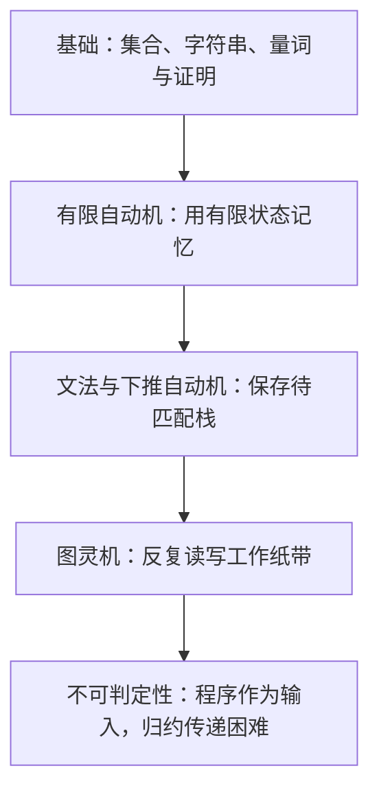

# 计算理论

**主线：先定义合法字符串的集合，再构造识别它的机器，最后证明某些集合没有通用判定算法。**

每章按“问题 → 定义 → 具体运行／推导 → 证明和边界 → 练习 → 记忆要点”连续阅读。遇到公式先确定对象类型，再代入小例；构造题要分别说明只接受正确串和所有正确串都能接受。

| 顺序 | 章节 | 读完应能完成 |
| --- | --- | --- |
| 1 | [基础：集合、语言与证明](01-toc-basics.md) | 区分空对象，翻转量词，计算关系闭包，完成双向与归纳证明 |
| 2 | [正则语言与有限自动机](02-toc-regular.md) | 构造 DFA，逐步确定化 NFA，消状态，最小化并证明非正则 |
| 3 | [上下文无关语言与下推自动机](03-toc-context-free.md) | 写文法并追踪推导，运行栈机器，证明转换和非 CFL |
| 4 | [图灵机](04-toc-turing.md) | 读写配置，构造标记循环，证明停机，理解递归与搜索 |
| 5 | [不可判定性](05-toc-undecidability.md) | 区分识别与判定，写自指和归约的完整两向证明 |

## 练习与范围

共 **29 道既有自编练习**，逐题保留题面、解答和判分要点，分布为 5、6、5、7、6 题。题目服务概念理解和证明训练；它们不标作历年原题或本年度真题。先独立写步骤，再对照解答定位缺少的条件和证明方向；阅读完毕不等于已经掌握。

新增配套：[习题集学习路线与代表题](06-practice-route.md)。将《计算理论分章习题集.pdf》的五章页码接到上述正文，提供有出处的代表题和独立参考解答；按“同章正文 → 代表题 → 未见题 → 错题重做”推进。

本套保持现有五章范围，含数值函数及原始递归，不增复杂度理论、P／NP、CNF／CYK 或 PCP。这是整理边界，不代表未列主题一定不考；当年教师的完整考试范围尚未核验。

## 参考入口

- [NoughtQ 浙大课程资料](https://github.com/NoughtQ/ZJU-Courses-Resources/tree/main/TOC-D3QD)：历史小测与期末复习资料入口。
- [浙大课程攻略共享计划 · 计算理论](https://qsctech.github.io/zju-icicles/%E8%AE%A1%E7%AE%97%E7%90%86%E8%AE%BA/)：教材、课件、历史作业、小测、试卷与解答入口。
- 《计算理论分章习题集.pdf》：用户提供的 308 页题目编排，五章共有 653 个编排条目；页码对应和使用方法见[配套路线](06-practice-route.md)，不把条目数等同独立原题数。
- [WintermelonC 计算理论笔记](https://github.com/WintermelonC/WintermelonC_Docs/tree/12183f324d59df832add19b4bbe1bbb33f58a1b1/docs/zju/compulsory_courses/computational_theory)：个人学习笔记，用于主题交叉参考。

这些资料用于备课与主题核对，本正文以独立解释和推导组织；个人笔记与历史材料不作为今年教师公告或标准答案。
