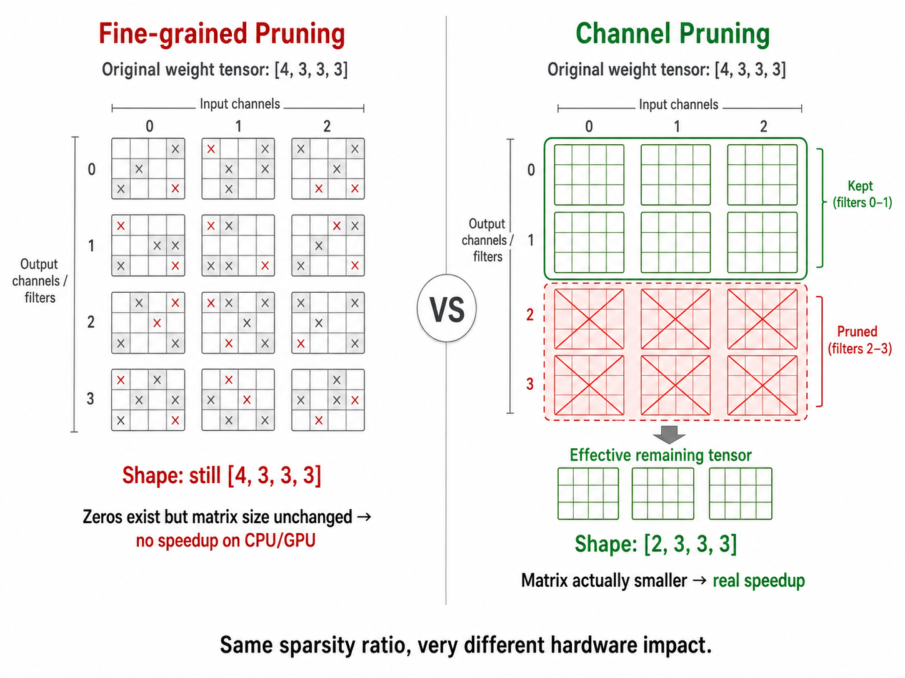
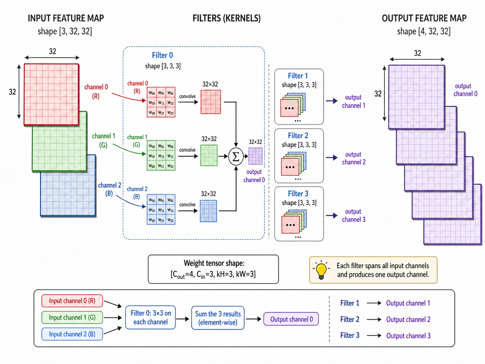
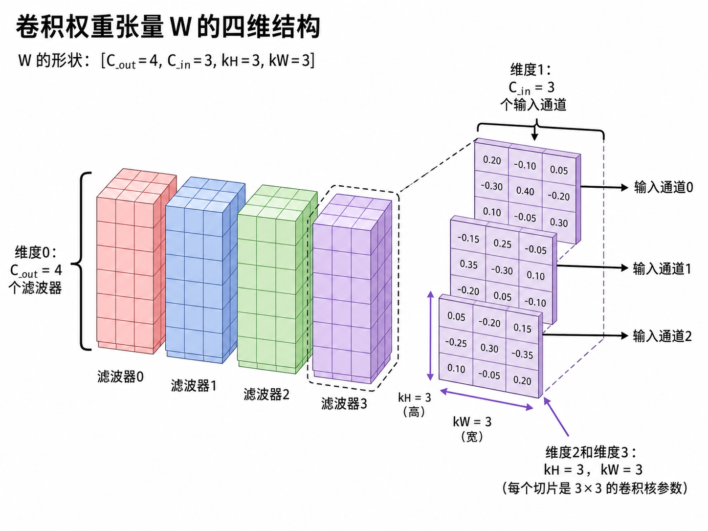
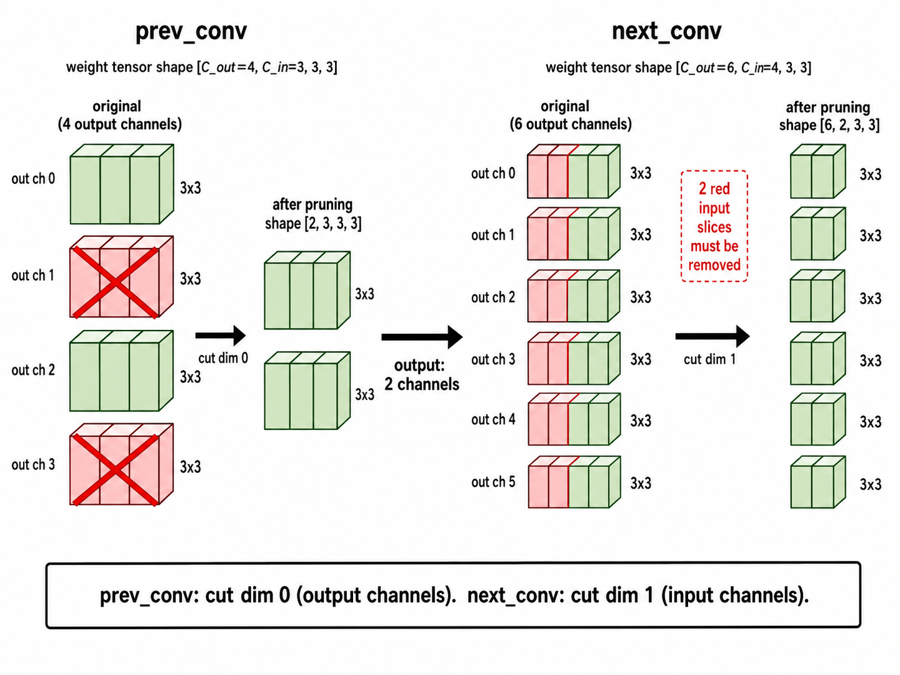
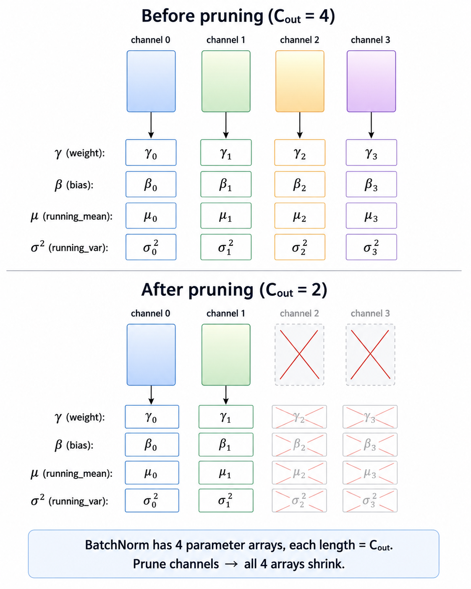

# Lab1: Pruning（剪枝）

> 删掉不重要的权重，让模型更小更快。核心问题：删什么、怎么判断重要性、删完怎么恢复精度。

---

## 一、两种剪枝方式



| | Fine-grained（Unstructured） | Channel（Structured） |
|--|--|--|
| 剪的单位 | 单个权重 | 整个 filter |
| 模型形状 | 不变 | 真正变小 |
| 实际加速 | 无（需稀疏硬件） | 有 |
| 精度恢复 | 容易 | 较难 |

Fine-grained 形状不变，普通硬件仍需计算所有乘法（包括乘以 0），无法加速。Channel pruning 让矩阵真正变小，直接快。

---

## 二、Fine-grained Pruning

**Sparsity（稀疏度）**：零元素占比。sparsity = 0.9 表示 90% 的权重为 0。

$$\text{sparsity} = \frac{\#\text{zeros}}{\#\text{total elements}}$$

**Magnitude-based Pruning**：以权重绝对值衡量重要性，绝对值越小越优先剪掉。找到第 `num_zeros` 小的值作为阈值，低于阈值的置零，生成 Binary Mask：

$$\text{importance} = |W|$$

```python
num_zeros = round(num_elements * sparsity)
threshold = torch.kthvalue(tensor.abs().view(-1), num_zeros).values
mask = tensor.abs() > threshold
```

---

## 三、卷积层权重结构



$$W \in \mathbb{R}^{C_{out} \times C_{in} \times k_H \times k_W}$$

- **dim 0** $C_{out}$：filter 数量（输出 channel 数）
- **dim 1** $C_{in}$：每个 filter 的输入 channel 数
- **dim 2, 3** $k_H, k_W$：卷积核尺寸



---

## 四、Channel Pruning

**维度联动规则**：谁的 channel 数变了，就切对应维度。

- prev_conv 输出减少 → 切 dim 0：`W[:n_keep]`
- next_conv 输入必须与之对齐 → 切 dim 1：`W[:, :n_keep]`

filter 的 C_in 不是自由的，上一层输出几个 channel，这一层每个 filter 就必须有几个输入切片，否则 PyTorch 报 shape mismatch。



**BatchNorm 联动**：BN 的 4 个参数（γ, β, μ, σ²）长度均等于 C_out，prev_conv 的 channel 数变了，后面的 BN 必须同步缩减，共 5 行修改。next_conv 只改了输入，输出不变，其后的 BN 无需修改。



**计算量**：删掉 30% channel，两侧同时缩减：

$$0.7C_{out} \times 0.7C_{in} = 0.49 \text{ 原来}$$

理论减少 50%，实际延迟降幅更小（kernel 启动、内存对齐等固定开销不随 channel 数缩减）。

---

## 五、Sensitivity Scan & Finetuning

**Sensitivity Scan**：逐层单独剪枝，测不同 sparsity 下的 accuracy 变化，找出各层敏感程度。敏感层给低 sparsity，不敏感层给高 sparsity。靠近输入的层通常最敏感。

**Finetuning**：剪枝后继续训练恢复精度。每次梯度更新后必须重新应用 mask，防止被剪权重"复活"：

```python
def apply(self, model):
    for name, param in model.named_parameters():
        if name in self.masks:
            param.data *= self.masks[name]
```

---

## PyTorch API 速查

```python
torch.kthvalue(tensor, k).values           # 第 k 小的值
tensor.abs()                               # 绝对值
torch.index_select(tensor, dim, index)     # 按 index 重排某维度
torch.argsort(importance, descending=True) # 按重要性排序，返回下标
tensor.detach()                            # 取消梯度追踪
tensor.set_(new_tensor)                    # 原地替换内容
tensor.copy_(new_tensor)                   # 原地复制内容

# 卷积层权重：[C_out, C_in, kH, kW]
# BN 参数：weight(γ), bias(β), running_mean(μ), running_var(σ²)，长度均为 C_out
```
