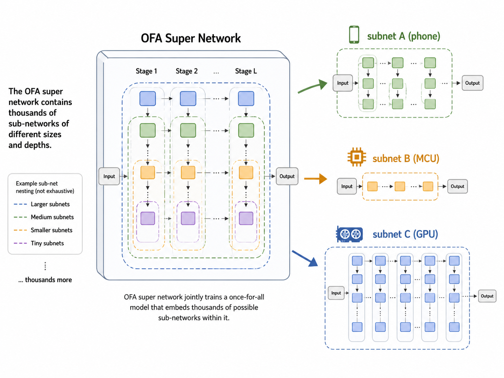
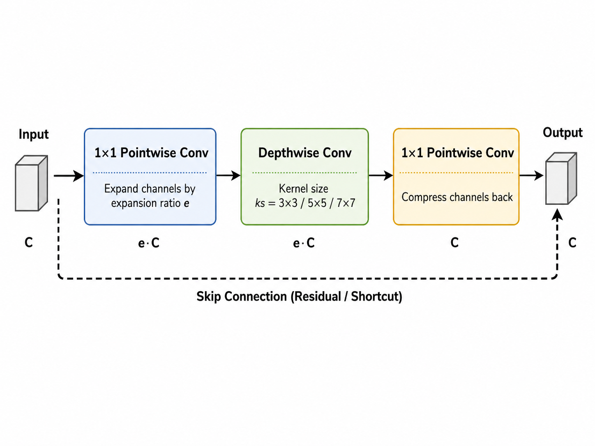
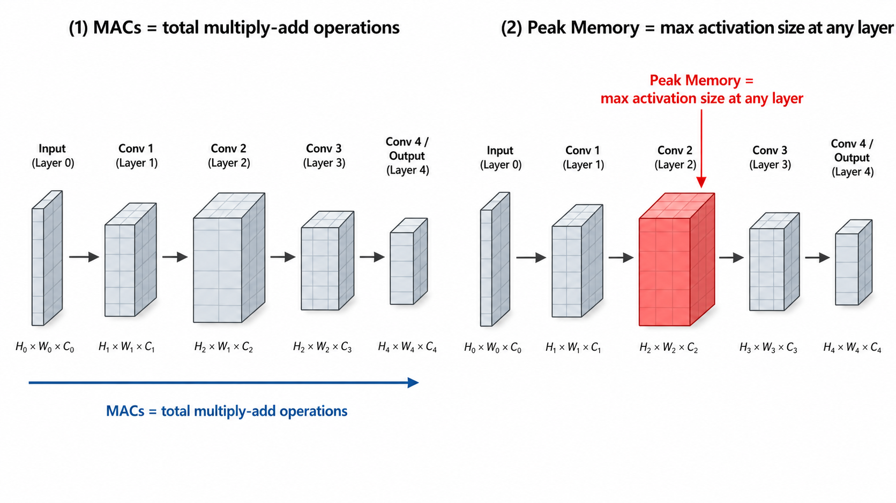
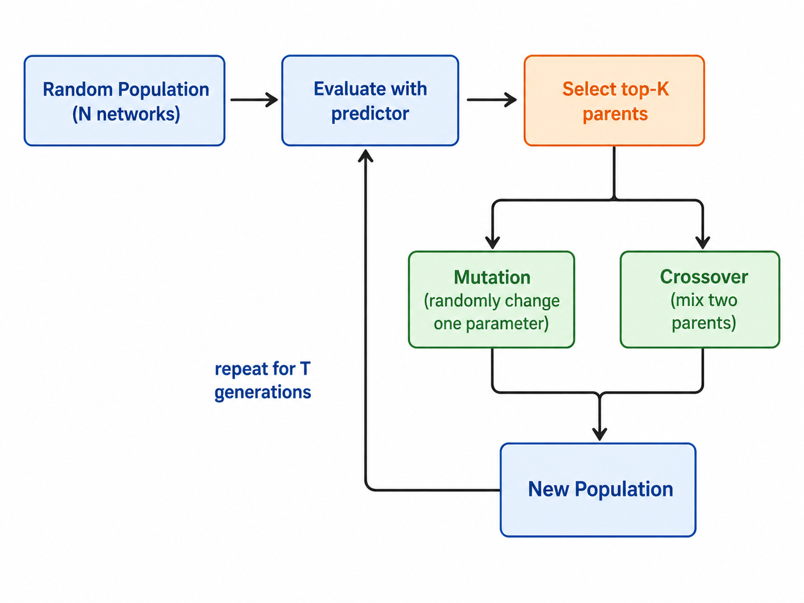

# Lab3: Neural Architecture Search

## 核心问题：网络结构从哪来？

传统做法：研究员手工设计网络（ResNet、MobileNet……），靠经验和直觉调参数。

问题：设计空间巨大——层数、宽度、kernel size、分辨率……组合数以亿计，人根本穷举不完。

**NAS 的思路**：让算法自动在设计空间里搜索，找到在给定硬件约束下准确率最高的网络。

---

## Once-for-All（OFA）超网



早期 NAS 每次评估一个网络都要从头训练，代价极高（几千 GPU 小时）。

OFA 的解法：**只训练一次超网**，超网里包含所有可能的子网。评估时直接从超网里"抠出"子网，不需要重新训练。

### 子网的参数

每个子网由 4 个参数决定：

| 参数 | 含义 | 可选值 |
|------|------|--------|
| `ks` | kernel size（卷积核大小） | 3, 5, 7 |
| `e` | expansion ratio（MBConv 中间层膨胀倍数） | 3, 4, 6 |
| `d` | depth（每个 stage 的层数） | 2, 3, 4 |
| `image_size` | 输入图片分辨率 | 48–224 |

这 4 个参数的组合数超过 10^19，人工穷举完全不可能。

---

## MBConv：子网的基本单元



MBConv = Mobile Inverted Bottleneck Convolution，MobileNet 系列的核心模块。

结构：先用 1×1 卷积把通道数**扩大** e 倍，再用 ks×ks 的**深度可分离卷积**提取特征，最后用 1×1 卷积压缩回来。

为什么叫"inverted"：普通 bottleneck 是先压缩再扩大，MBConv 反过来，先扩大再压缩。

---

## 效率指标：MACs 和 Peak Memory

在 MCU 上部署，两个指标最关键：

**MACs（Multiply-Accumulate Operations）**
- 衡量计算量，1 MAC = 1次乘法 + 1次加法
- MACs 越少 → 推理越快 → 功耗越低
- 主要由 image_size 和网络深度决定

**Peak Memory（峰值内存）**
- 推理过程中同时存在内存里的最大 activation 大小
- MCU 的 RAM 只有几百 KB，这是硬约束
- 主要由第一个 stage 的 feature map 大小决定：`image_size × image_size × channels × 4 bytes`



---

## 准确率预测器（AccuracyPredictor）

直接在真实数据上评估每个子网太慢（每次要跑完整 validation set）。

解法：训练一个轻量 MLP，输入子网的结构编码，输出预测准确率。

### 结构（Q3 实现的）

```python
# n_layers 层 MLP
for i in range(n_layers):
    in_dim = arch_encoder.n_dim if i == 0 else hidden_size
    layers.append(nn.Linear(in_dim, hidden_size))
    layers.append(nn.ReLU())
# 最后一层输出标量（准确率）
layers.append(nn.Linear(hidden_size, 1))
```

输入：子网结构的编码向量（把 ks/e/d/image_size 编码成数字）
输出：预测的 top-1 accuracy（0~100）

### 训练（Q4 实现的）

```python
# 前向传播
pred = acc_predictor(data)
loss = criterion(pred, label)   # L1Loss
# 反向传播
optimizer.zero_grad()
loss.backward()
optimizer.step()
```

用 L1Loss（绝对误差），比 MSE 对 outlier 更鲁棒。

---

## 搜索策略

### 随机搜索（Random Search）

最简单的 baseline：随机采样 N 个满足约束的子网，用预测器选最好的。

优点：实现简单，无偏。
缺点：效率低，N 很大才能找到好结果。

### 进化搜索（Evolutionary Search）



**核心思路**：模拟生物进化，好的网络结构"繁殖"，差的被淘汰。

**一轮流程**：
1. 随机生成 N 个满足约束的子网（初始种群）
2. 用预测器评估每个子网的准确率
3. 保留 top-K 个（parents）
4. 用 parents 做 **mutation** 和 **crossover** 生成下一代
5. 重复 T 代

**Mutation（变异）**：随机改变一个子网的某个参数（比如把某层的 ks 从 3 改成 5）

**Crossover（交叉）**：从两个 parent 各取一部分参数，拼成新子网：
```python
# 非列表参数：随机选一个 parent 的值
new_sample[key] = random.choice([sample1[key], sample2[key]])
# 列表参数（如每层的 ks）：逐位随机选
new_sample[key][i] = random.choice([sample1[key][i], sample2[key][i]])
```

**关键超参数**：

| 参数 | 含义 | 推荐值 |
|------|------|--------|
| `population_size` | 种群大小 | 100 |
| `parent_ratio` | 保留比例 | 0.25（留25个） |
| `mutation_ratio` | 变异候选比例 | 0.5 |
| `max_time_budget` | 最大代数 | 50 |

⚠️ `population_size=10` + `parent_ratio=0.1` → 只有 1 个 parent，crossover 退化，搜索失效。

---

## Q9 实验结果

| 约束 | Peak Memory | MACs | 搜到的 Accuracy |
|------|-------------|------|----------------|
| 宽松 | ≤ 250KB | ≤ 60M | **92.78%** ✅（要求≥92.5%） |
| 严格（bonus） | ≤ 200KB | ≤ 30M | **90.32%** ✅（要求≥90%） |

更严的约束 → 搜出来的网络更"瘦"（更小的 image_size，更少的层）。

---

## Q10：设计空间的边界

NAS 只能在**给定设计空间内**搜索，搜索空间本身不覆盖的区域，再怎么搜也找不到。

- **A（256KB + 15M MACs）**：不可行。设计空间里最小的子网 MACs 也超过 15M。
- **B（64KB 内存）**：不可行。image_size 取最小值时，第一层 feature map 就已经超过 64KB。

---

## 整体流程总结

```
OFA 超网（预训练好，不动）
    ↓
效率预测器：给定子网结构 → 预测 MACs / Peak Memory
准确率预测器：给定子网结构 → 预测 accuracy（MLP，需训练）
    ↓
进化搜索：在约束内找 accuracy 最高的子网
    ↓
取出子网 → 校准 BN → 在真实数据上验证
```
