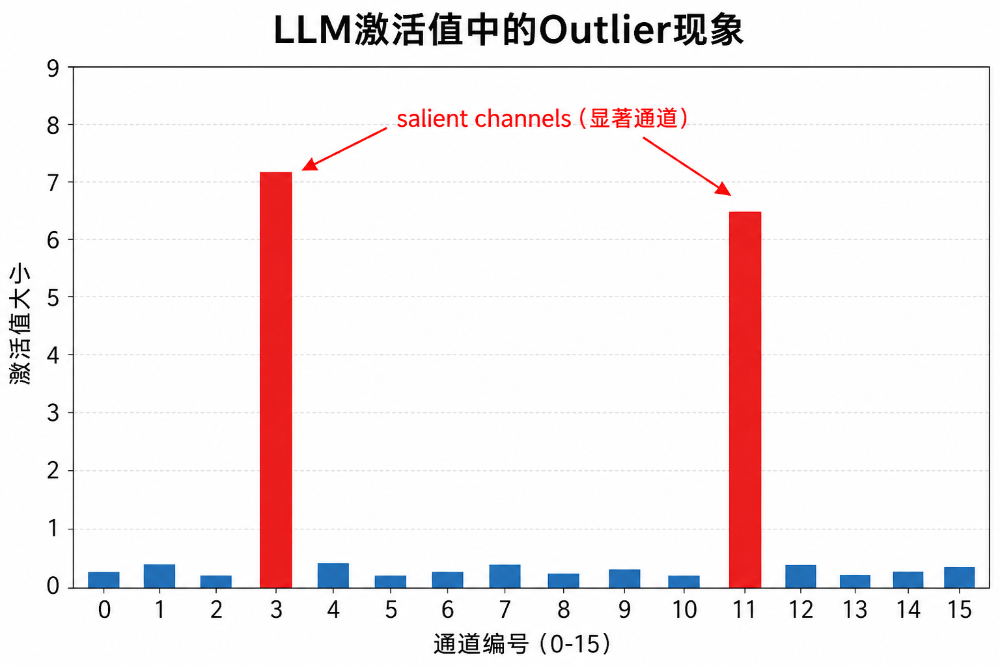
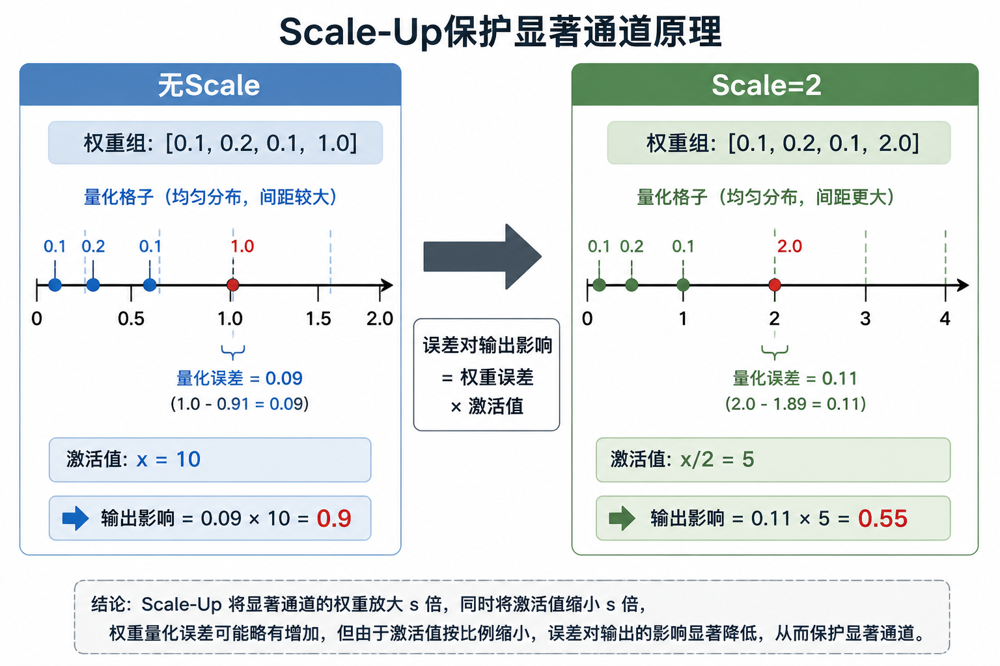
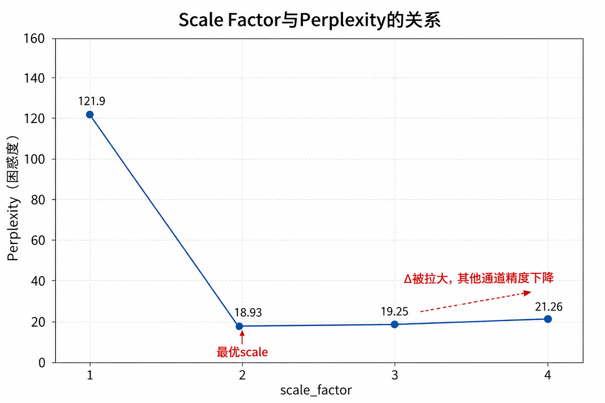
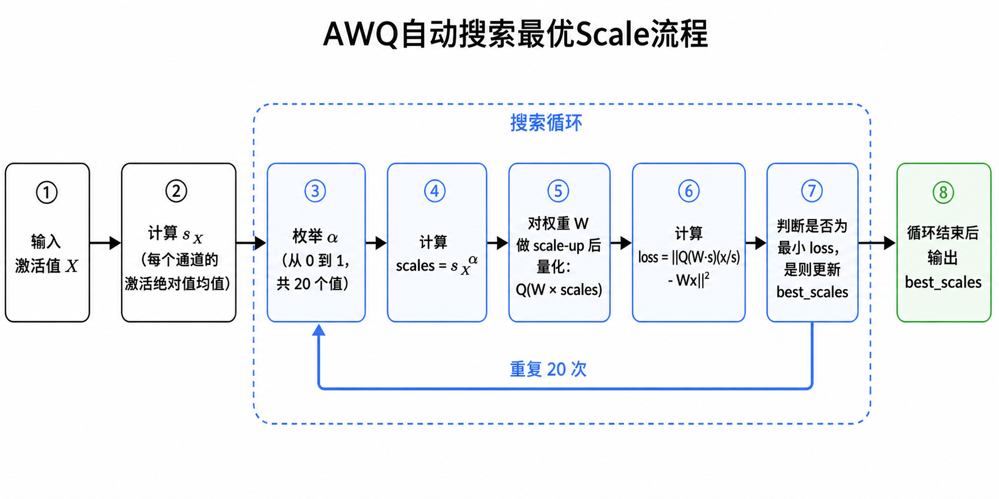

# Lab4: LLM Quantization with AWQ

> LLM推理的瓶颈是内存带宽，不是算力。AWQ通过激活感知的权重缩放，在纯INT4量化下保住精度，不需要混合精度。

---

## 一、为什么LLM需要量化

LLM推理的瓶颈是**内存带宽**，不是算力。

以LLaMA-65B单batch解码为例，做的是GEMV（矩阵×向量）：

- A100算力/带宽比：312TFLOPS / 2000GB/s = 156
- GEMV的计算强度：$\frac{2 \times 8192^2}{8192^2 \times 2} = 1$

两者差了100倍，GPU大部分时间在等数据从显存搬过来，不在算。

**解法**：把权重从FP16压成INT4，搬运量减少4倍，速度提升接近4倍。

---

## 二、两种量化类型

| | W8A8 | W4A16（AWQ） |
|--|--|--|
| 量化对象 | 权重+激活 | 只量化权重 |
| 适合场景 | 计算密集（大batch） | 内存密集（单batch解码） |
| 代表方法 | SmoothQuant | AWQ |

---

## 三、Pseudo Quantization（伪量化）

量化完立刻反量化，权重还是FP16存着，但精度已经损失了。

用途：测量"如果真的量化，精度会差多少"，不用真正部署就能评估。

**量化公式**（Lab2已学）：

$$s_q = \frac{\alpha - \beta}{2^b - 1}, \quad z = -\text{Round}(\beta / s_q), \quad w_q = \text{Clamp}(\text{Round}(w / s_q) + z)$$

反量化：$(w_q - z) \times s_q$

---

## 四、Outlier问题

LLM激活值有个规律：**少数通道的值持续偏大**（outlier），每个token都这样。

量化误差对输出的影响 = **权重误差 × 激活值大小**

激活值大的通道（显著通道），哪怕权重误差一样，对输出的破坏更大。



---

## 五、Q1：混合精度保护（Mixed Precision）

### 思路

找出激活值最大的1%通道（显著通道），量化时保留它们为FP16，其余量化为INT4。

### 代码逻辑

```python
importance = sum(input_feat[n]).float()  # 每个通道的激活总量，shape=[num_channels]
num_salient = max(1, int(0.01 * importance.shape[0]))
outlier_indices = torch.topk(importance, k=num_salient, largest=True).indices

outlier = m.weight.data[:, outlier_indices].clone()  # 备份
m.weight.data = pseudo_quantize_tensor(...)           # 全部量化
m.weight.data[:, outlier_indices] = outlier           # 恢复显著通道
```

### Q1.2对照实验

随机保留1%通道 vs 按importance保留1%通道：

| 方法 | Perplexity |
|--|--|
| 按importance保留1% | 17.15 |
| 随机保留1% | 124.62 |

**结论**：随机保留没用，显著通道的重要性来自"激活值大"，不是随机的。

### 问题

混合精度（同一层里有FP16和INT4）硬件实现复杂，不好部署。

---

## 六、Q2：AWQ Scale-Up（纯INT4保住精度）

### 核心思路

不保留FP16，而是对显著通道做等价变换：

$$y = Wx = (W \cdot s) \cdot \left(\frac{x}{s}\right)$$

乘以 $s$ 再除以 $s$，输出不变。但量化的是 $W \cdot s$，误差变成：

$$Err' = \Delta \cdot RoundErr\left(\frac{w}{\Delta}\right) \cdot \frac{x}{s}$$

误差缩小了 $s$ 倍。



### 实现

```python
# 放大显著通道
m.weight.data[:, outlier_mask] *= scale_factor
# 量化
m.weight.data = pseudo_quantize_tensor(...)
# 缩回来（保持输出等价）
m.weight.data[:, outlier_mask] /= scale_factor
```

$\frac{1}{s}$ 吸收进前一层的LayerNorm，推理时激活值自动带了 $\frac{1}{s}$，无额外开销。

### Scale太大会怎样

scale_factor越大，显著通道的值越大，可能成为整组的新最大值，导致 $\Delta$ 变大，其他通道精度变差。

| scale_factor | Perplexity |
|--|--|
| 1 | 121.90 |
| 2 | 18.93 |
| 3 | 19.25 |
| 4 | 21.26 |

最优在2附近，不是越大越好。



---

## 七、Q2.3：自动搜索最优Scale

### 问题

手动选scale_factor不稳定，不同层的最优值不同。

### AWQ的解法

$$s = s_X^\alpha, \quad \alpha^* = \arg\min_\alpha \|Q(W \cdot s)(s^{-1} \cdot X) - WX\|$$

- $s_X$：每个通道的激活均值
- $\alpha \in [0, 1]$：搜索参数，控制缩放强度
- 搜索20个 $\alpha$ 值，选误差最小的



### 代码逻辑

```python
s_x = x.abs().mean(0)          # 每个通道的激活均值
best_error = float('inf')
best_scales = None

for ratio in range(20):
    alpha = ratio / 20
    scales = s_x.clamp(min=1e-5) ** alpha   # s = s_X^α
    # 归一化scales
    scales = scales / (scales.max() * scales.min()).sqrt()

    fc.weight.mul_(scales)                   # 放大
    fc.weight.data = pseudo_quantize_tensor(...)
    fc.weight.div_(scales)                   # 缩回

    loss = (org_out - out).pow(2).mean()
    if loss < best_error:
        best_error = loss
        best_scales = scales

    block.load_state_dict(org_sd)            # 恢复权重，下次循环重新试
```

### 最终结果

| 方法 | Perplexity | 是否混合精度 |
|--|--|--|
| FP16原始 | ~14 | — |
| 3-bit均匀量化 | ~120 | 否 |
| Q1.1 保留显著1% FP16 | 17.15 | 是 |
| Q2.1 scale_factor=2 | 18.93 | 否 |
| Q2.3 自动搜索scale | 17.93 | 否 |

AWQ（Q2.3）不用混合精度，纯INT4，效果接近混合精度方案。

---

## 八、PyTorch 操作速查

| 操作 | 含义 |
|--|--|
| `torch.topk(t, k, largest=True).indices` | 找最大的k个值的下标 |
| `torch.randperm(n)[:k]` | 随机选k个下标 |
| `tensor.mul_(s)` | in-place乘法 |
| `tensor.div_(s)` | in-place除法 |
| `s_x ** alpha` | 逐元素幂运算 |
| `tensor.clamp(min=1e-5)` | 防止出现0导致除以0 |
| `block.load_state_dict(org_sd)` | 恢复模型权重到搜索前状态 |
