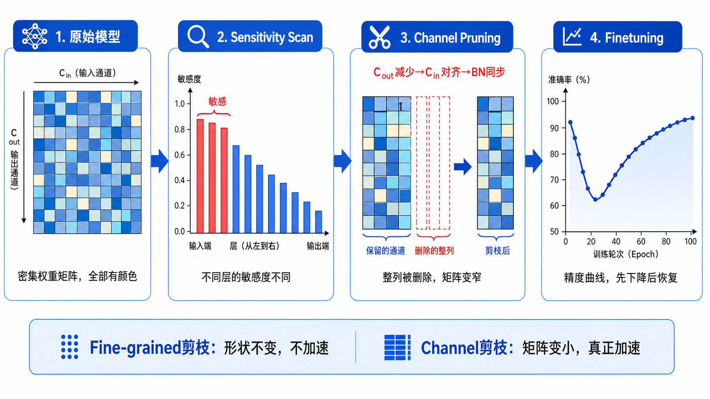
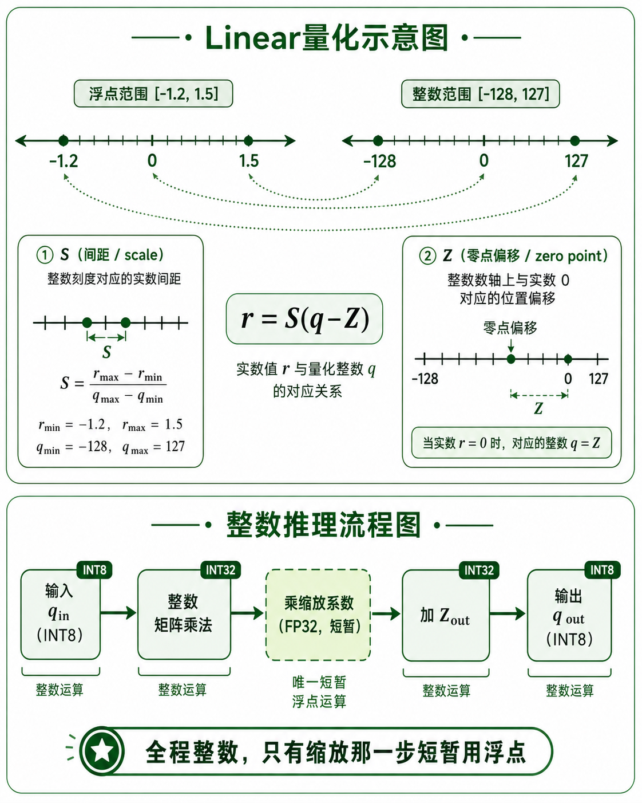
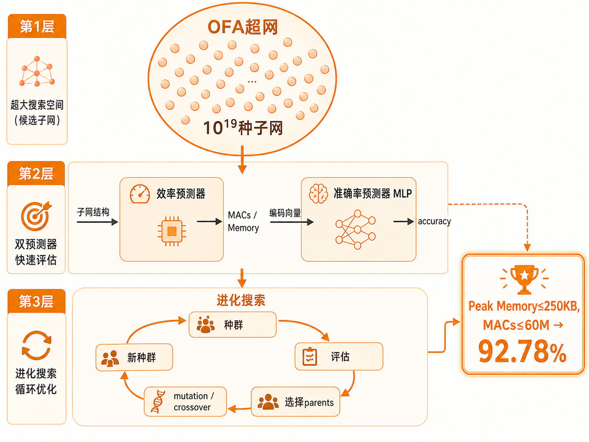
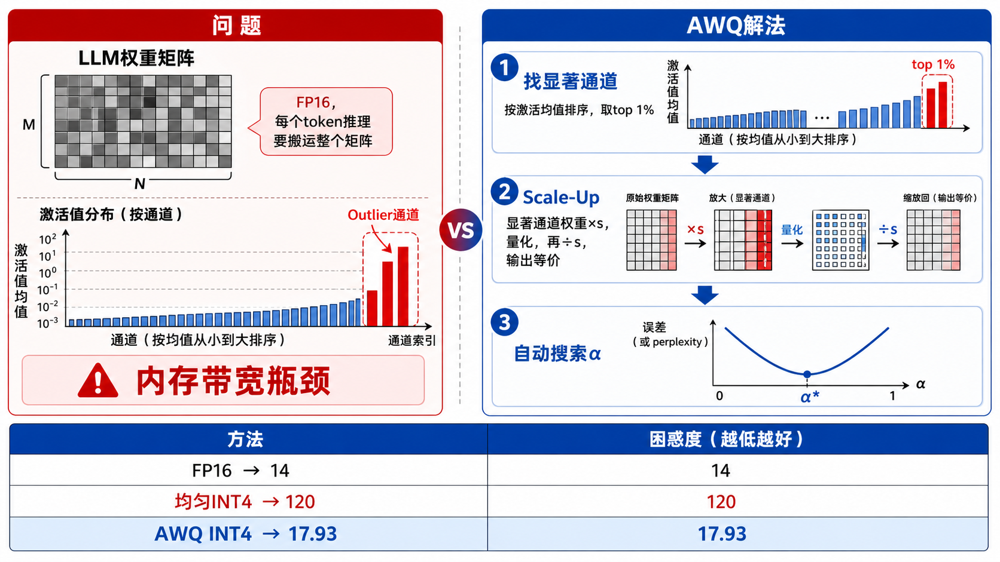
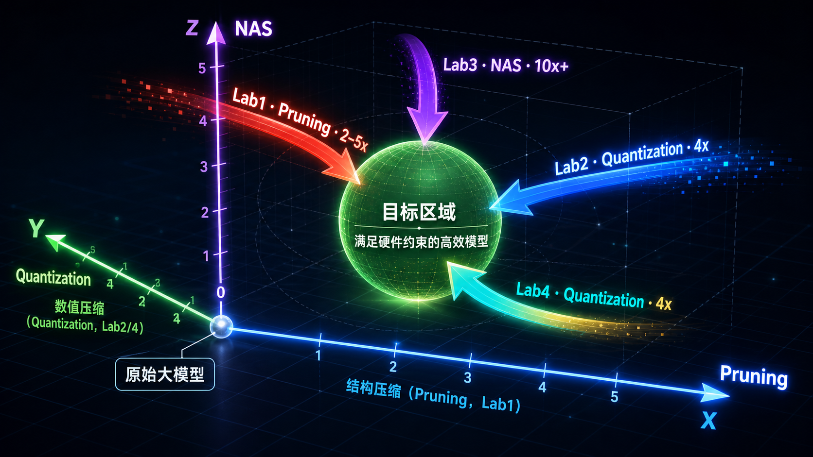

# MIT 6.5940 TinyML：课程主线串讲

> 一个核心问题贯穿全课：**神经网络太大，硬件太小，怎么办？**
> 四个 Lab 是四种正交的答案，可以单独用，也可以叠加。

---

## 零、问题的起点

神经网络默认用 FP32 存储，ResNet-50 有 25M 参数，占 100MB 显存，推理一次需要 4G MACs。

这在服务器上没问题。但 MCU（微控制器）只有几百 KB RAM，手机 NPU 带宽有限，边缘设备没有数据中心的算力。

**TinyML 的目标**：在不损失太多精度的前提下，让模型能跑在资源受限的硬件上。



---

## 一、Lab1 Pruning：删掉不重要的权重

### 核心洞察

神经网络是过参数化的——大量权重对输出贡献极小，删掉它们精度几乎不变。

**重要性 ≈ 权重绝对值**（Magnitude-based pruning）

$$\text{importance}(w) = |w|$$

### 两种剪枝粒度

| | Fine-grained（非结构化） | Channel（结构化） |
|--|--|--|
| 剪的单位 | 单个权重 | 整个 filter |
| 模型形状 | 不变（稀疏矩阵） | 真正变小 |
| 实际加速 | ❌ 需要稀疏硬件 | ✅ 矩阵直接变小 |
| 精度恢复 | 容易 | 较难 |

**关键结论**：Fine-grained 剪枝在普通硬件上不加速，因为乘以 0 也要算。Channel pruning 才是真正的加速。

### Channel Pruning 的联动规则

卷积权重形状：$W \in \mathbb{R}^{C_{out} \times C_{in} \times k_H \times k_W}$

- prev_conv 输出减少 → 切 dim 0（filter 数量）
- next_conv 输入必须对齐 → 切 dim 1（每个 filter 的输入切片数）
- prev_conv 后的 BN 参数长度 = $C_{out}$，必须同步缩减

删掉 30% channel，两侧同时缩减：$0.7 \times 0.7 = 0.49$，计算量减少约 50%。

### Sensitivity Scan + Finetuning

不同层对剪枝的敏感程度不同。靠近输入的层最敏感（特征提取的基础），靠近输出的层不敏感。

做法：逐层单独剪枝，测 accuracy 变化曲线，敏感层给低 sparsity，不敏感层给高 sparsity。

剪完之后 finetune 恢复精度，每次梯度更新后重新应用 mask，防止被剪权重"复活"。


---

## 二、Lab2 Quantization：压缩数值精度

### 核心洞察

权重不需要 32-bit 精度。用 8-bit 整数存储，体积缩小 4x，整数运算比浮点快，省电。

### Linear 量化的数学

把浮点范围 $[r_{min}, r_{max}]$ 均匀映射到整数范围 $[q_{min}, q_{max}]$：

$$r = S(q - Z)$$

$$S = \frac{r_{max} - r_{min}}{q_{max} - q_{min}}, \quad Z = \text{round}\left(q_{min} - \frac{r_{min}}{S}\right)$$

量化：$q = \text{round}(r / S) + Z$

权重分布关于 0 对称，令 $Z_{weight} = 0$，简化为 $S = r_{max} / q_{max}$。

### 整数推理（最重要的部分）

量化的真正目标不只是压缩存储，而是**推理全程用整数运算**。

代入 $r = S(q-Z)$，化简浮点推理公式，得到：

$$q_{out} = \left(q_{in} \times q_{weight} + Q_{bias}\right) \times \frac{S_{in} \cdot S_{weight}}{S_{out}} + Z_{out}$$

三步实现：
1. 整数矩阵乘法
2. 乘缩放系数（换算到输出整数域）
3. 加输出零点

### K-Means 量化 vs Linear 量化

| | K-Means | Linear |
|--|--|--|
| 精度 | 更高（适应数据分布） | 略低 |
| 硬件支持 | ❌ 需要查表 | ✅ 直接整数运算 |

K-Means 精度好但硬件不友好，Linear 是工业界主流。



---

## 三、Lab3 NAS：从设计上就高效

### 核心洞察

Lab1 和 Lab2 是对已有模型做后处理压缩。Lab3 换了思路：**直接搜索一个天生高效的架构**。

设计空间：kernel size（3/5/7）× expansion ratio（3/4/6）× depth（2/3/4）× image_size（48-224），组合数超过 $10^{19}$，人工穷举不可能。

### Once-for-All（OFA）超网

早期 NAS 每评估一个网络都要从头训练（几千 GPU 小时）。

OFA 的解法：**只训练一次超网**，超网里包含所有可能的子网。评估时直接从超网里"抠出"子网，不需要重新训练。

子网的基本单元是 **MBConv**（Mobile Inverted Bottleneck Convolution）：先用 1×1 卷积扩大通道 e 倍，再用深度可分离卷积提取特征，最后压缩回来。

### 两级预测器

直接在真实数据上评估每个子网太慢，用两个轻量预测器代替：

- **效率预测器**：给定子网结构 → 预测 MACs 和 Peak Memory（解析计算，不需要训练）
- **准确率预测器**：给定子网结构编码 → 预测 top-1 accuracy（MLP，用 L1Loss 训练）

### 进化搜索

模拟生物进化：好的结构"繁殖"，差的被淘汰。

1. 随机生成满足约束的初始种群
2. 预测器评估每个子网
3. 保留 top-K（parents）
4. Mutation（随机改一个参数）+ Crossover（两个 parent 各取一部分）生成下一代
5. 重复 T 代

**约束**：Peak Memory ≤ 250KB，MACs ≤ 60M → 搜到 92.78% accuracy。

### 与 Lab1/2 的关系

NAS 找到的是"在约束下最优的架构"，之后还可以对这个架构做 Lab1 的剪枝和 Lab2 的量化，进一步压缩。三者正交，可以叠加。



---

## 四、Lab4 AWQ：LLM 的特殊挑战

### 核心洞察

LLM 推理的瓶颈是**内存带宽**，不是算力。

以 LLaMA-65B 单 batch 解码为例，做的是 GEMV（矩阵×向量）：
- A100 算力/带宽比：312TFLOPS / 2000GB/s = 156
- GEMV 的计算强度：$\frac{2 \times 8192^2}{8192^2 \times 2} = 1$

两者差了 100 倍，GPU 大部分时间在等数据从显存搬过来。

**解法**：把权重从 FP16 压成 INT4，搬运量减少 4 倍，速度提升接近 4 倍。

### LLM 激活值的 Outlier 问题

LLM 激活值有个规律：**少数通道的值持续偏大**（outlier），每个 token 都这样。

量化误差对输出的影响 = **权重误差 × 激活值大小**

激活值大的通道（显著通道），哪怕权重误差一样，对输出的破坏更大。

### Q1：混合精度（思路正确，但硬件不友好）

找出激活值最大的 1% 通道，量化时保留为 FP16，其余量化为 INT4。

实验：按 importance 保留 1% → perplexity 17.15；随机保留 1% → perplexity 124.62。

问题：同一层里有 FP16 和 INT4，硬件实现复杂。

### Q2：AWQ Scale-Up（纯 INT4，保住精度）

不保留 FP16，而是对显著通道做等价变换：

$$y = Wx = (W \cdot s) \cdot \left(\frac{x}{s}\right)$$

乘以 $s$ 再除以 $s$，输出不变。但量化的是 $W \cdot s$，误差缩小了 $s$ 倍。

$\frac{1}{s}$ 吸收进前一层的 LayerNorm，推理时无额外开销。

### Q2.3：自动搜索最优 Scale

$$s = s_X^\alpha, \quad \alpha^* = \arg\min_\alpha \|Q(W \cdot s)(s^{-1} \cdot X) - WX\|$$

搜索 $\alpha \in [0, 1]$，选误差最小的。

### 最终结果对比

| 方法 | Perplexity | 是否混合精度 |
|--|--|--|
| FP16 原始 | ~14 | — |
| 3-bit 均匀量化 | ~120 | 否 |
| Q1 混合精度（1% FP16） | 17.15 | 是 |
| Q2 scale_factor=2 | 18.93 | 否 |
| Q2.3 AWQ 自动搜索 | 17.93 | 否 |

AWQ 不用混合精度，纯 INT4，效果接近混合精度方案。



---

## 五、四个 Lab 的关系：一张全景图

```
原始大模型（FP32，过参数化，内存/计算双重冗余）
         │
         ├─── Lab3 NAS ──────────────────────────────────────────────────────┐
         │    从设计上就高效：搜索满足硬件约束的最优架构                          │
         │    OFA超网 → 准确率预测器 → 进化搜索 → 高效子网                       │
         │                                                                    │
         ▼                                                                    ▼
    任意模型（可以是NAS搜出来的，也可以是现成的）
         │
         ├─── Lab1 Pruning ──────────────────────────────────────────────────┐
         │    删掉不重要的结构：Channel pruning → 矩阵真正变小                   │
         │    Sensitivity scan → 敏感层低sparsity → Finetuning恢复精度          │
         │                                                                    │
         ▼                                                                    ▼
    更小的模型（参数更少，但还是浮点数）
         │
         ├─── Lab2 Quantization ─────────────────────────────────────────────┐
         │    压缩数值精度：FP32 → INT8                                         │
         │    Linear量化 → BN Fusion → 整数推理                                │
         │                                                                    │
         ▼                                                                    ▼
    量化模型（INT8，体积缩小4x，推理全程整数）
         │
         └─── Lab4 AWQ（LLM专用）────────────────────────────────────────────┐
              LLM特殊挑战：内存带宽瓶颈 + Outlier通道                           │
              FP16 → INT4：Scale-Up保护显著通道 → 自动搜索最优scale              │
                                                                              ▼
                                                                    部署到边缘设备
```

**三个正交维度**：
- **结构压缩**（Lab1/3）：减少参数数量
- **数值压缩**（Lab2/4）：减少每个参数的存储位数
- **架构设计**（Lab3）：从源头控制计算量

三者可以叠加：NAS 搜出高效架构 → Channel pruning 进一步削减 → Quantization 压缩精度 → 部署。



---

## 六、从 TinyML 到科研的衔接

### 每个方向的研究前沿

**Pruning 方向**
- Lottery Ticket Hypothesis（彩票假说）：大网络里存在一个小的"中奖子网"，从一开始就能训练到同等精度
- Sparse Training：直接训练稀疏网络，不需要先训练再剪枝
- 非结构化剪枝的硬件加速：NVIDIA Ampere 的 2:4 稀疏格式

**Quantization 方向**
- Post-Training Quantization（PTQ）vs Quantization-Aware Training（QAT）：PTQ 不需要重训练，QAT 精度更高
- GPTQ：用二阶信息（Hessian）指导 LLM 量化，比 AWQ 更精确但更慢
- SqueezeLLM：非均匀量化，把 outlier 权重单独存成稀疏矩阵
- 1-bit LLM（BitNet）：极端量化，权重只有 {-1, +1}

**NAS 方向**
- Differentiable NAS（DARTS）：把离散的架构搜索变成连续优化，用梯度下降搜索
- Zero-shot NAS：不需要训练就能预测网络性能（用 gradient norm、synflow 等代理指标）
- Hardware-aware NAS：把延迟直接建模进搜索目标，不只看 MACs

**LLM Efficiency 方向（Lab4 的延伸）**
- KV Cache 压缩：Transformer 推理的另一个内存瓶颈
- Speculative Decoding：用小模型草稿，大模型验证，提升吞吐量
- Mixture of Experts（MoE）：每次推理只激活部分参数，计算量不随参数量线性增长
- Flash Attention：重新设计注意力计算的内存访问模式，减少 HBM 读写

### 这门课给你的底层认知

| 认知 | 来自哪个 Lab |
|--|--|
| 不是所有权重都重要，重要性可以量化 | Lab1 |
| 精度和效率之间有可以工程化的 tradeoff | Lab2 |
| 设计空间太大时，用预测器+搜索代替穷举 | Lab3 |
| 系统瓶颈不一定是算力，可能是带宽 | Lab4 |
| 数据分布（outlier）决定算法设计 | Lab4 |

这五条认知在 ML 系统、LLM 推理优化、硬件协同设计等方向都是基础。

---

## 七、关键公式汇总

| 公式 | 含义 | 来自 |
|--|--|--|
| $\text{importance} = \|W\|$ | 权重重要性 | Lab1 |
| $r = S(q - Z)$ | Linear 量化核心 | Lab2 |
| $S = (r_{max} - r_{min}) / (q_{max} - q_{min})$ | Scale 计算 | Lab2 |
| $q_{out} = (q_{in} \times q_{weight} + Q_{bias}) \times \frac{S_{in} S_{weight}}{S_{out}} + Z_{out}$ | 整数推理 | Lab2 |
| $\text{MACs} \propto \text{image\_size}^2 \times C_{in} \times C_{out} \times k^2$ | 卷积计算量 | Lab3 |
| $\text{Peak Memory} \propto \text{image\_size}^2 \times C \times 4\text{bytes}$ | 峰值内存 | Lab3 |
| $y = (W \cdot s)(x / s)$ | AWQ 等价变换 | Lab4 |
| $s = s_X^\alpha,\ \alpha^* = \arg\min \|Q(Ws)(s^{-1}X) - WX\|$ | AWQ 自动搜索 | Lab4 |
